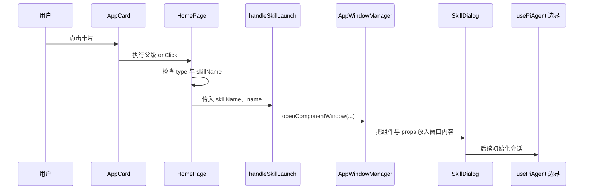
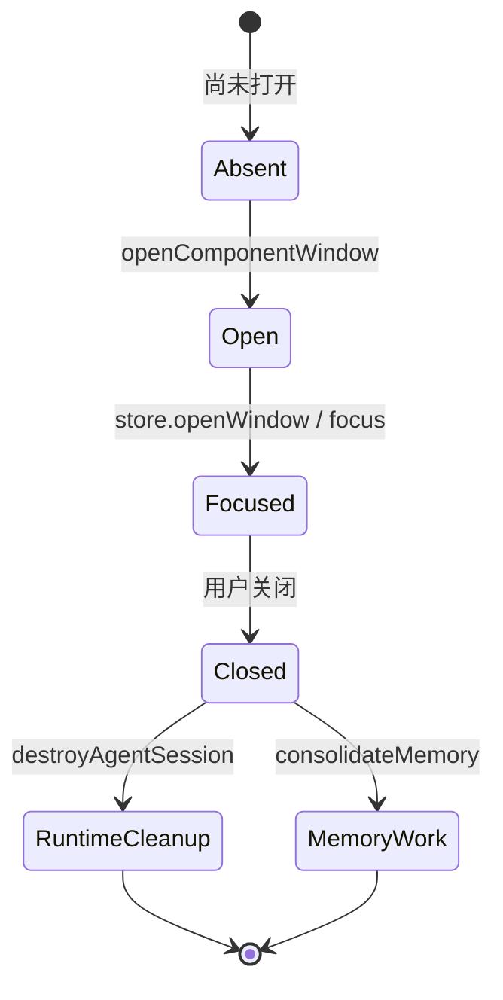

# A02：一次点击同时产生了哪三条链

## 同一个窗口，不能只用一条箭头解释

用户点击“头脑风暴”，窗口很快出现。若只画 `AppCard → SkillDialog`，图看起来简单，却遗漏了真正决定行为的页面层、窗口服务和身份数据，也无法解释关闭窗口为什么会触发运行时清理。

本章把同一次点击拆成三条链：

- **控制流**：当前是谁调用谁；
- **数据流**：`skillName`、标题和各种 id 怎样被改造成下一层输入；
- **生命周期**：窗口何时创建、聚焦、关闭，运行时何时清理。

三条链相互关联，但不能互相代替。

## 控制流：谁把下一棒交给谁



这张图在 `usePiAgent` 边界停止。A02 只证明页面怎样抵达会话入口，不展开 HTTP、runtime 和模型内部；后者由 Part B、Part E负责。

每根箭头都可以在源码中找到：卡片调用 `onClick`；页面判断入口字段；`handleSkillLaunch` 组装窗口配置；窗口服务保存组件和 props；React 挂载 `SkillDialog` 后，它才可能初始化会话。

## 源码窗口一：页面不是被动容器

[packages/web/src/app/page.tsx 第 1426—1450 行](../../../../packages/web/src/app/page.tsx#L1426) 把配置映射为卡片，并在闭包中决定后续 handler。关键条件是：

```ts
if (app.type === 'skill' && app.skillName) {
  handleSkillLaunch(app.skillName, app.name);
} else if (app.action === 'open-workspace') {
  const firstProject = projects[0];
  if (firstProject) {
    handleOpenWorkspace(firstProject.id);
  }
}
```

这段代码同时承担“解释配置”和“选择动作”两项职责。AppCard 不知道 `type`，真正的分流发生在页面编排层。

注意 `action` 分支还依赖 `projects[0]`。因此工作区入口配置正确，也可能因项目列表为空而没有后续动作。配置有效与运行条件满足是两件事。

## 数据流：同一个值如何变成不同身份

[packages/web/src/app/page.tsx 第 845—869 行](../../../../packages/web/src/app/page.tsx#L845) 接收两个必填字符串和一个可选初始消息：

```ts
const handleSkillLaunch = (skillName: string, name: string, initialMessage?: string) => {
  windowManager.openComponentWindow(
    `skill-${skillName}`,
    name,
    SkillDialog,
    {
      skillName,
      initialMessage: initialMessage?.trim()
        || '你好！我是' + name.split(' ')[0] + '助手，有什么可以帮助你的吗？',
    },
    {
      position: { width: 1200, height: 800 },
      constraints: { minWidth: 600, minHeight: 400 },
      metadata: {
        entryType: 'skill',
        entryId: skillName,
        sessionId: `skill-${skillName}`,
        projectId: `skill-${skillName}`,
      },
    },
  );
};
```

把 `skillName = 'bmad-brainstorming'` 代入后，可以逐项计算：

| 字段 | 结果 | 所属责任 |
| --- | --- | --- |
| 窗口 id | `skill-bmad-brainstorming` | 窗口去重与聚焦 |
| 标题 | `头脑风暴` | 用户可见文案 |
| `props.skillName` | `bmad-brainstorming` | SkillDialog 加载身份 |
| `metadata.entryType` | `skill` | 生命周期分类 |
| `metadata.entryId` | `bmad-brainstorming` | 入口所有权 |
| `metadata.sessionId` | `skill-bmad-brainstorming` | 关闭时的运行时清理参数 |
| `metadata.projectId` | `skill-bmad-brainstorming` | 关闭时帮助定位 runtime；不是 SkillDialog 创建会话时直接读取的字段 |

字符串相同不代表概念相同。窗口 id 和 session id 当前由同一表达式生成，是实现选择，不是二者天然属于同一资源。

还要避免一个更隐蔽的误读：窗口 metadata 并不会原样成为 `SkillDialog` 的 props。普通 Web 路径只把 `content.props` 交给组件；Electron 的 `/window` 重建页也只给 SkillDialog 传入 `skillName` 和 `initialMessage`。真正创建会话时，SkillDialog 再根据 `currentSkill` 独立构造 `projectId = skill-${currentSkill}`。

[packages/web/src/app/window/page.tsx 第 64—69 行](../../../../packages/web/src/app/window/page.tsx#L64) 可以直接看到这个停止边界：

```tsx
{windowType === 'skill' && (
  <SkillDialog
    skillName={skillName}
    initialMessage={initialMessage}
  />
)}
```

因此，修改窗口 metadata 中的 `projectId` 会改变关闭清理请求拿到的定位信息，却不会自动改变 SkillDialog 随后创建会话时使用的项目范围。两个值目前相同，是两条链各自计算出了相同字符串，不是一次字段透传。

## 生命周期：窗口服务在打开时埋下关闭动作

[packages/web/src/services/AppWindowManager.ts 第 31—54 行](../../../../packages/web/src/services/AppWindowManager.ts#L31) 读取窗口 metadata。若 `entryType` 属于受管理集合，就把原 `onClose` 包装为新回调：先执行原回调，再异步调用 `destroyAgentSession` 与 `consolidateMemory`。



图中的两个关闭后动作是 fire-and-forget：失败会记录日志，但不阻止窗口消失。它们也不等于删除会话文件。B10 会精读这一差异。

## 为什么这些责任不能合并进 AppCard

若 AppCard 直接 import `SkillDialog` 和 `AppWindowManager`，它就必须理解 Skill、工作区、项目访谈等所有应用类型。每新增一个入口都要修改通用视觉组件，Spotlight 与 Dock 也无法复用同一 handler。

当前结构让变化分开：

| 变化 | 主要修改点 |
| --- | --- |
| 卡片视觉变化 | `AppCard` |
| 新增入口数据 | `homeApps.ts` |
| 入口如何翻译为动作 | `page.tsx` |
| 窗口创建和关闭语义 | `AppWindowManager` |
| Skill 会话准备 | `SkillDialog` |

这种拆分不是为了文件数量，而是让不同变化拥有不同责任主体。

## 正向推演：改动输入后会发生什么

给 `handleSkillLaunch` 显式传入：

```ts
handleSkillLaunch(
  'bmad-brainstorming',
  '头脑风暴',
  '  帮我想三个学习 App 卖点  ',
);
```

`trim()` 后的初始消息是“帮我想三个学习 App 卖点”，不会使用默认欢迎语。若第三个参数只包含空格，`trim()` 得到空字符串，逻辑会回退到欢迎语。这个小分支证明数据流必须看到具体值，不能只背函数名。

再改变另一个条件：只把 metadata 中的 `projectId` 改成 `wrong-project`，保持 `props.skillName` 不变。窗口仍会加载 `bmad-brainstorming`，SkillDialog 初始化时仍计算 `skill-bmad-brainstorming`；但关闭窗口时，`destroyAgentSession` 会收到 `wrong-project`。这会制造“运行时创建链正确、清理定位链错误”的部分失败，也证明数据流与生命周期链不能合并。

## 反向诊断：四种相似的“没打开”

1. 卡片没有渲染：查 `HOME_APPS` 和列表渲染。
2. 卡片渲染但 handler 未执行：查 `AppCard.handleClick` 的 `path` 优先级与父级 `onClick`。
3. handler 执行但窗口状态没有记录：查 `openComponentWindow` 到 `store.openWindow`。
4. Electron 下 store 有记录但原生窗口未出现：查 `createNativeWindow` 的异步失败日志，不能只看 React store。

同样的用户描述必须拆成可观察证据，才能避免在错误层修代码。

## 测试证据与缺口

当前没有从 `HOME_APPS` 点击到 `SkillDialog` 挂载的完整自动化测试，也没有直接测试锁定 `handleSkillLaunch` 生成的 metadata。现有源码可以证明控制流和字段计算，却不能证明真实浏览器事件、窗口渲染与 Electron 原生窗口都已工作。

最小应补测试包括：

1. `skill` 且有 `skillName` 时调用 `handleSkillLaunch`；
2. 缺少 `skillName` 时不调用；
3. 生成的组件、props、尺寸和 metadata 与合同一致；
4. 同一窗口 id 再次打开时聚焦而非重复创建；
5. Electron 创建失败时保留可诊断日志。

## 小实验与答案

将窗口 id 前缀从 `skill-` 改成 `app-`，但 metadata 中的 sessionId 不变，先预测影响：窗口去重键会变化；会话清理键不变；二者不再同名。这个实验不建议直接提交，只用于证明“同名是实现选择”。完成标准是能指出窗口 store 与会话 API 分别读取哪个字段。

## 口头验收与下一章

不看正文，应能回答：

1. 控制流、数据流、生命周期各自回答什么问题？
2. `AppCard → HomePage` 与 `HomePage → AppWindowManager` 两根箭头分别传什么？
3. `initialMessage` 是空格时为什么会回退到欢迎语？
4. 窗口 id 与 session id 同名为什么不代表它们是同一对象？
5. Electron 原生窗口失败时，为什么 store 状态仍可能已经存在？
6. 为什么窗口 metadata 中的 `projectId` 与 SkillDialog 创建会话时的 `projectId` 目前同值，却不是一次字段透传？

下一章解释这些角色为什么分布在不同 package，以及 package 边界如何阻止 UI、运行时和桌面进程互相拖住。
