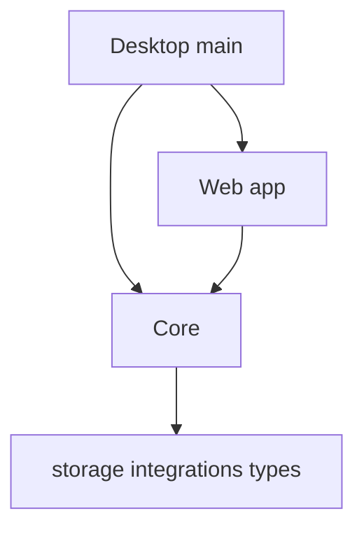

# A03：代码为什么分布在不同包中

一次技能启动经过 `packages/web` 的首页、窗口服务和组件，又会进入 `packages/core` 的 Pi Agent 集成。这不是目录偶然长成的样子，而是 Monorepo 的责任划分。

设想把所有代码都放进 `page.tsx`。第一天，点击卡片和对话框都能工作；第二天，桌面端需要复用会话逻辑，测试又需要在没有浏览器的环境中创建会话，页面文件就开始同时依赖 DOM、磁盘、Electron 与模型配置。任何一个环境变化都会牵动全部代码。包边界的目的正是防止这种“最初方便，后来无法移动”的结构。

 [pnpm-workspace.yaml（第 1 行）](../../../../pnpm-workspace.yaml#L1) 将 `packages/*` 纳入同一工作区。 [Web package（第 1-10 行）](../../../../packages/web/package.json#L1) 依赖 `@originos/core: workspace:*`； [Core package（第 1-8 行）](../../../../packages/core/package.json#L1) 则把入口指向自己的 `src/index.ts`。`workspace:*` 的意思是“使用本仓库中的 Core”，而不是下载一个外部副本。



箭头表示允许依赖。上层可以使用下层；下层不能反向知道上层。这样 Web 可以换界面，Desktop 可以替换壳，Core 的会话和存储仍可复用。

图的阅读顺序是从下往上。`storage integrations types` 是被复用的基础；`Core` 用它们组成业务与运行时；Web 将业务投影成用户界面；Desktop 在需要原生进程能力时调用 Core 并承载 Web。图中没有 `Core -> Web`，不是遗漏，而是刻意禁止的方向。

| 包 | 核心职责 | 不应承担的职责 |
| --- | --- | --- |
| `web` | 页面、组件、路由、Web 状态 | 复制一份 Agent 或存储业务 |
| `core` | 共享业务、类型、集成、存储 | import Web 页面或 Electron main |
| `desktop` | Electron 主进程、IPC、打包 | 复制 Core 的业务实现 |
| `agent` | Pi Agent adapter 的包边界 | 决定某个 React 面板如何显示 |

[AGENTS.md 的依赖层级（第 198-250 行）](../../../../AGENTS.md#L198) 是判断标准。例如 [首页导入（第 51-58 行）](../../../../packages/web/src/app/page.tsx#L51) 使用 Core 的 Pi Agent client 是允许的；若 `packages/core` 反向导入 `SkillDialog`，则 Core 无法脱离 Web 独立运行。

### 逐段判读一个真实导入

```ts
import { normalizeRuntimeLLMConfig } from
  '@originos/core/lib/integrations/pi-agent/client';
```

这句位于 [首页（第 51-56 行）](../../../../packages/web/src/app/page.tsx#L51) 。导入者是 Web app 层；被导入者是 Core integration 层；方向由上至下，因此符合规约。它还使用了 Core 的公开路径，而不是从 Core 内部绕路抓取某个私有文件。判断一条导入时，不要只看路径能否解析，要同时判断层级和公开边界。

### 失败案例

```ts
// 错误：Core 的项目服务直接渲染 Web 组件
import { ProjectCard } from '@/components/project/ProjectCard';
```

这会让项目服务必须认识 React 组件、浏览器打包别名和展示属性。正确方向是反过来：Core 返回项目数据或类型，`ProjectCard` 导入这些数据并决定怎样渲染。这样 CLI、测试或 Electron 服务也能复用项目服务。

### 本章检查

给出任意 import 时，应能回答四件事：导入者在哪一层、被导入者在哪一层、箭头是否允许、是否经过公共出口。A04 将在此基础上再区分“代码在哪个包”和“代码在哪个进程执行”。

### 练习

判断下面的导入为何错误，并说明替代方向：

```ts
// packages/core/src/lib/features/project/service.ts
import { ProjectCard } from '@/components/project/ProjectCard';
```

正确答案应包含：Core 返回项目数据或公共类型；Web 的 `ProjectCard` 消费这些数据，而不是让 Core 依赖展示组件。
