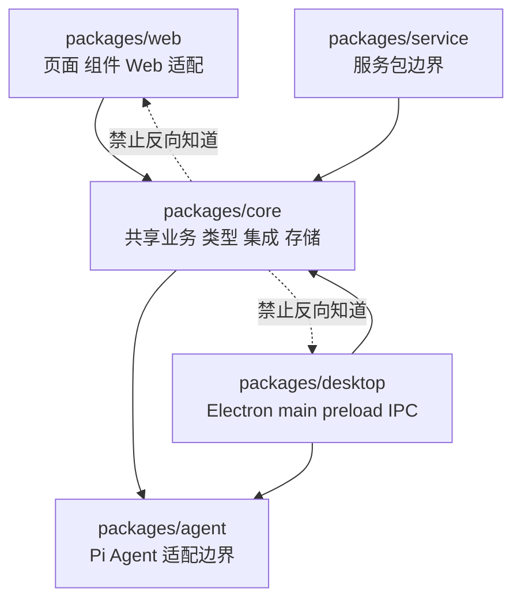

# A03：包边界不是目录整理，而是变化隔离

## 如果所有代码都放进首页会怎样

A02 的一次点击跨过配置、组件、页面、窗口服务和 Agent 入口。把这些代码塞进同一个页面，短期会少几次 import，长期却会产生三个直接后果：Core 单测必须加载 React 环境；Electron 主进程必须认识页面组件；修改窗口样式可能迫使 Agent 运行时代码重新构建。

Monorepo 不能自动解决这些问题。它只提供多个包共处一个仓库的组织方式；真正的边界来自每个包的职责和单向依赖。

## 先区分三个容易混淆的词

| 词 | 回答的问题 | OriginOS 示例 |
| --- | --- | --- |
| 仓库 | 哪些版本化文件共同演进 | `startupOS` Git 仓库 |
| workspace | 包管理器把哪些目录视为本地 package | `packages/*` |
| package | 哪组代码拥有独立名称、依赖和脚本 | `@originos/web`、`@originos/core` |

[pnpm-workspace.yaml 第 1—2 行](../../../../pnpm-workspace.yaml#L1) 的 `packages/*` 只声明 package 发现范围。它没有规定 Web 能否反向被 Core import，也没有规定业务逻辑放在哪里。架构规约才承担这些限制。

## 包关系图：箭头表示“知道对方”



实线说明上层可以使用下层公共能力；虚线标出禁止方向。Web 与 Desktop 都可以复用 Core，所以项目、会话、Skill 等规则只需实现一次。Core 若 import React 页面，就失去在 Node 测试、桌面服务和其他入口中独立使用的能力。

## 源码窗口一：`workspace:*` 连接的是本地包

[packages/web/package.json 第 13—16 行](../../../../packages/web/package.json#L13) 声明包名和对 Core 的依赖：

```json
{
  "dependencies": {
    "@originos/core": "workspace:*",
    "@originos/pi-agent-adapter": "workspace:*"
  }
}
```

[packages/core/package.json 第 1—12 行](../../../../packages/core/package.json#L1) 则把 `src/index.ts` 声明为 Core 的主入口，并通过 `exports` 继续暴露受支持的子路径。依赖版本写作 `workspace:*` 时，pnpm 解析当前仓库中的 package，而不是从远程 registry 随机下载同名实现。

`workspace:*` 解决“连接哪个包”，不解决“允许导入包内哪个文件”。例如 Web 可以使用 Core 公共 API，但不应任意穿透另一个 Feature 的内部实现。

把输入改成 `"@originos/core": "^0.1.0"`，依赖解析语义就从“必须连接当前 workspace 包”变成“可由 registry 版本满足”。这不一定立刻报错，却可能让 Web 运行旧 Core、源码编辑的 Core 没有被使用。排查“我改了 Core 但页面行为不变”时，package 声明就是第一层证据。

## 源码窗口二：同一次点击如何跨包而不反向依赖

[packages/web/src/app/page.tsx 第 845—869 行](../../../../packages/web/src/app/page.tsx#L845) 完成 Web 页面编排；[packages/web/src/services/AppWindowManager.ts 第 5—12 行](../../../../packages/web/src/services/AppWindowManager.ts#L5) 从 `@originos/core` 导入类型与 Electron 适配；Core 没有导入 `SkillDialog`。

窗口服务的真实 import 是：

```ts
import { AppWindowConfig, ComponentContent } from '@originos/core/types';
import { createNativeWindow } from '@originos/core/lib/integrations/electron/window';
import { isElectron } from '@originos/core/lib/integrations/electron/env';
```

第一行引入稳定数据合同，后两行引入环境适配；它没有让 Core 认识具体页面组件。调用时，页面把 `SkillDialog` 作为值传给窗口服务，依赖方向仍停留在 Web 内部。

允许方向可以写成：

```text
page.tsx
→ AppWindowManager.ts
→ @originos/core 的类型与集成适配
```

反方向若出现：

```ts
// 假设出现在 packages/core 内
import { SkillDialog } from '@/components/skills/SkillDialog';
```

Core 将依赖 Web 的路径别名、React 和 DOM 语义。结果不是“风格不优雅”，而是 Node 环境可能无法加载模块、桌面服务无法独立复用、依赖图可能形成循环。

## package 边界内仍有层级

同在 `packages/web` 不等于可以互相随意 import。规约给出的顺序是：

```text
app
→ components
→ services / store
→ core features / modules
→ storage / integrations / shared / types
```

这里的“向下”表示高层编排可以依赖更稳定的低层能力，低层不能反向认识具体 UI。`app/` 还只能承担页面、布局和 API 边界；把会话持久化算法直接写入 route，即使没有形成 import 循环，仍属于职责错位。

## Feature 公共出口：路径可解析不等于合同稳定

Core 中两个 Feature 同层存在时，也必须经过被依赖 Feature 的 `index.ts` 公共出口。直接导入深层实现的问题在于：调用方开始依赖文件布局、私有类型和临时函数，内部重构就会扩散到所有调用者。

判断一条 import 时依次问：

1. 导入者属于哪个 package、哪一层？
2. 被导入者属于哪个 package、哪一层？
3. 箭头是否从高层指向同层公共 API 或低层？
4. 是否绕过 Feature 的公共出口？
5. 被导入对象是否带入不属于当前运行环境的依赖？

[packages/core/package.json 第 12—45 行](../../../../packages/core/package.json#L12) 还暴露出一个现实边界：当前 Core 不只导出顶层 `index.ts`，也允许若干 `features/*/session-service`、`integrations/*/*` 等子路径。也就是说，“能够从 package exports 解析”只能证明包作者允许这一条构建路径，不能自动证明 Feature 之间的依赖符合 AGENTS.md。架构审查仍要继续判断导入者和被导入者的层级。

## 三个失败案例的因果推演

### Core import Web 组件

输入：Core 项目服务引入 `ProjectCard` 复用格式化函数。直接后果是服务模块同时加载 React 组件依赖。修复方式不是复制格式化函数，而是把纯格式化合同下沉到 shared 或 Feature 公共 API，再由组件和服务分别使用。

### Desktop 复制 Core 业务

输入：桌面 IPC service 重写一套 `createSession`。Web 修复字段默认值后，桌面仍使用旧规则，两个入口产生不同 JSON。正确方向是 desktop 只解析 IPC payload，再调用 Core 公共 service。

### Feature 穿透内部实现

输入：ontology 直接导入 project Feature 的内部 store。project 重命名或拆分文件时，ontology 被迫同步修改。正确方向是 project 的 `index.ts` 暴露必要合同，或将双方真正共享的抽象下沉。

## 测试证据与限制

[scripts/check-agents-compliance.js](../../../../scripts/check-agents-compliance.js#L1) 和 [eslint-rules/agents-compliance.js](../../../../eslint-rules/agents-compliance.js#L1) 把一部分路径与层级规则自动化。它们可以抓取可静态识别的违规 import，却无法证明以下事情：

- API route 内是否塞入了过多业务决策；
- Desktop 是否复制了逻辑而没有直接 import；
- 两个不同名字的模块是否形成语义循环；
- 公共 API 是否设计得足够稳定。

因此，`pnpm agents:check` 或 `pnpm lint` 通过只能证明扫描器覆盖的规则没有被触发，不能替代架构审查。

本轮曾实际运行 `pnpm agents:check`。命令退出码为 0，却同时输出“`src/` 目录不存在，跳过检查”。Given 是从仓库根运行脚本；When 是脚本寻找它预期的单一 `src/`；Then 是没有扫描当前 monorepo 的 `packages/*/src`。因此这次退出码不能作为“依赖方向已检查”的证据，反而揭示了校验入口和仓库结构之间的缺口。

## 小实验：给一段错位代码找新家

假设 `SkillDialog` 中出现一个纯函数 `buildSessionStoragePath(projectId, sessionId)`，同时 desktop service 也需要它。三个候选位置是 Web component、Desktop service、Core storage/shared。正确迁移目标应是 Core 的合适低层公共边界；两端再 import 它。验收时要同时说明：为什么它不依赖 React、为什么它不应重复、公共出口在哪里。

## 口头验收与下一章

合上本页，应能说明：

1. 仓库、workspace 和 package 的区别。
2. `workspace:*` 保证了什么，又没有保证什么。
3. Core 反向 import Web 会产生哪些具体后果。
4. 为什么“同在 Core”也可能越过 Feature 边界。
5. 静态依赖检查通过为什么不等于架构完全正确。

下一章增加一个正交维度：代码放在哪个 package，不等于它只会在哪个进程执行。
