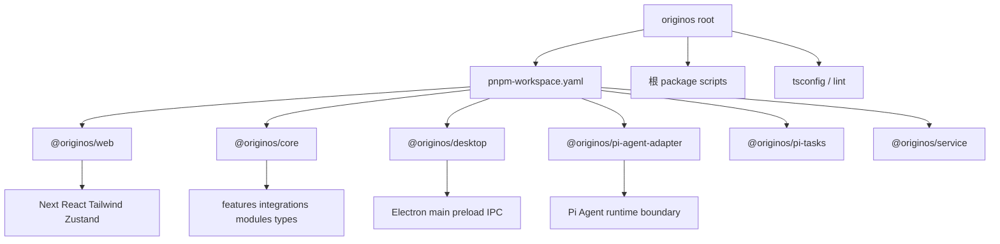

# A03：代码为什么分布在不同包中

## 一个假设实验

假设 OriginOS 把所有代码都放进 `packages/web/src/app/page.tsx`。第一天，点击卡片和打开窗口都能工作；第二天，桌面端需要复用会话逻辑，测试又需要在没有浏览器的环境中创建会话，页面文件就开始同时依赖 DOM、磁盘、Electron 与模型配置。任何一个环境变化都会牵动全部代码。再过一周，想单独升级 Electron 主进程时，发现必须先升级 React；想给 Core 写单元测试时，发现必须把整个 Next.js 打包环境拉进来。

Monorepo 的包边界就是为了防止这种「最初方便，后来无法移动」的结构。本章不是背诵每个 package 的名字，而是理解**为什么某个能力必须放在某个包里，以及判断一条 import 是否越界的规则**。

## Workspace 与包分工



[`pnpm-workspace.yaml` 第 1—2 行](../../../../pnpm-workspace.yaml#L1) 只声明：`packages: - packages/*`。这意味着 workspace package 必须在 `packages/` 下一层；`docs/`、`learning-note/`、`scripts/` 不是 package，它们是文档和工具区域。

[`packages/web/package.json` 第 1—10 行](../../../../packages/web/package.json#L1) 的 `name` 是 `@originos/web`，并依赖 `@originos/core: workspace:*`。 [`packages/core/package.json` 第 1—10 行](../../../../packages/core/package.json#L1) 的 `name` 是 `@originos/core`，入口指向 `src/index.ts`。 `workspace:*` 的意思是「使用本仓库中的 Core」，而不是从 npm 下载一个外部副本。

箭头表示允许依赖。上层可以使用下层；下层不能反向知道上层。这样 Web 可以换界面，Desktop 可以替换壳，Core 的会话和存储仍可复用。

## 每个包的核心职责

| Package | 核心职责 | 不应承担的职责 |
|---------|----------|----------------|
| `@originos/web` | 页面、组件、路由、Web 状态 | 复制一份 Agent 或存储业务 |
| `@originos/core` | 共享业务、类型、集成、存储 | import Web 页面或 Electron main |
| `@originos/desktop` | Electron 主进程、IPC、打包 | 复制 Core 的业务实现 |
| `@originos/pi-agent-adapter` | Pi Agent runtime 适配边界 | 决定某个 React 面板如何显示 |
| `@originos/pi-tasks` | 受控任务运行能力 | 处理 UI 事件 |
| `@originos/service` | 服务包占位或扩展边界 | 在 MVP 阶段承担未定义职责 |

判断一个改动应该放哪里，首先看它属于哪个 package 的职责。例如「会话创建逻辑」属于 Core，因为 Web 和 Desktop 都需要复用；「窗口关闭按钮样式」属于 Web，因为桌面壳有自己的原生窗口控件。

## 依赖方向的硬规则

[`AGENTS.md` 的依赖规则](../../../../AGENTS.md#L223) 给出了六层单向依赖：

```text
app routes → components → services/stores → core features/modules → storage/integrations/shared types
```

面对一个 import，依次提问：

1. 导入者在哪一层？
2. 被导入者在哪一层？
3. 箭头方向是否允许？
4. 是否绕开了另一个 Feature 的公共出口？

### 正确示例

[`packages/web/src/app/page.tsx` 第 51—56 行](../../../../packages/web/src/app/page.tsx#L51) 导入：

```ts
import { normalizeRuntimeLLMConfig } from '@originos/core/lib/integrations/pi-agent/client';
```

导入者是 Web app 层；被导入者是 Core integration 层；方向由上至下，符合规约。它还使用了 Core 的公开路径，而不是从 Core 内部绕路抓取某个私有文件。

### 错误示例

```ts
// packages/core/src/lib/features/project/service.ts
import { ProjectCard } from '@/components/project/ProjectCard';
```

这会让项目服务必须认识 React 组件、浏览器打包别名和展示属性。正确方向是反过来：Core 返回项目数据或类型，`ProjectCard` 导入这些数据并决定怎样渲染。这样 CLI、测试或 Electron 服务也能复用项目服务。

## 同包内的 Feature 边界

即使两个文件都在 Core，Feature A 直接 import Feature B 的内部文件也会形成隐蔽耦合。规约要求经过 B 的 `index.ts` 公共出口。原因是内部实现可以重构，而公共 API 才是稳定合同。

例如 Pi Agent runtime 需要项目上下文时，应通过 `@originos/core/lib/features/project` 的公共出口获取类型或服务，而不是直接深入 `project-creation-service.ts` 的内部函数。

## 失败路径

1. **越层依赖**：Core 的代码 import Web 组件，导致 Core 无法脱离浏览器环境测试。
2. **反向包依赖**：`packages/core` 依赖 `packages/web`，形成循环，任何 Web 改动都会影响 Core。
3. **绕过公共出口**：同层 Feature 直接读取对方内部实现，内部重构时调用方大面积失效。
4. **Desktop 复制 Core 业务**：桌面服务重新实现一套项目创建逻辑，未来修复 bug 需要改两处。

## 测试证据与缺口

- [`scripts/check-agents-compliance.js`](../../../../scripts/check-agents-compliance.js#L1) 把部分依赖层级规则变成自动检查，运行 `pnpm agents:check` 可发现越层 import。
- [`eslint-rules/agents-compliance.js`](../../../../eslint-rules/agents-compliance.js#L1) 在 lint 阶段也做类似检查。

缺口：自动脚本只能抓 import 路径违规，无法发现「业务逻辑堆在 route 里」或「Desktop 复制 Core 规则」这类结构性问题，仍需人工 review。

## 练习与口头验收

1. 解释 `pnpm-workspace.yaml` 中 `packages/*` 与 `package.json` 中 `workspace:*` 分别解决什么问题。
2. 判断下面 import 为何错误，并说明替代方向：
   ```ts
   // packages/core/src/lib/features/project/service.ts
   import { ProjectCard } from '@/components/project/ProjectCard';
   ```
3. 打开 [`packages/web/src/app/page.tsx`](../../../../packages/web/src/app/page.tsx#L51) 的导入区，找出三个来自 `@originos/core` 的导入，并确认它们都属于允许的方向。
4. 为什么 `@originos/core` 不能 import `@originos/web` 的组件？举出一个具体后果。

合上本页后，应能说出：Monorepo 包边界是责任划分，`workspace:*` 连接本地包，依赖方向只能从上到下，Core 不能知道 Web 或 Desktop 的实现细节，Feature 之间要通过公共出口。

下一章区分「代码在哪个包」和「代码在哪个进程执行」。
