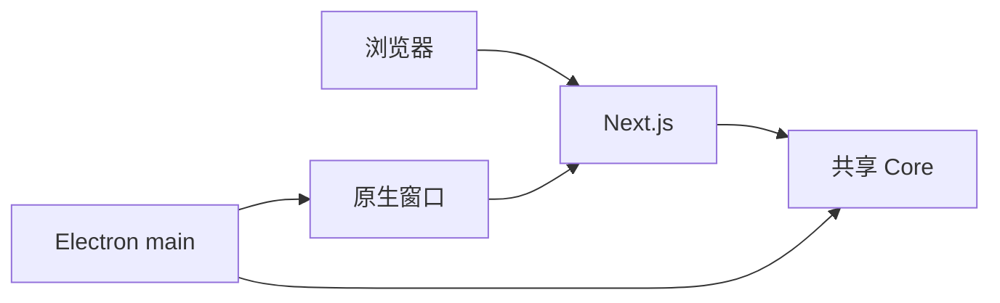

# A04：同一项目的两种运行形态

包说明代码放在哪里，运行形态说明代码在哪个进程执行。二者必须分开理解。

浏览器中打开首页时，代码拥有 DOM、`fetch` 和浏览器事件；Electron 主进程启动时，代码拥有创建原生窗口、访问系统进程和建立 IPC 的权限。即使它们都来自同一个 Git 仓库，也不能把两种权限当成同一个运行环境。

 [根 scripts（第 36-51 行）](../../../../package.json#L36) 中的 `pnpm dev` 只启动 `@originos/web`； [Desktop 的 dev 脚本（第 6-10 行）](../../../../packages/desktop/package.json#L6) 则同时构建 adapter、启动 3100 端口的 Next、监听桌面 TypeScript，并在端口可用后启动 Electron。

浏览器模式里，Next 服务页面；桌面模式里，Electron 主进程创建原生窗口，窗口再加载 Web。两种模式都可能 import Core。`wait-on tcp:3100` 的作用是避免 Electron 在 Next 尚未启动时加载失败。

图中 `Native -> Next` 容易被误读为“Electron 把 Next 编译进自己”。开发态并非如此：桌面脚本先启动可访问的 Next 服务，Electron 窗口再加载该服务地址。生产打包时会经历另一条准备独立产物的路径，这也是 [build:app（第 8-10 行）](../../../../packages/desktop/package.json#L8) 同时构建 Web、桌面 TypeScript 与运行时依赖的原因。

### 启动脚本逐步拆读

 [Desktop `dev`（第 8 行）](../../../../packages/desktop/package.json#L8) 可以拆成四段：

| 片段 | 做什么 | 若省略会怎样 |
| --- | --- | --- |
| `pi-agent-adapter build` | 先让桌面可解析 adapter 产物 | Electron 可能找不到 Agent 运行时 |
| `next dev -p 3100` | 提供渲染页面 | 窗口没有可加载的页面 |
| `tsc --watch` | 持续编译主进程代码 | 修改主进程后不能及时反映 |
| `wait-on ... electron` | 等 Web 可访问再启动壳 | 冷启动时容易加载失败 |

### 失败路径

若页面在浏览器可用、桌面版却失败，不能立刻怀疑 React。应先问：3100 是否已启动？Desktop TypeScript 是否产生 main 入口？adapter 是否可解析？这是按进程边界排错，而不是按界面现象盲猜。

 [Core 公共出口（第 1-3 行）](../../../../packages/core/src/index.ts#L1) 只导出 storage、utils、types 等基础入口，正是为了避免 Core 依赖 `window`、DOM 或某一个页面。

### 检查

`pnpm dev` 能否验证 Electron IPC？不能。它没有启动 Electron main。`pnpm desktop:dev` 为什么更慢？因为它需要协调多个进程和编译步骤。

下一章将把这种“先确定边界再判断代码”的方法用于每一条 import 语句。
