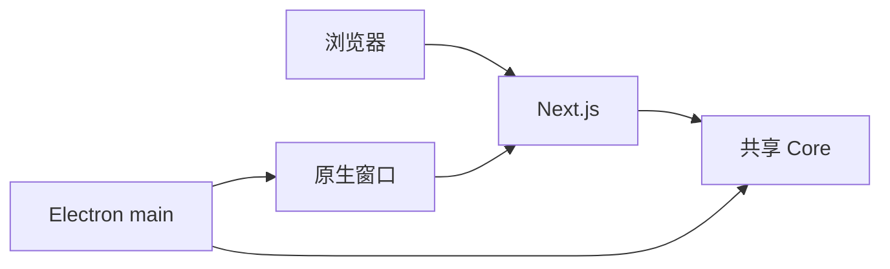

# A04：同一项目的两种运行形态

## 包说明位置，进程说明执行权限

上一章知道代码按 package 分层。但同一个 package 里的代码，也可能在不同进程执行。浏览器中打开首页时，代码拥有 DOM、`fetch` 和浏览器事件；Electron 主进程启动时，代码拥有创建原生窗口、访问系统进程和建立 IPC 的权限。即使它们都来自同一个 Git 仓库，也不能把两种权限当成同一个运行环境。

混淆这两种形态会带来典型错误：在浏览器里测试通过的代码，拿到桌面版却失败；或者在 Electron main 里直接操作 DOM。本章教你先判断「代码在哪个进程执行」，再读具体实现。

## 两种运行形态



浏览器模式里，Next 服务页面；桌面模式里，Electron 主进程创建原生窗口，窗口再加载 Web。两种模式都可能 import Core。图中 `Native -> Next` 容易被误读为「Electron 把 Next 编译进自己」。开发态并非如此：桌面脚本先启动可访问的 Next 服务，Electron 窗口再加载该服务地址。生产打包时会经历另一条准备独立产物的路径。

## 启动脚本逐步拆读

[`package.json` 第 36—48 行](../../../../package.json#L36) 中的 `pnpm dev` 只启动 `@originos/web`：

```json
"dev": "pnpm --filter @originos/web dev"
```

[`packages/desktop/package.json` 第 6—10 行](../../../../packages/desktop/package.json#L6) 的 `dev` 则同时处理多个进程：

```json
"dev": "pnpm pi-agent-adapter build && next dev -p 3100 & tsc --watch & wait-on tcp:3100 && electron ."
```

可以拆成四段：

| 片段 | 做什么 | 若省略会怎样 |
|------|--------|--------------|
| `pi-agent-adapter build` | 先让桌面可解析 adapter 产物 | Electron 可能找不到 Agent 运行时 |
| `next dev -p 3100` | 提供渲染页面 | 窗口没有可加载的页面 |
| `tsc --watch` | 持续编译主进程代码 | 修改主进程后不能及时反映 |
| `wait-on ... electron` | 等 Web 可访问再启动壳 | 冷启动时容易加载失败 |

`wait-on tcp:3100` 的作用是避免 Electron 在 Next 尚未启动时加载失败。这不是「Electron 依赖 Next 编译」，而是「桌面壳需要等待渲染服务就绪」。

## 两种形态下的 AppWindowManager

[`packages/web/src/services/AppWindowManager.ts` 第 56—120 行](../../../../packages/web/src/services/AppWindowManager.ts#L56) 在 Electron 环境下会走原生窗口分支：

```ts
if (config.content.type === 'component' && typeof window !== 'undefined' && isElectron()) {
  // 创建原生 BrowserWindow
  void createNativeWindow({ ... });
  // 同步 dock 图标
  this.syncWindowToDock(windowId, config.title, config);
  // 在 store 中记录 renderMode: 'native'
  return store.openWindow({ ...config, id: windowId, metadata: { ...metadata, renderMode: 'native' } });
}
```

这段代码说明同一个 `AppWindowManager` 类要根据运行形态选择不同实现：浏览器模式下用 React portal 渲染窗口，桌面模式下调用 `createNativeWindow`。如果把它只当作「Web 窗口管理器」来理解，就会漏掉桌面形态的关键分支。

## Core 为什么是共享的

[`packages/core/src/index.ts` 第 1—5 行](../../../../packages/core/src/index.ts#L1) 只导出 storage、utils、types 等基础入口，正是为了避免 Core 依赖 `window`、DOM 或某一个页面。无论代码在浏览器、Next 服务端还是 Electron main 执行，只要遵守类型约定，都可以使用 Core。

## 失败路径

1. **用 `pnpm dev` 验证 Electron IPC**：不能。`pnpm dev` 只启动 Web，没有 Electron main。
2. **在 Electron main 中直接使用 `window` 对象**：会报错，因为主进程没有 DOM。
3. **在浏览器代码中调用 `fs` 模块**：浏览器没有 Node 文件系统权限，必须通过 API route 或 IPC 间接访问。
4. **桌面版失败时先怀疑 React**：应先检查 3100 是否已启动、Desktop TypeScript 是否产生 main 入口、adapter 是否可解析。

## 测试证据与缺口

- Web 模式验证：`pnpm dev` 后用浏览器访问首页。
- 桌面模式验证：`pnpm desktop:dev` 后观察 Electron 窗口。
- Desktop 主进程测试：[`packages/desktop/vitest.config.ts`](../../../../packages/desktop/vitest.config.ts#L1) 使用 `node` 环境，覆盖 `src/` 和 `scripts/` 的测试。

缺口：目前没有自动化测试覆盖「Web 模式与桌面模式共享同一 Core 调用」的交叉验证，需要人工在两种形态下跑同一功能。

## 练习与口头验收

1. 解释 `pnpm dev` 和 `pnpm desktop:dev` 启动的进程差异。
2. 为什么 `wait-on tcp:3100` 在桌面开发脚本里必要？
3. 在 [`AppWindowManager.ts`](../../../../packages/web/src/services/AppWindowManager.ts#L56) 中找到原生窗口分支，说明它如何与 Web 窗口分支共享状态。
4. 判断：能否在 Electron main 进程中直接使用 React 的 `useState`？为什么？

合上本页后，应能区分「代码在哪个包」和「代码在哪个进程执行」，能说清浏览器模式与桌面模式的启动差异，并知道 `pnpm dev` 不能覆盖桌面 IPC。

下一章把「先确定边界再判断代码」的方法用于每一条 import 语句。
