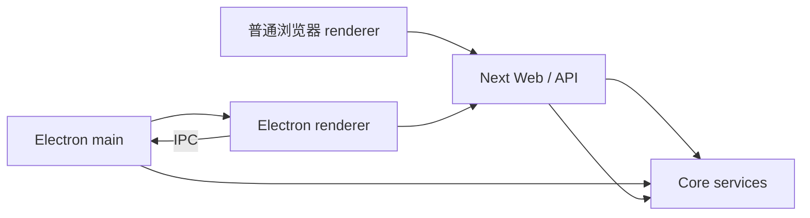

# A04：包的位置与代码执行的进程为什么必须分开判断

## Web 正常、桌面失败，并不矛盾

同一份首页代码可以在浏览器窗口中显示，也可以被 Electron 创建的原生窗口加载。表面 UI 相同，背后的权限与启动顺序却不同：浏览器 renderer 有 DOM 和 `fetch`，Next 服务端有 Node 能力，Electron main 能创建原生窗口与处理 IPC。

本章建立进程地图。它不讲打包发布的全部细节，只教会读者在排错前先问：这段代码此刻在哪个运行环境执行？

## 概念阶梯：package、进程、边界适配

| 概念 | 它决定什么 | 不决定什么 |
| --- | --- | --- |
| package | 代码归属、依赖和构建单元 | 代码必然在哪个进程运行 |
| 进程/运行环境 | 可用 API、内存和故障边界 | 代码逻辑属于哪个业务层 |
| 边界适配 | 同一能力在 HTTP 与 IPC 间如何选择 | 下层业务规则本身 |

例如 `packages/core` 中既有可在多环境复用的类型，也有只应在 Node 侧执行的文件访问实现。目录名“core”不能让浏览器突然获得 `fs` 权限。

## 运行地图：四个参与者而不是“两种模式”



- 普通浏览器 renderer 负责 UI 与用户事件，通过 HTTP 访问服务端边界。
- Next 同时包含页面构建和 API route；API route 在服务端环境执行。
- Electron renderer 仍是页面环境，但可以通过 preload 暴露的安全接口走 IPC。
- Electron main 拥有原生窗口、文件系统和进程管理能力。
- Core services 可被服务端或 desktop main 复用，但具体调用入口不同。

图中的两条通路不能因为最终都到 Core 就合并：HTTP 的请求、状态码和流协议，与 IPC 的 channel、payload 和事件终止语义不同。

## 源码窗口一：根命令只启动什么

[根 package.json](../../../../package.json#L1) 的 `dev` 脚本过滤到 Web package。它能够验证首页、React 交互和 Web API，却没有启动 Electron main，因此不能证明 IPC、原生窗口或 preload 工作。

[packages/desktop/package.json 第 6—10 行](../../../../packages/desktop/package.json#L6) 的开发脚本把多个任务放在一起：先构建 Pi Agent adapter，同时启动 Next 3100 端口和 TypeScript watch，等待端口就绪后再启动 Electron。

按因果关系拆开：

| 阶段 | 产物/状态 | 缺失时的现象 |
| --- | --- | --- |
| adapter build | 桌面运行时可解析的 Agent 适配产物 | main 侧模块加载失败 |
| `next dev -p 3100` | renderer 可访问的页面服务 | 原生窗口加载空白或连接失败 |
| `tsc --watch` | Electron main/preload 编译输出 | main 修改不生效或入口缺失 |
| `wait-on tcp:3100` | 启动顺序门闩 | Electron 过早加载页面 |
| `electron .` | 真正的桌面壳进程 | 只能看到普通浏览器形态 |

`wait-on` 证明的是端口可连接，不证明首页业务已健康，更不证明所有 IPC handler 注册成功。

## 源码窗口二：同一个窗口服务中的环境分支

[packages/web/src/services/AppWindowManager.ts 第 56—121 行](../../../../packages/web/src/services/AppWindowManager.ts#L56) 先检查内容类型、`window` 是否存在以及 `isElectron()`：

```ts
if (
  config.content.type === 'component'
  && typeof window !== 'undefined'
  && isElectron()
) {
  void createNativeWindow({ route: '/window', query, ... });
  this.syncWindowToDock(windowId, config.title, config);
  return store.openWindow({
    ...config,
    id: windowId,
    metadata: { ...metadata, renderMode: 'native' },
  });
}

return store.openWindow(config);
```

这段执行顺序包含一个重要边界：`createNativeWindow` 是异步 fire-and-forget，store 记录会立即返回。原生创建随后失败时，store 仍可能认为窗口已打开，并记录 `renderMode: 'native'`。所以“store 有窗口”不能证明“操作系统窗口已成功创建”。

## 原生窗口为什么只传可序列化 props

[同文件第 81—93 行](../../../../packages/web/src/services/AppWindowManager.ts#L81) 遍历组件 props，只把字符串、数字和布尔值放入 query；再从 metadata 注入若干字符串身份。React 组件、函数回调和复杂对象不会被序列化进 URL。

这不是简单的性能优化，而是进程边界要求。函数闭包持有当前 renderer 的内存，不能通过 URL 变成另一个窗口中可调用的同一闭包。若原生窗口依赖被过滤的复杂 prop，它必须通过稳定数据、store、API 或 IPC 重新获取，而不是假设 props 原样穿越。

## 源码窗口三：新原生窗口怎样重新获得组件输入

[packages/web/src/app/window/page.tsx 第 31—69 行](../../../../packages/web/src/app/window/page.tsx#L31) 是前一段 query 的消费者：

```tsx
const windowType = params.get('windowType') ?? '';
const skillName = params.get('skillName') ?? undefined;
const initialMessage = params.get('initialMessage') ?? undefined;

{windowType === 'skill' && (
  <SkillDialog
    skillName={skillName}
    initialMessage={initialMessage}
  />
)}
```

执行顺序是：原 renderer 把 primitive prop 变成 query，新 BrowserWindow 打开 `/window`，新 renderer 再把字符串解释为组件 props。这里没有共享旧 React 实例，也没有把旧闭包搬过去。

这段窗口同时暴露出停止边界：虽然 query 中还能出现 metadata 的 `projectId`、`sessionId`，Skill 分支没有把它们传给 SkillDialog。SkillDialog 会独立创建自己的会话身份。若只看 query 生成端而不看消费端，就会把“序列化成功”误写成“组件实际使用”。

## 正向推演：同一次 Skill 打开在两种环境中的差异

给定 `windowId = 'skill-bmad-brainstorming'`：

### 普通 Web

1. `isElectron()` 为假。
2. 跳过原生分支。
3. `store.openWindow(config)` 保存 React component 和 props。
4. Web 窗口容器从 store 渲染组件。

### Electron renderer

1. 环境检查为真。
2. 组件 props 被筛成 query 字符串。
3. 发起 `createNativeWindow`。
4. Dock 同步。
5. store 写入 `renderMode: 'native'`。
6. 新原生窗口通过 `/window` 路由重新解释 query。

现在代入一个不可序列化输入：`props.onDone = () => console.log('done')`。第 81—87 行只接受字符串、数字和布尔值，所以 query 中没有 `onDone`；新窗口也不可能在 `params` 中恢复它。正常路径是新窗口依靠可序列化身份重新获取数据，失败路径是组件仍假设回调存在而报错，恢复方式则是把跨窗口动作改成 API、IPC 或共享 store 合同。

两条路径共享窗口身份与部分状态，却不是同一种渲染机制。

## 反向故障诊断

| 现象 | 先检查 | 不应先改 |
| --- | --- | --- |
| `pnpm dev` 正常，`desktop:dev` 启动失败 | adapter build、3100、main 编译、Electron 日志 | React 卡片样式 |
| 桌面 store 有窗口但屏幕无原生窗 | `createNativeWindow` rejection 日志 | 会话存储 |
| 原生窗口缺少某个复杂 prop | props 序列化与 `/window` 重建 | Core 模型配置 |
| Web 中误用 `fs` | 是否应移到 API/Core Node 边界 | 给浏览器添加 Node polyfill |
| Electron main 使用 `window.document` | main/renderer 进程混淆 | Tailwind 配置 |

## 测试证据与缺口

[packages/desktop/vitest.config.ts](../../../../packages/desktop/vitest.config.ts#L1) 表明桌面测试使用 Node 侧环境；它不能替代真实 BrowserWindow 行为。Web 测试也不能自动覆盖 preload 与 IPC。

当前单元没有一项跨环境合同测试证明同一个 Skill 在 HTTP 与 IPC 下得到等价的窗口身份、会话请求和关闭语义。人工分别运行 `pnpm dev` 与 `pnpm desktop:dev` 可以增加运行证据，但若没有实际执行，就只能写作“验证方法”，不能写成“已通过”。

## 小实验：判断代码应在哪执行

给出四个动作：读取按钮文本、创建 `BrowserWindow`、读取会话 JSON、调用 `fetch('/api/skills/...')`。把它们分别归入 renderer、Electron main、服务端/Core、renderer 边界，并说明为什么。若一个动作在多个环境都可出现，还要指出它实际依赖的 API 与适配方式。

## 口头验收与下一章

合上本页，应能说明：

1. package 与进程为什么是两个维度。
2. `pnpm dev` 为什么不能验证 Electron IPC。
3. `wait-on` 能证明什么、不能证明什么。
4. 原生窗口为什么只序列化 primitive props。
5. 为什么 store 记录成功不等于 BrowserWindow 创建成功。

下一章把包层级和进程判断合并成一次“架构判案”：一段代码看似能运行，仍可能放错位置。
