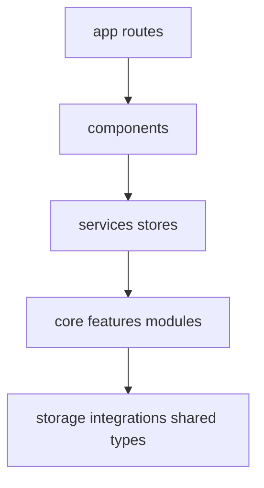
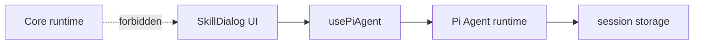

# A05：用架构规约判断一段代码的位置

在读懂业务之前，先能判断代码是否放错层，这会大幅降低阅读陌生仓库的难度。

架构规约并不替代源码；它像城市地图。地图不能告诉你一家店今天卖什么，却能告诉你不应把高速公路修进客厅。同样，规约不能替你理解 `SkillDialog` 的全部行为，却能先判断它不该被 Core 直接 import。

 [AGENTS.md 的目录规则（第 166-180 行）](../../../../AGENTS.md#L166) 规定：`app/` 只放页面、布局与 API 边界；共享逻辑下沉到 Core；Feature 经 `index.ts` 暴露公共 API。 [依赖规则（第 223-250 行）](../../../../AGENTS.md#L223) 则给出每层允许和禁止的依赖。

面对一个 import，依次提问：导入者在哪一层？被导入者在哪一层？箭头方向是否允许？是否绕开了另一个 Feature 的公共出口？

### 一次判案的完整过程

 [SkillDialog（第 1-26 行）](../../../../packages/web/src/components/skills/SkillDialog.tsx#L1) 位于 Web components 层。它导入 `usePiAgent`，后者来自 Core 的 Pi Agent integration。根据 [AGENTS.md（第 233-239 行）](../../../../AGENTS.md#L233) ，组件可以依赖 Web service/store 和 Core 公共 API，因此方向允许。相反，若 Pi Agent 的 `agent.ts` 导入 `SkillDialog`，基础集成层会依赖上层 UI，Desktop 服务与无 DOM 测试都被迫带入 React。

实线是允许的调用方向；虚线表示错误的反向依赖。错误不是“编译器一定报错”，而是系统的可替换性被破坏：以后任何想复用运行时的地方都要安装 UI。

### 另一种隐蔽错误

Feature A 直接 import Feature B 的内部文件，即使两个文件都在 Core，也会形成隐蔽耦合。规约要求经过 B 的 `index.ts` 公共出口，原因是内部实现可以重构，而公共 API 才是稳定合同。

例如 `page.tsx` 导入 `@originos/core/lib/integrations/pi-agent/client` 是上层使用下层能力。反过来，若 Pi Agent 代码 import `@/components/skills/SkillDialog`，就把 Core 锁死在 Web UI 上，违反规约。

### 小结

规约不是开发结束时才检查的清单，而是阅读时的罗盘。它不能替代业务理解，却能先排除不合理的解释。

### 练习

为 A02 的 `HomePage -> AppWindowManager -> SkillDialog` 链路标注层级。再假设把 `handleSkillLaunch` 中的会话持久化代码搬进 `page.tsx`，说明它违反的是哪条边界、应下沉到哪里。
