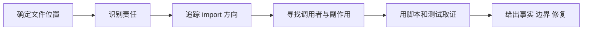

# A05：架构规约怎样用来“判案”而不是背诵

## 能编译的代码也可能放错位置

假设开发者为了复用 `SkillDialog` 中的提示词拼装逻辑，让一个 Core service 直接 import 这个 React 组件。TypeScript 可能暂时能解析路径，功能也可能在 Web 环境运行，但 Core 从此依赖 UI、浏览器别名和组件生命周期。真正的问题不是语法，而是依赖方向被反转。

本章用固定判案流程审查三类问题：越层 import、业务逻辑错位和跨 Feature 穿透。规约不是结论生成器；它提供假设，再由真实 import、调用者和副作用证明。

## 五步判案法



1. **位置**：文件属于 app、component、service/store、core feature/module 还是基础设施。
2. **责任**：它在做页面映射、UI 状态、共享业务还是文件/集成操作。
3. **方向**：依赖是否由高层指向低层或稳定公共 API。
4. **调用与副作用**：谁真正调用它，它是否写磁盘、开窗口、发网络请求。
5. **证据**：静态规则能抓什么，测试实际断言什么，还有什么只能人工判断。

## 案例一：`SkillDialog → usePiAgent` 为什么允许

[packages/web/src/components/skills/SkillDialog.tsx 第 288—300 行](../../../../packages/web/src/components/skills/SkillDialog.tsx#L288) 调用 `usePiAgent()`，获得初始化、恢复、流式发送和终止能力。导入者是 Web component；被依赖能力来自 Core 的 Pi Agent 客户端边界。方向是上层 UI 使用下层集成，符合规约。

同时，`usePiAgent` 返回状态与函数，不 import `SkillDialog`。因此 UI 可以替换，客户端运行逻辑仍保持独立。

## 案例二：API route 可以解析请求，却不应拥有业务主实现

[packages/web/src/app/api/agent/sessions/route.ts 第 54—145 行](../../../../packages/web/src/app/api/agent/sessions/route.ts#L54) 做参数解析、必填校验、配置合并、目录准备、调用 `agentSessionService` 和响应映射。这些是 HTTP 边界职责。

如果 route 自己实现“构造 AgentSession、决定路径、写 JsonStore”，桌面 IPC 想复用同一能力时就只能复制代码或模拟 HTTP。正确结构是 route 形成 `createRequest`，再把共享业务交给 [packages/core/src/lib/features/agent/session-service.ts 第 54—83 行](../../../../packages/core/src/lib/features/agent/session-service.ts#L54)。

边界判断不能机械地说“route 一行业务都不能有”。请求字段校验和 HTTP 状态码映射本来就属于 route；不应放进去的是跨入口都必须一致的会话业务规则。

## 案例三：基础设施层不能向 Feature 求助

存储层负责通用 JSON 读写。如果 `json-store.ts` 为了识别某种 Project 字段而 import project Feature，它就从最底层反向依赖业务层。以后 AgentSession、Ontology 等其他对象也会推动 JsonStore 添加专用分支，通用基础设施逐渐变成所有业务的汇总。

正确方式是上层把完整路径和数据传给通用 store；若需要业务验证，在 Feature 调用 store 之前完成。

## 自动检查真实做了什么

[scripts/check-agents-compliance.js](../../../../scripts/check-agents-compliance.js#L1) 定义可扫描层级和违规模式；[eslint-rules/agents-compliance.js](../../../../eslint-rules/agents-compliance.js#L1) 把部分规则放入 lint。阅读脚本时要区分：

| 证据 | 可以推出 | 不能推出 |
| --- | --- | --- |
| 扫描器定义了层级 | 这些路径会接受自动检查 | 所有真实目录都已覆盖 |
| 命令退出码为 0 | 本次扫描未发现已编码违规 | 没有复制逻辑或职责错位 |
| 某 import 被报错 | 路径触发明确规则 | 自动给出最合理重构设计 |

AGENTS.md 要求提交前运行 `pnpm lint`。若命令因环境或已有问题失败，应记录准确错误与未完成验证，不能把 `git diff --check` 通过写成 lint 通过。

要判断脚本是否真的覆盖仓库，必须继续精读入口，而不是停在文件名。[scripts/check-agents-compliance.js 第 1—24 行](../../../../scripts/check-agents-compliance.js#L1) 计算扫描根并检查目标目录是否存在；当前从仓库根执行时输出“`src/` 目录不存在，跳过检查”。执行过程可以写成：

```text
输入：仓库根目录
→ 脚本计算目标 src
→ existsSync 返回 false
→ 输出跳过提示
→ 进程没有报告违规并以 0 结束
```

这里的关键分支是“未扫描”而不是“扫描且无违规”。两种状态都可能得到零退出码，但证据含义完全不同。验证工具也必须像业务代码一样追踪输入、分支和输出。

## 一次完整的错误重构推演

错误输入：

```ts
// 假设位于 packages/core/src/lib/features/agent/session-service.ts
import { useAppWindowStore } from '@/store/appWindowStore';

export async function createAndOpenSession(request: CreateSessionRequest) {
  const session = await createSession(request);
  useAppWindowStore.getState().openWindow(...);
  return session;
}
```

逐步判案：

1. 文件属于 Core feature。
2. `createSession` 是共享业务；`openWindow` 是 Web UI 状态。
3. Core import Web store，箭头向上，违规。
4. 后果是无 UI 的调用方也被迫加载 Zustand/Web 别名。
5. 重构时保留 Core 的 `createSession`，由 Web 上层在成功返回后决定是否打开窗口；若多个 UI 入口要统一响应，可在 Web service 中封装编排。

重构不是把 import 换个相对路径，而是把决策送回拥有该责任的层。

重构后的最小调用合同应是：

```ts
// Core：只返回共享业务结果
export async function createSession(request: CreateSessionRequest) {
  return agentSessionService.createSession(request);
}

// Web：拥有窗口决策
const session = await createSession(request);
windowManager.openComponentWindow(
  `session-${session.sessionId}`,
  '会话',
  SessionView,
  { sessionId: session.sessionId },
);
```

第一段可以被 HTTP、IPC、后台任务复用；第二段只能在拥有 React 窗口语义的 Web 层执行。若 Core 创建成功而 Web 打窗失败，系统处于“会话已保存、窗口未出现”的部分成功，重试策略也应由上层决定是否复用已有 session，而不是让 Core 回滚文件。

## 隐蔽问题：平行实现和中间层空洞

没有违规 import 也可能有架构问题。Web 与 Desktop 分别复制相同会话构造，就是平行实现；教材若只讲 UI 和最终 Core service，跳过 HTTP/IPC 适配，就是中间层空洞。

全局审查应双向走查：

```text
用户入口 → 编排 → 边界适配 → Core → 副作用
副作用 → 谁写入 → 谁调用 → 哪个入口触发
```

两次走查得到的文件集合不一致时，应查明是遗漏、备用路径、legacy 路径还是未接入实现。

## 测试证据与缺口

静态规则适合验证 import 方向；单元测试适合验证业务输出；集成测试适合验证边界合同；E2E 才能跨过真实用户入口。任何一种都不能替代其余种类。

当前 Part A 没有实际执行 `pnpm lint`，所以正文只给出运行方式，不声称它已通过。即使后续执行成功，也只能把结论写成“当前工作树在规则覆盖范围内通过”，不能写成“架构完全正确”。

本轮实际证据如下：Given 是当前 monorepo 根目录，When 执行 `pnpm agents:check`，Then 命令跳过 `src/` 扫描；Given 是当前依赖环境，When 尝试运行目标 Vitest，Then `vitest` 命令不存在。两项都不是产品代码失败，但都阻止“自动验证已经完成”的结论。

## 小实验：对四个位置逐一判案

把“把 session 对象保存成 JSON”分别放入 `page.tsx`、Web service、Core feature service、JsonStore，判断每处应该拥有多少责任：页面只触发；Web service 可适配环境；Core feature 决定会话业务；JsonStore 只负责通用 DataFile 写入。完成后再说明调用链应该怎样串联，而不是只选一个目录名。

## 口头验收与下一章

合上本页，应能回答：

1. 五步判案法各自收集什么证据。
2. 为什么 `SkillDialog → usePiAgent` 合法，反向则违规。
3. API route 中哪些逻辑属于边界，哪些必须下沉。
4. 静态检查通过为什么不能证明没有平行实现。
5. 重构依赖违规时为什么要移动责任，而非只改 import 路径。

下一章将以上方法用于一次完整学习记录：从用户问题进入源码，再用测试边界和最小实验收束。
