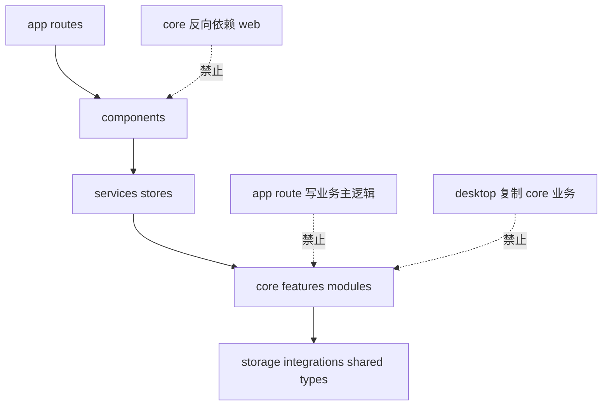
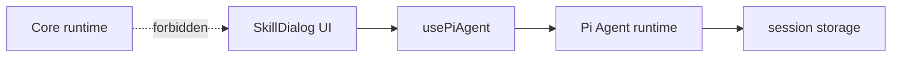

# A05：用架构规约判断一段代码的位置

## 规约是地图，不是业务解释

在读懂业务之前，先能判断代码是否放错层，这会大幅降低阅读陌生仓库的难度。架构规约并不替代源码；它像城市地图。地图不能告诉你一家店今天卖什么，却能告诉你不应把高速公路修进客厅。同样，规约不能替你理解 `SkillDialog` 的全部行为，却能先判断它不该被 Core 直接 import。

[`AGENTS.md` 的目录规则](../../../../AGENTS.md#L166) 规定：`app/` 只放页面、布局与 API route 边界；共享逻辑下沉到 Core；Feature 经 `index.ts` 暴露公共 API。 [`AGENTS.md` 的依赖规则](../../../../AGENTS.md#L223) 则给出每层允许和禁止的依赖方向。

## 单向依赖层级



实线是允许的调用方向；虚线表示错误的反向依赖或错位。错误不是「编译器一定报错」，而是系统的可替换性被破坏：以后任何想复用运行时的地方都要安装 UI。

## 一次判案的完整过程

[`SkillDialog.tsx` 第 1—26 行](../../../../packages/web/src/components/skills/SkillDialog.tsx#L1) 位于 Web components 层。它导入 `usePiAgent`，后者来自 Core 的 Pi Agent integration。根据 [`AGENTS.md`](../../../../AGENTS.md#L233) ，组件可以依赖 Web service/store 和 Core 公共 API，因此方向允许。

相反，若 Pi Agent 的 `agent.ts` 导入 `SkillDialog`，基础集成层会依赖上层 UI，Desktop 服务与无 DOM 测试都被迫带入 React。



判断一条 import 时，不要只看路径能否解析，要同时判断层级和公开边界。

## 另一种隐蔽错误：同包内绕过公共出口

Feature A 直接 import Feature B 的内部文件，即使两个文件都在 Core，也会形成隐蔽耦合。规约要求经过 B 的 `index.ts` 公共出口，原因是内部实现可以重构，而公共 API 才是稳定合同。

例如 `page.tsx` 导入 `@originos/core/lib/integrations/pi-agent/client` 是上层使用下层能力。反过来，若 Pi Agent 代码 import `@/components/skills/SkillDialog`，就把 Core 锁死在 Web UI 上，违反规约。

## 从规约到脚本

[`scripts/check-agents-compliance.js`](../../../../scripts/check-agents-compliance.js#L1) 把部分规则变成自动检查。它定义了依赖层级：

```js
const DEPENDENCY_LAYERS = {
  'src/app': 5,
  'src/components': 4,
  'src/services': 3,
  'src/lib/features': 2,
  'src/modules': 2,
  'src/lib/storage': 1,
  'src/lib/integrations': 1,
  'src/lib/hooks': 1,
  'src/lib/shared': 0,
  'src/lib/utils.ts': 1,
};
```

数字越大，层级越高。如果一个低层文件导入更高层文件，就会产生 `LAYER_VIOLATION`。脚本还检查组件分层和 feature 跨模块导入。但它只能抓一部分问题，不能替代人工 review。

## 失败路径

1. **Core 依赖 Web 组件**：Core 无法脱离浏览器环境测试和复用。
2. **API route 写业务主逻辑**：业务逻辑被锁死在 HTTP 边界内，桌面端和 CLI 无法复用。
3. **Desktop 服务复制 Core 规则**：同样的 bug 需要在两处修复。
4. **Feature 之间直接读取内部文件**：内部重构时调用方大面积失效。

## 测试证据与缺口

- `pnpm lint` 会运行 ESLint，包括 [`eslint-rules/agents-compliance.js`](../../../../eslint-rules/agents-compliance.js#L1) 的自定义规则。
- `pnpm agents:check` 会运行 [`scripts/check-agents-compliance.js`](../../../../scripts/check-agents-compliance.js#L1)，扫描依赖违规。

缺口：自动脚本无法发现「业务逻辑写在 route 里太多」这类结构性问题，需要人工 review 判断。

## 练习与口头验收

1. 为 A02 的 `HomePage -> AppWindowManager -> SkillDialog` 链路标注层级。
2. 假设把 `handleSkillLaunch` 中的会话持久化代码搬进 `page.tsx`，说明它违反的是哪条边界、应下沉到哪里。
3. 判断下面 import 为何错误：
   ```ts
   // packages/core/src/lib/features/ontology/index.ts
   import { OntologyPreview } from '@/components/os/ontology-preview/OntologyPreview';
   ```
4. 打开 [`scripts/check-agents-compliance.js`](../../../../scripts/check-agents-compliance.js#L1)，说明 `DEPENDENCY_LAYERS` 中数字越大代表层级越高还是越低。

合上本页后，应能给出任意 import 时回答四件事：导入者在哪一层、被导入者在哪一层、箭头是否允许、是否经过公共出口。规约不是开发结束时才检查的清单，而是阅读时的罗盘。

下一章把这套方法固化成可复用的源码阅读闭环。
