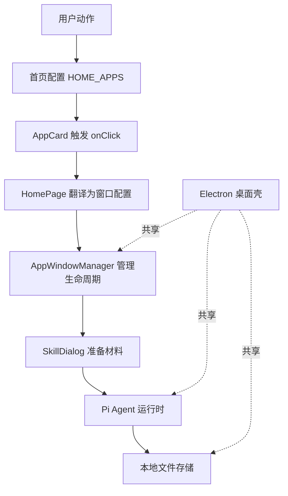
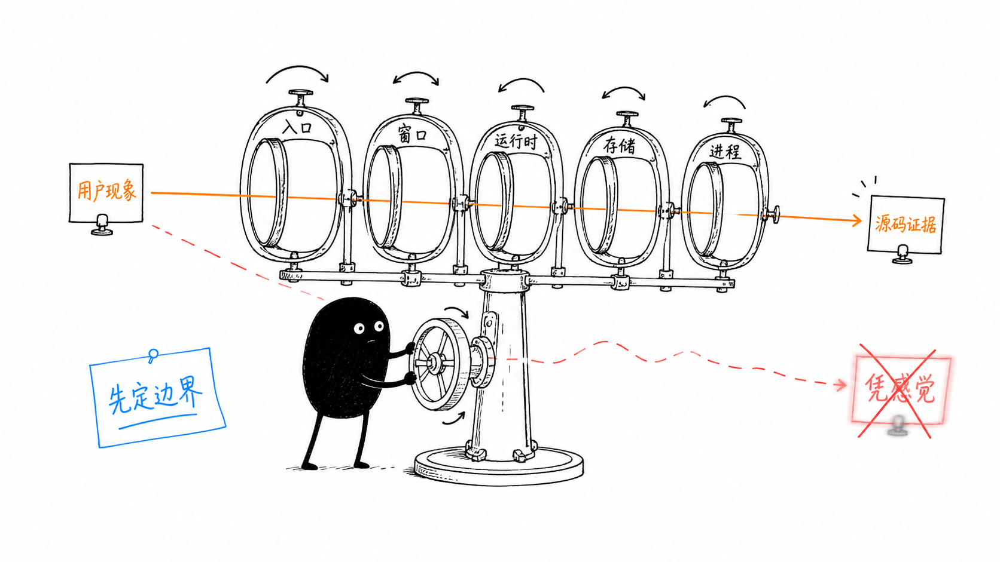

# A06：把源码阅读变成可验证的知识

## 从「看过文件」到「能解释行为」

学完前五章，你已经知道 OriginOS 有四个系统角色、代码按 Monorepo 分层、运行形态分浏览器和桌面、架构规约是阅读罗盘。但知道这些还不够。源码阅读的目标不是记住函数名，而是能在新问题出现时重新找到入口、追踪数据并验证判断。

"我看过这个文件"和"我能解释这个行为"之间差着一条证据链。文件很长时，最危险的做法是从第一行顺序滚动，看到熟悉词就以为理解。更可靠的做法是先提出一个能被证明或推翻的问题，再只阅读回答该问题所需的窗口。

## 阅读闭环

以技能卡片为例：问题是「点击后谁打开对话」；入口是 [`HOME_APPS` 第 27 行](../../../../packages/web/src/config/homeApps.ts#L27)；调用链是 `AppCard -> onClick -> handleSkillLaunch -> AppWindowManager -> SkillDialog`；关键类型是 `HomeAppConfig`；测试证据分散在组件测试和 E2E 中；练习是画出这条链并解释每个边界；复盘记录是「窗口 id 不等于已持久化 session」。

## 一次完整的阅读记录

| 步骤 | 实际动作 | 得到的证据 |
|------|----------|------------|
| 提问 | "哪段代码决定 skill 还是 action？" | 这是可定位的问题 |
| 定位 | 搜索 `HOME_APPS.map` | 找到 [`page.tsx` 第 1426 行](../../../../packages/web/src/app/page.tsx#L1426) |
| 追踪 | 沿 `onClick` 进入 `handleSkillLaunch` | 找到 [`page.tsx` 第 845 行](../../../../packages/web/src/app/page.tsx#L845) |
| 校正 | 区分窗口 id 与持久化 session | 第 866 行只创建元数据关联 |
| 验证 | 比较 `action` 分支 | 工作区没有调用 `handleSkillLaunch` |

这张表的价值在于每一步都可回到源码复查。它避免把"我认为应该如此"误写成"代码就是如此"。

## 测试应当回答什么

测试不是给整个文件打一个"正确"印章。它只证明一个明确断言。例如消息测试会验证空内容是否拒绝，会话测试会验证保存后能否恢复；它们不自动证明窗体视觉布局正确。阅读任何测试时，先写出它的 Given、When、Then，再判断这条断言覆盖了调用链的哪一段。

每次记录只保留四项：入口、关键数据、容易误解点、验证结果。有效记录不是"已阅读 page.tsx"，而是"`skillName` 同时参与窗口 id 和 props，但不等于已持久化 Session"。

## Part A 核心判断

读完 Part A 后，你应该带着一句核心判断进入 Part B：

> OriginOS 的源码不是按功能目录平铺的，而是按"谁面对用户、谁共享业务、谁管理运行时、谁保存状态、谁在桌面进程执行"分层的。阅读任何代码时，先问它属于哪一层、依赖哪一层、数据落在哪里。

这句话可以拆成五条具体含义：

1. **产品入口是配置**：`HOME_APPS` 中的 `type` 决定入口身份，不是视觉样式。
2. **视觉组件不执行业务**：`AppCard` 只触发 `onClick`，不知道 Skill 如何运行。
3. **窗口是生命周期边界**：`AppWindowManager` 在关闭时注入 Agent 销毁和记忆整理。
4. **包边界是责任边界**：`web/core/desktop` 单向依赖，`workspace:*` 连接本地包。
5. **进程边界是权限边界**：浏览器、Next 服务端、Electron main 拥有不同权限，`pnpm dev` 不能验证桌面 IPC。

## 总体认知图

这张图不是调用链，而是 Part A 建立的整体责任地图。每一根箭头代表一种稳定的依赖关系：首页配置决定入口，卡片触发事件，页面翻译配置，窗口服务管理生命周期，SkillDialog 准备会话材料，Agent 运行时处理模型调用，存储层保存结果。Electron 不是替代其中任何一层，而是在桌面形态下复用 Web 与 Core。

## 关键区分卡

| 概念 | 是什么 | 不能误认为 |
|------|--------|-----------|
| `app.id` | React 列表 key | 窗口 id 或 session id |
| 窗口 id | 窗口在 `AppWindowManager` 中的标识 | 持久化会话的磁盘文件名 |
| session id | 会话在存储层和运行时的标识 | 窗口的视觉标题 |
| `workspace:*` | 本地 workspace 包引用 | npm 外部包版本 |
| `app/` | 页面和 API route 边界 | 业务逻辑主实现 |
| `core/lib/features/` | 共享业务能力 | UI 展示或进程专属代码 |
| `pnpm dev` | 只启动 Web | 也启动 Electron |
| `pnpm desktop:dev` | 协调 Web + adapter + 主进程 + Electron | 只编译桌面 |

## 排查地图

当遇到一个现象时，先按层定位，再进入该层源码：

| 现象 | 先看哪一层 | 典型入口 |
|------|-----------|----------|
| 首页卡片没显示 | Web 配置层 | `packages/web/src/config/homeApps.ts` |
| 点击卡片没反应 | Web 页面编排层 | `packages/web/src/app/page.tsx` 中 `HOME_APPS.map` |
| 窗口没打开 | 窗口服务层 | `packages/web/src/services/AppWindowManager.ts` |
| 窗口开了但欢迎语不对 | SkillDialog 准备层 | `packages/web/src/components/skills/SkillDialog.tsx` |
| 桌面版失败但 Web 正常 | 运行形态/进程层 | `packages/desktop/package.json` scripts |
| 不确定 import 是否越界 | 架构规约层 | `AGENTS.md` 目录与依赖规则 |

## 综合实验

不看 Part A 正文，完成以下三项：

1. 画出一次技能启动的控制流、数据流和生命周期边界。
2. 任选一个 `packages/web/src/app/page.tsx` 中的 import，用 A05 的四问判定其方向。
3. 解释如果删除 `HOME_APPS` 中某个 `skill` 条目的 `skillName`，系统会怎样表现。

## 源码覆盖台账

| 文件路径 | 状态 | 主讲章节 | 教学责任 |
|----------|------|----------|----------|
| `packages/web/src/config/homeApps.ts` | 直接精读 | A01、A02 | 首页入口分类 |
| `packages/web/src/app/page.tsx` | 局部引用 | A02 | 页面编排与点击分发 |
| `packages/web/src/components/framework/AppCard.tsx` | 直接精读 | A02 | 卡片只触发事件 |
| `packages/web/src/services/AppWindowManager.ts` | 局部引用 | A02、A04 | 窗口生命周期与原生分支 |
| `pnpm-workspace.yaml` | 直接精读 | A03 | workspace 包范围 |
| `packages/*/package.json` | 直接精读 | A03、A04 | 包职责与 scripts |
| `packages/core/src/index.ts` | 背景引用 | A03 | Core 公共入口 |
| `AGENTS.md` | 直接精读 | A03、A05 | 目录规则与依赖方向 |
| `scripts/check-agents-compliance.js` | 直接精读 | A05 | 规约自动化检查 |

## 进入 Part B 前的口头验收

合上 Part A 后，应能不翻稿回答：

1. OriginOS 的四个系统角色是什么，各自负责什么？
2. 为什么 `AppCard` 不执行 Skill，而只触发 `onClick`？
3. `workspace:*` 与 npm 包引用有什么区别？
4. `pnpm dev` 和 `pnpm desktop:dev` 分别启动了哪些进程？
5. 如何判断一条 import 是否违反 `AGENTS.md` 的层级规则？
6. 源码阅读的闭环包含哪七个步骤？

能完成这六项，说明 Part A 提供的不是目录记忆，而是一套可以进入 Part B 的阅读工具。

## 下一单元预告

Part B 将用一次真实点击——首页「头脑风暴」卡片——把 Web 入口、窗口、API、Core、Agent 运行时、文件产物串成一条完整链路。你不再需要凭感觉猜测"系统做了什么"，而是能逐层追踪"数据现在在哪里、下一跳去哪里、边界在哪里"。

*上图意图：小黑手持放大镜，依次穿过「问题」「入口」「调用链」「关键类型」「测试证据」「练习」「复盘」七个节点，最终回到问题本身，表示每一次阅读都应留下可验证的证据链。*
