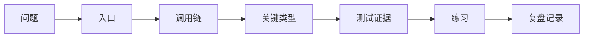

# A06：把源码阅读变成可验证的知识

源码阅读的目标不是记住函数名，而是能在新问题出现时重新找到入口、追踪数据并验证判断。

“我看过这个文件”和“我能解释这个行为”之间差着一条证据链。文件很长时，最危险的做法是从第一行顺序滚动，看到熟悉词就以为理解。更可靠的做法是先提出一个能被证明或推翻的问题，再只阅读回答该问题所需的窗口。

以技能卡片为例，问题是“点击后谁打开对话”；入口是 [HOME_APPS（第 27 行）](../../../../packages/web/src/config/homeApps.ts#L27) ；调用链是 `AppCard -> onClick -> handleSkillLaunch -> AppWindowManager -> SkillDialog`；关键类型是 `HomeAppConfig`；测试会在后续会话和 UI 行为章节中证明边界。

### 一次完整的阅读记录

| 步骤 | 实际动作 | 得到的证据 |
| --- | --- | --- |
| 提问 | “哪段代码决定 skill 还是 action？” | 这是可定位的问题，不是“看懂首页” |
| 定位 | 搜索 `HOME_APPS.map` | 找到 [第 1426 行](../../../../packages/web/src/app/page.tsx#L1426) |
| 追踪 | 沿 `onClick` 进入 `handleSkillLaunch` | 找到 [第 845 行](../../../../packages/web/src/app/page.tsx#L845) |
| 校正 | 区分窗口 id 与持久化 session | 第 866 行只创建元数据关联 |
| 验证 | 比较 `action` 分支 | 工作区没有调用 `handleSkillLaunch` |

这张表的价值在于每一步都可回到源码复查。它避免把“我认为应该如此”误写成“代码就是如此”。

### 测试应当回答什么

测试不是给整个文件打一个“正确”印章。它只证明一个明确断言。例如消息测试会验证空内容是否拒绝，会话测试会验证保存后能否恢复；它们不自动证明窗体视觉布局正确。阅读任何测试时，先写出它的 Given、When、Then，再判断这条断言覆盖了调用链的哪一段。

每次记录只保留四项：入口、关键数据、容易误解点、验证结果。有效记录不是“已阅读 page.tsx”，而是“`skillName` 同时参与窗口 id 和 props，但不等于已持久化 Session”。

 [根测试脚本（第 43-48 行）](../../../../package.json#L43) 提供 lint、type-check、test 和 coverage 入口。测试的作用不是给课程盖章；它让关于行为的判断可以被机器重复检查。

### Part A 总结

从下一章开始，阅读将持续使用同一条路线：先观察用户动作，再定位入口，沿真实调用链前进，在关键类型处停下解释，最后用测试和小改动验证。Part E 的第一章由此进入 Session：它是用户一次连续 Agent 工作的最小容器。

### Part A 验收

不看正文，画出一次技能启动的控制流、数据流和生命周期边界；分别指出 Web、Core、Electron 的职责；再任选一个 import 用 A05 的四个问题判定其方向。能完成这三项，才说明 Part A 提供的不是目录记忆，而是一套可以进入 Part E 的阅读工具。
