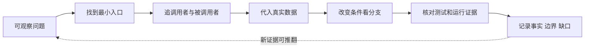
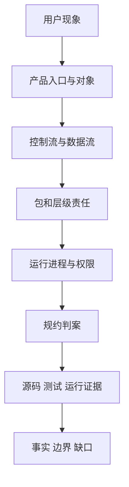

# A06：把“我看过源码”变成可复查的判断能力

## 最后一课不再增加新名词

Part A 已建立产品角色、三条链、包边界、运行进程和架构判案。A06 把它们合成一种可重复的阅读方法，并完整演示一次：

> 问题：为什么头脑风暴卡片能显示，却可能点击后没有任何反应？

这个问题足够具体，可以被源码证据支持或推翻；也足够小，不需要先读完整个 `page.tsx`。

本课也承担 Part A 的复盘。阅读顺序是：先用“卡片可见但无动作”完成一次正向执行和反向诊断；再看总体认知图重新组织 A01—A05；最后用工作区入口做迁移实验。不要先背源码台账，先掌握证据回路怎样工作。

一句核心判断是：**源码阅读的产物不是结论，而是一条带输入、执行过程、证据等级和停止边界的可复查推理。**它包含四层含义：现象不等于原因；同名字段不等于同一对象；代码分支不等于测试证明；单次验证不等于永久事实。

## 阅读闭环不是直线，而是证据回路


图中，小黑操作五层镜片，把“用户动作”聚焦到“源码证据”；偏离镜片的红色光线代表未经验证的直觉。五层镜片分别提醒读者检查入口、窗口、运行时、存储和进程。任何一层证据不足，都应回到源码继续定位，而不是把猜测写成结论。



图中最后一根回箭头很重要：源码会变化，旧结论必须允许被新证据修正。

## 第一步：把模糊抱怨改写成可验证问题

“卡片坏了”无法定位。先拆成三个观察：

1. `HOME_APPS` 中是否存在条目？
2. `AppCard` 是否执行了传入的 `onClick`？
3. 页面闭包是否满足启动分支？

本次只追到第 3 项。窗口创建与会话初始化分别是下一层问题。

## 第二步：按调用方向打开最少文件

建议顺序不是按目录，而是按因果：

1. [packages/web/src/config/homeApps.ts 第 8—83 行](../../../../packages/web/src/config/homeApps.ts#L8)：入口对象长什么样。
2. [packages/web/src/app/page.tsx 第 1426—1450 行](../../../../packages/web/src/app/page.tsx#L1426)：对象怎样变成回调。
3. [packages/web/src/components/framework/AppCard.tsx 第 73—79 行](../../../../packages/web/src/components/framework/AppCard.tsx#L73)：点击是否真的把控制权还给父级。
4. [packages/web/src/app/page.tsx 第 845—869 行](../../../../packages/web/src/app/page.tsx#L845)：满足条件后准备什么窗口配置。

这次可以暂时跳过 `page.tsx` 的项目访谈、Spotlight 视觉、设置面板等区域，因为它们不回答当前问题。

## 第三步：代入一个真实配置逐步执行

输入对象：

```ts
{
  id: 'app-brainstorming',
  name: '头脑风暴',
  type: 'skill',
  skillName: 'bmad-brainstorming',
}
```

执行记录：

| 步骤 | 当前数据 | 分支结果 | 新副作用 |
| --- | --- | --- | --- |
| 配置读取 | `type='skill'`、`skillName` 非空 | 可进入 skill 分支 | 无 |
| AppCard 点击 | `path` 未优先导航、`onClick` 存在 | 执行父回调 | 无 |
| 页面判断 | 两个条件均真 | 调用 `handleSkillLaunch` | 无 |
| handler 组装 | 窗口 id、title、props、metadata | 调用窗口服务 | 窗口状态即将创建 |

直到最后一步，系统才接近窗口副作用；前面三步都没有创建会话或调用模型。

## 第四步：改变一个条件，推导控制流

### 删除 `skillName`

配置仍满足 `HomeAppConfig`，卡片仍可渲染；页面条件的第二项为假；若 `action` 也不存在，则闭包结束。可见症状是“卡片有，点击无结果”。

### 增加 `path`

`AppCard.handleClick` 优先处理 `path`，不会执行 `onClick`。若调用方同时传两者，用户会导航而非打开窗口。这个分支说明只看页面闭包还不够，必须回看真实组件入口。

### `type='action'` 且 `action='open-workspace'`

页面进入工作区分支，但还要求 `projects[0]` 存在。若没有项目，同样可能“无结果”，但责任不再是缺少 `skillName`。

## 第五步：从症状反向定位

```text
卡片是否可见？
├─ 否：查 HOME_APPS 与渲染列表
└─ 是：点击是否执行 onClick？
   ├─ 否：查 path 优先级、disabled/事件层
   └─ 是：type 与必要字段是否满足？
      ├─ 否：修配置合同或提供可见错误
      └─ 是：进入 AppWindowManager 继续查
```

这棵树故意在窗口服务处停止。诊断地图应当告诉读者何时把问题交给下一责任层，而不是把所有可能故障堆在一张表里。

## 第六步：测试证据只覆盖它断言的范围

本案例缺少直接配置结构测试、`handleSkillLaunch` 单测和完整点击 E2E。因此当前判断主要是静态执行推演。它能够证明条件分支按代码将怎样运行，不能证明真实浏览器中没有遮罩层阻挡点击、React 没有 hydration 问题、Electron 原生窗口一定成功。

适合补充的最小测试：

```ts
it('requires skillName for every skill home app', () => {
  for (const app of HOME_APPS) {
    if (app.type === 'skill') {
      expect(app.skillName).toBeTruthy();
    }
  }
});
```

这项测试只固定配置不变量；它仍不证明用户点击能打开窗口。第二层需要组件/编排测试，完整视觉行为需要 E2E 或人工运行。

## 第七步：形成一条可审计记录

| 字段 | 本次记录 |
| --- | --- |
| 可观察问题 | 头脑风暴卡片可见但点击可能无结果 |
| 最小入口 | `HOME_APPS` 中对应对象 |
| 控制流 | 配置 → AppCard → 父级 onClick → 页面条件 → handler |
| 关键数据 | `type`、`skillName`、`path`、`projects[0]` |
| 已证事实 | 缺少 `skillName` 时 skill 分支不执行 |
| 未证边界 | 真实 DOM 点击、窗口渲染、Electron 创建 |
| 建议验证 | 配置单测 + handler 测试 + 浏览器/Electron 观察 |

这样的记录比“已阅读 page.tsx”更有用，因为另一位读者可以复查、反驳或在源码变化后更新。

## Part A 总体认知图



这不是产品调用链，而是阅读顺序：先把现象改写成问题，再确定对象和流向，然后判断包与进程，最后用多种证据收束。顺序反过来时，读者容易从一个测试文件或一个大类名推导过度结论。

## 源码覆盖与相邻边界

Part A 已直接精读 `homeApps.ts`、`AppCard.tsx` 的点击窗口、`page.tsx` 的技能启动窗口、`AppWindowManager.ts` 的打开与环境分支、workspace/package 脚本和架构检查入口。`SkillDialog`、客户端 Hook、API routes、会话 service 与工具只作为停止边界，Part B/E 继续精读。

因此，本单元完成不意味着全项目地图中的这些大文件已整体“吃透”；它只完成台账登记的代码窗口和能力目标。

## 已证明、尚未证明与明确不在范围内

| 证据状态 | 本单元可以下的结论 |
| --- | --- |
| 已由当前源码证明 | 入口配置怎样投影成卡片；页面怎样选择 Skill handler；窗口服务怎样分 Web/Electron；规约怎样限制依赖方向 |
| 只有静态推演、尚无回归测试 | 缺少 `skillName` 时无动作；handler 生成的完整 metadata；原生窗口失败后的 store 部分成功 |
| 本轮命令未证明 | `pnpm agents:check` 实际跳过扫描；Vitest 在当前环境不可用；浏览器和 Electron 均未启动 |
| 明确不在 Part A | Skill 内容加载、会话创建、消息恢复、SSE、工具执行和产物写入的内部实现 |

这张表防止两个常见越界：不能因为源码分支存在就写成回归行为已被测试固定，也不能因为 Part A 画出了 Agent 节点就声称已经掌握 Pi Agent runtime。

## 综合实验：独立追踪另一个入口

选择“工作区”入口，不复制本章答案，完成以下记录：

1. 配置对象与必要字段；
2. AppCard 到页面闭包的控制流；
3. `projects[0]` 对分支的影响；
4. handler 生成的窗口 id、标题、组件和 metadata；
5. 没有项目时的用户可见症状；
6. 现有测试能证明与不能证明的范围。

验收标准不是写满六项，而是每项都能指向真实源码窗口，并至少完成一个条件变化的预测。

## 进入 Part B 前的口头验收

不看稿，应能回答：

1. 为什么“页面上同时出现”不能推出“同一个组件完成”？
2. package、架构层级和运行进程分别回答什么问题？
3. 判断 import 的五个步骤是什么？
4. 为什么静态检查、单元测试、集成测试和 E2E 不能互相替代？
5. 卡片可见但无反应时，怎样在不盲读整个仓库的情况下逐层定位？
6. 一条可信源码笔记为什么必须包含未证明边界？

## 四轮学习者模拟

1. **术语首现**：能够用头脑风暴对象解释配置、组件实例、窗口、会话和 runtime，不依赖后文章节补定义。
2. **正向追踪**：能把真实配置推进到页面条件和窗口命令，并在尚未创建会话处停下。
3. **反向诊断**：从“卡片可见但无动作”依次排除 AppCard 事件、页面字段和窗口服务，不直接归因于模型。
4. **相邻迁移**：把同一方法用于工作区 action，识别 `projects[0]` 是新的条件，而不是机械寻找 `skillName`。

若其中任一轮只能复述结论、不能指出字段和源码窗口，Part A 仍需回到对应章节复习，不能把读完文件当成通过。

Part A 最终留下的原则是：**先建立最小准确模型，再用真实输入推演；从症状反查边界，用证据限制结论。** Part B 将用这套原则贯穿一次完整 Skill 操作。
