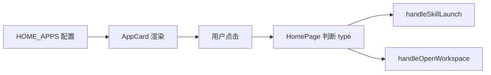

# B01：首页入口为什么分成 skill 和 action

## 一个可观察的现象

打开 OriginOS 首页，「创建 Agent」「创建角色」「技能市场」「头脑风暴」「工作流构建」看起来都是卡片。但「工作区」点进去打开的是文件管理窗口；其余五个点进去打开的却是对话窗口。这个差异不是 UI 风格不同，而是源码中 [`AppCardType = 'skill' | 'action'`](../../../../packages/web/src/config/homeApps.ts#L8) 这条类型决定的。

本章回答：为什么首页卡片只是一条配置数据，而不是已经加载好的 Skill 或窗口？

## 首页配置到动作的翻译



这张图说明：首页卡片只是配置的投影；真正决定走哪条路径的是 `HomePage` 中的条件判断。`AppCard` 甚至不知道 `type` 字段的存在。

## 首页配置的本质

[`packages/web/src/config/homeApps.ts` 第 8—21 行](../../../../packages/web/src/config/homeApps.ts#L8) 定义了 `HomeAppConfig`：

```ts
export type AppCardType = 'skill' | 'action';

export interface HomeAppConfig {
  id: string;
  name: string;
  description: string;
  icon: string;
  color: string;
  type: AppCardType;
  skillName?: string;  // 用于 skill 类型
  action?: string;     // 用于 action 类型
}
```

注意 `skillName` 和 `action` 都是可选的，但 `type` 是必填的。这意味着：一个 `type: 'skill'` 的条目如果没有 `skillName`，卡片仍会显示，点击后却不会进入任何 Skill。类型表达设计意图，运行时字段防御错误配置，两者缺一不可。

[`HOME_APPS` 第 27—111 行](../../../../packages/web/src/config/homeApps.ts#L27) 是实际配置：

```ts
{
  id: 'app-brainstorming',
  name: '头脑风暴',
  description: '...',
  icon: '💡',
  color: 'from-amber-500',
  type: 'skill',
  skillName: 'bmad-brainstorming',
},
```

这里有一个关键区分：`name` 是用户看到的文案，`skillName` 才是决定加载哪个 Skill 文件的代码名。如果把 `name` 改成「预算规划」但保持 `skillName: 'bmad-brainstorming'`，打开的仍然是头脑风暴 Skill。

## 卡片组件如何消费配置

[`packages/web/src/components/framework/AppCard.tsx` 第 28—47 行](../../../../packages/web/src/components/framework/AppCard.tsx#L28) 定义了 props：

```ts
interface AppCardProps {
  id: string;
  name: string;
  description: string;
  icon: string;
  path?: string;
  color?: string;
  onClick?: () => void;
  action?: 'install' | 'update' | 'launch';
  dockType?: 'agent' | 'skill' | 'action';
  skillName?: string;
  // ...
}
```

`AppCard` 接收 `dockType` 和 `skillName`，但只是为了固定到 Dock 时携带元数据；它自己不根据这些字段决定点击行为。点击逻辑在第 73—79 行：

```ts
const handleClick = () => {
  if (path) {
    window.location.href = path;
  } else if (onClick) {
    onClick();
  }
};
```

`AppCard` 要么跳转链接，要么调用父组件传进来的回调。它不知道 `bmad-brainstorming` 是什么，也不知道打开后会发生什么。

## 首页如何把类型翻译成动作

[`packages/web/src/app/page.tsx` 第 1426—1450 行](../../../../packages/web/src/app/page.tsx#L1426) 把 `HOME_APPS` 映射成 `AppCard`，并在 `onClick` 中判断类型：

```ts
{HOME_APPS.map((app) => (
  <AppCard
    key={app.id}
    id={app.id}
    name={app.name}
    description={app.description}
    icon={app.icon}
    color={app.color}
    dockType={app.type}
    skillName={app.skillName}
    onClick={() => {
      if (app.type === 'skill' && app.skillName) {
        handleSkillLaunch(app.skillName, app.name);
      } else if (app.action === 'open-workspace') {
        const firstProject = projects[0];
        if (firstProject) {
          handleOpenWorkspace(firstProject.id);
        }
      }
    }}
    action="launch"
  />
))}
```

这段代码说明 `HomePage` 是编排层：它读取配置，把 `type` 和 `skillName` 翻译成具体 handler。条件同时验证「它是 skill」与「必要参数存在」，因此缺少 `skillName` 时不会进入启动函数。

## 概念阶梯：入口名、技能名、窗口名

| 名称 | 例子 | 来源 | 不能被误认为 |
|------|------|------|-------------|
| 入口名（`name`） | 「头脑风暴」 | 配置文件 | 磁盘上的 Skill 文件名 |
| 技能代码（`skillName`） | `bmad-brainstorming` | 配置文件 | 窗口标题或 session id |
| 窗口标题 | 「头脑风暴」 | `handleSkillLaunch(name)` | 技能代码 |
| 窗口 id | `skill-bmad-brainstorming` | `handleSkillLaunch` 内部生成 | 持久化会话 id |

这张表是排查「为什么改了个名字就打不开」时的第一反应地图。

## 失败路径

1. **缺少 `skillName`**：`type: 'skill'` 但 `skillName` 为空，卡片可渲染，点击无响应。
2. **`name` 与 `skillName` 混用**：改 `name` 不影响加载哪个 Skill；改 `skillName` 才会影响。
3. **`app.id` 作为窗口 id**：`id` 只给 React 列表使用，不参与窗口创建。
4. **`action` 与 `type` 不匹配**：`type: 'action'` 但没有 `action` 字段，点击后不会进入任何分支。

## 测试证据与缺口

- 首页入口配置目前没有直接单元测试。验证靠人工 review `HOME_APPS` 的结构。
- [`packages/web/src/components/skills/__tests__/skill-export-policy.test.ts`](../../../../packages/web/src/components/skills/__tests__/skill-export-policy.test.ts#L1) 与首页入口无关，它验证 Skill 产物导出策略。

缺口：建议增加一个配置结构测试，断言每个 `type: 'skill'` 条目都有非空 `skillName`，每个 `type: 'action'` 条目都有非空 `action`。

## 练习与口头验收

1. 将 `bmad-brainstorming` 的 `name` 改为「预算规划」但保持 `skillName`，预测打开的是哪个 Skill。
2. 删除 `bmad-brainstorming` 的 `skillName`，卡片还能显示吗？点击后会发生什么？
3. 在 `HOME_APPS` 中找出所有 `type: 'skill'` 和 `type: 'action'` 的入口，分别说明它们完成工作时最先缺少的能力。
4. 解释为什么 `AppCard` 不读取 `skillName` 来决定行为。

合上本页后，应能准确说清：`HOME_APPS` 是配置，`AppCard` 只触发点击，`HomePage` 负责把 `type`/`skillName` 翻译成 handler；`name` 是展示名，`skillName` 是技能代码，两者不是一回事。

下一章追踪点击后，控制权如何离开卡片进入页面层。
