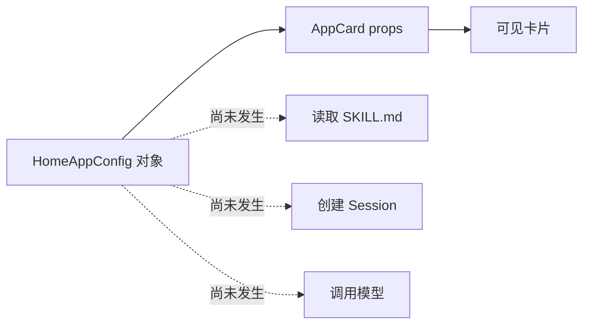

# B01：首页卡片为什么只是入口配置

## 用户看见应用，系统先看见数据

Part B 始终跟随“头脑风暴”。用户看见一张可以点击的应用卡片，源码首先看见的却是 `HOME_APPS` 数组中的普通对象。这个对象没有加载 Skill，没有创建窗口，也没有会话状态；它只声明展示字段和启动类别。

本章只追踪 `HOME_APPS → AppCard props`，在用户点击处停止。页面怎样处理点击留到 B02。

## 概念桥：配置、实例、资源

| 概念 | 头脑风暴案例 | 是否已经产生运行副作用 |
| --- | --- | --- |
| 配置 | `HOME_APPS` 中的对象 | 否 |
| 组件实例 | React 渲染出的 AppCard | 只产生 UI |
| Skill 资源 | 磁盘中的 `SKILL.md` 与参考文件 | 此时尚未读取 |
| Agent 会话 | 运行时与会话 JSON | 此时尚不存在 |

把这四层分开，才能理解“卡片显示正常但启动失败”为何完全可能。

## 配置合同与它留下的空隙

[packages/web/src/config/homeApps.ts 第 8—21 行](../../../../packages/web/src/config/homeApps.ts#L8) 定义：

```ts
export type AppCardType = 'skill' | 'action';

export interface HomeAppConfig {
  id: string;
  name: string;
  description: string;
  icon: string;
  color: string;
  type: AppCardType;
  skillName?: string;
  action?: string;
}
```

`type` 是必填联合类型，却没有形成判别联合；`skillName` 与 `action` 都可缺省。因此 TypeScript 会接受不完整组合，页面必须在运行时再次判断。更严格的替代设计可以把它改成：

```ts
type HomeAppConfig = CommonFields & (
  | { type: 'skill'; skillName: string }
  | { type: 'action'; action: string }
);
```

这是设计比较，不是当前源码事实。当前行为应以可选字段和页面分支为准。

## 真实对象怎样投影成 UI

[同文件第 66—74 行](../../../../packages/web/src/config/homeApps.ts#L66) 的对象包含：

```ts
{
  id: 'app-brainstorming',
  name: '头脑风暴',
  description: '使用多种创意技巧进行头脑风暴和创意生成',
  icon: '💡',
  color: 'from-amber-500',
  type: 'skill',
  skillName: 'bmad-brainstorming',
}
```

[packages/web/src/app/page.tsx 第 1426—1450 行](../../../../packages/web/src/app/page.tsx#L1426) 把这些字段交给 `AppCard`。其中：

- `id` 参与 React 列表与卡片身份；
- `name`、`description`、`icon`、`color` 决定可见内容；
- `type` 被传为 `dockType`，同时由父级闭包用于分支；
- `skillName` 既作为卡片元数据，又被闭包捕获。

配置不是“无逻辑”。它通过字段决定后续逻辑的输入，但自己没有执行权。

## 图解：数据投影不是能力装载



实线表示当前阶段真实发生的数据投影；虚线表示用户容易提前想象、但源码此时尚未发生的工作。

## `AppCard` 的点击责任

[packages/web/src/components/framework/AppCard.tsx 第 73—79 行](../../../../packages/web/src/components/framework/AppCard.tsx#L73) 只选择 `path` 或 `onClick`。`path` 优先意味着同时传入两者时会导航，不会执行父级启动回调。组件并不根据 `dockType` 或 `skillName` 自己启动 Skill；这些字段只服务显示或 Dock 元数据。

[同文件第 28—47 行](../../../../packages/web/src/components/framework/AppCard.tsx#L28) 还说明 `HomeAppConfig` 与 `AppCardProps` 不是同一合同：

```ts
interface AppCardProps {
  id: string;
  name: string;
  description: string;
  path?: string;
  onClick?: () => void;
  dockType?: 'agent' | 'skill' | 'action';
  skillName?: string;
}
```

页面把配置字段投影为组件 props，并额外提供回调。`HomeAppConfig.type` 只有 skill/action，`AppCardProps.dockType` 还允许 agent；这说明它们属于不同边界，不能为了省一次映射就把两个接口当成同一类型。

## 输入变化推演

| 改动 | 预测结果 | 原因 |
| --- | --- | --- |
| 只改 `name` | 卡片文案变化，Skill code 不变 | 加载身份来自 `skillName` |
| 只改 `skillName` | 可见文案不变，后续目标变化 | 父闭包传 `skillName` |
| 删除 `skillName` | 卡片仍可见，skill 分支不执行 | 当前类型合同允许缺省，页面再检查 |
| 增加 `path` prop | 点击优先导航 | `handleClick` 的第一分支 |
| 把 `type` 改为 `action` 且无 `action` | 卡片仍可见，无匹配动作 | 配置组合不完整 |

## 测试证据与缺口

当前没有专门测试固定 `HOME_APPS` 的字段不变量，也没有直接组件测试证明 `path` 优先于 `onClick`。源码能支持静态推演，但不能替代真实 React 事件验证。

最小测试层次应分开：配置测试验证字段组合；AppCard 测试验证点击优先级；页面编排测试验证 handler 选择；E2E 验证用户真的看到窗口。四层不能用一个测试名互相替代。

## 小实验与口头验收

复制头脑风暴对象到纸上，分别圈出“只影响显示”“参与分流”“后续加载身份”的字段。然后将 `skillName` 删除，逐步写出渲染与点击两阶段的不同结果。

合上本页，应能回答：

1. 配置对象、React 卡片、Skill 资源和 Agent 会话为什么是四种对象？
2. `name` 与 `skillName` 分别控制什么？
3. 为什么 `HomeAppConfig` 与 `AppCardProps` 不能视为同一个合同？
4. `path` 与 `onClick` 同时存在时为什么会导航？
5. 缺少 `skillName` 时，为什么卡片可见仍不能启动 Skill？

下一章从 AppCard 执行父级回调开始，看页面怎样把配置翻译成窗口命令。
