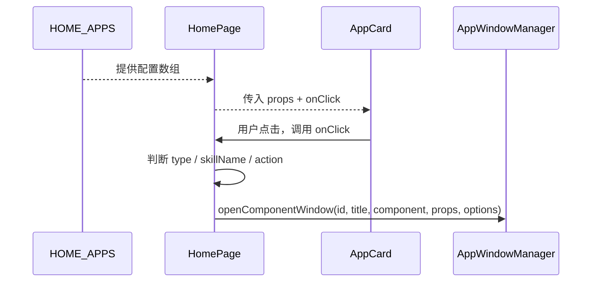
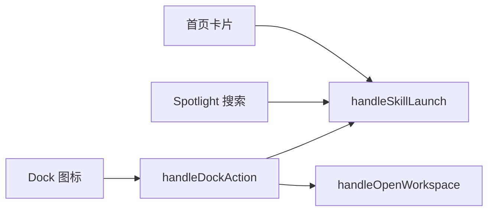

# B02：点击后谁决定打开哪个窗口

## 一个错觉

上一章看到 `AppCard` 只触发 `onClick`。但用户确实看到窗口打开了——这个决定是在哪里做出的？答案是 `HomePage`。它不仅是首页的视觉容器，更是把「入口配置」翻译成「窗口配置」的编排层。

本章追踪：从 `HOME_APPS.map` 到 `handleSkillLaunch`，再到 `AppWindowManager.openComponentWindow`，首页如何把一次点击变成一份窗口配置。

## 调用链



图中没有网络请求。`AppCard -> HomePage` 是子组件执行父组件传下来的回调；`HomePage -> AppWindowManager` 是把产品入口翻译成窗口配置。

## 页面层的事件分发

[`packages/web/src/app/page.tsx` 第 1426—1450 行](../../../../packages/web/src/app/page.tsx#L1426) 是分发中心：

```ts
onClick={() => {
  if (app.type === 'skill' && app.skillName) {
    handleSkillLaunch(app.skillName, app.name);
  } else if (app.action === 'create-agent') {
    handleCreateProject();
  } else if (app.action === 'open-workspace') {
    const firstProject = projects[0];
    if (firstProject) {
      handleOpenWorkspace(firstProject.id);
    }
  }
}}
```

这里有三个分支：

- `skill`：打开 Skill 对话窗口。
- `create-agent`：创建项目并打开访谈窗口。
- `open-workspace`：打开第一个项目的工作区窗口。

当前配置中只实际使用了 `skill` 和 `open-workspace`，`create-agent` 分支是为未来入口预留的。这个条件结构也说明：**首页卡片可以共享同一种视觉组件，但走完全不同的后续路径**。

## handleSkillLaunch 的翻译工作

[`packages/web/src/app/page.tsx` 第 845—869 行](../../../../packages/web/src/app/page.tsx#L845) 把 `skillName` 和 `name` 翻译成窗口配置：

```ts
const handleSkillLaunch = (skillName: string, name: string, initialMessage?: string) => {
  const windowManager = AppWindowManager.getInstance();

  windowManager.openComponentWindow(
    `skill-${skillName}`,
    name,
    SkillDialog,
    {
      skillName,
      initialMessage: initialMessage?.trim() || '你好！我是' + name.split(' ')[0] + '助手，有什么可以帮助你的吗？',
    },
    {
      position: { width: 1200, height: 800 },
      constraints: { minWidth: 600, minHeight: 400 },
      metadata: { entryType: 'skill', entryId: skillName, sessionId: `skill-${skillName}`, projectId: `skill-${skillName}` },
    }
  );
};
```

这段代码做了四件事：

| 输入 | 输出 | 原因 |
|------|------|------|
| `skillName` | `skill-${skillName}` | 稳定窗口 id，避免重复点击产生随机窗口 |
| `name` | 窗口标题 | 用户看到产品名称，不必看内部代码名 |
| `skillName` | `SkillDialog` 的 prop | 对话界面才能读取正确的技能 |
| `skillName` | `metadata.entryType/entryId` | 关闭或恢复时能辨认入口身份 |

第 866 行的 `metadata.sessionId` 只是窗口层的关联键，**不等于已经在磁盘创建了会话**。这条区分以后会反复出现：一个 id 存在，不代表对应资源已经被初始化。

## 三条入口通道汇流

首页不是唯一入口。[`page.tsx` 第 1194—1267 行](../../../../packages/web/src/app/page.tsx#L1194) 的 Spotlight 搜索也会生成 `appItems`，并复用同一批 handler；Dock 的 `handleDockAction` 也会根据 `entryType` 调用 `handleSkillLaunch` 或 `handleOpenWorkspace`。



这意味着「点击首页卡片」只是众多入口中的一种。把 handler 放在 `HomePage` 而不是 `AppCard`，正是为了让 Spotlight、Dock 等入口复用同一套翻译逻辑。

## 关键区分：窗口 id 与 session id

在 `handleSkillLaunch` 中，窗口 id 和 `metadata.sessionId` 目前都使用 `skill-${skillName}`。这个选择有两个目的：

1. **重复点击聚焦同一窗口**：同一 `id` 不会让 `AppWindowManager` 创建多个窗口。
2. **会话归属稳定**：同一 Skill 的多次启动复用同一项目范围。

但它也带来一个风险：如果误以为「窗口 id 就是 session id 且已创建会话」，会忽略 `SkillDialog` 初始化时真正创建会话的那一步。窗口 id 只是视觉容器的标识；session id 是会话在存储层的标识；两者只是在当前实现中碰巧同名。

## 失败路径

1. **`handleOpenWorkspace` 没有项目时无法打开**：它依赖 `projects[0]`，如果列表为空则无任何反馈。
2. **`skillName` 为空时进入不了 `handleSkillLaunch`**：条件判断在 `HOME_APPS.map` 中已完成。
3. **窗口 id 冲突**：如果两个不同入口使用相同前缀生成窗口 id，会导致聚焦错误。

## 测试证据与缺口

- `handleSkillLaunch` 目前没有直接单元测试。
- 首页点击流程依赖 E2E 或人工验证。

缺口：建议为 `handleSkillLaunch` 和 `handleOpenWorkspace` 增加单元测试，验证生成的窗口 id、标题、组件类型和 metadata。

## 练习与口头验收

1. 对比 `app-workspace` 与 `app-brainstorming` 的点击分支，写出各自经过的 handler。
2. 如果将 `bmad-brainstorming` 的 `skillName` 改成 `trip-planner`，窗口 id、窗口标题、`SkillDialog` 收到的 prop 分别是什么？
3. 说明为什么 `handleSkillLaunch` 放在 `HomePage` 而不是 `AppCard`。
4. 解释 `metadata.sessionId: skill-${skillName}` 为什么不等于磁盘已经创建会话。

合上本页后，应能画出：`HOME_APPS -> AppCard -> onClick -> HomePage -> handleSkillLaunch -> AppWindowManager.openComponentWindow`，并说明每一棒传递的是配置、组件还是身份。

下一章进入窗口管理器，看一个窗口 id 如何变成屏幕上的窗体。
