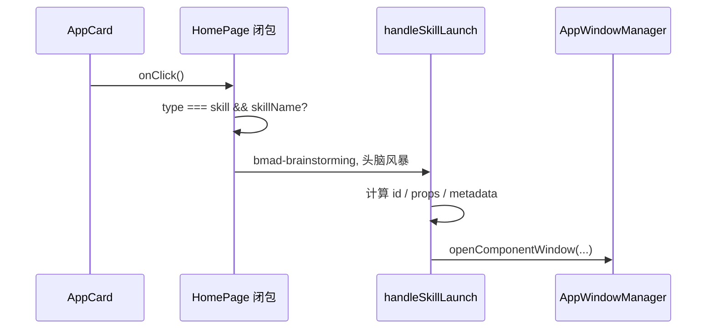
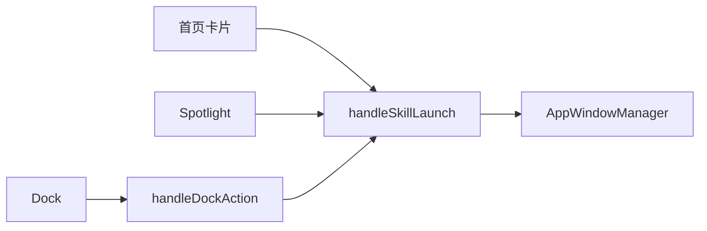

# B02：页面怎样把一次点击翻译成窗口命令

## 点击事件本身不知道要开什么

B01 停在 `AppCard` 调用父级 `onClick`。接下来，`HomePage` 才读取 `type`、`skillName` 或 `action`，选择具体 handler。页面在这里承担**编排**：它连接产品配置和窗口服务，却不实现 Skill 加载或会话持久化。

## 控制流与数据流并排阅读



第一根箭头没有业务参数，因为闭包已捕获 `app`；第二步才读取配置。`handleSkillLaunch` 接收稳定 code 和显示名，输出的是窗口服务合同。

## 页面分流的真实分支

[packages/web/src/app/page.tsx 第 1426—1450 行](../../../../packages/web/src/app/page.tsx#L1426) 对 skill 与 workspace 采取不同路径。`skill` 要求 `app.skillName`；工作区还要求 `projects[0]`。

这说明页面不是简单转发器：它拥有当前页面状态 `projects`，可以决定某个 action 是否具备执行条件。但它不应在这里读取 Skill 文件或写会话 JSON，那些是下层公共能力。

## `handleSkillLaunch` 的五次翻译

[packages/web/src/app/page.tsx 第 845—869 行](../../../../packages/web/src/app/page.tsx#L845) 把 `skillName` 与 `name` 翻译为：

1. `skill-${skillName}`：窗口 id；
2. `name`：窗口标题；
3. `{ skillName, initialMessage }`：交给 `SkillDialog` 的 props；
4. `{ width: 1200, height: 800 }` 与最小尺寸：窗口几何合同；
5. `{ entryType, entryId, sessionId, projectId }`：生命周期 metadata。

给定输入：

```ts
handleSkillLaunch('bmad-brainstorming', '头脑风暴');
```

得到：

```ts
{
  windowId: 'skill-bmad-brainstorming',
  title: '头脑风暴',
  component: SkillDialog,
  props: {
    skillName: 'bmad-brainstorming',
    initialMessage: '你好！我是头脑风暴助手，有什么可以帮助你的吗？',
  },
  metadata: {
    entryType: 'skill',
    entryId: 'bmad-brainstorming',
    sessionId: 'skill-bmad-brainstorming',
    projectId: 'skill-bmad-brainstorming',
  },
}
```

`name.split(' ')[0]` 按半角空格截取首段；中文“头脑风暴”没有空格，所以完整进入欢迎语。这是实际字符串规则，不是自然语言分词。

## 三条入口为什么要复用 handler

[page.tsx 第 1194—1267 行](../../../../packages/web/src/app/page.tsx#L1194) 还把 HOME_APPS 与用户 Skill 变成 Spotlight 项；Dock action 也会回到 `handleSkillLaunch`。因此首页卡片只是一个生产调用者，不是唯一入口。



复用 handler 可以统一窗口 id、尺寸、props 和 metadata；但三个入口的上游合同仍需分别验证，不能因为最终汇流就假设行为完全一致。

## 相同字符串，不同身份

窗口 id、metadata.sessionId 和 projectId 当前都可能是 `skill-bmad-brainstorming`。分别改变它们可以看到责任差异：

- 改窗口 id 会影响窗口去重/聚焦；
- 改 sessionId 会影响关闭时销毁哪个 runtime；
- 改 metadata.projectId 会影响关闭清理请求的 runtime 定位；它不会直接改写 SkillDialog 创建会话时独立计算的 projectId；
- 改 entryId 会影响入口所有权与记忆整理对象。

它们同名是为了稳定关联，不是可以永远混用的类型保证。

[packages/web/src/app/window/page.tsx 第 64—69 行](../../../../packages/web/src/app/window/page.tsx#L64) 是验证这个结论的消费端：Skill 原生窗口只把 `skillName` 与 `initialMessage` 传给 `SkillDialog`。随后 [SkillDialog.tsx 第 485—496 行](../../../../packages/web/src/components/skills/SkillDialog.tsx#L485) 才用 `currentSkill` 计算 `projectId`。因此，metadata 和会话请求目前是两条独立计算、结果碰巧一致的数据链。

## 失败诊断

| 症状 | 证据入口 | 可能原因 |
| --- | --- | --- |
| 首页点击无反应 | 页面闭包是否进入分支 | `skillName` 缺失 |
| Spotlight 能开，首页不能 | 两个入口上游差异 | 首页配置/闭包问题 |
| 重复点击聚焦了错误窗口 | 实际 window id | id 冲突 |
| 标题正确但加载错误 Skill | `name` 与 `props.skillName` | 两个字段错配 |
| 窗口已开却没有 session 文件 | `SkillDialog.initialize` | 打开窗口不等于初始化会话 |

## 测试证据与缺口

当前没有直接测试固定 `handleSkillLaunch` 的完整输出，也没有跨首页、Spotlight、Dock 的一致性测试。源码事实只能说明三个入口复用了 handler；不能证明各入口在真实 UI 中都能触发，也不能证明原生窗口创建成功。

建议的合同测试应拦截 `openComponentWindow`，断言 id、component、props、尺寸与 metadata；另用入口测试分别验证首页、Spotlight、Dock 是否传入相同 `skillName` 与显示名。

## 小实验与口头验收

传入 `initialMessage = '   '`，推导为何最终使用欢迎语；再传入 `'  先列十个方向  '`，推导为何去掉首尾空格。完成标准是写出条件表达式的求值过程。

合上本页，应能回答：

1. HomePage 怎样从配置中选择 handler？
2. `handleSkillLaunch` 做了哪五次字段翻译？
3. 为什么多个入口汇流不等于上游合同一致？
4. 为什么窗口 id 存在不能证明 session 已创建？
5. 只改变 metadata.projectId、保持 `skillName` 不变时，打开、初始化和关闭分别读取哪个值？

下一章进入窗口服务，观察窗口命令如何变成 Web store 状态或 Electron 原生窗口。
