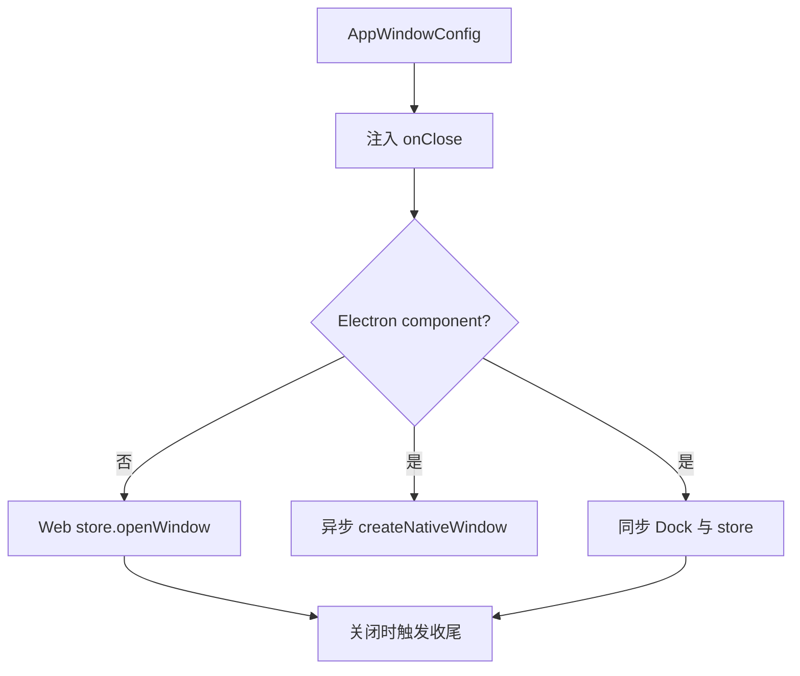

# B03：窗口服务为什么同时管理视觉状态和运行时收尾

## `openComponentWindow` 只是便利入口

B02 最后调用 `AppWindowManager.openComponentWindow`。这个方法本身只把组件、props 与 options 包成 `AppWindowConfig`，真正的分支在 `openWindow`：它先注入关闭回调，再选择普通 Web store 或 Electron 原生窗口路径。

## 从便利方法进入真实实现

[packages/web/src/services/AppWindowManager.ts 第 245—259 行](../../../../packages/web/src/services/AppWindowManager.ts#L245) 的输入是 id、title、React component、props 和可选配置，输出是 `openWindow` 返回的字符串 id：

```ts
return this.openWindow({
  id,
  type: 'app',
  title,
  content: { type: 'component', component, props } as ComponentContent,
  ...options,
});
```

`...options` 位于最后，调用方可以补充位置、约束、metadata，甚至覆盖前面同名字段。阅读对象展开时必须看顺序；“默认字段写在前面”不代表最终值一定不变。

## 生命周期注入先于环境分支

[同文件第 31—54 行](../../../../packages/web/src/services/AppWindowManager.ts#L31) 先读取 metadata。若 `entryType` 和 `entryId` 存在且类型属于 `MEMORY_ENTRY_TYPES`，便包装 `onClose`：

```ts
onClose: () => {
  originalOnClose?.();
  destroyAgentSession({ sessionId, projectId }).catch(...);
  consolidateMemory(entryType, entryId).catch(...);
}
```

执行顺序是原回调、runtime 销毁请求、记忆整理请求。后两项没有 `await`，因此窗口关闭不会等它们完成。失败只记录日志，不会把窗口重新打开。

## 图解：一个配置产生两类状态



Electron 分支中，原生窗口创建和 store 记录不是一个原子操作：`createNativeWindow` 以异步方式启动，后续 store 写入可以先完成。这一事实决定了故障诊断不能只看 store。

## Web 与 Electron 的数据差异

[第 56—121 行](../../../../packages/web/src/services/AppWindowManager.ts#L56) 的 Electron 分支只把 primitive props 序列化进 query，并注入字符串 metadata。复杂对象、函数与 React component 本身不会跨到新窗口 URL。

| Web store 路径 | Electron 原生路径 |
| --- | --- |
| 可在内存中保留 component 与函数 props | query 只能携带可序列化字符串 |
| 窗口由当前 React 树渲染 | 新 BrowserWindow 加载 `/window` |
| 聚焦主要改变 store 状态 | 还需调用 `focusNativeWindow` |
| 无 Dock IPC 同步 | 同步 Dock 并广播 |

“同一个 AppWindowManager”表示统一入口，不表示两个平台内部实现相同。

## 重复打开与状态所有者

最终窗口集合由 [packages/web/src/store/appWindowStore.ts](../../../../packages/web/src/store/appWindowStore.ts#L1) 持有。`AppWindowManager` 是编排 service，Zustand store 才是 Web 窗口状态所有者。服务通过 `useAppWindowStore.getState()` 操作它，不在类实例中复制一份 windows 数组。

[appWindowStore.ts 第 38—68 行](../../../../packages/web/src/store/appWindowStore.ts#L38) 给出重复 id 的真实分支：

```ts
const existingId = config.id;
if (existingId && get().windows[existingId]) {
  // 恢复最小化状态、提高 zIndex、移到 windowOrder 末尾
  // 并把 focusedWindowId 改为 existingId
  return existingId;
}
```

这条分支没有用新 config 覆盖旧窗口的 content、props 或 metadata。第二次用相同 id 调用 `openComponentWindow` 时，结果是聚焦原窗口，而不是把新 `initialMessage` 注入已有 SkillDialog。单例只保证 manager 实例唯一；真正的窗口去重由 id 与 store 分支共同保证。

若希望“同 id 打开时更新输入”，就不能只改 handler 传参，还要重新设计 store 的已有窗口更新合同，并测试旧组件状态怎样处理。否则用户可能看到窗口被聚焦，却仍保留第一次打开时的内容。

## 关闭回调究竟由谁调用

[appWindowStore.ts 第 125—145 行](../../../../packages/web/src/store/appWindowStore.ts#L125) 先取出即将关闭的窗口，调用其 `onClose`，再从 `windows` 与 `windowOrder` 删除：

```ts
const closingWindow = get().windows[windowId];
closingWindow?.onClose?.();
set((state) => {
  const { [windowId]: closed, ...remaining } = state.windows;
  return { windows: remaining, ... };
});
```

这解释了完整调用链：Manager 在打开时注入回调，Store 在关闭时执行回调。只读 Manager 看不到触发点，只读 Store又看不到回调为何包含 destroy/consolidate；两段必须配对。

同文件第 147—153 行的 `closeAllWindows` 直接清空集合，没有逐窗调用 `onClose`。因此，“单窗关闭会清理 runtime”不能推广为“关闭全部窗口也会执行同样收尾”。这是当前实现的生命周期缺口，需要专门测试或修复，教材不能替源码补保证。

## 正向推演：头脑风暴窗口

输入 metadata：

```ts
{
  entryType: 'skill',
  entryId: 'bmad-brainstorming',
  sessionId: 'skill-bmad-brainstorming',
  projectId: 'skill-bmad-brainstorming',
}
```

1. `skill` 命中 `MEMORY_ENTRY_TYPES`。
2. 原配置的 `onClose` 被包装。
3. Web 环境直接进入 store；Electron 环境还创建 native window、同步 Dock、写 `renderMode: 'native'`。
4. 用户关闭时发起 runtime 销毁和 memory consolidation。
5. 没有任何一步调用 `deleteSession`，所以不能推出会话 JSON 被删除。

## 失败与部分成功

| 状态 | 用户可能看到 | 系统事实 |
| --- | --- | --- |
| 原生创建失败、store 成功 | 可能无可见原生窗 | store 仍有 native 记录 |
| `destroyAgentSession` 失败 | 窗口仍消失 | runtime 可能残留 |
| `consolidateMemory` 失败 | 关闭无阻塞 | 长期记忆未整理 |
| metadata 缺少 entryId | 窗口正常打开 | 不注入 Agent 收尾 |
| 非 primitive prop 被过滤 | 新窗缺少输入 | 不是 Skill service 故障 |
| 调用 `closeAllWindows` | 所有窗口消失 | 当前不会逐个执行注入的 onClose |

这些状态说明系统并非只有“成功/失败”二值；一条跨边界操作可能视觉成功但后台清理失败，也可能 store 成功但原生副作用失败。

## 测试证据与缺口

当前没有 `AppWindowManager` 的直接单元测试锁定回调注入、Web/Electron 分支、query 序列化与失败行为。源码可以证明调用顺序，不能证明实际 `BrowserWindow` 和 Dock IPC 的集成结果。

应分别测试：纯 Web store 合同、Electron adapter 合同、关闭回调的 fire-and-forget 行为、`closeAllWindows` 的清理语义，以及同一 id 的重复打开。把它们合并成一个脆弱 E2E 会很难定位失败责任。

## 小实验与口头验收

将 `entryType` 临时设想为 `'workspace'`，逐步预测：窗口仍会打开；不会命中 `MEMORY_ENTRY_TYPES`；因此不注入 destroy/consolidate。再说明这是否必然造成泄漏——答案是不必然，只有该窗口确实拥有 Agent runtime 才构成问题。

合上本页，应能回答：

1. `openComponentWindow` 与 `openWindow` 分别负责什么？
2. 生命周期回调为什么在平台分支之前注入？
3. manager 单例与窗口 id 去重为什么不是同一保证？
4. 为什么关闭窗口不等于删除会话？
5. `closeWindow` 与 `closeAllWindows` 当前为什么不是相同清理合同？

下一章进入已挂载的 `SkillDialog`，观察它如何处理初始化、恢复和快速切换三种并发状态。
