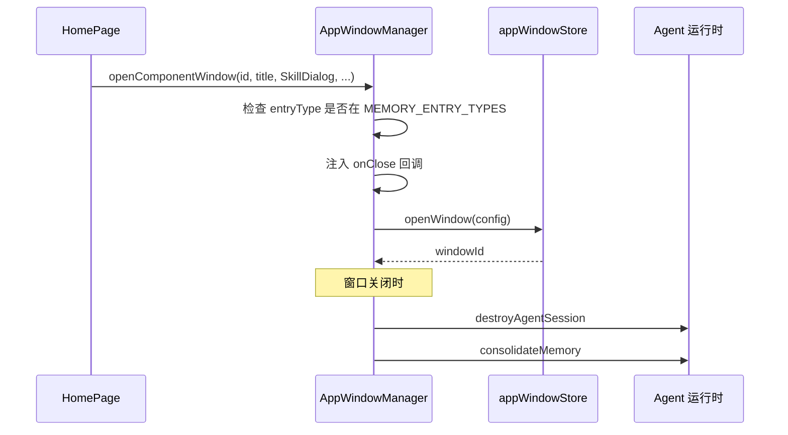

# B03：窗口管理器不只管视觉

## 一个容易忽略的问题

当「头脑风暴」窗口出现时，大多数人只关注窗口内容。但窗口关闭时，系统还要做两件事：销毁运行中的 Agent 实例、整理本次会话的记忆。这些生命周期动作不是由 `SkillDialog` 自己处理的，而是由打开它的 `AppWindowManager` 在关闭回调中注入的。

本章回答：为什么窗口不仅是视觉容器，还是运行时生命周期边界？

## AppWindowManager 的双重身份

窗口服务同时承担两个职责：创建可见窗口，以及管理窗口背后的运行时生命周期。



[`packages/web/src/services/AppWindowManager.ts` 第 16—26 行](../../../../packages/web/src/services/AppWindowManager.ts#L16) 显示它是一个单例：

```ts
export class AppWindowManager {
  private static instance: AppWindowManager | null = null;

  static getInstance(): AppWindowManager {
    if (!AppWindowManager.instance) {
      AppWindowManager.instance = new AppWindowManager();
    }
    return AppWindowManager.instance;
  }
}
```

单例模式保证整个应用只有一个窗口管理器，避免多个组件各自创建窗口状态。 [`openComponentWindow` 第 245—259 行](../../../../packages/web/src/services/AppWindowManager.ts#L245) 是一个便利方法，把组件包装成窗口配置：

```ts
openComponentWindow(
  id: string,
  title: string,
  component: React.ComponentType<any>,
  props?: Record<string, unknown>,
  options?: Partial<AppWindowConfig>
): string {
  return this.openWindow({
    id,
    type: 'app',
    title,
    content: { type: 'component', component, props } as ComponentContent,
    ...options,
  });
}
```

真正创建窗口的是 [`openWindow` 第 31—122 行](../../../../packages/web/src/services/AppWindowManager.ts#L31)。它除了调用 store 创建窗口状态外，还会根据运行形态决定走 Web 渲染分支还是 Electron 原生窗口分支。

## 生命周期回调的注入

[`openWindow` 第 31—54 行](../../../../packages/web/src/services/AppWindowManager.ts#L31) 是本章最关键的代码：

```ts
openWindow(config: AppWindowConfig): string {
  const store = useAppWindowStore.getState();
  const metadata = config.metadata;

  if (metadata) {
    const entryType = metadata['entryType'] as string | undefined;
    const entryId = metadata['entryId'] as string | undefined;
    if (entryType && entryId && MEMORY_ENTRY_TYPES.has(entryType)) {
      const originalOnClose = config.onClose;
      config = {
        ...config,
        onClose: () => {
          originalOnClose?.();
          destroyAgentSession({ sessionId, projectId }).catch(...);
          consolidateMemory(entryType, entryId).catch(...);
        },
      };
    }
  }
  // ...
}
```

其中 `MEMORY_ENTRY_TYPES = new Set(['role-agent', 'agent', 'project', 'solution', 'skill'])`。只有这些 `entryType` 的窗口才会在关闭时触发 Agent 销毁和记忆整理。

这个设计说明：**窗口是运行时生命周期的托管者**。 `SkillDialog` 不知道窗口关闭时会发生什么；它只负责渲染对话界面。窗口服务在打开时悄悄注入了关闭后的清理逻辑。

## Web 窗口 vs 原生窗口

[`openWindow` 第 56—120 行](../../../../packages/web/src/services/AppWindowManager.ts#L56) 处理 Electron 原生窗口分支：

```ts
if (config.content.type === 'component' && typeof window !== 'undefined' && isElectron()) {
  const windowId = config.id ?? `native-${Date.now()}`;
  // ...
  void createNativeWindow({ ... });
  this.syncWindowToDock(windowId, config.title, config);
  return store.openWindow({ ...config, id: windowId, metadata: { ...metadata, renderMode: 'native' } });
}

return store.openWindow(config);
```

在浏览器模式下，直接调用 `store.openWindow`，由 React portal 渲染窗口；在 Electron 模式下，先调用 `createNativeWindow` 创建原生 BrowserWindow，再在 store 中记录 `renderMode: 'native'`。同一个类根据运行形态选择不同实现。

## 窗口状态与 store

[`packages/web/src/store/appWindowStore.ts`](../../../../packages/web/src/store/appWindowStore.ts#L1) 管理窗口状态。核心字段包括 `windows`、`windowOrder`、`focusedWindowId`、`maxZIndex`。 [`openWindow` 第 38—123 行](../../../../packages/web/src/store/appWindowStore.ts#L38) 会检查 id 是否已存在：若存在则复用并置顶，不存在则创建新窗口。

这意味着**重复点击同一 Skill 卡片不会产生多个窗口**，只会让已有窗口聚焦。

## 失败路径

1. **非 `MEMORY_ENTRY_TYPES` 的窗口关闭时不清理 Agent**：如果某个窗口的 `entryType` 不在集合中，关闭时不会触发 `destroyAgentSession`，可能导致运行时实例泄漏。
2. **`destroyAgentSession` 失败只打日志**：`catch` 中只调用 `console.error`，不会阻止窗口关闭。
3. **原生窗口 props 序列化丢失函数**：第 81—87 行只序列化 `string/number/boolean` 类型的 props，函数和 React 组件不会传入原生窗口。
4. **关闭窗口后误以为会话被删除**：`destroyAgentSession` 清理的是运行时实例，持久化会话 JSON 仍保留。

## 测试证据与缺口

- 窗口管理器目前没有直接单元测试。
- `appWindowStore` 可能有测试，但需要确认。

缺口：建议为 `AppWindowManager.openWindow` 增加测试，验证：
1. 同一 id 的窗口不会重复创建。
2. `MEMORY_ENTRY_TYPES` 内的窗口关闭时会调用 `destroyAgentSession`。
3. 非 `MEMORY_ENTRY_TYPES` 的窗口关闭时不调用清理逻辑。

## 练习与口头验收

1. 说明 `AppWindowManager` 为什么是单例。
2. 打开 [`AppWindowManager.ts`](../../../../packages/web/src/services/AppWindowManager.ts#L14)，找出 `MEMORY_ENTRY_TYPES` 包含哪些 `entryType`。
3. 如果某窗口的 `entryType` 是 `'workspace'`（不在集合中），关闭时会发生什么？
4. 解释为什么 `SkillDialog` 不自己处理窗口关闭后的清理。
5. 对比 Web 模式与 Electron 模式下 `openWindow` 的分支差异。

合上本页后，应能准确说明：窗口服务管理窗口状态、注入关闭回调、区分 Web/原生渲染；关闭 Skill 窗口会触发 Agent 销毁和记忆整理，但持久化会话文件仍保留。

下一章进入 `SkillDialog`，看它拿到入口身份后如何准备会话材料。
