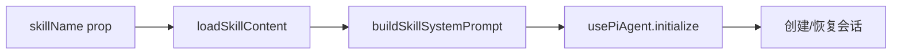

# B04：SkillDialog 拿到入口身份后做什么

## 窗口打开了，但会话还没开始

当「头脑风暴」窗口出现时，用户看到欢迎语。但这句欢迎语不是模型当场生成的——在窗口打开的瞬间，Agent 会话甚至还没有创建。`SkillDialog` 拿到 `skillName` 后，需要先加载技能内容、构建系统提示词、确定工作目录和输出目录，然后才调用 `usePiAgent.initialize` 创建或恢复会话。

本章回答：`SkillDialog` 如何准备会话所需材料，但又不直接运行模型？

## SkillDialog 的入口身份

`SkillDialog` 拿到 `skillName` 后，会依次加载技能内容、构建提示词、准备目录信息，最后才初始化会话。



[`packages/web/src/components/skills/SkillDialog.tsx` 第 46—53 行](../../../../packages/web/src/components/skills/SkillDialog.tsx#L46) 定义了 props：

```ts
interface SkillDialogProps {
  skillName?: string;
  initialMessage?: string;
  onMessage?: (message: string) => Promise<void>;
  onSkillChange?: (skillName: string) => void;
  skillContent?: string;
  onClose?: () => void;
}
```

`skillName` 是入口身份。 `initialMessage` 是可选的首次问候语。注意 `skillContent` 也是可选的：如果外部已经加载了技能内容，可以直接传入；否则 `SkillDialog` 自己加载。

## 内部状态：稳定 session id 与过渡守卫

[`SkillDialog.tsx` 第 236—254 行](../../../../packages/web/src/components/skills/SkillDialog.tsx#L236) 初始化关键 refs：

```ts
const stableSessionIdRef = useRef<string>(uuidv4());
const transitionGuardRef = useRef<{ isCurrent: boolean }>({ isCurrent: true });
```

- `stableSessionIdRef` 在组件创建时生成，避免 Hook 重新初始化时产生新的 session id。
- `transitionGuardRef` 用于防止快速切换 Skill/Session 导致的竞态初始化。旧的 `initialize` 结果会被丢弃。

这解决了一个真实问题：如果用户在窗口打开后快速切换 Skill，旧的异步加载可能后返回，从而覆盖新 Skill 的状态。 `transitionGuardRef.isCurrent` 让 `SkillDialog` 只接受最近一次初始化的结果。

## 加载技能列表与历史会话

[`SkillDialog.tsx` 第 304—329 行](../../../../packages/web/src/components/skills/SkillDialog.tsx#L304) 加载可用技能列表：

```ts
const loadSkillsList = useCallback(async () => {
  const result = await listAvailableSkills();
  if (result.success && result.data) {
    setAvailableSkills(result.data.skills || []);
  }
}, []);
```

[`第 331—355 行](../../../../packages/web/src/components/skills/SkillDialog.tsx#L331) 加载历史会话：

```ts
const loadSessionHistory = useCallback(async () => {
  const result = await listAvailableSkillSessions(currentSkill);
  if (result.success && result.data) {
    setSkillSessions(result.data.sessions || []);
  }
}, [currentSkill]);
```

这两个调用说明 `SkillDialog` 不只是打开一个空白对话，它还要让用户看到可用技能列表和该技能的历史会话。注意这些调用都经过 Electron 服务适配层，因此 Web 和桌面可以复用同一套逻辑。

## 加载技能内容

[`SkillDialog.tsx` 第 59—98 行](../../../../packages/web/src/components/skills/SkillDialog.tsx#L59) 的 `loadSkillContent` 先调 Skill API，失败回退到 Agent API：

```ts
async function loadSkillContent(skillName: string): Promise<{
  content: string;
  baseDir?: string;
  workingDir?: string;
  outputDir?: string;
  systemManaged: boolean;
}> {
  try {
    const data = await getAvailableSkillContent({ name: skillName });
    if (data.success && data.data?.content) {
      return { content: String(data.data.content), ... };
    }
  } catch (error) {
    console.warn(`Failed to load skill content for ${skillName}, trying agents API...`);
  }

  // Fallback: role agents launched as skills
  try {
    const data = await getAgentContent(skillName);
    // ...
  } catch (error) {
    console.error(`Failed to load agent content for ${skillName}:`, error);
  }

  return { content: '', systemManaged: true };
}
```

这个 fallback 说明 Skill 和 Role Agent 在 UI 层有统一的入口：如果按 Skill 找不到内容，就尝试按 Agent 找。返回的 `baseDir`、`workingDir`、`outputDir` 是后续构建系统提示词的关键输入。

## 初始化时机

[`SkillDialog.tsx` 第 412—535 行](../../../../packages/web/src/components/skills/SkillDialog.tsx#L412) 的 `useEffect` 在 Skill 或 Session 变化时调用 `initialize`：

```ts
useEffect(() => {
  if (!currentSkill) return;

  const guard = { isCurrent: true };
  transitionGuardRef.current = guard;

  const setup = async () => {
    // 加载技能内容
    // 构建 systemPrompt
    // 调用 usePiAgent.initialize(...)
  };

  setup();

  return () => {
    guard.isCurrent = false;
  };
}, [currentSkill, selectedSessionId]);
```

注意 `return () => { guard.isCurrent = false; }` 是清理函数：当组件卸载或依赖变化时，旧的 guard 失效，旧异步操作的结果会被忽略。

## 关键区分：准备材料 vs 运行模型

`SkillDialog` 的职责可以总结为：

| 做什么 | 不做什么 |
|--------|----------|
| 加载技能内容 | 不直接调用 LLM |
| 构建系统提示词 | 不决定工具是否可见 |
| 生成稳定的 session id | 不直接写文件 |
| 调用 `usePiAgent.initialize` | 不处理流式响应细节 |

真正运行模型的是 `usePiAgent` 后面的 Agent 运行时。`SkillDialog` 只是「会话启动材料的装配车间」。

## 失败路径

1. **技能内容加载失败**：fallback 到 Agent API，再失败则返回空 content，可能导致系统提示词不完整。
2. **快速切换 Skill 导致状态混乱**：`transitionGuardRef` 防止旧初始化覆盖新状态。
3. **`skillName` 为空时 `useEffect` 直接返回**：窗口出现但没有任何 Skill 被加载。
4. **历史会话加载失败**：只影响列表显示，不影响当前会话创建。

## 测试证据与缺口

- [`packages/web/src/components/skills/__tests__/skill-export-policy.test.ts`](../../../../packages/web/src/components/skills/__tests__/skill-export-policy.test.ts#L1) 验证 Skill UI 附近的策略，但不覆盖 `SkillDialog` 初始化流程。
- `SkillDialog` 目前没有直接单元测试。

缺口：建议为 `loadSkillContent` 的 fallback 路径和 `transitionGuardRef` 的竞态防护增加测试。

## 练习与口头验收

1. 说明 `stableSessionIdRef` 和 `transitionGuardRef` 各自解决什么问题。
2. 如果用户在窗口打开后快速切换两次 Skill，哪一次初始化的结果会被保留？为什么？
3. `SkillDialog` 加载技能内容失败时，会 fallback 到哪里？如果 fallback 也失败会怎样？
4. 解释为什么 `SkillDialog` 是「会话启动材料的装配车间」，而不是「模型执行器」。

合上本页后，应能说清：`SkillDialog` 接收 `skillName`、加载技能内容、构建系统提示词、生成稳定 session id、调用 `usePiAgent.initialize`；它本身不运行模型，只是把材料准备好交给运行时。

下一章追踪技能内容从磁盘到前端的完整路径。
