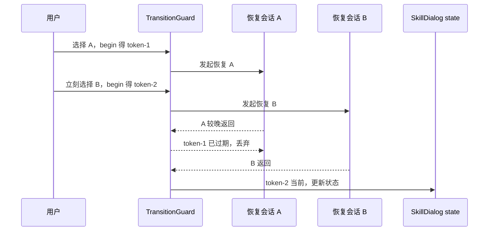

# B04：SkillDialog 如何避免把“打开窗口”误当成“会话已就绪”

## 窗口挂载后，仍有三种任务在竞争

`SkillDialog` 出现在屏幕上时，组件至少还要处理：初始化一个新会话、选择并恢复历史会话、快速切换 Skill 或创建新会话。它们都包含异步请求；旧请求可能晚于新请求返回。

本章关注 UI 状态和并发所有权，不展开 API 内部。核心问题是：**哪个异步结果仍有资格修改当前窗口？**

## 关键状态不是一个 `isLoading`

[packages/web/src/components/skills/SkillDialog.tsx 第 228—300 行](../../../../packages/web/src/components/skills/SkillDialog.tsx#L228) 可以分成四组：

| 状态组 | 关键字段 | 责任 |
| --- | --- | --- |
| Skill 选择 | `currentSkill`、`skills`、content cache | 当前要运行哪个 Skill |
| 稳定会话 | `stableSessionIdRef`、`activeSessionId` | 初次 id 与当前选中 id |
| 过渡状态 | `switchingSessionId`、`pendingNewSessionRef` | 新建/切换期间的 UI 与回滚 |
| 运行时状态 | `isInitialized`、`isRestoring`、`runtimeSessionId` | Hook 当前真正拥有的会话 |

`stableSessionIdRef` 在组件实例首次创建时生成 UUID，避免普通 re-render 改变默认会话 id；它不表示磁盘文件已创建。

## 会话转换守卫：token 决定结果所有权

[SkillDialog.tsx 第 278 行](../../../../packages/web/src/components/skills/SkillDialog.tsx#L278) 使用 `createSessionTransitionGuard()`。选择历史会话时，[第 373—409 行](../../../../packages/web/src/components/skills/SkillDialog.tsx#L373) 先 `begin('restore:...')` 获得 token，恢复完成后再用 `isCurrent(token)` 判断结果是否仍属于最新操作。

[packages/web/src/components/os/agent-dialog/session-transition-guard.ts 第 30—47 行](../../../../packages/web/src/components/os/agent-dialog/session-transition-guard.ts#L30) 展示 token 的全部算法：

```ts
let epoch = 0;
let target: string | null = null;

return {
  begin(nextTarget) {
    epoch += 1;
    target = nextTarget;
    return { epoch, target: nextTarget };
  },
  invalidate() {
    epoch += 1;
    target = null;
  },
  isCurrent(token) {
    return token.epoch === epoch && token.target === target;
  },
};
```

`epoch` 解决“第几次转换”，`target` 解决“这次转换属于谁”。两者都匹配才允许结果继续。只比较 target 会让“先后两次都恢复 A”无法区分；只比较 epoch 又无法在日志和调试中说明当前目标。



守卫没有取消服务端工作；它只阻止过期结果污染 UI。网络资源是否取消、服务端是否产生副作用，要由更下层机制另行证明。

## 初始化 effect 的实际顺序

[第 411—535 行](../../../../packages/web/src/components/skills/SkillDialog.tsx#L411) 在 `currentSkill` 或 `activeSessionId` 变化时运行。主要步骤是：

1. 选择 `effectiveSessionId = activeSessionId || stableSessionId`；
2. 若刚刚已经恢复该 id，则跳过重复初始化；
3. 用 `lastInitRef` 阻止相同 Skill + Session 重复请求；
4. 为本次初始化创建 transition token；
5. 从 cache 获取 Skill 内容，未命中才加载；
6. 计算 `skillDir`、`agentWorkDir`、`outputDir`；
7. 构建 system prompt 和运行时 LLM 配置；
8. 调用 `initialize(effectiveSessionId, projectContext, variables, llmConfig)`；
9. 返回后再次检查 token；
10. 成功则更新 active id，失败的新建操作则回滚到 previous id。

若只把这一段理解成“useEffect 加一个 boolean guard”，就会漏掉具名 token 与新会话回滚状态；当前实现能够区分多次交错的转换，而单个布尔值很难表达“哪一次请求仍然最新”。

关键提交点在 [SkillDialog.tsx 第 485—529 行](../../../../packages/web/src/components/skills/SkillDialog.tsx#L485)：

```tsx
await initialize(...);
if (!transitionGuardRef.current.isCurrent(initializationToken)) return;
setActiveSessionId(effectiveSessionId);

// catch 分支也先检查 token，再决定是否回滚 previous
```

异步调用前记录 token，异步调用后再次验证，是守卫真正生效的位置。若只在 `begin` 时创建 token、回来后不检查，守卫对象即使测试通过也不会保护组件。

## 一条真实的新建会话推演

假设当前历史会话是 `old-1`，用户点击“新建”：

1. 生成 `new-2`。
2. `invalidate()` 让旧转换结果失效。
3. `pendingNewSessionRef` 保存 `{ target: 'new-2', previous: 'old-1', skill }`。
4. `activeSessionId` 改为 `new-2`，触发初始化 effect。
5. 初始化成功：清空 pending，结束 switching。
6. 初始化失败：`lastInitRef` 恢复 previous，`activeSessionId` 回到 `old-1`。

这是一条恢复路径，而不是简单报错。读者应能预测失败后 UI 应继续指向旧会话，而非卡在未创建的 id。

## Skill 内容加载不是单一路径

[文件第 59—98 行](../../../../packages/web/src/components/skills/SkillDialog.tsx#L59) 优先调用 `getAvailableSkillContent`；失败或无内容时再尝试 `getAgentContent`，以支持按 Skill 窗口启动的 Role Agent。两条路径都失败时返回空内容和 `systemManaged: true`。

空内容不会立刻让组件崩溃；B06 将看到 prompt builder 会生成通用助手文本。这是受控降级，不等于成功加载了目标 Skill。

## 测试证据与缺口

[packages/web/src/components/os/agent-dialog/__tests__/session-transition-guard.test.ts](../../../../packages/web/src/components/os/agent-dialog/__tests__/session-transition-guard.test.ts#L1) 直接测试守卫 token 的 current/invalidated 语义。这证明守卫本身按合同工作；没有证明 `SkillDialog` 所有异步分支都正确使用它。

其中第 7—14 行的 Given 是初始化 A 已开始；When 是恢复 B 随后成为新目标；Then 是 A token 为 false、B token 为 true。第 16—23 行则证明 `invalidate()` 会让在途 token 失效。测试没有渲染 SkillDialog，没有制造真实 Promise 乱序，也没有断言回滚后的 UI。

当前仍缺 `SkillDialog` 集成测试来覆盖：A/B 恢复乱序、新会话失败回滚、cache 命中、刚恢复后跳过重复 initialize、组件卸载后的结果丢弃。

## 故障反查与验收

- 快速点两条历史后显示旧会话：查 token 是否在更新 state 前复核。
- 新建失败后界面卡在新 id：查 `pendingNewSessionRef.previous` 回滚。
- 同一会话初始化两次：查 `restoredSessionIdRef` 与 `lastInitRef`。
- Skill 窗口能聊天但身份错误：查内容 fallback 是否走到通用助手。

小实验：按“初始化 A、恢复 B、创建 C、A 最后返回”的顺序写出每次 epoch、target 和 `isCurrent` 结果。预期只有 C 的 token 仍有效；A、B 的返回都不能提交 active id。

合上本页，应能回答：

1. 稳定 id、active id 与 runtime id 分别由谁持有？
2. epoch 和 target 为什么必须同时比较？
3. 守卫为什么不能取消服务端副作用？
4. 新建初始化失败时 previous id 怎样恢复？
5. 守卫纯函数测试为什么不能证明 SkillDialog 的真实乱序交互已经正确？

下一章沿内容加载函数向下，追踪 `SKILL.md` 怎样穿过 HTTP/IPC 边界进入组件。
