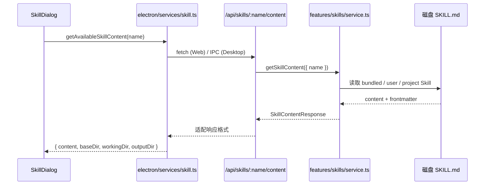

# B05：技能内容从磁盘到前端有多远

## 不只是下载 Markdown

当 `SkillDialog` 调用 `getAvailableSkillContent({ name: 'bmad-brainstorming' })` 时，它看起来只是在请求一段 Markdown。但这段内容背后涉及：技能来源发现（bundled / user / project）、目录解析、工作目录与输出目录计算、Web/Electron 适配、API route 边界、前端状态更新。

本章追踪：技能文件从磁盘到 `SkillDialog` 经历了哪些层，每一层新增了哪些边界信息。

## 调用链



## 前端适配层

[`packages/core/src/lib/integrations/electron/services/skill.ts` 第 147—163 行](../../../../packages/core/src/lib/integrations/electron/services/skill.ts#L147) 提供了 `getAvailableSkillContent`：

```ts
export async function getAvailableSkillContent(params: { name: string }): Promise<...> {
  if (isElectron()) {
    return window.ipcRenderer.invoke(IPC_CHANNELS.SKILL_GET_CONTENT, params);
  }
  const response = await fetch(`/api/skills/${params.name}/content?format=json`);
  return response.json();
}
```

这个函数屏蔽了运行环境差异：Web 下走 HTTP fetch，桌面下走 IPC。 `SkillDialog` 不需要知道自己运行在浏览器还是 Electron 中。

## API route 边界

[`packages/web/src/app/api/skills/[name]/content/route.ts` 第 39—67 行](../../../../packages/web/src/app/api/skills/[name]/content/route.ts#L39) 处理请求：

```ts
export async function GET(
  request: NextRequest,
  { params }: { params: { name: string } }
) {
  const name = params.name;
  const { searchParams } = new URL(request.url);
  const includeFrontmatter = searchParams.get('includeFrontmatter') === 'true';
  const format = (searchParams.get('format') as 'raw' | 'json') || 'raw';

  const data = getSkillContent({ name, includeFrontmatter });

  if (format === 'raw') {
    return new NextResponse(data.content, { headers: { 'Content-Type': 'text/markdown' } });
  }

  return NextResponse.json<ApiResponse<SkillContentResponse>>({ success: true, data, ... });
}
```

注意两个分支：

- `format=raw`：只返回 Markdown 文本，用于直接展示或简单读取。
- `format=json`：返回包含 `content`、`frontmatter`、`baseDir`、`workingDir`、`outputDir` 的结构化数据。

`SkillDialog` 使用 `format=json`，因为它需要目录信息来构建系统提示词。

## Core service 的目录解析

[`packages/core/src/lib/features/skills/service.ts` 第 171—209 行](../../../../packages/core/src/lib/features/skills/service.ts#L171) 的 `getSkillContent` 会：

1. 按名称找到 Skill 文件。
2. 解析 frontmatter。
3. 计算 `baseDir`（Skill 源目录）、`workingDir`（工作目录）、`outputDir`（输出目录）。

对于 bundled Skill，`workingDir` 通常落到 `data/skills/{code}`，而 `outputDir` 若 frontmatter 未指定则回退到 `workingDir`。这个设计保证：

- **只读资产**（`baseDir` 下的 `SKILL.md` 和参考文件）不会被修改。
- **工作目录**（`workingDir`）用于保存记忆、实践日志等认知文件。
- **输出目录**（`outputDir`）用于保存产物文件。

## 技能来源与去重

[`packages/core/src/lib/features/skills/service.ts` 第 455—510 行](../../../../packages/core/src/lib/features/skills/service.ts#L455) 的 `listAvailableSkills` 会合并多个来源：

1. bundled skills（系统内置模板）。
2. user skills（用户数据目录）。
3. project skills（当前项目目录）。
4. explicit paths（显式路径）。

同名 Skill 按加载顺序，第一个胜出，后续记录 collision 诊断。这意味着用户可以在自己的数据目录覆盖系统内置 Skill，但系统不会自动合并同名 Skill 的内容。

## 关键区分：源目录 vs 工作目录 vs 输出目录

| 目录 | 用途 | 典型路径 |
|------|------|----------|
| `baseDir` | Skill 源文件位置，只读 | `templates/skills/bmad-brainstorming` 或 `data/skills/bmad-brainstorming` |
| `workingDir` | Agent 运行时的 CWD，保存认知文件 | `data/skills/bmad-brainstorming` |
| `outputDir` | 产物输出目录 | `data/skills/bmad-brainstorming` 或 frontmatter 指定目录 |

这三个目录可能相同，也可能不同。它们的分离是 OriginOS 安全模型的基础：Agent 不能随意写回 Skill 源目录。

## 失败路径

1. **raw 格式不返回目录信息**：如果前端误用 `format=raw`，会得到 Markdown 但丢失 `workingDir`/`outputDir`。
2. **bundled Skill 被误认为可写**：系统内置 Skill 的 `baseDir` 在 `templates/` 下，Agent 不应向那里写入。
3. **同名 Skill 覆盖**：用户自定义 Skill 可能静默覆盖系统 Skill，需要检查 `listAvailableSkills` 的 collision 诊断。
4. **Skill 文件缺失**：`getSkillContent` 会抛出 `SkillServiceError`，API route 会返回 404 或 500。

## 测试证据与缺口

- [`packages/core/src/lib/features/skills/__tests__/service.test.ts`](../../../../packages/core/src/lib/features/skills/__tests__/service.test.ts#L1) 覆盖技能内容目录规则。
- [`packages/core/src/lib/integrations/pi-agent/__tests__/skills.test.ts`](../../../../packages/core/src/lib/integrations/pi-agent/__tests__/skills.test.ts#L1) 覆盖技能加载与格式化。

缺口：目前没有直接测试验证「`format=json` 返回完整目录信息」和「Web/Electron 适配层返回格式一致」。

## 练习与口头验收

1. 解释 `getAvailableSkillContent` 在 Web 和 Electron 下分别走哪条路径。
2. 为什么 `SkillDialog` 必须使用 `format=json` 而不是 `format=raw`？
3. 给定 bundled `bmad-brainstorming` 无显式 `outputDir`，推导 `workingDir` 与 `outputDir` 的路径。
4. 如果用户在自己的 `data/skills/` 下创建同名 Skill，系统会怎样处理？

合上本页后，应能画出：技能内容从磁盘 → Core service → API route → 适配层 → SkillDialog 的完整链路，并说明 `baseDir`、`workingDir`、`outputDir` 的职责差异。

下一章进入 `buildSkillSystemPrompt`，看 `SKILL.md` 如何变成 Agent 的系统提示词。
