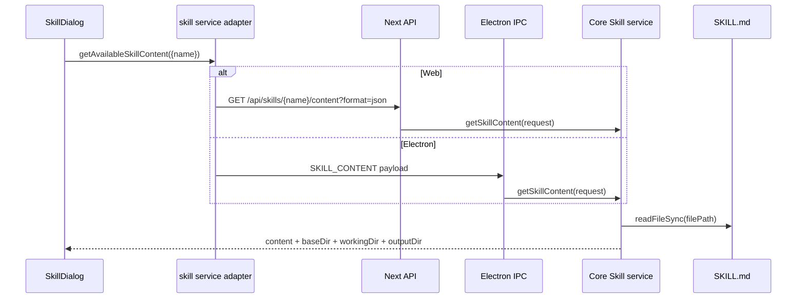

# B05：SKILL.md 从磁盘到组件要穿过哪些合同

## “读取 Markdown”为什么需要多层

Skill 内容既可能来自系统 bundled 目录，也可能来自用户或项目来源；同一 UI 在 Web 中通过 HTTP 获取，在 Electron 中通过 IPC 获取。组件需要的不只是正文，还包括只读源目录、工作目录、输出目录和管理属性。

## 两条入口、一个返回合同



两条入口复用 Core service，但 HTTP 的 URL 编码、状态码和 JSON，IPC 的 channel 与 payload 仍是不同合同，必须分别验证。

## 客户端适配层怎样选择环境

[packages/core/src/lib/integrations/electron/services/skill.ts 第 174—190 行](../../../../packages/core/src/lib/integrations/electron/services/skill.ts#L174) 在 Electron 中调用 `IPC_CHANNELS.SKILL_CONTENT`；否则构造带 `encodeURIComponent(request.name)` 的 URL，并固定 `format=json`。

URL 编码很重要。Skill 名若包含空格或特殊字符，直接拼接可能改变路径结构；编码只保护 URL 表达，不证明这个 Skill 名合法或存在。

## API route 的责任边界

[packages/web/src/app/api/skills/[name]/content/route.ts](../../../../packages/web/src/app/api/skills/[name]/content/route.ts#L1) 解析路径名、`format` 与 `includeFrontmatter`，调用 Core service，再把成功或 `SkillServiceError` 映射成 HTTP 响应。

[同文件第 39—67 行](../../../../packages/web/src/app/api/skills/[name]/content/route.ts#L39) 的成功主干只有一次 Core 调用：

```ts
const includeFrontmatter = searchParams.get('includeFrontmatter') === 'true';
const format = (searchParams.get('format') as 'raw' | 'json') || 'raw';
const data = getSkillContent({ name, includeFrontmatter });

if (format === 'raw') {
  return new NextResponse(data.content, { ... });
}
return NextResponse.json({ success: true, data, ... });
```

这里的 `as 'raw' | 'json'` 只是类型断言。请求传 `format=xml` 时，运行时字符串仍是 `xml`，代码会落入非 raw 分支并返回 JSON；它没有真正验证查询值属于联合类型。这是“编译期缩窄不等于输入校验”的实际例子。

`raw` 返回 Markdown 文本；`json` 返回结构化对象。SkillDialog 使用后者，因为它需要目录信息。route 不应自己扫描目录或重新实现 Skill 优先级。

## Desktop IPC 入口不是一句“走 IPC”

[packages/desktop/src/main/services/skill-service.ts 第 75—87 行](../../../../packages/desktop/src/main/services/skill-service.ts#L75) 注册真实 handler：

```ts
ipcMain.handle(
  IPC_CHANNELS.SKILL_CONTENT,
  async (_event, request) => {
    try {
      return { success: true, data: getSkillContent(request), timestamp: ... };
    } catch (error) {
      return this.toErrorResponse(error, '[SkillService] Get skill content failed');
    }
  },
);
```

HTTP 与 IPC 在这里确实调用同一个 `getSkillContent`，但外围合同不同：HTTP 有 raw/json、状态码与缓存头；IPC 始终返回 `IpcResponse`，错误由 `toErrorResponse` 编码。共享 Core 只能证明目录和内容规则复用，不能证明两端错误呈现完全相同。

## Core service 生成四类信息

[packages/core/src/lib/features/skills/service.ts 第 488—510 行](../../../../packages/core/src/lib/features/skills/service.ts#L488) 的实际顺序是：

1. `findSkillForContent(name)` 找到目标；
2. 找不到则抛出带 404 状态的 `SkillServiceError`；
3. `readFileSync(skill.filePath, 'utf-8')` 读取全文；
4. `resolveSkillWorkingDirectory(skill)` 计算并在不存在时创建目录；
5. `resolveSkillOutputDir(skill)` 解析输出路径；
6. 返回 `content`、`baseDir`、`workingDir`、`outputDir`、`systemManaged`；
7. 只有请求要求时才额外解析 frontmatter。

这意味着 GET 并非纯粹无副作用：计算 bundled Skill 的 working directory 时，可能创建运行目录。HTTP 语义上的“读取”与文件系统内部“确保目录存在”需要如实区分。

## 三个目录的最小准确模型

| 字段 | 当前来源 | 责任 | 不应推出 |
| --- | --- | --- | --- |
| `baseDir` | Skill 定义位置 | 读取模板与参考资产 | 一定可写 |
| `workingDir` | bundled 时为 `data/skills/{code}`，其他来源常用 baseDir | CWD 与认知文件范围 | 一定与源目录不同 |
| `outputDir` | frontmatter 解析或回退 workingDir | 产物目标提示 | 文件工具自动把任意相对路径放这里 |

[service.ts 第 171—209 行](../../../../packages/core/src/lib/features/skills/service.ts#L171) 显示相对 `outputDir` 基于数据根解析；绝对值原样返回。这个实现负责解析，不等于已经验证绝对路径满足所有安全策略。

## 真实输入推演

假设 bundled Skill：

```text
name/code = bmad-brainstorming
baseDir = <bundled source>/bmad-brainstorming
frontmatter 未声明 outputDir
```

则 `workingDir = getDataRoot()/skills/bmad-brainstorming`，目录不存在时被创建；`outputDir` 回退为同一目录。Skill 源内容仍从 `baseDir` 的 `SKILL.md` 读取，产物不应写回源目录。

若 frontmatter 写 `outputDir: data/agents/demo`，解析结果变成 `getDataRoot()/agents/demo`，不再与 workingDir 相同。

## 来源、过滤和冲突不能凭想象

[service.ts 第 455—476 行](../../../../packages/core/src/lib/features/skills/service.ts#L455) 的 `listSkills` 调用 `loadSkills({ includeDefaults: true })`，再按 source 与 `disableModelInvocation` 过滤，并可返回 diagnostics。具体同名冲突优先级由 loader 实现决定，不能只从 `listSkills` 这一窗口断言“用户一定覆盖 bundled”或相反。

## 测试证据与缺口

[packages/core/src/lib/features/skills/__tests__/service.test.ts](../../../../packages/core/src/lib/features/skills/__tests__/service.test.ts#L1) 应按具体 `it` 逐项阅读：只有真实断言到目录解析、404 或 frontmatter 的用例才构成对应证据。测试文件存在不能证明 Web 与 IPC 响应完全一致。

[该测试第 48—97 行](../../../../packages/core/src/lib/features/skills/__tests__/service.test.ts#L48) 的 Given 是 Electron resources 中存在 bundled `SKILL.md`，且 frontmatter 写有 `outputDir: data/`；When 调用 `getSkillContent`；Then 断言内容被物化到 workingDir、`outputDir` 等于 data root、frontmatter 被解析、`systemManaged` 为 true。它证明 Core 物化和目录结果，不证明 HTTP 缓存头、状态码或 IPC 错误映射。

当前单元未运行测试，因此给出的命令是验证方法，不是通过记录：

```bash
pnpm --filter @originos/core exec vitest run src/lib/features/skills/__tests__/service.test.ts
```

跨入口测试还应固定同一个 Given：Skill 不存在。When 分别调用 HTTP JSON route 与 IPC handler；Then 两端都应携带 `NOT_FOUND` 语义，但 HTTP 还必须是 404，IPC 则检查 `success:false` 和错误对象。只测 Core 抛出 `SkillServiceError`，不能证明两层映射都正确。

## 小实验：让三个目录第一次分开

给一个 bundled Skill 设定 `outputDir: data/exports/brainstorming`，先在纸上推导：`baseDir` 仍指向 bundled 源目录；`workingDir` 仍是 `data/skills/{code}`；`outputDir` 则落到 data root 下的 exports 目录。然后分别写出“读取参考模板”“生成 Memory.md”“输出 ideas.md”最适合使用哪个概念。

验收答案不是要求三者永远落入不同物理目录，而是能说明即使两个路径碰巧相同，读取资产、运行 CWD 与产物目标仍是三种责任。

## 故障反查与口头验收

- 404：先查 Skill 发现与 name，不先查 prompt builder。
- 有正文但目录字段缺失：查是否误用 raw 格式或边界映射丢字段。
- 第一次读取时目录权限报错：查 working directory 创建，而非 `readFileSync` 一项。
- Web 正常、Electron 异常：对照 HTTP 与 IPC adapter，不因共用 Core 就跳过入口。

合上本页，应能回答：

1. 为什么一次 GET 可能创建工作目录？
2. `baseDir`、`workingDir`、`outputDir` 各自回答什么问题？
3. HTTP raw 与 JSON 两条返回分支有什么不同？
4. `format` 的 TypeScript 断言为什么不是运行时校验？
5. HTTP 和 IPC 共用 Core service 后，为什么仍必须分别测试错误合同？

下一章使用这四类返回值，逐行构造 Agent 会看到的系统提示词。
