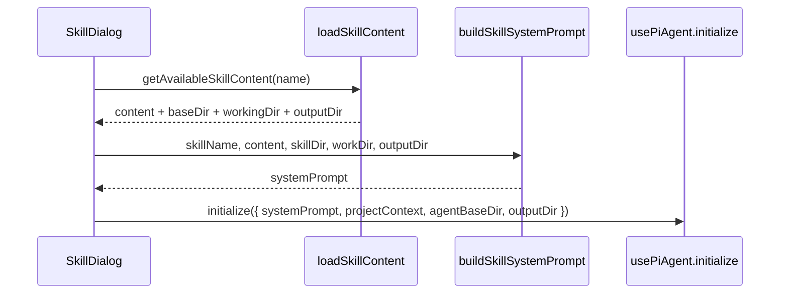

# B06：SkillDialog 如何把 SKILL.md 变成系统提示词

## 打开窗口后，Agent 还不认识你

当「头脑风暴」窗口出现时，Agent 还不知道它要扮演什么角色、能使用哪些工具、结果应写到哪里。这些信息不在用户即将输入的第一句话里，而在 `SKILL.md` 的 frontmatter 和正文中。`SkillDialog` 需要把它们整理成一份 `systemPrompt`，连同工作目录、输出目录一起交给 `usePiAgent.initialize`。

本章回答：系统提示词由哪些材料拼接而成，为什么 `SkillDialog` 要承担这个拼装工作？

## 调用链



## buildSkillSystemPrompt 的四段拼接

[`packages/web/src/components/skills/SkillDialog.tsx` 第 103—219 行](../../../../packages/web/src/components/skills/SkillDialog.tsx#L103) 是 `buildSkillSystemPrompt` 的实现。它可以拆成四段：

### 第一段：目录边界

```ts
if (workDir) {
  lines.push(`Working directory: ${workDir}`);
  lines.push('All bash commands and cognitive files (Memory.md, practice/) are resolved from this directory.');
}

if (outputDir && outputDir !== workDir) {
  lines.push(`Output directory for artifacts: ${outputDir}`);
  lines.push('Use `${OUTPUT_DIR}` in shell commands only when you need the native absolute artifact directory.');
}
```

这段告诉 Agent：你的 CWD 在哪里，产物应该写到哪里。 `outputDir` 和 `workDir` 可能相同也可能不同，分别对应「工作上下文」和「产物输出」。

### 第二段：Skill 身份与能力

```ts
lines.push(`You are the ${skillName} skill.`);
lines.push('');
lines.push(skillContent);
```

`skillContent` 是 `SKILL.md` 去除 frontmatter 后的正文。它描述 Skill 的目标、工作方式和输出格式。

### 第三段：执行规则

```ts
lines.push('When executing commands or writing files, follow these rules:');
lines.push('- Prefer creating files in the output directory.');
lines.push('- When using bash tools, use relative paths from the working directory.');
// ...
```

这些规则是所有 Skill 共享的运行时约定，确保 Agent 不会把文件写到不该写的地方。

### 第四段：变量替换

某些 Skill 的 `SKILL.md` 可能包含占位符，如 `{projectName}`。`buildSkillSystemPrompt` 会进行简单替换：

```ts
return lines.join('\n').replace(/\{\{(\w+)\}\}/g, (match, key) => {
  const value = variables[key];
  return value !== undefined ? String(value) : match;
});
```

如果变量缺失，占位符会原样保留，而不是替换成空字符串。这避免了"成功返回字符串"但"上下文没填好"的静默错误。

## 关键输入：skillDir、workDir、outputDir

| 参数 | 来源 | 作用 |
|------|------|------|
| `skillDir` | `baseDir`（Skill 源目录） | 让 Agent 知道只读资产位置 |
| `workDir` | `workingDir` | Agent 的 CWD，保存记忆和实践日志 |
| `outputDir` | `outputDir` | 产物输出目录，可能不等于 workDir |

这三个目录的分离是 OriginOS 安全模型的基础：Agent 不能随意写回 Skill 源目录，产物和运行上下文也要分开管理。

## 初始化调用

[`SkillDialog.tsx` 第 470—498 行](../../../../packages/web/src/components/skills/SkillDialog.tsx#L470) 调用 `usePiAgent.initialize`：

```ts
await initialize({
  sessionId: stableSessionIdRef.current,
  projectId: currentProjectId,
  projectName: currentSkillData?.displayName || currentSkill,
  agentType: 'skill',
  systemPrompt,
  projectContext: {
    ...
    currentPath: agentBaseDir,
    outputDir: effectiveOutputDir,
  },
  agentBaseDir,
  outputDir: effectiveOutputDir,
});
```

注意 `systemPrompt` 是本地构建的字符串；`agentBaseDir` 和 `outputDir` 会进入 `projectContext`，最终传递到 Agent 运行时的工具上下文中。

## 失败路径

1. **`skillContent` 为空**：如果技能内容加载失败，`systemPrompt` 会缺少身份和能力描述。
2. **`outputDir` 缺失**：回退到 `workDir` 或 `skillDir`，可能导致产物和运行上下文混在一起。
3. **变量替换失败**：占位符原样保留，Agent 可能看到 `{projectName}` 这样的未解析标记。
4. **提示词与工具注册不一致**：提示词里写了「你可以写文件」，但如果工具列表没有 `write_file`，模型仍然无法执行。

## 测试证据与缺口

- [`packages/web/src/components/skills/__tests__/skill-export-policy.test.ts`](../../../../packages/web/src/components/skills/__tests__/skill-export-policy.test.ts#L1) 验证 Skill 产物导出策略。
- `buildSkillSystemPrompt` 目前没有直接单元测试。

缺口：建议增加测试验证 `buildSkillSystemPrompt` 的输出结构，包括目录区、身份区、规则区的顺序，以及变量缺失时的占位符行为。

## 练习与口头验收

1. 给一段带 frontmatter 的 `SKILL.md`，写出最终 prompt 中目录区、身份区、规则区的大致顺序。
2. 如果 `outputDir` 与 `workDir` 相同，`buildSkillSystemPrompt` 会怎样处理？
3. 为什么变量缺失时占位符要原样保留，而不是替换成空字符串？
4. 解释「提示词声明不等于工具授权」：如果提示词写了可以删除文件，但工具列表没有 `delete_file`，会发生什么？

合上本页后，应能说清：`SkillDialog` 把 `SKILL.md` 正文、目录边界、运行规则三块积木拼成 `systemPrompt`，然后交给 `usePiAgent.initialize`；`agentBaseDir` 和 `outputDir` 会进入项目上下文，最终影响工具的文件操作范围。

下一章追踪 `usePiAgent.initialize` 如何跨越 HTTP 边界创建会话。
