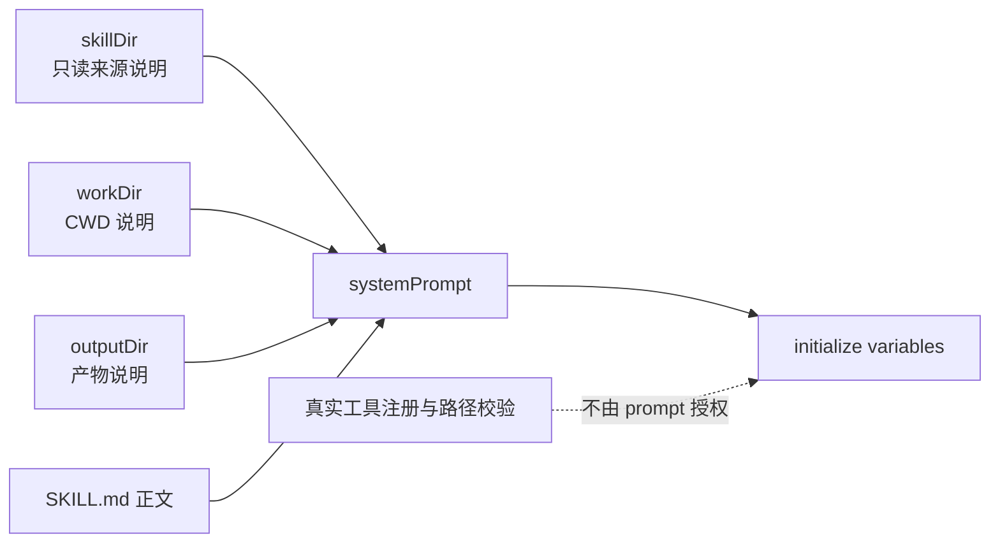

# B06：Skill 内容怎样变成一次会话的系统提示词

## 原始 SKILL.md 不能单独启动 Agent

B05 返回一段全文和三个目录。运行时还需要明确工作目录、产物目录、只读资产目录、执行规则和通信约束。`SkillDialog` 中的 `buildSkillSystemPrompt` 把这些材料按固定顺序拼成字符串。

本章只解释当前 builder 的真实行为。提示词是否合理、工具是否真的注册、模型怎样消费上下文，属于后续运行时章节。

## 拼装顺序决定模型先看到什么

[packages/web/src/components/skills/SkillDialog.tsx 第 103—220 行](../../../../packages/web/src/components/skills/SkillDialog.tsx#L103) 的顺序是：

```text
Working directory
→ Output directory
→ Skill assets directory
→ Skill identity and body
→ How to Execute
→ Tool Execution Rules
→ Network Access
→ User Communication Rules
→ 替换 ${CLAUDE_SKILL_DIR} 与 ${OUTPUT_DIR}
```

它不是通用模板引擎。当前实现只做两个精确字符串替换，不处理任意 `{{projectName}}` 占位符。把它理解为通用花括号变量系统，会错误预测未知变量也会被解析。

## 目录段的三个条件分支

### 有 `workDir`

加入工作目录，并说明 bash 与认知文件从该目录解析。

### 有 `outputDir` 且不同于 `workDir`

加入产物目录、`${OUTPUT_DIR}` 用法以及 file tools 的运行时数据根路径约定。

### `outputDir === workDir`

仍注入 output directory 行。源码注释说明这是对某些 cwd 异常环境的兜底，使 Agent 至少能从 prompt 读到绝对产物目录。

这三个分支说明“两个目录相同”不等于 output 说明可以完全省略。

## Skill 身份段怎样处理 frontmatter

[第 138—163 行](../../../../packages/web/src/components/skills/SkillDialog.tsx#L138) 的两条路径：

- 内容为空：生成一个通用 `${skillName}` 助手说明；
- 内容非空：用正则识别文件开头的 `---` frontmatter，提取 name 与 description，去掉 frontmatter 后把正文放进 `## Skill Instructions`。

当前实现先用 `name` 设置 `displayName`，若又有 `description`，会把 `displayName` 覆盖为 description。于是最终 `You are ...` 可能使用描述而非名称。这是源码现状，可能是设计选择也可能值得审查；教材不能把它理想化成“稳定使用 name”。

真实赋值顺序是：

```ts
if (nameMatch?.[1]) displayName = nameMatch[1].trim();
if (descMatch?.[1]) displayName = descMatch[1].trim();
```

输入 `name: Brainstorm Coach`、`description: 帮助用户发散创意` 时，最终身份行是 `You are 帮助用户发散创意.`。若产品希望 description 只作为说明，就必须引入单独变量，而不是修改正则便假设行为会改变。

## 图解：三类目录进入一段文本，但不变成权限



前三根实线表示字符串材料进入 prompt。虚线提醒：prompt 说“可以写文件”并不会创造 `write_file`；真实工具对象和执行边界仍由 runtime 决定。

## 代入真实值逐步得到结果

输入：

```text
skillName = bmad-brainstorming
skillDir = /source/bmad-brainstorming
workDir = /data/skills/bmad-brainstorming
outputDir = /data/skills/bmad-brainstorming
```

输出前部会依次包含 working directory、同值 output directory、skill assets directory。`${CLAUDE_SKILL_DIR}` 被替换为源目录；`${OUTPUT_DIR}` 被替换为数据目录。若正文中出现其他 `${UNKNOWN}`，builder 不会处理它。

## Prompt 进入 initialize 的真实调用

[SkillDialog.tsx 第 470—498 行](../../../../packages/web/src/components/skills/SkillDialog.tsx#L470) 计算目录与 prompt，随后调用：

```ts
await initialize(
  effectiveSessionId,
  {
    projectId: `skill-${currentSkill}`,
    projectName: `技能: ${currentSkill}`,
  },
  {
    agentType: 'skill',
    systemPrompt,
    ...(agentWorkDir && { agentBaseDir: agentWorkDir }),
    ...(outputDir && { outputDir }),
  },
  llmConfig,
);
```

system prompt、agentBaseDir 和 outputDir 是并列传入的启动材料。下层不必从 prompt 文本反向解析目录；文字用于模型理解，结构字段用于程序执行。

## 失败与误解

| 情况 | 当前行为 | 风险 |
| --- | --- | --- |
| Skill 内容为空 | 退化为通用助手 prompt | 窗口可聊天但目标能力缺失 |
| frontmatter 格式不匹配 | 全文作为 instructions | 元数据可能直接暴露给模型 |
| description 覆盖 name | `You are` 使用描述 | 身份文本不符合预期 |
| 目录缺失 | 对应提示段不生成 | 工具仍需下层决定 CWD |
| prompt 声明工具能力 | 只影响模型文本上下文 | 不提供真实授权 |

## 测试证据与缺口

当前 builder 是 `SkillDialog.tsx` 内部函数，没有直接单元测试。现有 `skill-export-policy.test.ts` 不能替它证明拼装顺序或替换行为。

应抽取或通过组件测试锁定：空内容降级、name/description 选择、frontmatter 去除、相同/不同 outputDir、两个变量替换、未知变量保留。没有这些断言时，本章行为依据是源码执行推演，而非回归测试保证。

例如 Given 是同时具有 name 与 description 的内容；When 调用 builder；Then 应断言当前输出使用 description。这个测试会先固定现状；若随后修复为使用 name，应同步修改测试和教材，而不是把期望写成现有事实。

## 小实验与口头验收

准备只有 `name`、同时有 `name + description`、没有 frontmatter 三份短内容，预测 `You are ...` 的实际结果。再解释为什么这是正则与赋值顺序的结果，而不是 YAML 规范的一般结论。

合上本页，应能回答：

1. builder 按什么顺序拼装各段？
2. 当前只替换哪两个变量？
3. name 与 description 同时存在时，为什么 description 会成为 displayName？
4. 结构化目录字段与 prompt 目录文字为什么不能互相替代？
5. 提示词声明工具能力为什么不等于真实授权？

下一章观察这些启动材料如何跨过 HTTP 或 IPC 边界，成为可持久化的 AgentSession。
