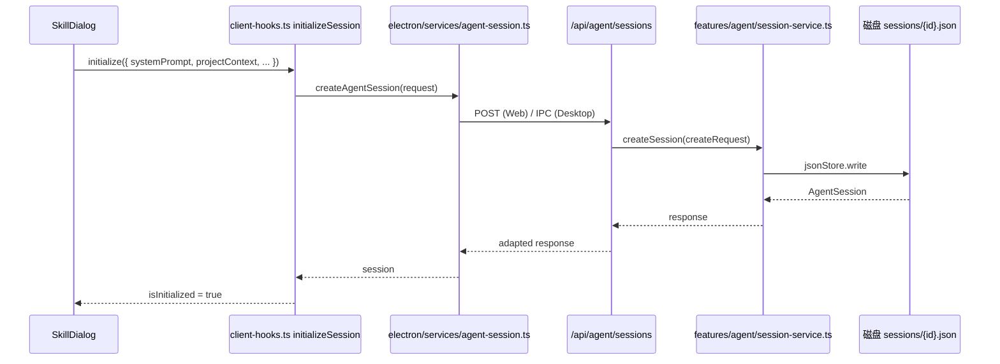

# B07：创建 Agent 会话时跨越了哪条 HTTP 边界

## 客户端不能自己创建会话

当 `SkillDialog` 准备好 `systemPrompt`、`agentBaseDir`、`outputDir` 等材料后，它不能直接在浏览器里创建 Agent 会话。原因是浏览器没有 Node 文件系统权限，也无法保证多个进程（Web、桌面、测试）使用相同的持久化逻辑。因此必须把这些材料打包成 HTTP 请求，发给 Next.js API route，由服务端调用 Core 的 `agentSessionService` 创建会话。

本章追踪：初始化请求从浏览器出发，经过哪些边界，最终变成磁盘上的一个会话 JSON 文件。

## 调用链



## 客户端 Hook 的请求构建

[`packages/core/src/lib/integrations/pi-agent/client-hooks.ts` 第 207—249 行](../../../../packages/core/src/lib/integrations/pi-agent/client-hooks.ts#L207) 的 `initializeSession` 构造请求：

```ts
const response = await createAgentSession({
  sessionId,
  projectId: scopedProjectContext.projectId,
  projectName: scopedProjectContext.projectName || 'Agent Session',
  agentType,
  systemPrompt,
  projectContext: scopedProjectContext as unknown as Record<string, unknown>,
  llmConfig,
  agentBaseDir: variables?.['agentBaseDir'],
  outputDir: variables?.['outputDir'],
});
```

这里发生的是**边界适配**：Hook 的 `ProjectContext` 被整理成 API 所需请求字段。 `projectName || 'Agent Session'` 是名称缺失时的默认值；它不补造 `projectId`，因为没有项目身份不能可靠地猜一个。

`as unknown as Record<string, unknown>` 是 TypeScript 的类型适配，不是运行时校验。它使当前请求接口可以用通用对象承载上下文，却不确认每个字段真实有效。编译器允许与运行时已验证属于不同层次。

## Web / Electron 适配层

[`packages/core/src/lib/integrations/electron/services/agent-session.ts` 第 46—70 行](../../../../packages/core/src/lib/integrations/electron/services/agent-session.ts#L46) 的 `createAgentSession` 屏蔽了运行环境：

```ts
export async function createAgentSession(request: CreateAgentSessionRequest): Promise<...> {
  if (isElectron()) {
    return window.ipcRenderer.invoke(IPC_CHANNELS.AGENT_SESSION_CREATE, request);
  }
  const response = await fetch('/api/agent/sessions', {
    method: 'POST',
    headers: { 'Content-Type': 'application/json' },
    body: JSON.stringify(request),
  });
  return response.json();
}
```

同一函数名，两种实现：Web 走 HTTP，桌面走 IPC。 `SkillDialog` 不需要知道当前运行形态。

## API route 只做边界映射

[`packages/web/src/app/api/agent/sessions/route.ts` 第 54—130 行](../../../../packages/web/src/app/api/agent/sessions/route.ts#L54) 处理创建请求：

```ts
export async function POST(request: NextRequest) {
  const body = await request.json();

  if (!body.projectId || !body.projectName) {
    return NextResponse.json({ success: false, error: { code: 'INVALID_REQUEST', ... } }, { status: 400 });
  }

  persistRuntimeLLMConfig(body.llmConfig);
  const userConfig = readUserConfig();
  const llmConfigWithMapping = {
    ...body.llmConfig,
    ...(userConfig.llm?.mapping && !body.llmConfig?.mapping ? { mapping: userConfig.llm.mapping } : {}),
  };

  if (body.agentBaseDir) {
    mkdirSync(body.agentBaseDir, { recursive: true });
  }

  const createRequest = {
    projectId: body.projectId,
    projectName: body.projectName,
    systemPrompt: body.systemPrompt,
    agentType: body.agentType,
    projectContext: { ...body.projectContext, ... },
    sessionId: body.sessionId,
    llmConfig: llmConfigWithMapping,
  };

  const session = await agentSessionService.createSession(createRequest);
  return NextResponse.json({ success: true, data: session, ... }, { status: 201 });
}
```

这段代码只做四件事：

1. 参数校验（`projectId`、`projectName` 必填）。
2. LLM 配置归一化与合并用户 mapping。
3. 确保 `agentBaseDir` 目录存在。
4. 调用 `agentSessionService.createSession`。

业务规则（会话应该怎样创建、存到哪里）全部下沉到 Core service，route 只做 HTTP 边界映射。

## Core service 的持久化

[`packages/core/src/lib/features/agent/session-service.ts` 第 48—83 行](../../../../packages/core/src/lib/features/agent/session-service.ts#L48) 的 `createSession` 创建会话对象：

```ts
async createSession(request: CreateAgentSessionRequest): Promise<AgentSession> {
  const session: AgentSession = {
    id: request.sessionId || uuidv4(),
    projectId: request.projectId,
    projectName: request.projectName,
    agentType: request.agentType,
    systemPrompt: request.systemPrompt,
    projectContext: request.projectContext,
    llmConfig: request.llmConfig,
    messages: [],
    createdAt: new Date().toISOString(),
    updatedAt: new Date().toISOString(),
  };

  await this.saveSession(session);
  return session;
}
```

[`saveSession` 第 88—100 行](../../../../packages/core/src/lib/features/agent/session-service.ts#L88) 写入磁盘：

```ts
async saveSession(session: AgentSession): Promise<void> {
  const filePath = this.getSessionFilePath(session.id, session.projectId);
  await this.jsonStore.write(filePath, session);
}
```

会话文件路径通常是 `data/projects/{projectId}/sessions/{sessionId}.json` 或全局 `data/sessions/{sessionId}.json`，取决于 `projectId` 是否以项目形式存在。

## 关键区分：客户端 state 与会话 JSON

| 状态 | 位置 | 生命周期 |
|------|------|----------|
| `isInitialized` (React state) | 浏览器内存 | 页面刷新后丢失 |
| `AgentSession` 对象 | API 返回的 JSON | 存在于 HTTP 响应中 |
| 磁盘 JSON | `data/.../sessions/{id}.json` | 窗口关闭后仍保留 |

只有磁盘 JSON 是持久权威；客户端 state 只反映本次页面生命周期的初始化结果。

## 失败路径

1. **缺少 `projectId` 或 `projectName`**：API 返回 400，`SkillDialog` 需要处理错误状态。
2. **`agentBaseDir` 创建失败**：`mkdirSync` 可能因权限失败，但错误处理在 `catch` 中返回 500。
3. **`sessionId` 已存在**：[`route.ts` 第 83—100 行](../../../../packages/web/src/app/api/agent/sessions/route.ts#L83) 会返回现有会话并合并 `projectContext` 与 `llmConfig`。
4. **用户 mapping 合并错误**：如果 `body.llmConfig` 已含 `mapping`，不会覆盖；否则合并 `userConfig.llm.mapping`。

## 测试证据与缺口

- `agentSessionService.createSession` 目前没有直接单元测试（`packages/core/src/lib/features/agent/__tests__/` 目录不存在）。
- API route 的测试需要集成测试覆盖，目前可能依赖 E2E。

缺口：建议为 `session-service.ts` 增加单元测试，覆盖创建、保存、读取、更新、删除会话；为 API route 增加集成测试，覆盖 400、201、会话复用等分支。

## 练习与口头验收

1. 为什么 `SkillDialog` 不能直接在浏览器里创建会话文件？
2. `client-hooks.ts` 中的 `as unknown as Record<string, unknown>` 是什么意思？它是否提供运行时验证？
3. 对比 Electron IPC 与 Web fetch 两种 `createAgentSession` 路径，说明同一函数如何屏蔽运行环境差异。
4. 如果 `sessionId` 已经存在，API 会怎样处理？为什么这样设计？

合上本页后，应能画出：`SkillDialog → usePiAgent.initialize → createAgentSession → /api/agent/sessions → agentSessionService.createSession → 磁盘 JSON`，并说明每一层只做边界映射、参数校验还是业务持久化。

下一章追踪用户发送第一条消息后，这条消息如何被校验、持久化并交给 Agent 运行时。