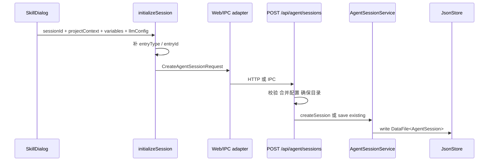

# B07：`initialize` 怎样把浏览器状态变成持久化会话

## 到这里才第一次真正创建会话

B02 创建了窗口 id，B04 选择了 `effectiveSessionId`，B06 构造了 system prompt。它们都只是启动材料。只有 `usePiAgent.initialize` 经客户端适配调用服务端创建接口后，磁盘上才可能出现会话 JSON。

本章追踪创建与复用分支，不展开 Agent runtime 内部初始化。

## 四层边界



图中 `initializeSession` 仍是客户端合同转换；route 是传输边界；Core service 拥有会话数据结构；JsonStore 负责通用文件包装。

## 客户端先补齐入口所有权

[packages/core/src/lib/integrations/pi-agent/client-hooks.ts 第 207—249 行](../../../../packages/core/src/lib/integrations/pi-agent/client-hooks.ts#L207) 接收四组输入。它根据 `agentType` 推导 `entryType`，再根据项目 id 推导 `entryId`：

```ts
const entryType = projectContext.entryType
  ?? (agentType === 'skill' ? 'skill' : agentType === 'role-agent' ? 'role-agent' : 'agent');

const entryId = projectContext.entryId
  ?? (entryType === 'skill' && projectContext.projectId.startsWith('skill-')
    ? projectContext.projectId.slice('skill-'.length)
    : projectContext.projectId);
```

对 `projectId = 'skill-bmad-brainstorming'`，结果是 `entryType='skill'`、`entryId='bmad-brainstorming'`。这两个字段之后用于恢复与消息所有权校验。

`projectContext as unknown as Record<string, unknown>` 只让 TypeScript 接受请求形状，不执行运行时验证。字符串前缀推导也只是当前兼容规则，不是身份认证。

## Web 与 Electron 共享字段意图，但当前没有共享一份请求类型

客户端调用 `createAgentSession`。Web 形态发 `POST /api/agent/sessions`，Electron 形态走 IPC。两端传递相似字段，却不是由同一个导出的 `CreateAgentSessionRequest` 类型约束。

[packages/core/src/lib/integrations/electron/services/agent-session.ts 第 46—69 行](../../../../packages/core/src/lib/integrations/electron/services/agent-session.ts#L46) 在 renderer adapter 内联声明请求形状，并选择传输：

```ts
export async function createAgentSession(request: {
  projectId: string;
  projectName: string;
  systemPrompt?: string;
  // ...其余字段
}): Promise<IpcResponse<AgentSession>> {
  if (isElectron()) {
    return getIpcRenderer().invoke(IPC_CHANNELS.AGENT_SESSION_CREATE, request);
  }
  return readJsonResponse(await fetch('/api/agent/sessions', { ... }));
}
```

Desktop handler 又在 [packages/desktop/src/main/services/agent-session-service.ts 第 91—103 行](../../../../packages/desktop/src/main/services/agent-session-service.ts#L91) 内联了一份相似结构。这叫平行合同，不叫共享类型。字段日后在一端新增、另一端遗漏时，TypeScript 不一定能跨 package 提醒。

因此，“调用同一个 Core service”只能证明最终会话对象的部分业务复用，不能自动证明边界合同一致。

## route 的两个成功分支

[packages/web/src/app/api/agent/sessions/route.ts 第 54—145 行](../../../../packages/web/src/app/api/agent/sessions/route.ts#L54) 先要求 `projectId` 和 `projectName`，然后持久化/合并 LLM 配置。

### 已有 session：200

若请求带 `sessionId`，route 用同一 projectId 查找。找到后不会重新创建空会话，而是合并 `projectContext`、`agentBaseDir`、`outputDir`，必要时更新 agentType 与 llmConfig，再 `saveSession(existing)`，返回 200。

### 新 session：201

若未找到，route 在有 `agentBaseDir` 时 `mkdirSync(..., { recursive: true })`，组装 `createRequest`，调用 `agentSessionService.createSession`，返回 201。

这两个分支解释了“initialize”为什么既可能创建，也可能复用并刷新已有会话。函数名不能替代分支阅读。

## Desktop 创建入口：相似主干中的真实差异

[agent-session-service.ts 第 112—175 行](../../../../packages/desktop/src/main/services/agent-session-service.ts#L112) 也执行必填检查、已有会话更新、目录创建和 `createSession`。但它没有 HTTP 状态码；成功和失败都放进 `IpcResponse`。

更重要的是，两条入口当前并非逐字段相同：

| 对照项 | Web route | Desktop IPC handler |
| --- | --- | --- |
| 必填字段 | `projectId`、`projectName` | 相同 |
| 已有会话 | 直接合并对象后 `saveSession` | 调用 `updateSession` |
| 用户 LLM mapping | 读取 `readUserConfig()` 并在请求未带 mapping 时合并 | 当前窗口未执行同样合并 |
| 新建目录 | `mkdirSync(agentBaseDir)` | 动态 import `fs` 后 `mkdirSync` |
| 新建结果 | HTTP 201 | `success:true`，无状态码 |
| 找到已有结果 | HTTP 200 | `success:true`，无 200/201 区分 |
| 异常 | HTTP 500 | `toErrorResponse` |

这张表揭示一个教学上必须保留的结论：Web 中观察到的 LLM mapping 和 200/201 语义，不能直接推广到 Electron。若产品要求两端完全一致，应先提取共享边界服务和共享 DTO，再用合同测试固定差异。

## Core 实际保存的 `AgentSession`

[packages/core/src/lib/features/agent/session-service.ts 第 54—83 行](../../../../packages/core/src/lib/features/agent/session-service.ts#L54) 生成的对象使用 `sessionId` 字段和毫秒时间戳：

```ts
{
  sessionId,
  createdAt: now,
  updatedAt: now,
  status: 'active',
  messages: [],
  projectContext: { projectId, projectName, ...request.projectContext },
  systemPrompt: request.systemPrompt || '',
  agentType: request.agentType || 'generic',
  config: { sessionId, systemPrompt, agentType },
  llmConfig?: ...
}
```

若把字段写成 `id` 或把时间写成 ISO 字符串，就不是当前合同。精读类型时必须区分相邻服务或历史版本中的不同形状。

[第 88—100 行](../../../../packages/core/src/lib/features/agent/session-service.ts#L88) 取 `projectContext.projectId`，再让 JsonStore 写入 `projects/{projectId}/sessions/{sessionId}.json` 或全局 fallback。JsonStore 还会包一层 `DataFile`；磁盘根对象并不等于裸 `AgentSession`。

## 一条真实请求的字段变化

```text
SkillDialog:
  sessionId = <uuid>
  projectId = skill-bmad-brainstorming
  agentType = skill

client-hooks:
  entryType = skill
  entryId = bmad-brainstorming

route:
  currentPath = agentBaseDir
  outputDir = outputDir

service:
  status = active
  messages = []
  createdAt/updatedAt = Date.now()

JsonStore:
  DataFile.data = AgentSession
```

这条字段链描述两端共同的核心结果。传输层仍分叉：Web 返回 201/200，Electron 返回统一 `IpcResponse`。因此纸面追踪必须同时写“数据怎样变化”和“调用者怎样得知结果”，不能只追最终 JSON。

每层都只新增属于自己的字段或包装；浏览器的 `isInitialized` 只是 UI 状态，不能替代磁盘写入证据。

## 失败与部分成功

| 失败点 | 结果 | 已经发生的副作用 |
| --- | --- | --- |
| 缺 projectId/projectName | HTTP 400 | 未创建目录/会话 |
| `persistRuntimeLLMConfig` 失败 | HTTP 500 | 取决于函数内部，需另查 |
| `mkdirSync` 权限失败 | HTTP 500 | 会话尚未创建 |
| JsonStore 写失败 | HTTP 500 | 目录可能已创建，但会话不可靠 |
| 已有 session 分支 save 失败 | HTTP 500 | 内存对象已合并，磁盘未必更新 |

跨多步操作必须区分“没有副作用”“部分副作用”“持久化成功”。

## 测试证据与缺口

当前有 SessionStore、restore 与客户端 Hook 测试，但不能据此自动宣称这个 route 的 200/201/400 分支都已覆盖。应为 route 构造请求并断言状态码、Core 调用与目录准备；为 `AgentSessionService` 断言 DataFile 读取后的真实字段。

可运行的 Core 测试入口要以实际文件为准，例如：

```bash
pnpm --filter @originos/core exec vitest run src/lib/integrations/pi-agent/__tests__/session-store.test.ts
```

它证明的仍是目标测试断言，不是本章整条 HTTP 链。

最低跨入口测试应使用同一份输入分别调用 Web route 与 Desktop handler，比较持久化的 `AgentSession`；再故意省略 `projectName` 比较失败合同；最后提供只存在于用户配置中的 LLM mapping，确认两端当前差异是预期、缺陷还是待统一设计。没有这组测试，不能写“平台合同一致”。

## 小实验与口头验收

分别为“同 session 已存在”和“不存在”写出状态码、是否清空 messages、是否更新 projectContext。正确答案：已有分支返回 200，不重新构造空 messages；新建分支返回 201、messages 初始为空。

合上本页，应能回答：

1. session id 何时只是候选值，何时已经持久化？
2. Web 的 200 复用与 201 新建分别做了什么？
3. 为什么 renderer adapter 与 Desktop handler 目前属于平行类型声明？
4. Web 的用户 LLM mapping 合并为什么不能直接推广到 Electron？
5. 磁盘 JSON 为什么比 `AgentSession` 多一层 DataFile 包装？

下一章跟随第一条用户消息，看既有会话怎样先恢复 runtime，再接收新输入。
