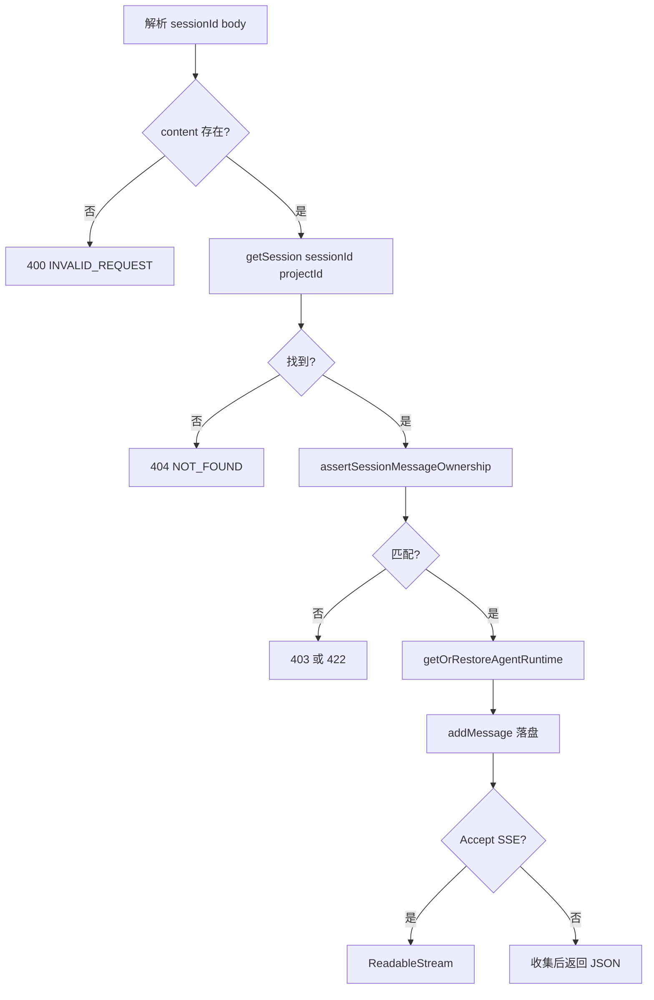

# B08：发送消息前为什么必须先确认归属并恢复运行时

## “点击发送”离模型还很远

用户输入“帮我想三个适合大学生的学习 App 卖点”。消息 route 在调用 Agent 前，要验证内容、找到会话、校验入口归属、恢复 runtime，最后才把用户消息落盘并进入流式或非流式处理。

本章最重要的顺序是：**先用旧会话恢复 runtime，再追加当前新消息。**

## 当前 route 的主干

[packages/web/src/app/api/agent/sessions/[sessionId]/messages/route.ts 第 51—155 行](../../../../packages/web/src/app/api/agent/sessions/[sessionId]/messages/route.ts#L51) 可以压缩为：



图中每个错误出口都在不同责任层：格式、存在性、归属、运行时、持久化和模型处理不可混为一个“发送失败”。

## 所有权不是登录认证

[packages/core/src/lib/integrations/pi-agent/session-restore.ts](../../../../packages/core/src/lib/integrations/pi-agent/session-restore.ts#L1) 的 `assertSessionMessageOwnership` 比较 sessionId、projectId、entryType 和 entryId 等会话归属信息，防止一个入口把消息发进另一个入口的会话。

它保护的是**对象归属一致性**。仅凭这项校验不能声称系统已经完成用户身份认证、租户授权或不可伪造的访问控制。安全术语必须与源码保证相称。

## 为什么恢复发生在 `addMessage` 之前

route 第 113 行的注释给出设计目的：runtime 必须先恢复持久化历史，再提交当前新消息，避免新消息被重复注入。

假设旧会话有 10 条消息，新消息是第 11 条：

### 当前顺序

```text
用 10 条持久历史恢复 runtime
→ 将第 11 条写入 session JSON
→ agent.prompt 处理当前输入
```

### 错误顺序

```text
先把第 11 条写入 session JSON
→ 恢复时把 11 条全灌进 runtime
→ 又把当前输入交给 prompt
```

若恢复实现把第 11 条视为历史，而 prompt 又提交一次，它可能重复出现。顺序本身是合同，需要专门测试，不是代码风格。

## `addMessage` 保存的真实形状

[packages/core/src/lib/features/agent/session-service.ts 第 156—178 行](../../../../packages/core/src/lib/features/agent/session-service.ts#L156) 接收不含 id 与 timestamp 的消息，补 UUID 和 `Date.now()`，push 到 `session.messages`，再保存整个会话。

route 传入 `projectId`，确保读取与写回同一项目目录。若保存返回 null，route 返回 500，不进入模型分支。

因此，当模型稍后失败时，用户消息通常已经落盘。这是一种“输入已接受、处理未完成”的部分成功，UI 不应简单把它当作消息从未发送。

## SSE 与 JSON 从同一准备阶段分叉

route 检查 `Accept` 是否包含 `text/event-stream`。流式分支返回 `ReadableStream`；非流式分支订阅 Agent 事件、累积回复后返回一次 JSON。

相同的会话校验与用户消息持久化位于分叉之前。两条响应路径的最终助手消息、错误和终止语义仍需分别测试，不能因共享前半段就推断完全一致。

## Electron 不是调用这条 HTTP route

[packages/desktop/src/main/services/agent-session-service.ts 第 590—631 行](../../../../packages/desktop/src/main/services/agent-session-service.ts#L590) 为流式 IPC 注册另一条生产入口：

```ts
const session = await agentSessionService.getSession(
  request.sessionId,
  request.projectId,
);
assertSessionMessageOwnership(session, request);
const agent = await agentManager.getOrRestoreAgentRuntime(session);
await agentSessionService.addMessage(request.sessionId, {
  role: request.role || 'user',
  content: request.content,
}, request.projectId);
```

它保留了同样的重要顺序：存在性 → 归属 → runtime 恢复 → 追加新消息。但错误不转换成 HTTP 400/404/403/422，而是返回 `IpcResponse`。后续也不创建 SSE `ReadableStream`，而是通过 `event.sender.send(AGENT_EVENT, payload)` 向 renderer 推事件。

因此，本章的 HTTP 状态表只能用于 Web。Electron 排查需要读取 `success`、`error.code`、主进程日志和对应 IPC 事件；不能在 Electron 控制台里寻找一个并未发生的 403 响应。

## 故障状态表

| 用户现象 | HTTP/服务状态 | 消息是否已落盘 |
| --- | --- | --- |
| 空内容立即失败 | 400 | 否 |
| 会话找不到 | 404 | 否 |
| 所有权不匹配 | 403/422 | 否 |
| runtime 恢复失败 | 500 | 否，恢复在 add 前 |
| addMessage 失败 | 500 | 不可靠 |
| 模型调用失败 | 流内 error 或 500 | 用户消息通常已保存 |

Electron 具有相同的“用户消息可能已保存、回答仍失败”状态，但观察证据不同：启动调用可能已经返回 `success:true, started:true`，后续失败通过 `AGENT_EVENT` 的 error 到达 renderer。传输层结果与后台任务结果必须分开。

这张表是恢复 UI 设计的依据：模型失败后重试时，应先确认已保存的用户消息是否会再次提交。

## 测试证据与缺口

[packages/core/src/lib/integrations/pi-agent/__tests__/session-restore.test.ts](../../../../packages/core/src/lib/integrations/pi-agent/__tests__/session-restore.test.ts#L1) 和 [client-hooks-session-isolation.test.ts](../../../../packages/core/src/lib/integrations/pi-agent/__tests__/client-hooks-session-isolation.test.ts#L1) 分别提供恢复/隔离相关证据。必须逐个断言确认它们是否覆盖 route 的调用顺序，不能只看文件名。

[session-restore.test.ts 第 239—255 行](../../../../packages/core/src/lib/integrations/pi-agent/__tests__/session-restore.test.ts#L239) 的 Given 是请求 entry 与持久化归属不匹配；When 调用 `restoreSessionAtBoundary`；Then 断言在 runtime hydrate 或返回消息正文之前拒绝请求。它证明恢复边界的先后顺序，却没有调用 messages route，也没有断言 `addMessage` 未发生。

仍需要 route 集成测试明确断言：ownership 失败时不 restore、不 add；restore 完成后才 add；add 失败时不 prompt；SSE/JSON 分叉前状态一致。

还需要一组 IPC 合同测试使用相同 Given/When/Then，确认 ownership 失败不会恢复 runtime、不会追加消息、不会启动后台流，并比较 Web 403/422 与 IPC `error.code` 的映射。两端共享函数并不能代替这组边界断言。

## 小实验与口头验收

把 `getOrRestoreAgentRuntime` 与 `addMessage` 的顺序交换，在纸上模拟“服务重启后的第一条新消息”，标出重复注入可能发生在哪。再说明 ownership check 解决的是哪种串会话问题，又不等于哪种用户授权。

合上本页，应能回答：

1. 为什么必须先恢复旧历史，再追加当前消息？
2. ownership 校验保护什么，又不等于什么？
3. Web 的 400、404、403/422、500 分别停在哪一层？
4. Electron 为什么不能用 HTTP 状态码诊断同一问题？
5. 为什么“用户消息已保存”和“Agent 已成功回答”必须作为两个状态处理？

下一章进入 SSE 分支，观察 runtime 事件怎样变成浏览器逐段可见的文本。
