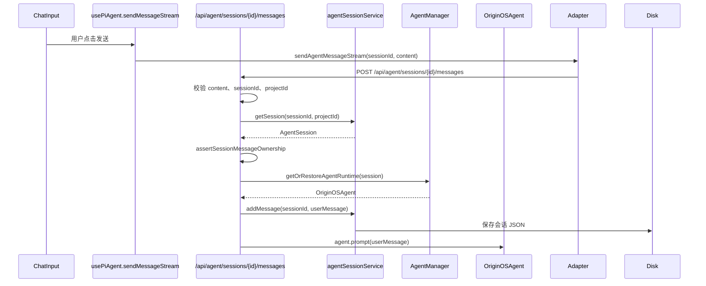

# B08：发送消息不是直接调用模型

## 一个误解

用户在输入框里打了一句「帮我头脑风暴一个学习 App 的卖点」，点击发送。初学者容易以为这句话「直接交给模型」。实际上，在交给模型之前，系统必须做三件事：确认这条消息属于哪个会话、恢复该会话的运行时状态、把消息持久化到磁盘。只有做完这三件事，模型才能基于完整上下文开始生成。

本章追踪：`POST /api/agent/sessions/{id}/messages` 如何处理一次发送请求。

## 调用链



## 消息 API 的入口

[`packages/web/src/app/api/agent/sessions/[sessionId]/messages/route.ts` 第 51—120 行](../../../../packages/web/src/app/api/agent/sessions/[sessionId]/messages/route.ts#L51) 是入口：

```ts
export async function POST(
  _request: NextRequest,
  { params }: { params: Promise<{ sessionId: string }> }
) {
  const { sessionId } = await params;
  const body = await _request.json();
  const projectId = body.projectId;

  if (!body.content) {
    return NextResponse.json({ success: false, error: { code: 'INVALID_REQUEST', message: 'content is required' } }, { status: 400 });
  }

  let session = await agentSessionService.getSession(sessionId, projectId);
  if (!session) {
    return NextResponse.json({ success: false, error: { code: 'NOT_FOUND', message: 'Session not found' } }, { status: 404 });
  }

  try {
    assertSessionMessageOwnership(session, { sessionId, projectId, entryType: body.entryType, entryId: body.entryId });
  } catch (error) {
    const ownershipError = toRestoreAgentSessionError(error);
    return NextResponse.json({ success: false, error: ownershipError }, { status: ownershipError.code === 'OWNERSHIP_MISMATCH' ? 403 : 422 });
  }

  const agent = await agentManager.getOrRestoreAgentRuntime(session);
  session = await agentSessionService.addMessage(sessionId, { role: 'user', content: body.content, ... });
  // ... 进入流式/非流式处理
}
```

这段代码展示了四个关键边界：

1. **请求校验**：`content` 必填。
2. **会话存在性**：找不到会话返回 404。
3. **所有权校验**：`entryType/entryId/projectId` 必须与会话匹配。
4. **运行时恢复**：调用 `agentManager.getOrRestoreAgentRuntime(session)`。

## 所有权校验：防止串会话

[`packages/core/src/lib/integrations/pi-agent/session-restore.ts` 第 262—327 行](../../../../packages/core/src/lib/integrations/pi-agent/session-restore.ts#L262) 的 `assertSessionMessageOwnership` 会检查：

- `sessionId` 是否匹配。
- `projectId` 是否匹配。
- `entryType` 和 `entryId` 是否与会话启动时一致。

这个校验防止一个入口误用另一个入口的会话。例如，不能用 `skill-budget-planner` 的 `projectId` 向 `skill-bmad-brainstorming` 的会话发消息。

## 运行时恢复：为什么必须先恢复再追加消息

[`packages/core/src/lib/integrations/pi-agent/agent-manager.ts` 第 251—277 行](../../../../packages/core/src/lib/integrations/pi-agent/agent-manager.ts#L251) 的 `getOrRestoreAgentRuntime`：

```ts
async getOrRestoreAgentRuntime(session: AgentSession): Promise<OriginOSAgent> {
  const agent = await this.getOrCreateAgent(session.id, session);
  await this.restoreAgentRuntimeOnce(session);
  return agent;
}
```

`OriginOSAgent` 实例可能因长时间未用被清理，或因服务重启而丢失。每次发消息时，必须先从磁盘会话恢复运行时状态，再把新消息追加进去。如果先追加消息再恢复，新消息可能被重复注入或丢失。

## 消息持久化

[`agentSessionService.addMessage` 第 156—178 行](../../../../packages/core/src/lib/features/agent/session-service.ts#L156) 把用户消息追加到会话对象并保存：

```ts
async addMessage(sessionId: string, message: Partial<AgentMessage>): Promise<AgentSession> {
  const session = await this.getSessionOrThrow(sessionId);
  session.messages.push({ ...message, id: uuidv4(), timestamp: new Date().toISOString() } as AgentMessage);
  session.updatedAt = new Date().toISOString();
  await this.saveSession(session);
  return session;
}
```

注意：消息先落盘，再交给模型。这样即使模型调用失败或流式响应中断，用户消息也不会丢失。

## 关键区分：持久化 vs 模型调用

| 步骤 | 是否落盘 | 是否调用模型 |
|------|----------|--------------|
| 校验请求 | 否 | 否 |
| 恢复运行时 | 否 | 否 |
| 追加用户消息 | 是 | 否 |
| 调用 `agent.prompt` | 否 | 是 |
| 保存助手消息 | 是 | 否 |

这条顺序是系统可靠性的基础：用户输入一旦接收，先保存；模型调用失败不会导致消息丢失。

## 失败路径

1. **会话不存在**：返回 404，客户端需要引导用户重新创建会话。
2. **所有权不匹配**：返回 403，通常意味着入口身份被篡改或会话 ID 被误用。
3. **运行时恢复失败**：可能因 LLM 配置无效、工具上下文错误等原因抛出异常。
4. **消息追加成功但模型调用失败**：用户消息已保存，但助手回复为空或报错。

## 测试证据与缺口

- [`packages/core/src/lib/integrations/pi-agent/__tests__/client-hooks-session-isolation.test.ts`](../../../../packages/core/src/lib/integrations/pi-agent/__tests__/client-hooks-session-isolation.test.ts#L1) 覆盖客户端会话隔离。
- 消息 API route 的集成测试目前可能依赖 E2E。

缺口：建议为 `messages/route.ts` 增加集成测试，覆盖 400、404、403、正常流式、非流式响应等分支。

## 练习与口头验收

1. 为什么发消息前必须先 `assertSessionMessageOwnership`？举一个越权场景。
2. 解释「消息先落盘，再交给模型」的顺序为什么重要。
3. 如果 `agentManager.getOrRestoreAgentRuntime` 失败，用户消息是否已保存？为什么？
4. 画出从用户点击发送到 `agent.prompt` 的完整调用链。

合上本页后，应能准确说明：发送消息不是直接调用模型，而是先校验、再恢复运行时、再持久化用户消息、最后才进入模型调用；所有权校验防止不同入口串用会话。

下一章追踪模型回复如何以流式事件一段一段回到窗口。
