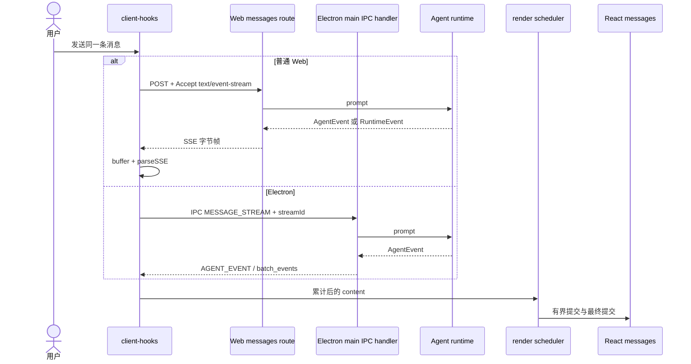

# B09：一段回复怎样经过 SSE 去重与调度进入 React

## Web 客户端不是 `EventSource`，Electron 客户端也不走 SSE

常见误读是把所有流式客户端都想成 `new EventSource(url)`。当前 Web 实现需要 POST 消息正文和身份字段，因此使用 `fetch` 获取 `Response.body`，通过 `ReadableStream` reader 读取字节，再手工解析 SSE。Electron renderer 则调用 IPC，并订阅主进程发送的 `AGENT_EVENT`。两端最后都更新 React 消息，却没有共用同一种传输。

## 一条业务流在平台边界处分成两条传输链



图中的 `alt` 是真实平台分支，不是两个可同时发生的步骤。Web route 内部还会按 runtime worker 与 in-process Agent 分成两座事件桥；Electron main 当前使用自己的订阅和批处理逻辑。scheduler 位于汇流后的 renderer，只控制何时渲染，不决定文本真值。

## Web route 内部再选择两种桥接模式

[messages/route.ts 第 315—330 行](../../../../packages/web/src/app/api/agent/sessions/[sessionId]/messages/route.ts#L315) 检查 Agent 是否带运行中的 `__bridgeProcess`：

- runtime mode 直接拦截 worker `RuntimeEvent`；
- in-process mode 订阅 `OriginOSAgent` 的 `AgentEvent`。

两者最终输出 `StreamMessage`，但事件名与累积方式不同。route 通过适配把 `TOOL_CALL`、`MESSAGE_SENT` 或 `message_update` 等映射为 `tool_start`、`text_delta`、`assistant_message`、`error` 和 `done`。

这两座桥只属于 Web route，不能用来描述 Electron main。Electron 的 [agent-session-service.ts 第 633—672 行](../../../../packages/desktop/src/main/services/agent-session-service.ts#L633) 通过 `event.sender.send` 发 IPC 事件，并用 `StreamEventBatcher` 批量发送高频 `text_delta`；非文本事件先 flush 再单独发送。它没有生成 `data: ...\n\n` 字符串。

## SSE 是有边界的文本帧

服务器用：

```ts
controller.enqueue(
  encoder.encode(`data: ${JSON.stringify(msg)}\n\n`),
);
```

TCP/ReadableStream 的一个 chunk 不保证恰好等于一个 SSE 事件。客户端必须累计 `buffer`，只处理已经出现双换行的完整帧，并把尾部残片留给下一 chunk。把每个 chunk 直接 `JSON.parse` 会在帧被拆开时随机失败。

## 去重不是简单比较相等

[packages/core/src/lib/integrations/pi-agent/stream-dedupe.ts 第 30—50 行](../../../../packages/core/src/lib/integrations/pi-agent/stream-dedupe.ts#L30) 的 `appendStreamDelta` 处理五种关系：空值、完全相等、delta 已是累计全文、长 delta 是 current 的前缀、current 已以 delta 结尾，以及后缀—前缀重叠。

例子：

```text
current = "三个卖点：专注"
delta   = "专注搭子、错题回放"
```

公共重叠“专注”不应重复，结果是“三个卖点：专注搭子、错题回放”。`getVisibleStreamDelta` 同时返回合并后的 `content` 与真正需要发出的新增 `delta`。

[同文件第 210—224 行](../../../../packages/core/src/lib/integrations/pi-agent/stream-dedupe.ts#L210) 的 `reconcileFinalStreamContent` 处理最终完整消息：若 final 是 streamed 的扩展则补尾部；若 streamed 更长则保留；完全无法建立前缀关系时以 final 为准。最终消息是一次权威校正，不是又追加一遍。

## Renderer 怎样拥有一条活动流

[packages/core/src/lib/integrations/pi-agent/client-hooks.ts 第 724—1056 行](../../../../packages/core/src/lib/integrations/pi-agent/client-hooks.ts#L724) 为每次发送生成 `streamId`，并用 `activeStreamIdRef` 判断事件是否仍属于当前流。两端的停止手段不同。

Web 分支使用 `AbortController` 取消 fetch；Electron 分支使用 `streamId` 过滤事件并取消 renderer 订阅。当前 `abort()` 对 AbortController 的调用不会自动终止 Electron main 已经启动的后台 `agent.prompt`。因此，当新流替换旧流或用户停止时：

1. Web 旧 fetch 会收到 abort；Electron 旧订阅会被移除；
2. 两端的 render schedulers 都会 cancel；
3. 即使旧数据稍后到达，`streamId` 和 `isActiveStream()` 会阻止它更新当前消息；
4. 这只能证明旧结果不污染 UI，不能证明服务端或主进程任务已经停止。

取消网络、取消订阅、取消调度、拒绝旧流状态更新和终止后台 Agent 是五个不同动作。

## Scheduler 为什么不是普通 debounce

[packages/core/src/lib/integrations/pi-agent/stream-render-scheduler.ts 第 31—142 行](../../../../packages/core/src/lib/integrations/pi-agent/stream-render-scheduler.ts#L31) 默认间隔 32ms，保留 latestContent 与 renderedContent。`schedule` 逐步提交；`finish` 会把最终剩余内容立即提交并产生非 streaming 的最终状态；`cancel` 停止 timer 并释放等待者。

它解决“文本真值增长很快，但 React 不必每个字节都 commit”。若把它误写成简单节流，就会漏掉 final authoritative commit 和取消后的 waiter 释放。

## 一组事件的完整推演

输入事件：

```text
text_delta: "三个"
text_delta: "三个卖点"
text_delta: "卖点：专注"
assistant_message: "三个卖点：专注、陪伴、复盘"
done
```

逐步结果：

1. “三个”成为初始 content。
2. “三个卖点”被识别为累计全文，结果替换为更长值而非追加。
3. “卖点：专注”与尾部重叠，追加“：专注”。
4. final 以完整助手消息校正尾部。
5. scheduler `finish` 提交最终文本，`done` 清理进度。

## 失败与测试证据

| 故障 | 防线 | 未保证的部分 |
| --- | --- | --- |
| SSE 帧跨 chunk | buffer + 双换行边界 | 服务端永不发送畸形 JSON |
| 累计文本与 delta 混用 | stream-dedupe | 所有语义重复都能识别 |
| 高频 React 更新 | scheduler | 浏览器在所有设备都达 60fps |
| Web 旧流污染新会话 | streamId + fetch abort + active check | Web 服务端任务一定被真正终止 |
| Electron 旧流污染新会话 | streamId + 取消订阅 + active check | 主进程中的 prompt 一定终止 |
| final 与 streamed 冲突 | final reconciliation | final 内容本身一定正确 |

[stream-dedupe.test.ts](../../../../packages/core/src/lib/integrations/pi-agent/__tests__/stream-dedupe.test.ts#L1) 与 [stream-render-scheduler.test.ts](../../../../packages/core/src/lib/integrations/pi-agent/__tests__/stream-render-scheduler.test.ts#L1) 分别证明其断言覆盖的纯函数和调度行为。跨 Web route、fetch、Electron IPC、批处理、取消与 React state 的集成仍需分别建立 Hook/IPC 测试。

[stream-dedupe.test.ts 第 18—25 行](../../../../packages/core/src/lib/integrations/pi-agent/__tests__/stream-dedupe.test.ts#L18) 的 Given 是 current 为 `hello world`、下一帧为累计全文 `hello world again`；When 调用 `getVisibleStreamDelta`；Then 完整 content 是新全文，可见 delta 只有 ` again`。第 39—44 行再证明 final 扩展 streamed 前缀时不会重复。它们没有经过网络 chunk、SSE parser 或 IPC batcher。

## 小实验与口头验收

手工计算 `current='abcXYZ'`、`delta='XYZ123'`，预期得到 `abcXYZ123`；再解释为什么一个网络 chunk 不能直接当作一个 SSE event。最后把“停止 Web 流”和“停止 Electron 流”分别写成动作表。

合上本页，应能回答：

1. Web 为什么使用 fetch reader 而不是 EventSource？
2. Electron 为什么没有 SSE 字节解析阶段？
3. Web route 的两座 bridge 与平台的 Web/Electron 分支为什么不是同一层分支？
4. 去重、最终校正和渲染调度分别拥有哪部分责任？
5. 为什么旧流不再更新 UI，仍不能证明后台 Agent 已经终止？

下一章回到窗口关闭动作，区分 UI 生命周期、runtime 生命周期和持久化会话生命周期。
