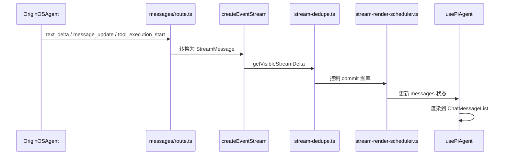

# B09：流式回复怎样一段一段出现在窗口

## 为什么不是一次性 JSON

模型生成回复时，一个字一个字地"想"出来。如果等模型全部想完再返回一个完整 JSON，用户会看到长时间空白，然后突然跳出一大段文字。流式响应（SSE / IPC 事件流）让模型每生成一小段就推送到前端，前端再逐段更新界面。

但这带来工程问题：同一段文本可能被重复推送、事件可能乱序、高频更新会拖慢 React、用户可能中途取消。本章看 OriginOS 如何处理这些问题。

## 调用链



## API route 中的事件桥接

[`packages/web/src/app/api/agent/sessions/[sessionId]/messages/route.ts` 第 315—330 行](../../../../packages/web/src/app/api/agent/sessions/[sessionId]/messages/route.ts#L315) 根据运行环境选择桥接方式：

```ts
function createEventStream(agent: OriginOSAgent, session: AgentSession, body: unknown) {
  const bridgeProcess = body.__bridgeProcess;
  if (bridgeProcess) {
    return createRuntimeEventStream(agent, session, body);
  }
  return createInProcessEventStream(agent, session, body);
}
```

- **In-process 模式**：`OriginOSAgent` 与 API route 在同一个 Node 进程内，直接订阅 `agent.subscribe`。
- **Runtime 模式**：通过 `__bridgeProcess` 与独立 Agent 进程通信，覆盖 `process.eventHandler` 拦截事件。

两种模式的事件来源和累积方式不同，但最终都输出同一种 `StreamMessage` 给客户端。

## 事件类型

[`messages/route.ts` 第 29—40 行](../../../../packages/web/src/app/api/agent/sessions/[sessionId]/messages/route.ts#L29) 定义了 `StreamMessage` 类型：

```ts
interface StreamMessage {
  type:
    | 'user_message'
    | 'assistant_message'
    | 'message_delta'
    | 'text_delta'
    | 'status'
    | 'error'
    | 'done'
    | 'tool_start'
    | 'tool_end';
  data: unknown;
}
```

客户端最常用的是 `text_delta`（新增文本片段）和 `assistant_message`（完整助手消息）。`tool_start` / `tool_end` 表示工具调用边界，`done` 表示流结束。

## 去重：防止重复文本变成"真理"

[`packages/core/src/lib/integrations/pi-agent/stream-dedupe.ts` 第 42—80 行](../../../../packages/core/src/lib/integrations/pi-agent/stream-dedupe.ts#L42) 的 `getVisibleStreamDelta` 计算两次事件之间的可见差异：

```ts
export function getVisibleStreamDelta(
  previous: string | undefined,
  current: string
): { text: string; isDuplicate: boolean } {
  // 如果 current 以 previous 开头，只返回新增部分
  // 否则返回完整 current 并标记可能重复
}
```

为什么需要这个？因为上游可能同时发送 `text_delta` 和 `message_update`，两者携带的累计文本可能重叠。如果不做去重，同一段话会在界面上出现两次，用户会误以为模型说了两遍。

[`reconcileFinalStreamContent` 第 210—224 行](../../../../packages/core/src/lib/integrations/pi-agent/stream-dedupe.ts#L210) 在流结束时做最终 reconciling，确保客户端保存的助手消息与服务器端一致。

## 渲染调度：限制 React commit 频率

[`packages/core/src/lib/integrations/pi-agent/stream-render-scheduler.ts` 第 31—100 行](../../../../packages/core/src/lib/integrations/pi-agent/stream-render-scheduler.ts#L31) 控制界面更新频率。模型可能每秒产生几十个 `text_delta`，如果每个都触发 React re-render，长消息会严重掉帧。

调度器通常采用"批处理 + 节流"策略：在一定时间窗口内合并多个 delta，然后统一更新一次状态。这样用户看到流畅的打字效果，而 React 不会被压垮。

## 客户端处理

[`packages/core/src/lib/integrations/pi-agent/client-hooks.ts` 第 868—999 行](../../../../packages/core/src/lib/integrations/pi-agent/client-hooks.ts#L868) 的 SSE 解析与消息更新：

```ts
const eventSource = new EventSource(url);
eventSource.onmessage = (event) => {
  const message = JSON.parse(event.data) as StreamMessage;
  switch (message.type) {
    case 'text_delta':
      appendTextDelta(message.data as string);
      break;
    case 'assistant_message':
      setAssistantMessage(message.data as AgentMessage);
      break;
    case 'tool_start':
      setActiveTool(message.data as string);
      break;
    case 'done':
      eventSource.close();
      break;
    case 'error':
      setErrorMessage(message.data as string);
      break;
  }
};
```

注意 abort 逻辑：如果用户中途取消发送，`usePiAgent` 会调用 `abortControllerRef.current.abort()`，然后丢弃旧流后续事件。第 511—596 行的 `sendMessage` 处理了这个边界。

## 关键区分：SSE 事件 vs JSON 响应

| 特性 | 非流式 JSON | 流式 SSE |
|------|-------------|----------|
| 响应格式 | 一个完整 JSON | 多个 `data:` 行 |
| 用户体验 | 长时间空白后突然显示 | 逐字显示 |
| 取消支持 | 请求发出后难取消 | 可 abort EventSource |
| 错误处理 | 一次性返回错误 | 可在流中间返回 `error` 事件 |
| 实现复杂度 | 低 | 高（去重、调度、状态合并） |

## 失败路径

1. **同一文本被重复推送**：`stream-dedupe` 负责识别并丢弃重复部分。
2. **高频更新导致卡顿**：`stream-render-scheduler` 通过节流缓解。
3. **用户中途取消后旧事件仍到达**：`usePiAgent` 通过 `abortControllerRef` 和 guard 丢弃旧流事件。
4. **流结束但没有 `assistant_message`**：API route 会兜底读取 `agent.getSessionState().messages` 最后一条助手消息。

## 测试证据与缺口

- [`packages/core/src/lib/integrations/pi-agent/__tests__/stream-dedupe.test.ts`](../../../../packages/core/src/lib/integrations/pi-agent/__tests__/stream-dedupe.test.ts#L1) 覆盖流式去重。
- [`packages/core/src/lib/integrations/pi-agent/__tests__/stream-render-scheduler.test.ts`](../../../../packages/core/src/lib/integrations/pi-agent/__tests__/stream-render-scheduler.test.ts#L1) 覆盖渲染调度。

缺口：目前没有直接测试覆盖「用户 abort 后旧流事件被丢弃」和「两条桥接模式输出一致」的集成场景。

## 练习与口头验收

1. 用纸面事件序列模拟：模型先发送 `"Hello"`，再发送 `"Hello world"`，`getVisibleStreamDelta` 应该返回什么？
2. 为什么流式响应需要 `stream-render-scheduler`？没有它会出现什么问题？
3. 用户中途取消后，`usePiAgent` 如何防止旧流事件继续更新界面？
4. 比较 in-process 模式与 runtime 模式的事件来源差异。

合上本页后，应能准确说明：流式回复不是单一 JSON，而是一系列 SSE/IPC 事件；事件需要经过桥接、去重、调度后才更新 UI；取消操作需要正确丢弃旧流事件。

下一章看窗口关闭时会发生什么，以及为什么关闭窗口不等于删除会话。
