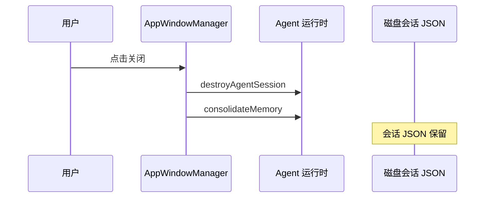

# B10：窗口关闭不等于会话删除

## 一个常见误解

用户点击窗口右上角关闭按钮，窗口消失了。很多人会以为「这次对话没了」。但在 OriginOS 中，窗口只是运行时生命周期的容器；窗口关闭时，系统会清理内存中的 Agent 实例并整理记忆，但会话 JSON 文件仍然保留在磁盘上。下次打开同一 Skill 时，历史会话仍然可以恢复。

本章回答：关闭窗口时为什么会触发 `destroyAgentSession` 和 `consolidateMemory`，以及它们与会话持久化的关系。

## 关闭回调的注入位置

关闭窗口时，系统会同时做两件事：清理运行时实例、整理长期记忆。但会话 JSON 文件保留。



[`packages/web/src/services/AppWindowManager.ts` 第 31—54 行](../../../../packages/web/src/services/AppWindowManager.ts#L31) 在打开窗口时注入 `onClose`：

```ts
if (entryType && entryId && MEMORY_ENTRY_TYPES.has(entryType)) {
  const originalOnClose = config.onClose;
  config = {
    ...config,
    onClose: () => {
      originalOnClose?.();
      destroyAgentSession({ sessionId, projectId }).catch((err) => console.error('[AppWindowManager] agent destroy failed:', err));
      consolidateMemory(entryType, entryId).catch((err) => console.error('[AppWindowManager] memory consolidation failed:', err));
    },
  };
}
```

这里的关键是 `MEMORY_ENTRY_TYPES = new Set(['role-agent', 'agent', 'project', 'solution', 'skill'])`。只有这些入口类型的窗口才会在关闭时触发清理。 `entryType: 'skill'` 的「头脑风暴」窗口当然在其中。

## destroyAgentSession 清理什么

[`packages/core/src/lib/integrations/electron/services/agent-session.ts` 第 132—145 行](../../../../packages/core/src/lib/integrations/electron/services/agent-session.ts#L132) 的 `destroyAgentSession`：

```ts
export async function destroyAgentSession(params: { sessionId?: string; projectId?: string }): Promise<void> {
  if (isElectron()) {
    return window.ipcRenderer.invoke(IPC_CHANNELS.AGENT_SESSION_DESTROY, params);
  }
  const response = await fetch('/api/agent/sessions/destroy', {
    method: 'POST',
    headers: { 'Content-Type': 'application/json' },
    body: JSON.stringify(params),
  });
  return response.json();
}
```

它最终调用 `AgentManager` 的清理逻辑，移除缓存的 `OriginOSAgent` 实例。注意：它**不删除** `agentSessionService` 保存的会话 JSON 文件。

[`packages/core/src/lib/integrations/pi-agent/agent-manager.ts` 第 525—557 行](../../../../packages/core/src/lib/integrations/pi-agent/agent-manager.ts#L525) 的 `removeAgent` / `finalizeAndRemoveAgent` 会：

1. 停止订阅事件。
2. 清理工具上下文。
3. 从缓存中移除实例。

## consolidateMemory 整理什么

`consolidateMemory` 是 fire-and-forget 的记忆整理操作。它会：

1. 读取本次会话的实践日志（`practice/` 下的 turn 记录）。
2. 提取需要长期保存的记忆片段。
3. 更新 `Memory.md` 或认知文件。

这个操作失败时只打日志，不会阻止窗口关闭。因为它属于"最好成功但不阻塞 UI"的后台任务。

## 会话 JSON 为什么保留

[`packages/core/src/lib/features/agent/session-service.ts` 第 88—100 行](../../../../packages/core/src/lib/features/agent/session-service.ts#L88) 的 `saveSession` 在每次消息追加时都会写入磁盘。窗口关闭不调用 `deleteSession`，因此文件保留。

```ts
async saveSession(session: AgentSession): Promise<void> {
  const filePath = this.getSessionFilePath(session.id, session.projectId);
  await this.jsonStore.write(filePath, session);
}
```

保留会话文件的原因：

1. **恢复历史**：下次打开同一 Skill 时，`SkillDialog` 可以列出历史会话。
2. **审计**：用户可以回看完整对话。
3. **多窗口共享**：同一项目可能有多个窗口引用同一会话范围。

## 关键区分：运行时销毁 vs 持久化删除

| 操作 | 影响 | 不影响 |
|------|------|--------|
| 关闭窗口 | 触发 `onClose`，清理 Agent 运行时实例 | 不删除会话 JSON |
| `destroyAgentSession` | 移除缓存的 `OriginOSAgent` | 不删除会话 JSON |
| `consolidateMemory` | 更新长期记忆文件 | 不删除会话 JSON |
| `deleteSession` | 删除磁盘上的会话 JSON | 只在显式调用时发生 |

## 失败路径

1. **`destroyAgentSession` 失败**：只打日志，窗口仍然关闭，可能导致运行时实例泄漏。
2. **`consolidateMemory` 失败**：只打日志，记忆整理未完成，但用户无感知。
3. **窗口关闭后误以为会话被删除**：实际上 JSON 仍在，可以恢复。
4. **非 `MEMORY_ENTRY_TYPES` 的窗口关闭**：不触发任何清理，如果该窗口也持有 Agent 资源，可能泄漏。

## 测试证据与缺口

- `AppWindowManager` 的关闭回调注入目前没有直接单元测试。
- `destroyAgentSession` 和 `consolidateMemory` 的集成测试需要模拟窗口关闭场景。

缺口：建议为 `AppWindowManager.openWindow` 增加测试，验证 `MEMORY_ENTRY_TYPES` 内的窗口关闭时是否正确注入清理回调；并验证清理失败时窗口仍能关闭。

## 练习与口头验收

1. 关闭「头脑风暴」窗口后，磁盘上的会话 JSON 是否还在？为什么？
2. `destroyAgentSession` 和 `deleteSession` 有什么区别？
3. 如果 `consolidateMemory` 失败，用户会感知到什么？为什么这样设计？
4. 打开 [`AppWindowManager.ts`](../../../../packages/web/src/services/AppWindowManager.ts#L14)，说明 `MEMORY_ENTRY_TYPES` 包含哪些类型；如果某窗口 `entryType` 不在集合中，关闭时会跳过哪些回调。

合上本页后，应能准确说明：关闭窗口触发 `destroyAgentSession`（清理运行时实例）和 `consolidateMemory`（整理记忆），但都不删除持久化会话 JSON；会话文件保留是为了恢复历史、审计和共享。

下一章追踪 Agent 调用工具时，产物和会话分别落在哪里。
