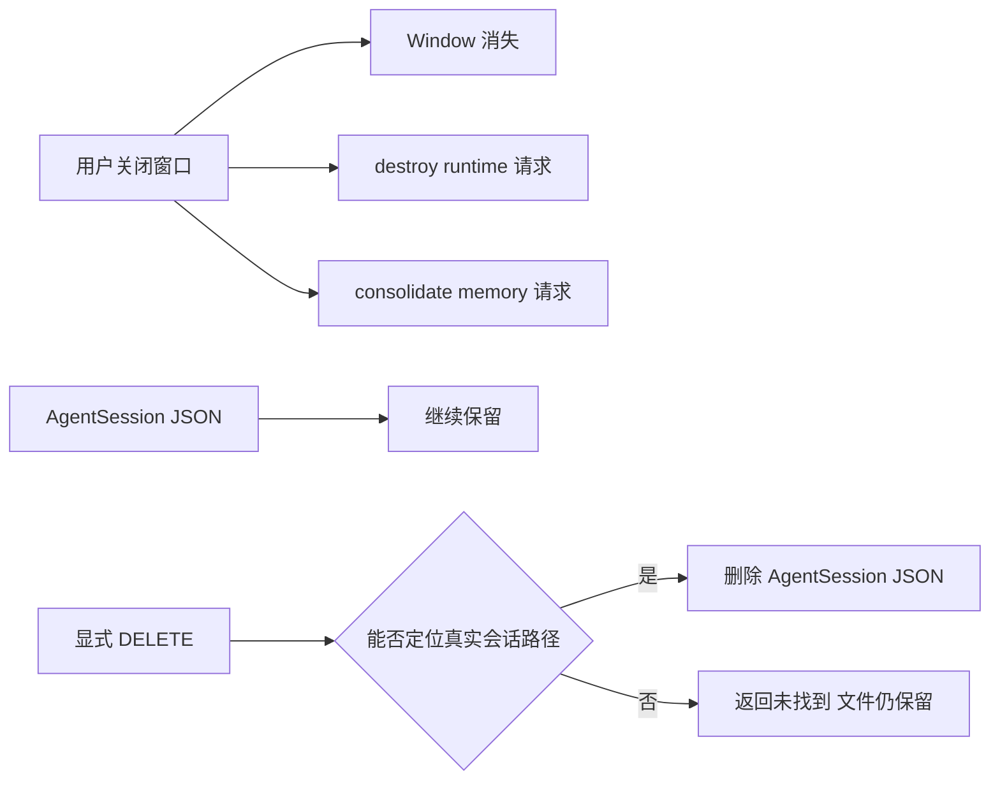

# B10：关闭窗口、销毁运行时和删除会话是三件事

## 用户只做了一次关闭，系统却处理三种生命周期

“头脑风暴”窗口消失，只能直接证明 UI 窗口已关闭。`AppWindowManager` 还会请求销毁 Agent runtime 和整理记忆；持久化会话 JSON 则继续保留，除非用户显式调用删除会话接口。

## 三种对象与三种终止动作

| 对象 | 终止动作 | 典型结果 |
| --- | --- | --- |
| Window | `closeWindow` / store close | 界面不再显示 |
| Agent runtime / worker | `destroyAgentSession` | 内存实例或子进程释放 |
| AgentSession 文件 | `deleteAgentSession` / DELETE route | 持久历史移除 |

三者可能使用相关 id，却不共享同一生命周期。

最后一行描述的是删除动作的目标语义，不保证当前所有项目范围都能被正确定位。后文会看到，现有 DELETE 合同只传 sessionId，而 Core 的项目会话路径还需要 projectId；对 Skill 的项目范围会话，这是一项真实缺口。

## 关闭回调从打开时就被注入

[packages/web/src/services/AppWindowManager.ts 第 31—54 行](../../../../packages/web/src/services/AppWindowManager.ts#L31) 在 `entryType='skill'` 时包装 `onClose`。关闭时执行原回调，再分别调用：

```ts
destroyAgentSession({ sessionId, projectId }).catch(...);
consolidateMemory(entryType, entryId).catch(...);
```

两个 Promise 都没有被等待。窗口关闭与后台收尾不是事务：窗口成功消失后，runtime 清理或记忆整理仍可能失败。

## destroy adapter 不调用 DELETE

[packages/core/src/lib/integrations/electron/services/agent-session.ts 第 130—146 行](../../../../packages/core/src/lib/integrations/electron/services/agent-session.ts#L130) 的 Web 路径发 `POST /api/agent/sessions/destroy`。同文件更早的删除会话函数才发 `DELETE /api/agent/sessions/{sessionId}`。

HTTP method 和 route 已经给出明确语义：destroy 面向运行实例；DELETE 面向持久数据。

## destroy route 为什么要尝试多个身份

[packages/web/src/app/api/agent/sessions/destroy/route.ts 第 21—105 行](../../../../packages/web/src/app/api/agent/sessions/destroy/route.ts#L21) 同时支持 runtime mode 与 in-process mode。

### Runtime mode

1. 优先按 sessionId 在 global spawner 查 worker；
2. 若窗口传的是稳定 Skill id，而真实 worker 使用 UUID，则按 projectId 列最近会话再找 UUID；
3. 最后遍历进程并对 id 做包含匹配；
4. 找不到也返回 200，只把 `agentDestroyed` 设为 false。

### In-process mode

1. 直接 `finalizeAndRemoveAgent(sessionId)`；
2. 必要时从会话或 projectId 反查 Agent entry；
3. 找不到仍返回成功响应和 false。

包含匹配是兼容兜底，不应描述成严格身份匹配。若多个进程 id 共享子串，它存在误选风险；真正的改进方向是稳定传递真实 runtime id，而不是夸大当前保证。

## Electron destroy 是另一套定位实现

[packages/desktop/src/main/services/agent-session-service.ts 第 280—324 行](../../../../packages/desktop/src/main/services/agent-session-service.ts#L280) 没有调用 Web destroy route。它先按 sessionId 调用 `finalizeAndRemoveAgent`，失败后从会话反查 projectId，再遍历 AgentManager stats 做精确 projectId 比较，最后才用请求中的 projectId 重试。

与 Web route 相比，Desktop handler 没有 global runtime spawner 的 worker 查找，也没有进程 id 子串匹配。两端都可能返回 `success:true` 和 `agentDestroyed:false`，但内部查找集合与风险不同。测试 Web 模糊匹配不能替代 Desktop projectId 回退测试。

## DELETE 当前为什么可能找不到 Skill 项目会话

[packages/web/src/app/api/agent/sessions/[sessionId]/route.ts 第 159—192 行](../../../../packages/web/src/app/api/agent/sessions/[sessionId]/route.ts#L159) 只从路径取得 sessionId：

```ts
const { sessionId } = await params;
const deleted = await agentSessionService.deleteSession(sessionId);
```

而 [session-service.ts 第 183—184 行](../../../../packages/core/src/lib/features/agent/session-service.ts#L183) 只有收到 projectId 才能构造项目会话路径。Skill 会话通常保存在 `projects/skill-bmad-brainstorming/sessions/{id}.json`；DELETE 没有 projectId 时会尝试全局 session 路径，可能返回 404，即使项目目录中的文件仍存在。

Desktop 的 delete handler 也只接收 sessionId。因此准确结论不是“显式 DELETE 一定删除 Skill 历史”，而是“删除 API 的目标是持久会话，但当前项目范围定位合同不完整”。这需要修复 DTO/route/IPC，并增加项目会话删除测试。

## 图解：关闭后的分叉不是一条删除线



窗口关闭没有指向 JSON 删除。记忆整理也不等于保存当前会话；会话消息在 B08/B09 的持久化步骤中已经处理。

## 四种结果的用户解释

| 结果 | 窗口 | runtime | 会话 JSON |
| --- | --- | --- | --- |
| 正常关闭与销毁 | 关闭 | 移除 | 保留 |
| 没找到 runtime | 关闭 | 原本不存在或定位失败 | 保留 |
| destroy 抛错 | 关闭 | 可能残留 | 保留 |
| 显式删除全局会话且路径命中 | 可开可关 | 不由 DELETE 自动代表 | 删除 |
| 显式删除项目会话但未传 projectId | 可开可关 | 不由 DELETE 自动代表 | 可能仍保留并返回未找到 |

`agentDestroyed: false` 不必然是错误：runtime 可能已被清理或从未创建。是否需要告警取决于调用场景和观测数据。

## 测试证据与缺口

当前需要分别验证窗口回调注入、destroy route 两种模式、找不到 runtime 的幂等语义、DELETE 的持久化效果。任何一个测试都不能单独证明三类生命周期完全一致。

特别应补的边界是模糊匹配：构造两个相似进程 id，验证不会销毁错误目标；若当前行为无法保证，应把风险写进实现与测试，而不是只在教材中提醒。

还应补项目会话删除用例：Given 会话位于 `projects/{projectId}/sessions`；When 只传 sessionId 调用当前 Web/IPC delete；Then 记录当前未命中的行为；修复合同后再断言带 projectId 可以删除正确文件且不会误删同名全局会话。

## 小实验与口头验收

给出“窗口关闭后历史仍能恢复”的现象，解释它为什么是预期行为；再给出“关闭后后台 worker 仍占资源”，列出要查的 request、response 中 `agentDestroyed` 与服务端日志。

合上本页，应能回答：

1. close、destroy、consolidate、delete 分别作用于什么对象？
2. 为什么单窗 close 与 `closeAllWindows` 当前没有相同回调语义？
3. Web 与 Desktop destroy 分别怎样回退定位 runtime？
4. 为什么 200 或 `success:true` 加 `agentDestroyed:false` 不一定是错误？
5. 为什么当前 DELETE 不能保证删除项目范围内的 Skill 会话？

下一章查看同一次工作留下的三类磁盘痕迹，以及工具路径边界真实保护到哪里。
