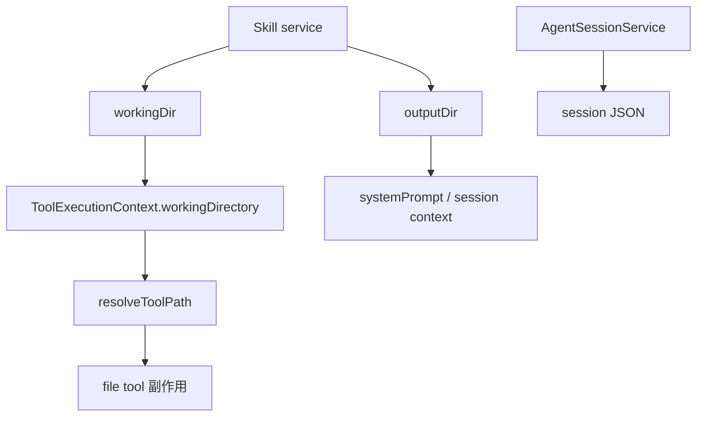

# B11：会话、产物与认知文件为什么不能混成一个“保存结果”

## 一次头脑风暴会留下不同用途的痕迹

用户看到回答后，系统可能留下会话 JSON、Markdown 产物和 Memory/practice 文件。它们的写入者、路径基准和生命周期不同。模型说“已经保存”不是证据；工具成功回执和磁盘状态才是副作用证据。

## 三类痕迹

| 类型 | 典型位置 | 写入者 | 生命周期 |
| --- | --- | --- | --- |
| 会话 | `data/projects/{projectId}/sessions/{sessionId}.json` | `AgentSessionService` + JsonStore | 跟随会话 |
| Skill 产物 | `data/skills/{skillCode}/...` 或配置目标 | file/bash 工具 | 跟随工作成果 |
| 认知材料 | working directory 下的 Memory/practice 等 | cognitive/memory 生命周期 | 跟随 Agent/项目实践 |

它们可能位于相邻目录，但不能因“都在 data 下”而互相替代。

## 工具层只接收一个路径概念

[packages/core/src/lib/integrations/pi-agent/tools/context.ts 第 1—23 行](../../../../packages/core/src/lib/integrations/pi-agent/tools/context.ts#L1) 明确设计原则：工具层不关心 Agent、Skill、Project 等平台概念，只接收 `sessionId?` 与 `workingDirectory?`。

当前 `ToolExecutionContext` 没有 `outputDirectory` 字段。`outputDir` 会被写入会话上下文并进入提示词，但 file tools 的基础路径由上游解析后的 `workingDirectory` 注入。工具不会自动把每个相对文件名重定向到 outputDir。

[packages/core/src/lib/integrations/pi-agent/agent-manager.ts 第 138—169 行](../../../../packages/core/src/lib/integrations/pi-agent/agent-manager.ts#L138) 创建并注册这个 context。恢复会话时也从 `projectContext.currentPath` 重新注入，保证 runtime 重建后工具仍有路径基准。

## 路径解析实际保护什么

[packages/core/src/lib/integrations/pi-agent/tools/path-utils.ts 第 54—130 行](../../../../packages/core/src/lib/integrations/pi-agent/tools/path-utils.ts#L54) 的 `resolveToolPath`：

1. 没有 workingDirectory 就拒绝执行；
2. `data` 与 `data/...` 映射到当前 data root，并检查词法范围；
3. Skill runtime 下兼容 `agents/...`、`skills/...` 映射到 data root；
4. 原生绝对路径必须位于 working boundary 或 data root；
5. Windows 绝对路径在当前非 Windows 解析分支被拒绝；
6. 普通相对路径以 workingDirectory 解析，并拒绝 `..` 逃逸。

这里的 `isInsidePath` 使用 `path.relative` 做**词法/规范化路径检查**。它没有在这一函数中调用 `realpath` 检查 symlink 最终目标，也不构成操作系统级 sandbox。准确说法是：它限制解析后的路径字符串落在允许边界；真实文件系统链接与 OS 权限仍是额外边界。

普通相对路径的决定性代码可以压缩为：

```ts
const absolutePath = path.resolve(workingDirectory, rawPath);
if (!isInsidePath(absolutePath, workingDirectory)) {
  throw new Error('Path escapes working directory');
}
return { absolutePath, ... };
```

`path.resolve` 会消解 `..`，所以 `../x.md` 在比较前已经成为父目录的规范化字符串；`isInsidePath` 随后拒绝它。但若 workingDirectory 内存在指向外部的 symlink，字符串仍可能位于边界内，真实目标却在外部。这正是词法检查与 realpath 检查的差别。

## 图解：提示目录、执行基准和持久化路径



`outputDir → prompt/session context` 与 `workingDir → tool context` 是不同箭头。二者可能同值，但职责仍不同。

## 会话路径与 DataFile 包装

[packages/core/src/lib/features/agent/session-service.ts 第 88—112 行](../../../../packages/core/src/lib/features/agent/session-service.ts#L88) 根据 `projectContext.projectId` 选择项目会话路径，调用 JsonStore。读取返回 `sessionData?.data`，说明磁盘根对象由 JsonStore 包装。

对 Skill：

```text
projectId = skill-bmad-brainstorming
sessionId = <当前 UUID 或稳定 id>
路径 = data/projects/skill-bmad-brainstorming/sessions/{sessionId}.json
```

不能一概写成固定 `skill-bmad-brainstorming.json`，因为当前 `SkillDialog` 默认会生成 UUID，历史会话也拥有各自 id。

## 一条写文件请求的推演

假设 workingDirectory 是 `data/skills/bmad-brainstorming`，模型调用：

```json
{
  "filePath": "results/ideas.md",
  "content": "# 三个卖点"
}
```

`resolveToolPath` 把相对路径解析到 workingDirectory 下的 `results/ideas.md`。若传 `../outside.md`，规范化结果不在 boundary 内，函数抛错。若传 `data/agents/demo/file.md`，它会按 data root 规则解析；这是一条显式跨到 data 根内其他区域的能力，不应误写成“只能写当前 Skill 文件夹”。

## 副作用证据层级

1. 模型文本“我已保存”：只有陈述。
2. 产生 `write_file` tool call：只有意图与请求。
3. tool result `success: true`：工具层成功证据。
4. 重新读取文件：结果可复查证据。
5. 重启后仍存在：持久化与路径选择证据。

教材在说明“已保存”时至少应看到第 3 层；若要求验证内容，则应到第 4 层。

## 测试证据与缺口

[packages/core/src/lib/integrations/pi-agent/tools/__tests__/working-directory.test.ts](../../../../packages/core/src/lib/integrations/pi-agent/tools/__tests__/working-directory.test.ts#L1) 明确测试工具只收到 workingDirectory、系统 Skill 路径、Windows 字符串和 file tool 基准等合同。它不能证明 symlink 不越界，也不能证明每个 Tool 都正确使用 resolver。

[该测试第 334—355 行](../../../../packages/core/src/lib/integrations/pi-agent/tools/__tests__/working-directory.test.ts#L334) 的 Given 是注入 `workingDirectory=testDir`；When `write_file` 写入相对路径 `solutions/agents/new-role-agent/Agent.md`；Then 文件只出现在 testDir 下的完整相对位置，错误的短路径不存在。它证明 file tool 使用注入基准，不证明 outputDir 自动参与，也没有覆盖 symlink 最终目标。

需要将 file-tools、path-utils、bash-tools 与真实临时目录分别测试，并把 data-root 例外、绝对路径、`..`、symlink 和权限失败分开。

## 小实验与口头验收

给定 workingDirectory `/data/skills/demo`，分别推导 `notes.md`、`../x.md`、`data/agents/a/x.md` 的处理。再说明为什么 outputDir 出现在 prompt 中不能推出 file tool 自动重定向。

合上本页，应能回答：

1. 会话、Skill 产物和认知材料分别由谁写入？
2. ToolExecutionContext 当前有哪些字段，为什么没有 outputDirectory？
3. `../x.md` 为什么会被词法边界拒绝？
4. 词法路径检查为什么不能证明 symlink 与 OS sandbox 安全？
5. 模型文本、tool call、tool result、重新读取和重启后存在分别属于什么证据等级？

下一章把 Part B 整条链重新压缩成正向执行与反向排错两张地图。
