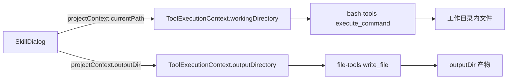

# B11：产物和会话在哪里留下痕迹

## Agent 不只是"说话"

当用户让「头脑风暴」Skill 生成创业想法时，Agent 可能会写出一个 Markdown 文件保存结果。这个结果不是存在浏览器的内存里，也不是存在 Skill 源目录中，而是落在 `outputDir` 指定的位置。同时，整个对话历史也被保存到会话 JSON 中。

本章追踪：Agent 运行时的产物和会话状态分别写到哪里，以及工具如何知道该往哪里写。

## 工具执行上下文的来源

Agent 写文件时，路径不是由 Agent 自己决定的，而是由会话创建时传入的 `projectContext` 决定。



[`packages/core/src/lib/integrations/pi-agent/agent-manager.ts` 第 138—170 行](../../../../packages/core/src/lib/integrations/pi-agent/agent-manager.ts#L138) 在创建 Agent 时设置工具上下文：

```ts
setToolContext(sessionId, {
  workingDirectory: projectContext.currentPath || getDataRoot(),
  outputDirectory: projectContext.outputDir,
  projectId,
  entryType,
  entryId,
});
```

这个上下文来自 `SkillDialog` 初始化时传入的 `projectContext.currentPath` 和 `outputDir`。也就是说，工作目录和输出目录不是 Agent 自己决定的，而是在会话创建时就由 UI 层协商好的。

[`packages/core/src/lib/integrations/pi-agent/tools/context.ts` 第 12—73 行](../../../../packages/core/src/lib/integrations/pi-agent/tools/context.ts#L12) 定义了 `ToolExecutionContext`：

```ts
interface ToolExecutionContext {
  workingDirectory: string;
  outputDirectory?: string;
  projectId?: string;
  entryType?: string;
  entryId?: string;
}
```

工具在执行前会读取这个上下文，确保文件操作发生在允许范围内。

## 文件工具的路径约束

[`packages/core/src/lib/integrations/pi-agent/tools/file-tools.ts` 第 277—340 行](../../../../packages/core/src/lib/integrations/pi-agent/tools/file-tools.ts#L277) 的 `write_file` 工具：

```ts
async execute({ filePath, content }) {
  const context = getToolContext(this.sessionId);
  const resolvedPath = resolveToolPath(filePath, context.workingDirectory);
  // 边界检查：resolvedPath 必须在 workingDirectory 或 dataRoot 内
  await fs.writeFile(resolvedPath, content);
  // 格式校验
  return { success: true, ... };
}
```

[`path-utils.ts` 第 54—130 行](../../../../packages/core/src/lib/integrations/pi-agent/tools/path-utils.ts#L54) 的 `resolveToolPath` 会：

1. 如果路径是相对路径，基于 `workingDirectory` 解析。
2. 如果路径以 `data/...` 开头，映射到 `getDataRoot()`。
3. 如果路径是绝对路径，必须位于 boundary 或 dataRoot 内，否则拒绝。

这意味着 Agent 不能随意写系统的任意位置。

## Bash 工具的工作目录

[`packages/core/src/lib/integrations/pi-agent/tools/bash-tools.ts` 第 551—600 行](../../../../packages/core/src/lib/integrations/pi-agent/tools/bash-tools.ts#L551) 的 `execute_command` 工具：

```ts
async execute({ command, workingDirectory }) {
  const context = getToolContext(this.sessionId);
  const cwd = workingDirectory || context.workingDirectory;
  // 安全黑名单检查
  // 执行命令，超时默认 30s，最大 5min
}
```

Shell 命令的 CWD 默认使用工具上下文中的 `workingDirectory`。如果 Agent 在 prompt 中被告知 "All bash commands are resolved from working directory"，它就不会误用其他目录。

## 产物输出目录

当 Agent 需要创建产物文件时，应该优先使用 `outputDirectory`。 [`file-tools.ts`](../../../../packages/core/src/lib/integrations/pi-agent/tools/file-tools.ts#L277) 的 `write_file` 允许传入 `filePath`，工具会把它解析到工作目录内。如果 Agent 想明确把产物放到输出目录，可以在 prompt 中通过 `${OUTPUT_DIR}` 变量获取原生绝对路径。

对于 bundled Skill `bmad-brainstorming`，`outputDir` 通常与 `workingDir` 相同，都是 `data/skills/bmad-brainstorming`。因此产物会保存在该目录下，例如 `data/skills/bmad-brainstorming/brainstorm-result.md`。

## 会话 JSON 的保存位置

[`packages/core/src/lib/features/agent/session-service.ts` 第 27—29 行](../../../../packages/core/src/lib/features/agent/session-service.ts#L27) 定义了路径规则：

```ts
private getSessionFilePath(sessionId: string, projectId?: string): string {
  if (projectId) {
    return path.join('projects', projectId, 'sessions', `${sessionId}.json`);
  }
  return path.join('sessions', `${sessionId}.json`);
}
```

对于 Skill 会话，`projectId` 是 `skill-${skillName}`，因此会话文件保存在 `data/projects/skill-bmad-brainstorming/sessions/skill-bmad-brainstorming.json`。

## 双重痕迹

一次完整的 Skill 交互会在磁盘留下两类文件：

| 类型 | 典型路径 | 用途 |
|------|----------|------|
| 会话 JSON | `data/projects/{projectId}/sessions/{sessionId}.json` | 保存对话历史、配置、项目上下文 |
| 产物文件 | `data/skills/{skillName}/` 或 frontmatter 指定目录 | 保存 Agent 生成的文件 |
| 认知文件 | `{workingDir}/Memory.md`、`{workingDir}/practice/` | 保存长期记忆和实践日志 |

这三类文件的生命周期不同：会话 JSON 跟随会话；产物文件跟随项目/Skill；认知文件跟随 Agent/项目，会被定期整理。

## 失败路径

1. **工具写出边界外**：`resolveToolPath` 会拒绝超出 `workingDirectory` 或 `dataRoot` 的路径。
2. **`outputDir` 未设置**：产物可能写入 `workingDir`，与运行上下文混在一起。
3. **格式校验失败**：`write_file` 写入后按扩展名校验，失败会删除脏文件。
4. **会话 JSON 写入失败**：通常因权限或磁盘空间，会导致消息历史丢失。

## 测试证据与缺口

- [`packages/core/src/lib/integrations/pi-agent/tools/__tests__/working-directory.test.ts`](../../../../packages/core/src/lib/integrations/pi-agent/tools/__tests__/working-directory.test.ts#L1) 覆盖工具工作目录边界。
- `session-service.ts` 目前没有直接单元测试。

缺口：建议为 `session-service.ts` 增加测试，覆盖会话文件路径解析和保存；为 `file-tools.ts` 增加测试，覆盖 `outputDirectory` 的使用。

## 练习与口头验收

1. Agent 的工具上下文来自哪里？`workingDirectory` 和 `outputDirectory` 分别是什么？
2. 如果 Agent 尝试写 `/etc/passwd`，`resolveToolPath` 会怎样处理？
3. 对于 `bmad-brainstorming`，会话 JSON 和产物文件分别可能在哪里？
4. 解释为什么产物文件和会话 JSON 要分开保存。

合上本页后，应能追踪：工具上下文来自 `SkillDialog` 初始化时传入的 `projectContext`，文件工具通过 `resolveToolPath` 强制边界，产物落在 `outputDir`，会话 JSON 落在项目/会话目录，认知文件落在 `workingDir`。

下一章对 Part B 做整体复盘，把 B01–B11 串成一张可排查的认知地图。
