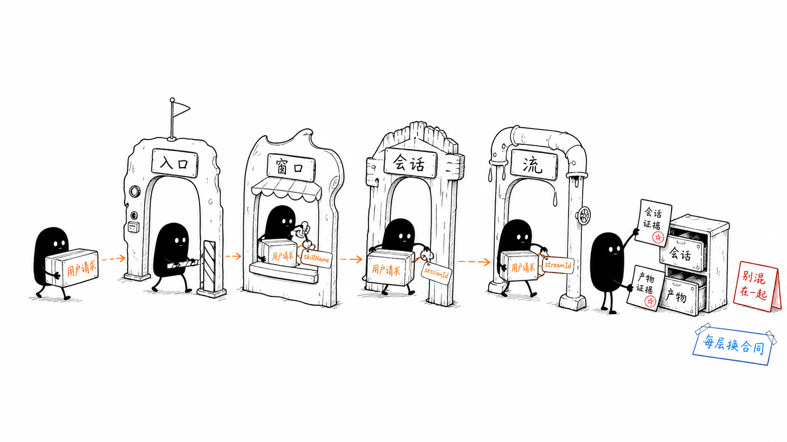
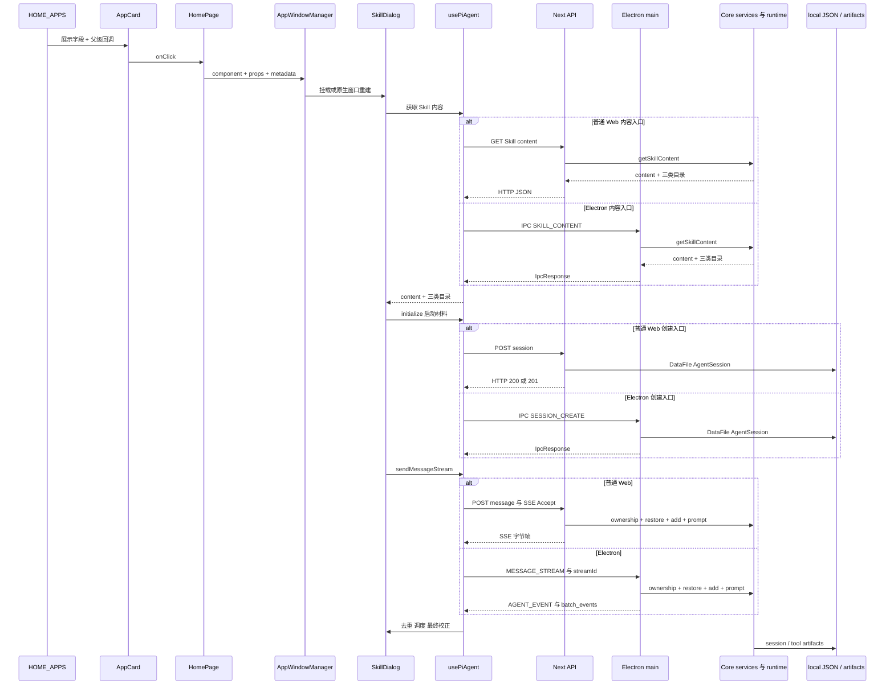

# B12：Part B 复盘——从一次点击到可恢复的工作痕迹

## 先记住一句话

一次 Skill 操作不是“卡片把文字发给模型”，而是：**入口配置被页面翻译成窗口与身份，SkillDialog 准备目录和提示词，客户端跨边界创建/恢复会话，消息在归属校验后进入 runtime，事件经去重与调度变成 UI，产物和会话由不同写入者持久化。**



图中的小黑不是在搬同一个不变纸箱。每过一道闸门，纸箱上的字段和责任都会变化；最后“会话回执”和“产物回执”被放进不同抽屉。这正是本单元最容易混淆、也最需要记住的结构。

本页按四步阅读：先沿正向链看字段怎样改变；再用五张区分卡校准相近概念；然后从用户症状反向定位；最后用测试矩阵和综合实验检查自己能否独立迁移。源码台账放在框架之后，是为了查证，不是让读者从文件名开始背诵。

## 完整正向链



逐箭头的核心数据：

1. 配置到卡片：展示字段，不含运行实例。
2. 页面到窗口：`skillName` 被翻译为 id、props、metadata。
3. Dialog 到 Skill API：code；返回正文与目录。
4. Dialog 到 initialize：sessionId、projectContext、systemPrompt、agentBaseDir、outputDir、llmConfig。
5. 客户端到消息 API：session/project/entry 所有权字段与 content。
6. runtime 到客户端：Web 是 SSE 字节帧，Electron 是 IPC 事件或批次；都不是一次最终 JSON。
7. 工具到磁盘：以 workingDirectory 与 data root 规则解析路径。

## 同一案例的字段接力

| 阶段 | 关键值 | 本阶段才新增的含义 |
| --- | --- | --- |
| 首页 | `app-brainstorming` | 配置/React 身份 |
| 启动 handler | `bmad-brainstorming` | Skill code 与 entryId |
| 窗口 | `skill-bmad-brainstorming` | window id 与 metadata 关联 |
| Skill service | `baseDir/workingDir/outputDir` | 来源、CWD、产物提示 |
| 客户端 | UUID `effectiveSessionId` | 当前真实会话候选 |
| route/service | `AgentSession.sessionId` | 已持久化会话身份 |
| 流式发送 | `streamId` | 当前浏览器活动流所有权 |
| 工具 | `workingDirectory` | 路径解析基准 |

相同字符串可以承担不同角色；不同字符串也可能指向同一业务范围。排错时必须写字段名，不能只说“那个 id”。

## 五张核心区分卡

### 配置与实例

卡片配置存在不等于 Skill 已加载；窗口 id 已算出不等于 session 已创建。

### 源目录、工作目录与输出目录

`baseDir` 供读取 Skill 资产；`workingDir` 注入工具 context；`outputDir` 进入 prompt 与会话上下文。当前工具 context 只有 workingDirectory。

### 初始化与恢复

initialize 可能新建 201，也可能复用已有 200；restore 必须验证所有权并用 transition token 防止旧结果覆盖新选择。

### 流文本与最终文本

delta 可能是增量、累计值或重叠片段；final message 用于校正。scheduler 控制渲染节奏，不决定文本正确性。

### 关闭、销毁与删除

关闭 Window、销毁 runtime、整理 Memory、删除 AgentSession 是四个动作。默认关闭不删除会话 JSON。

## 反向排查地图

```text
卡片不见
→ homeApps 配置 / 页面渲染

卡片可见但点击无结果
→ AppCard path/onClick → 页面 type/skillName/action

窗口记录存在但 Electron 无原生窗
→ createNativeWindow rejection / query 重建

窗口出现但 Skill 身份错误
→ loadSkillContent fallback / prompt frontmatter

初始化失败
→ client request → Web route 或 Desktop handler → 目录准备 → JsonStore

发送返回 403/422
→ session/project/entry ownership

用户消息可恢复但没有助手回复
→ add 已成功，继续查 runtime prompt / SSE error

回复重复或跳变
→ Web bridge 或 Desktop IPC batch → stream-dedupe → final reconciliation

新会话被旧回复污染
→ transition token / active stream id / abort / scheduler cancel

窗口关闭后历史仍在
→ 正常：destroy runtime 不等于 DELETE session

显式删除 Skill 会话却返回未找到
→ delete 请求是否携带 projectId → AgentSessionService 是否定位到项目会话路径

模型说已写文件但找不到
→ tool call/result → workingDirectory → resolveToolPath → 重新读取
```

## 源码覆盖台账

| 文件/窗口 | 主讲 | 状态 | 未覆盖边界 |
| --- | --- | --- | --- |
| `homeApps.ts`、`AppCard.tsx` | B01 | 精读目标窗口 | 完整组件样式后续逐文件卡 |
| `page.tsx` 启动与入口汇流 | B02 | 窗口精读 | 页面其余业务不在本单元 |
| `AppWindowManager.ts` 打开/关闭 | B03、B10 | 窗口精读 | 全部窗口类型与 Dock 细节 |
| `appWindowStore.ts`、`app/window/page.tsx` | B03 | 关键分支精读 | 拖拽、缩放与其他窗口类型 |
| `SkillDialog.tsx` 状态、加载、prompt、initialize | B04、B06 | 窗口精读 | 渲染细节与全部交互 |
| Skill adapter、Web route、Desktop handler、Core service | B05 | 双入口链路精读 | loader 全来源优先级后续精读 |
| `client-hooks.ts` initialize/stream 窗口 | B07、B09 | 链路精读 | Hook 全 API 属于 Part E |
| Web/Desktop session create、session service | B07 | 双入口精读 | 管理、summary、statistics 后续 |
| Web/Desktop message 与 stream 入口 | B08、B09 | 双入口精读 | 完整 runtime 事件体系 Part E |
| Web/Desktop destroy/delete 入口 | B10 | 双入口精读 | 当前项目会话删除合同仍有缺口 |
| tool context/path utils | B11 | 边界精读 | 每个工具逐文件卡 Part E |

“窗口精读”明确表示大文件只有登记行段进入本单元，不能在全项目文件地图中把整文件标为已吃透。

## 测试证据矩阵

| 结论 | 当前相关测试 | 仍缺什么 |
| --- | --- | --- |
| transition token 能拒绝过期结果 | `session-transition-guard.test.ts` | SkillDialog 真实乱序集成 |
| restore/ownership 有公共合同 | `session-restore.test.ts` | message route 顺序与状态码 |
| 客户端会话隔离 | `client-hooks-session-isolation.test.ts` | 真实 fetch/SSE 跨会话 |
| 文本去重纯函数 | `stream-dedupe.test.ts` | 两座 bridge 的一致性 |
| 调度器 finish/cancel | `stream-render-scheduler.test.ts` | React UI 性能与流集成 |
| workingDirectory 注入 | `working-directory.test.ts` | symlink 与 OS sandbox 边界 |

本页没有附带这些测试的新执行记录，因此这里只说明证据入口和预期证明范围，不把它们标记为“已通过”。

## 证据边界

| 状态 | 当前可以说什么 |
| --- | --- |
| 源码已证明 | 两个平台具有不同创建、消息、流式和销毁入口；两端复用部分 Core 服务；Web 使用 SSE，Electron 使用 IPC |
| 相关局部测试存在 | transition guard、stream dedupe、render scheduler、workingDirectory 等局部合同有测试入口 |
| 尚未执行 | 当前环境找不到 Vitest；浏览器、Electron、真实 IPC、SSE 和文件副作用均未运行 |
| 已发现实现缺口 | Skill 项目会话删除缺少 projectId 定位；closeAllWindows 不逐窗触发 onClose；Web/Desktop LLM mapping 合并不一致 |
| 明确留给 Part E | runtime 内部模型上下文、工具注册、完成度判断、重试与稳定性策略 |

## 综合纸面实验

输入：用户快速从会话 A 切到 B，然后发送消息；A 的恢复最后返回，B 的 SSE 正在输出，同时用户关闭窗口。

逐步回答：

1. A 的 restore token 为什么失效？
2. B 的 runtimeSessionId 与 active stream id 分别保护什么？
3. 关闭会触发哪些 fire-and-forget 请求？
4. B 已保存的用户消息是否因窗口关闭而删除？
5. 若旧 SSE chunk 最后到达，哪些检查阻止它更新 UI？

把第 5 问分别改写为两种平台：Web 的旧 SSE chunk 由 fetch abort、active id 与 scheduler 防护；Electron 的旧 IPC event 由取消订阅、streamId、active id 与 scheduler 防护。两者都不能单独证明后台 prompt 已经终止。

验收答案：A 结果被 transition guard 拒绝；runtime id 属于会话，stream id 属于本次请求；关闭请求 destroy 与 consolidate；会话 JSON 保留；abort、active stream 检查和 scheduler cancel 共同阻止旧流更新。

## 口头验收

不看稿，应能独立完成：

1. 从 `HOME_APPS` 逐层说到磁盘会话与产物，并为每层给一个真实字段。
2. 解释为何窗口、session、stream 和 entry 的 id 不能混用。
3. 分别解释 Web 为什么使用 fetch reader、Electron 为什么使用 IPC 事件。
4. 从 400、404、403/422、流内 error 反推失败阶段。
5. 说明 `resolveToolPath` 的真实保护及 symlink/OS sandbox 缺口。
6. 解释窗口关闭后历史仍在为什么是预期行为。

## 四轮学习者模拟记录

1. **术语首现**：配置、实例、runtime、session、stream、entry、workingDirectory 在首次出现处都有具体值和反例。
2. **正向追踪**：同一条“学习 App 卖点”输入能够分别沿 Web 和 Electron 到达持久化、runtime 与 UI，不再把 SSE 套到 Electron。
3. **反向诊断**：从“删除返回未找到但历史文件还在”可以反推 projectId 丢失，而不是误判 JsonStore 一定损坏。
4. **相邻迁移**：将 Skill 换成 Role Agent 时，仍先列入口身份、平台传输、runtime 身份与持久化范围，再判断哪些 handler 可以复用。

Part B 最终留下的排查原则是：**先确认当前对象和身份，再沿边界看字段怎样变化；先区分事实、部分成功和失败，再决定重试、恢复或删除。** 下一单元可以在这张地图上继续深入 Core 基础或 Pi Agent runtime，而不再把所有问题归因于“模型”。
