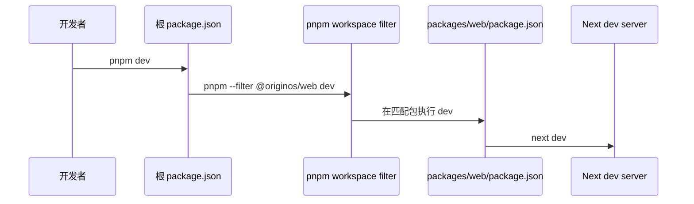

# C01：在根目录执行命令，不等于“整个仓库一起运行”

## 从 Part B 的窗口回到终端

Part B 中，用户点击“头脑风暴”卡片后看到一个 Skill 窗口。开发者要观察这条链路，通常先在仓库根执行 `pnpm dev`。最容易形成的错误直觉是：根目录代表整个项目，所以这条命令会启动 Web、Core、Desktop 和 Agent。

实际代码给出的答案更窄：根 manifest 是**命令路由器**。它把一个便于人记忆的命令转发给某个 workspace package。C01 只解决“根命令把控制权交给谁”；被选中的包怎样构建，留给后续章节。

## 概念阶梯：仓库、包与进程不是一回事

| 概念 | 准确定义 | 本课具体对象 | 不能推出 |
| --- | --- | --- | --- |
| 仓库 | Git 管理的一组文件 | `startupOS/` | 所有文件会被同一工具执行 |
| package | 有自己 `package.json` 的依赖与脚本边界 | `packages/web` | 它一定会独立发布 |
| script | manifest 中的一段命令别名 | 根 `dev` | 已经创建了运行进程 |
| 进程 | 操作系统实际运行的程序实例 | 后续的 Next dev server | package 名称本身就是进程 |

## 控制权怎样移动



第一根箭头只查找根脚本。第二根箭头把包名交给 pnpm 的 workspace 过滤器。第三根箭头进入 `@originos/web` 的 manifest。第四根箭头才创建 Next 开发服务器。图在 Next 启动处停止；它没有启动 Electron 主进程。

## 第一段源码：环境合同先于脚本

[根 `package.json` 第 1—35 行](../../../../package.json#L1) 声明项目为 `private`，指定 `pnpm@9.15.9`，并要求 Node `>=22.19.0`、pnpm `>=9.0.0`。

`private: true` 的主要作用是阻止把根 package 意外发布到 npm；它不表示仓库内容保密，也不表示子 package 全都不能发布。`packageManager` 记录期望的精确 pnpm 版本，而 `engines.pnpm` 只给最低范围。当前实测环境为 Node `v22.23.2`、pnpm `9.15.9`，满足两组声明；这只能证明版本数字匹配，不能证明依赖已经完整安装。

## 第二段源码：根脚本选择具体工作包

[根 `package.json` 第 36—67 行](../../../../package.json#L36) 的关键脚本可以按目标分组：

```json
{
  "dev": "pnpm --filter @originos/web dev",
  "build": "pnpm --filter @originos/web build",
  "test": "pnpm --filter @originos/web test",
  "desktop:dev": "pnpm --filter @originos/desktop dev",
  "desktop:build": "pnpm --filter @originos/desktop build:app"
}
```

给定输入 `pnpm dev`，字段变化如下：

```text
用户输入 dev
→ 根 scripts.dev
→ filter = @originos/web
→ 包脚本名仍为 dev
→ packages/web/package.json 的 dev
→ next dev
```

根 `test` 同样只转发到 Web，并不自动运行 Core、Desktop、Agent 或 pi-tasks 的测试。脚本名看起来宽泛，执行范围却由命令正文决定。以后看到“测试已通过”，第一问必须是“哪一个 package 的哪一套测试？”

## 怎样逐字符读懂一条转发脚本

初次接触 monorepo 时，长命令很容易被当成一个不可拆分的字符串。可以把 `pnpm --filter @originos/web dev` 拆成四个槽位：

| 槽位 | 当前值 | 它决定什么 | 写错后的直接后果 |
| --- | --- | --- | --- |
| 包管理器 | `pnpm` | 由谁读取 workspace | 使用不支持 workspace 协议的工具会改变解析 |
| 选择选项 | `--filter` | 后续命令在哪些 package 执行 | 漏掉后可能回到根 manifest |
| 选择条件 | `@originos/web` | 目标 package name | 无匹配时 Next 尚未启动 |
| 包内脚本 | `dev` | 读取目标 manifest 的哪个字段 | 目标包没有该 script 时失败 |

这四步中没有一步读取 `packages/web/src/app/page.tsx`。只有包内 `dev` 成功展开为 `next dev` 后，Next 才开始发现页面源码。由此可以建立一个非常实用的停止边界：错误发生在 filter 阶段时，不需要阅读 React 组件。

### `pnpm --filter` 不是 `cd`

从效果上看，它会让目标脚本在 package 上下文执行，但语义比手工 `cd packages/web && pnpm dev` 更丰富：filter 可以匹配一个或多个 workspace package，也可以按依赖关系选包。当前根脚本使用精确 package 名，因此预期只有一个匹配者。

教材中的“cwd 切到 Web 包”是一种便于理解的结果描述，不应误解为脚本字符串真的执行了一次 shell `cd`。若后续使用递归/依赖选择器，多个包可能分别获得自己的执行上下文。

## 第三段源码：根依赖不等于所有子包都自动拥有依赖

[根 `package.json` 第 69—130 行](../../../../package.json#L69) 列出 Next、React、Electron、Vitest、TypeScript 等大量依赖与开发依赖。根 node_modules 的 hoisted 布局可能使子包在当前机器“碰巧能找到”其中一些模块，但 package 合同仍应以各自 manifest 为准。

例如 Web manifest 自己声明 Next 与 React，所以 Web 依赖边明确；Core manifest 没有声明 TypeScript，因为 TypeScript 目前位于根 devDependencies。工具二进制能否在 `pnpm --filter @originos/core exec` 中被找到，取决于安装布局和 pnpm 行为。本次实测找不到 `tsc`，正说明不能把“根 manifest 写了依赖”直接说成“每个 package 命令现在都能执行”。

### 直接依赖与工具依赖的差别

应用运行时导入 `zod`，它属于运行依赖；`tsc` 用来检查/编译源码，它通常属于开发工具。二者都会影响命令成功，却在发布包中的责任不同。把所有工具都塞进根依赖可以减少重复，但也会让 package 的独立可运行性更依赖根环境。

本章不要求立刻重构依赖位置，只要求读者能准确描述现状：根提供了一批共享工具，package manifest 又声明自己的直接运行/开发依赖；最终可用性要用目标 package 的真实命令验证。

## 脚本矩阵：先按消费者分类

| 根命令 | 目标 package/工具 | 第一层副作用 | 成功仍未证明 |
| --- | --- | --- | --- |
| `dev` | Web | 启动 Next dev | Electron 窗口、桌面 IPC |
| `build` | Web | 生成 `.next` | Desktop main、安装包 |
| `start` | Web | 消费既有 Web build | build 是最新的 |
| `lint` | Web | 扫描 Web `src` | Core/Desktop lint |
| `type-check` | Web | Web TS 诊断 | Core 严格类型 |
| `test` | Web | Web Vitest | Core/adapter/Desktop 测试 |
| `desktop:dev` | Desktop | 进入多进程开发链 | 发布包可安装 |
| `desktop:build` | Desktop | 进入应用构建链 | 签名、公证、目标机启动 |
| `agents:check` | 根 Node 脚本 | 尝试扫描依赖 | packages 已全部覆盖 |

这张表不是脚本速查表，而是证据边界表。以后看到一段 CI 日志，可以先用第一列定位命令，再用最后一列阻止过度承诺。

## 一次完整的正向输入追踪

给定输入：

```text
cwd = startupOS
argv = pnpm dev
```

可以不运行程序先推演：pnpm 找到根 manifest → 查到 `scripts.dev` → 解析 workspace filter → 用 package name 匹配 Web manifest → 查到 Web `scripts.dev` → shell 启动 `next dev` → Next 才读取 Web 配置与页面。

状态变化至少包括：

1. 当前任务所有权从根转给 Web package；
2. 进程从一次性 pnpm 调度变成长期 Next server；
3. 配置发现基准从仓库组织层进入 Web package；
4. 端口监听成功后才出现用户可观察页面。

若端口已被占用，失败发生在最后阶段；根脚本和 filter 仍可能完全正确。相同“命令退出”现象必须结合最早错误日志定位。

## 恢复路径不是重复执行同一命令

| 故障 | 无效动作 | 有证据的恢复 |
| --- | --- | --- |
| package 无匹配 | 重装 React | 修 filter 或 package name |
| Web 无 `dev` script | 修改页面 | 修目标 manifest script |
| Next 二进制缺失 | 清空业务数据 | 恢复依赖安装 |
| 端口占用 | 修改 Core exports | 释放/改端口并同步消费者 |
| 页面编译失败 | 改 Desktop builder | 阅读 Next 编译错误与对应源码 |

恢复动作之所以不同，是因为每个故障停止在不同箭头。诊断的核心不是列尽可能多的原因，而是找到最后成功的边界和第一条失败证据。

## 三条容易误读的分支

1. `dev:src` 直接写成 `next dev`。根目录没有 `src/app`，因此它不具备与 Web 包 `dev` 相同的 cwd 和配置发现条件。脚本存在不证明它是当前推荐生产入口。
2. `clean` 删除根 `dist-electron`、`dist` 和 `.tmp`；`clean:all` 还删除 package 级产物。清理范围和构建范围并不完全对称。
3. 根 `main` 指向 `dist-electron/desktop/src/main/main.js`，但执行 `pnpm dev` 不会读取这个入口；Electron 启动才会消费它。

## 失败诊断：`pnpm dev` 没打开桌面窗口

正确的证据顺序是：

1. 查看根 `scripts.dev`，确认它只过滤 `@originos/web`。
2. 查看 Web `scripts.dev`，确认实际命令是 `next dev`。
3. 若需要桌面窗口，应比较 `desktop:dev`，而不是先排查 IPC。
4. 只有选对桌面脚本后仍无窗口，才进入 C12 的多进程诊断。

因此，这个症状在本章范围内是“选错入口”，不是 Agent、窗口管理器或 Electron IPC 故障。

## 验证证据与缺口

`pnpm list -r --depth -1` 在当前工作区列出了根和六个 package，证明 pnpm 能识别这些 manifest。`pnpm --filter @originos/web exec node -p "require('./package.json').name"` 输出 `@originos/web`，证明 filter 把 cwd 切到 Web 包。

这两项检查没有启动 Next，也没有证明浏览器页面可访问；它们只固定“包选择”这一步。正式启动还会受依赖安装、端口和 Next 配置影响。

把它改写成 Given/When/Then：

- Given：当前根目录存在 workspace 配置与六份有效 manifest。
- When：递归列出 package，并在 Web filter 中打印当前 package name。
- Then：输出包含六个 package，定向命令输出 `@originos/web`。

测试没有断言 `scripts.dev` 创建端口，也没有进入浏览器。若要补自动化合同测试，可读取根/Web manifest，断言根 `dev` 精确转发到 Web、Web `dev` 精确调用 Next；集成测试再启动 server 等待端口。两层测试不能互相替代。

## 源码实验室：把根命令拆成三个可验证阶段

前文已经给出脚本结论，现在用真实窗口把“环境合同、路由选择、包内执行”连成一次可计算过程。先看 [根 manifest 第 26—45 行](../../../../package.json#L26)：

```json
"engines": {
  "node": ">=22.19.0",
  "pnpm": ">=9.0.0"
},
"scripts": {
  "dev": "pnpm --filter @originos/web dev",
  "build": "pnpm --filter @originos/web build",
  "type-check": "pnpm --filter @originos/web type-check"
}
```

`engines` 是调用前提，`scripts` 是控制权路由。二者都不会自动执行：终端先找到当前目录的 `package.json`，包管理器再按脚本字符串启动子进程。若 Node 版本不满足，严格程度取决于包管理器配置；所以版本字段是合同证据，不等于所有环境都会强制拒绝。

第二个窗口来自 [Web manifest 第 5—12 行](../../../../packages/web/package.json#L5)：

```json
"scripts": {
  "dev": "next dev",
  "build": "next build",
  "start": "next start",
  "lint": "eslint src --ext .ts,.tsx",
  "type-check": "tsc --noEmit",
  "test": "vitest run"
}
```

输入 `pnpm dev` 时，根脚本中的最后一个 `dev` 不是递归调用根脚本。`--filter @originos/web` 已把执行上下文选到 Web 包，因此第二个 `dev` 从这个窗口解析成 `next dev`。控制权依次发生两次变化：仓库根脚本选择 package，package 脚本再选择工具。

第三个窗口说明 Desktop 使用另一条入口，见 [根 manifest 第 49—51 行](../../../../package.json#L49)：

```json
"desktop:dev": "pnpm --filter @originos/desktop dev",
"desktop:build": "pnpm --filter @originos/desktop build:app",
"desktop:dist": "pnpm --filter @originos/desktop dist"
```

因此“`pnpm dev` 没有桌面窗口”不是运行失败，而是入口选择与期待不一致。真正的恢复动作是选择 `desktop:dev`，然后继续检查 Desktop 包内脚本；重复执行根 `dev` 不会改变路由。

### 纸面 Given/When/Then

- Given：当前目录是仓库根，Web manifest 存在且 name 为 `@originos/web`。
- When：执行 `pnpm dev`。
- Then：可由两个 manifest 推出最终工具是 `next dev`；不能由此证明端口一定监听。
- 缺口：当前没有针对根脚本路由的自动化测试。filter 验证只能证明选包，不会启动 Next。

## 小实验与口头验收

1. 不执行命令，展开 `pnpm desktop:build` 的前两层：根脚本应进入哪个包、请求哪个脚本？
2. 比较 `pnpm test` 与 `pnpm --filter @originos/core test`。前者能否代表 Core 测试？依据是什么？
3. 假设根 `dev` 的 filter 写成不存在的包名，预测失败发生在 Next 启动前还是后。
4. 合上本页，复述仓库、package、script、进程四者的差别。

### 实验参考推演

第1题应得到：根 `desktop:build` → filter `@originos/desktop` → Desktop `build:app`。此时尚未进入 electron-builder，后者只有 `dist`、`pack` 等脚本继续调用。

第2题答案是否定的。根 test 正文精确过滤 Web；Core 测试有自己的 Vitest 配置与显式命令。脚本名“test”没有全仓含义。

第3题会在 pnpm package 选择阶段失败，Next 进程尚未创建。可用递归 package 列表和 filter 诊断确认。

第4题的合格表述必须包含：仓库是 Git 边界；package 是 manifest 边界；script 是命令映射；进程是运行实例。四者可能一对多，不能相互替换。

## 源码阅读顺序与暂时跳过项

1. 先读根 manifest 第 1—35 行，确定环境与根身份。
2. 再读第 36—67 行，只展开本课涉及的 dev/build/test/desktop 脚本。
3. 跳到 Web manifest 第 5—12 行，确认二次展开。
4. 用 workspace 列表验证 filter 对象存在。
5. 暂时跳过完整 dependencies 版本细节；C03/C04 会负责依赖图与锁定。

若读者从第 69 行上百个依赖开始，很容易失去本章唯一问题“命令交给谁”。正确阅读不是越多越好，而是在当前停止边界内读完输入、分支和输出。

## 迁移验收：新增 `core:test`

假设要在根增加一个只跑 Core 测试的便捷入口。合格设计应指向 `@originos/core` 的明确 filter，并先确认 Core manifest 是否存在 `test` script；当前 Core manifest 没有 scripts，所以不能只加根转发就声称可用。可以选择在 Core 补标准 script，或根使用 `pnpm --filter ... exec vitest`，两者的所有权与可维护性不同。

完成后至少验证：错误 package 名会失败、正确命令加载 Core Vitest 配置、不会误跑 Web。这个迁移题检验读者能否把本章模型用于新命令，而不是只会背 `pnpm dev`。

本课建立了第一个工程判断：先读命令正文，再谈运行行为。下一课继续追问：pnpm 为什么知道 `packages/web` 是一个可过滤的 workspace 成员？
