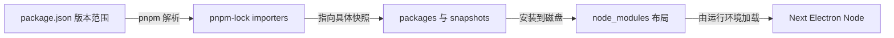
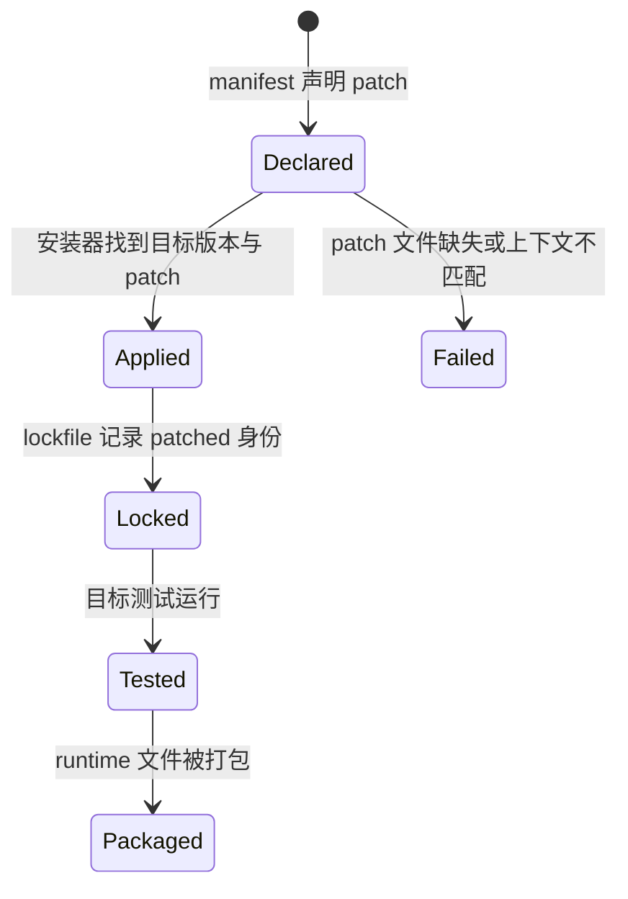

# C04：lockfile 固定了解析结果，却没有替你运行程序

## “依赖已锁定”到底锁住了什么

头脑风暴窗口依赖 Next、React、adapter 和大量间接包。`package.json` 中常见 `^14.0.0` 这样的范围；若每次安装都重新选择满足范围的最新版本，两台机器可能得到不同依赖树。`pnpm-lock.yaml` 记录一次解析后的精确图，减少这种漂移。

本章要守住边界：lockfile 是**解析证据**，不是运行证据、安全证明或跨平台打包证明。

## 三层版本信息



第一根箭头把“允许范围”变成解析结果；第二根箭头连接直接依赖与具体包快照；第三根箭头受 workspace 安装策略影响；最后一根箭头才进入真实运行。lockfile 在 C 处停止，不能替 E 作保证。

## 第一段源码：lockfile 与 importer

[pnpm-lock.yaml 第 1—15 行](../../../../pnpm-lock.yaml#L1) 声明 lockfile 版本 `9.0`，随后用 `importers` 按 package 记录直接依赖解析。根 importer 从第 16 行开始；`packages/agent`、`core`、`desktop`、`pi-tasks`、`service`、`web` 分别在后续独立段落出现。

例如 Web manifest 写 `@originos/core: workspace:*`，lockfile 的 Web importer 仍保留 `specifier: workspace:*`，并把 version 记录为本地 `link:../core`。这说明依赖由 workspace 链接解决，而不是从 registry 下载一个同名 Core 包。

## 第二段源码：补丁属于依赖身份的一部分

[根 manifest 第 30—34 行](../../../../package.json#L30) 为两项 pi 依赖声明 `patchedDependencies`。这意味着实际安装内容不只由上游版本 `0.80.10` 决定，还要叠加仓库中的 patch 文件。

因此，下面三种状态必须区分：

| 状态 | 可以确认 | 不能确认 |
| --- | --- | --- |
| manifest 有 patch 声明 | 项目意图覆盖某依赖 | patch 一定能应用 |
| lockfile 记录 patched hash | 解析图纳入补丁身份 | 补丁后的行为满足业务要求 |
| 安装/测试成功 | 当前平台完成对应动作 | 另一平台或打包态也成功 |

补丁文件缺失、内容与上游版本不匹配或 lockfile 未同步，都会在应用源码运行之前造成失败。

## 怎样阅读一份很大的 lockfile

`pnpm-lock.yaml` 有上万行时，不应从头逐行背诵。围绕一个具体问题按四步定位：

1. 在目标 consumer 的 importer 中找到依赖名；
2. 读取 `specifier`，确认 manifest 原始范围；
3. 读取 importer 的 `version`/link，找到实际解析目标；
4. 再到 packages/snapshots 查 peers、integrity、patched 标识与传递依赖。

以 Web → Core 为例，前两步都在 `packages/web` importer；本地 `link:../core` 已足以判断它没有下载 registry Core。只有研究第三方 Next/React 的具体依赖树时，才需要继续进入 snapshots。

### importer 是“某个消费者的视角”

同一个第三方包可以被多个 importer 直接声明，也可以使用不同 specifier。lockfile 将这些消费者分开记录，再尽可能复用兼容 snapshot。不能看到全局只有一个 package snapshot，就忽略每个 package 是否声明了直接依赖。

### snapshot 是解析结果，不是文件清单

snapshot 记录版本、peer 组合和依赖边，安装器据此构建 node_modules。它通常不枚举包里的每个 JS 文件，也不记录 electron-builder 最终复制结果。要回答“安装包中有没有 ai.js”，仍要查 build 输出和 builder 清单。

## semver 范围为何会产生漂移

`^14.0.0` 通常允许同一主版本内的更新；精确 `0.80.10` 则只允许该版本。manifest 表达维护者接受的范围，lockfile 把当前选择固定下来。

| 变更 | manifest 是否变 | lockfile 是否可能变 | 运行是否一定变 |
| --- | --- | --- | --- |
| 干净 frozen install | 否 | 不应 | 环境差异仍可能影响 |
| 重新解析 `^` 范围 | 否 | 可能 | 新 snapshot 可能改变行为 |
| 修改精确版本 | 是 | 应同步 | 需构建/测试确认 |
| 修改 patch 内容 | patch 声明可不变 | patched hash 应变 | 补丁行为会变 |
| 只改业务源码 | 否 | 否 | 应由源码构建结果改变 |

这张表帮助审查 Git diff：业务小改却出现巨大 lockfile diff，需要确认是否意外触发了依赖重算。

## peer dependency：同一个版本也可能有不同身份

某些 package 的行为/兼容性依赖宿主提供的 React、TypeScript 或其他 peer。pnpm snapshot 可能把 peer 组合编码进解析身份。于是“包版本相同”仍可能对应不同 peer 环境。

本章不深入每个 peer 组合，但读者必须知道：复制一行版本号不能完全复刻依赖身份；lockfile、Node/pnpm 版本与平台同样是安装输入。

## patch 流程的完整状态机



Declared 只表示意图；Applied 表示安装修改了依赖；Locked 保证下次解析识别补丁身份；Tested 才提供行为证据；Packaged 又是独立的分发边界。源码中存在 patch 绝不能直接跳到最后状态。

## native/optional 依赖为何更容易出现“同锁不同结果”

lockfile 可以同时记录多平台 optional 包，安装器会根据 OS/CPU、supportedArchitectures、build permission 与本机工具选择实际文件。两台机器使用同一 lockfile，node_modules 的平台二进制仍可能不同。

此外，Electron/Node ABI、代码签名、系统库都在 lockfile 之外。lockfile 的可重复性是重要基础，不是完整环境镜像。

## 反向故障案例：只在 CI frozen install 失败

排查顺序：

1. 查看 CI Node/pnpm 版本是否满足根 engines/packageManager；
2. 查错误是否明确指出 manifest 与 lockfile 不一致；
3. 定位具体 importer，而不是盲目删除整个 lockfile；
4. 若是 patch，核对 patch 文件、目标版本与 hash；
5. 在正确 pnpm 版本重算，并审查 diff 是否只涉及预期依赖；
6. 再运行受影响 package 的 build/test。

删除 lockfile再安装可能暂时消除不一致，却同时重算大量无关依赖，扩大风险。恢复动作应最小且可审计。

## 具体输入推演：升级 Next

假设把 Web manifest 的 `next` 从 `^14.0.0` 改为新的范围，却不更新 lockfile。在默认 frozen-lockfile 的 CI 环境中，声明与锁定结果不一致通常会阻止安装；若本地允许重算，lockfile 会发生大范围变化。正确复盘不是只看 `package.json` 一行，而要检查：

1. importer 的 specifier 是否同步；
2. 解析出的具体版本及 peers 是否变化；
3. Next 构建与 Web 测试是否在新图上运行；
4. desktop standalone 打包是否仍包含正确依赖。

## 失败诊断：lockfile 没冲突，应用仍启动失败

这完全可能。按顺序区分：

- 安装阶段：patch 是否应用、native lifecycle 是否被允许；
- 解析阶段：hoisted 布局中是否能找到模块；
- 构建阶段：浏览器 bundle 是否误装 Node-only 包；
- 运行阶段：native binary 是否匹配 OS/CPU；
- 打包阶段：electron-builder 是否复制了运行依赖。

lockfile 无 diff 只能排除“依赖图刚被重新解析”这一类变化，不能排除以上问题。

## 当前验证事实

本次没有执行联网重装依赖。当前命令可以读取 workspace 列表，但在 Core/Web 内执行 `tsc --showConfig` 报 `Command "tsc" not found`。这证明当前环境没有可供该 package exec 解析的 TypeScript 二进制；不能据此判断 tsconfig 内容有错，也不能写成类型检查通过。

若补 lockfile 合同测试，可设计：

- Given：manifest 与 lockfile 均已提交；
- When：使用根声明的 pnpm 版本执行 frozen install；
- Then：安装不改 lockfile，两个 pi patch 应用成功，workspace links 指向本地包。

再增加运行层：从 adapter 实际 require 一个 patched API 并断言预期行为。前一层失败说明解析/安装问题，后一层失败才进入补丁行为或模块加载。

## 源码实验室：从声明范围算到一次确定解析

lockfile 的入口状态位于 [pnpm-lock.yaml 第 1—13 行](../../../../pnpm-lock.yaml#L1)：

```yaml
lockfileVersion: '9.0'
settings:
  autoInstallPeers: true
  excludeLinksFromLockfile: false
patchedDependencies:
  '@earendil-works/pi-agent-core@0.80.10':
    hash: lc6gr4hsbygdn2e65qfs7ah7ky
    path: patches/@earendil-works__pi-agent-core@0.80.10.patch
```

版本号选择 lockfile 语义；settings 影响解析；补丁条目把原始版本、补丁路径和内容 hash 绑成一个身份。只改 patch 文件而不更新 hash，会使 frozen 安装发现输入与锁定结果不一致。

再看根 importer，见 [pnpm-lock.yaml 第 15—39 行](../../../../pnpm-lock.yaml#L15)：

```yaml
importers:
  .:
    dependencies:
      '@originos/pi-agent-adapter':
        specifier: workspace:*
        version: link:packages/agent
```

`specifier` 保存 manifest 的意图，`version` 保存本次解析结果。这里的结果是本地链接。若 `packages/agent` 不在 workspace 中，保留这几行也不能让目录重新出现；安装器会重新校验真实输入。

第三个窗口说明范围与确定版本不同，见 [pnpm-lock.yaml 第 497—526 行](../../../../pnpm-lock.yaml#L497)：

```yaml
eslint:
  specifier: ^8.57.1
  version: 8.57.1
prettier:
  specifier: ^3.0.0
  version: 3.9.5
typescript:
  specifier: ^5.0.0
  version: 5.7.3
```

`^3.0.0` 允许多个 3.x 版本，当前 lockfile 固定到 3.9.5。删除 lockfile 后重解可能仍满足 manifest，却得到另一个兼容版本。

### 正向与失败推演

正常路径是 manifest 范围 → lock importer → 具体 package/snapshot → 安装布局。frozen 失败通常说明前两者不一致；安装成功但 native 模块加载失败，则应查平台二进制、生命周期脚本和打包资源。lockfile 不包含最终安装包清单。

### 可验证的测试设计

- Given：manifest 与 patch 文件不变。
- When：干净目录执行 `pnpm install --frozen-lockfile`。
- Then：安装器不得修改 lockfile；退出为零只证明依赖图能按当前平台落地。
- 未证明：Next 构建、Electron native 加载和发布包资源。

## 小实验与口头验收

1. 在 lockfile 中找到 Web importer 的 `@originos/core`，解释 specifier 与 link version 的差别。
2. 为什么 `pnpm-lock.yaml` 应提交 Git，而 `node_modules` 不应提交？
3. 给出一个“lockfile 完全不变但桌面运行失败”的合理路径。
4. 解释 patch 声明、patched hash、行为测试三层证据为何不能互相替代。

### 实验参考推演

第1题应在 `packages/web` importer 中找到 specifier `workspace:*` 和本地 link；前者保留消费者声明，后者是当前解析目标。

第2题：lockfile是可审查的依赖输入，node_modules是平台/安装策略生成的庞大结果。同一lockfile仍需安装才能形成磁盘布局。

第3题可选native ABI、builder漏复制external、环境变量缺失或Node/Electron宿主差异；这些均不要求lockfile改变。

第4题必须按Declared/Locked/Tested分层。声明/哈希说明安装身份，只有真实断言才说明补丁行为。

## 源码阅读顺序

1. 先读根manifest的packageManager、engines与patchedDependencies。
2. 再读lockfile头与importers，不进入所有snapshot。
3. 选Web/Core/adapter各一条直接边，跟到version/link。
4. 只为一个具体第三方依赖继续追snapshot与peer。
5. 最后对照patch文件是否存在；行为内容留给对应runtime章节。

## 迁移验收：升级patched pi依赖

写计划时必须同步上游版本、patch文件名/内容、root patchedDependencies、adapter依赖、lockfile和runtime tests。若新上游已包含补丁修复，应通过测试证明后移除patch，而不是机械重放旧diff。

验收还需Desktop打包态，因为开发node_modules能加载不代表复制后的runtime依赖完整。

下一课回到命令：根脚本、包脚本和仓库里存在的 `turbo.json` 是否真的组成同一条任务流水线？
