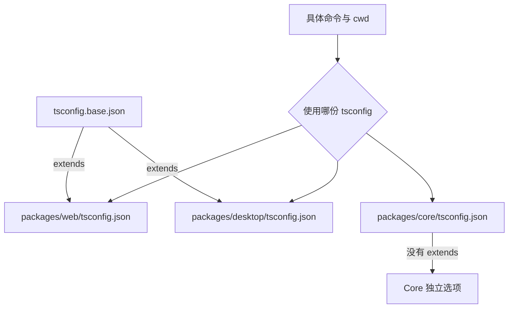

# C06：TypeScript 有效配置来自继承与覆盖，不来自“最近看到的一行”

## 同一个 `strict`，为什么结果可能不同

OriginOS 有根 `tsconfig.base.json`、根 `tsconfig.json`、Web/Core/Desktop 各自配置。阅读者容易看到 base 的 `strict: true` 就断言所有 package 都严格；也可能看到 Core 的 `strict: false` 就断言整个仓库不严格。两种说法都把配置层级混在了一起。

本章建立“先找命令使用哪份 tsconfig，再计算 extends 与覆盖”的方法。

## 配置选择与继承



命令先选择配置入口。Web 与 Desktop 再继承 base；Core 当前没有 `extends`，所以 base 的新增字段不会自动进入 Core。根 `tsconfig.json` 也是独立配置，并不因为位于根目录就成为所有 package 的父配置。

## 第一段源码：base 提供严格默认值

[tsconfig.base.json 第 1—30 行](../../../../tsconfig.base.json#L1) 开启 `strict`、`noImplicitAny`、`strictNullChecks`、未使用检查、未覆盖索引访问等规则，并选择 ESNext module、bundler resolution 与 `jsx: preserve`。

这份文件本身不执行类型检查，也没有 `include`。只有某个 tsconfig 通过 `extends` 引入它，且某条 `tsc -p ...` 或框架命令使用那份配置时，这些字段才进入有效配置。

## 第二段源码：Web 继承后继续缩小范围

[Web tsconfig 第 1—23 行](../../../../packages/web/tsconfig.json#L1) `extends` base，并覆盖/补充：

- `incremental: true`：允许保存增量构建信息；
- `noEmit: true`：TypeScript 只检查，不直接写 JS；
- Next plugin；
- `baseUrl` 与 Web 私有 aliases；
- include 只收 Web `src`、`next-env.d.ts` 与 `.next/types`；
- exclude 明确排除 `../core`。

Web 能在构建时消费 Core，并不意味着 Web 的 `tsc --noEmit` 会把 Core 源码纳入自己的 include；Next 的 transpilePackages 和 module resolution 是另一条边界。

## 第三段源码：Desktop 继承后切换模块世界

[Desktop tsconfig 第 1—18 行](../../../../packages/desktop/tsconfig.json#L1) 同样 extends base，却把 `module` 改为 CommonJS、`moduleResolution` 改为 Node，并把 `outDir` 指向根 `dist-electron`。它还将 Core alias 指向真实源码，并把一个 Core worker `.mts` 加入 include。

因此继承不是复制后冻结；子配置可以改变关键语义。Desktop 最终目标是 Node/Electron 主进程可加载的产物，不是浏览器 bundle。

## 第四段源码：Core 没有继承 base

[Core tsconfig 第 1—25 行](../../../../packages/core/tsconfig.json#L1) 自己声明大部分选项，并明确 `strict: false`、`noEmit: false`、`outDir: ../../dist/core`。它没有 `extends`。这与 AGENTS.md 的“TypeScript 严格模式”目标存在当前配置差距，教材必须如实记录，不能把规范愿望写成已经被工具完全执行。

## TypeScript 合并规则：对象覆盖与数组替换

理解 `extends` 时，不能把父子 JSON 简单相加。compilerOptions 中未覆盖的字段通常继承，子配置同名字段覆盖；`include`、`exclude` 等顶层文件集合由子配置定义，而不是自动把父文件列表拼在一起。

因此 Web 的有效配置可以这样推导：

```text
base.strict = true               保留
base.moduleResolution = bundler  保留
web.noEmit = true                新增
web.plugins = next               新增
web.paths                         使用 Web 自己的映射
web.include                       使用 Web 自己的文件集合
```

Desktop 则覆盖 module/moduleResolution；Core 因无 extends，从自己的第 2 行开始独立计算。

## 严格模式不是单个开关的全部故事

`strict: true` 会启用一组严格检查，但某个子选项仍可单独覆盖。base 还显式写出 `noImplicitAny`、`strictNullChecks` 等，使意图更清楚。Core 的 `strict: false` 关闭 strict 家族默认值，却仍可能通过 ESLint warning 捕获部分问题。

这三种事实要分开：

- TypeScript 编译器是否报错；
- ESLint 是否报告 warning/error；
- AGENTS.md 是否禁止该写法。

编译器放过不等于规约允许，规约要求也不等于当前工具已经自动拦截。

## `module` 与 `moduleResolution` 是两项不同决定

`module` 决定输出/保留何种模块语法；`moduleResolution` 决定编译器怎样根据 import 找文件。Web/base 使用 ESNext + bundler，适合让 Next 接管打包；Desktop 改成 CommonJS + node，适合 Electron main 由 Node require 加载。

若只改 Desktop `module` 为 ESNext，却保留 Node/CommonJS 入口与 package 语义，运行时可能出现 `require is not defined`、exports condition 不匹配等问题。类型检查成功也不能证明 Node 会用相同规则执行产物。

## `lib` 与 `types` 决定可见的环境声明

base 的 `lib` 包含 DOM，因此继承它的 Desktop 配置理论上也能看到 DOM 类型；Desktop 又将 `types` 设为 Node。类型可见不表示运行环境真的同时拥有浏览器 DOM 与 Node/Electron API。

这是一种常见误判：代码因声明存在而编译，不代表对象在目标进程存在。Electron main 与 renderer 的真实全局对象仍由进程决定。

## `skipLibCheck` 跳过什么

base/Core 都开启 `skipLibCheck`，主要减少第三方 `.d.ts` 之间的检查成本。它不跳过项目 `.ts` 业务逻辑，也不保证第三方类型与运行时完全一致。依赖类型冲突被跳过后，API 使用点仍可能出现问题。

## `isolatedModules` 与框架编译

`isolatedModules: true` 要求每个文件都能被独立转换，适合 Next/Babel/esbuild 等逐文件工具。它不是“每个 package 被隔离”，也不是安全 sandbox。某些只在全程序 TypeScript emit 中成立的写法会被限制。

## 文件集合精读：include/exclude 决定谁被审判

Web include 纳入 `.next/types`，因此框架生成的路由类型会参与检查；同时 exclude `../core`，避免 Web tsc 对整个 Core重复拥有检查责任。

Core include 覆盖 ts/tsx/mts，exclude 测试、mocks、四个独立模块与两个具体文件。于是“Core tsc 通过”也不证明这些 excluded 源码通过同一配置。排除项是明确的证据边界，不是无关文件清单。

Desktop include 一个 Core worker `.mts`，意味着 Desktop 编译边界跨入部分 Core 源码。若这个 worker 又导入其他 Core 文件，TypeScript 会跟随 import 纳入依赖；include 只是根文件集合，不是“只允许编译这两个目录”。

## 可计算案例：一个空值访问

```ts
function title(project?: { name: string }) {
  return project.name;
}
```

在继承 base 且 `strictNullChecks: true` 的 Web 中，应报告 project 可能 undefined。在 Core 当前 strict false 配置中，编译器可能不报这个严格错误。若 Next 通过 transpilePackages 编译 Core 源码且 build 忽略类型错误，运行时调用 `title(undefined)` 仍会抛异常。

这条输入把配置事实连接到真实后果：类型门被放宽/绕过，不会给运行时自动加空值保护。

## `tsc --showConfig` 为什么是重要验证

它会解析 extends、默认值、paths 与文件列表，输出有效配置，比人工合并更可靠。推荐命令必须从目标 package 执行，或显式 `-p` 指定配置。

本次命令因 `tsc` 不可用而失败，属于“工具入口未满足”，不是 `showConfig` 输出为空。恢复依赖后应先重新运行它，再把人工推导与实际结果对照；如果不同，以工具实际解析和版本文档为准。

## 测试配置本身也要有合同

可以写一个 Node 测试读取三份 JSON，断言 Web/Desktop extends base、Core strict 状态与输出目录。它能防止配置字段意外漂移，却不执行编译。第二层需要 fixture 文件触发 strict 错误/emit；第三层才加载生成 JS。

## 具体输入推演

假设在 `packages/web/src/app/page.tsx` 写一个隐式 `any` 参数：Web `type-check` 选择 Web tsconfig，继承 base 的 `noImplicitAny: true`，理论上应报告错误。若同样代码放入 Core，Core 的 `strict: false` 会关闭 strict 家族默认项；是否仍报错要看 Core 是否单独开启对应规则，而当前配置没有写 `noImplicitAny: true`。

这个推演依赖配置语义；当前环境 `pnpm --filter ... exec tsc --showConfig` 因找不到 `tsc` 失败，所以没有现场输出有效配置，更没有类型通过证据。

## 失败诊断：编辑器与命令结果不同

先检查：

1. 文件被哪份 `include` 收录？
2. 编辑器打开的是哪个 tsconfig project？
3. 终端命令 cwd 与 `-p` 指向哪里？
4. 子配置是否覆盖 base？
5. 框架构建是否又配置了忽略类型错误？C09 会看到 Next 的这一分支。

不要把“编辑器没有红线”“Next build 成功”“tsc 通过”视为同一证据。

恢复时先让编辑器选择正确 workspace TS version 和 tsconfig，再用相同版本 CLI 复现。若 CLI 与编辑器仍不同，比较文件是否被 include、缓存 tsbuildinfo、插件与 command flags；不要通过关闭 strict 消除表面差异。

## 源码实验室：补齐根配置与 Next 类型入口

根 [tsconfig.json 第 1—24 行](../../../../tsconfig.json#L1) 自己重复声明严格选项，并没有 `extends`：

```jsonc
{
  "compilerOptions": {
    "strict": true,
    "noImplicitAny": true,
    "strictNullChecks": true,
    "noUnusedLocals": true,
    "noUncheckedIndexedAccess": true
  }
}
```

它的消费者必须由具体 `tsc -p`、编辑器项目选择或工具默认查找证明。根位置不会让字段自动注入子包；Web/Desktop 是因为显式 extends base 才继承，Core 则完全独立。

Web 文件集合来自 [packages/web/tsconfig.json 第 1—23 行](../../../../packages/web/tsconfig.json#L1)：

```json
{
  "extends": "../../tsconfig.base.json",
  "compilerOptions": {
    "incremental": true,
    "noEmit": true,
    "plugins": [{ "name": "next" }]
  },
  "include": ["next-env.d.ts", "src/**/*.d.ts", "src/**/*.ts", "src/**/*.tsx", ".next/types/**/*.ts"],
  "exclude": ["node_modules", ".next", "out", "dist", "../core"]
}
```

`extends` 合并 compilerOptions，但 include/exclude 使用子配置自己的数组。`../core` 被排除并不阻止 Next 通过 `transpilePackages` 消费 Core；它只说明 Web 这次 `tsc` 不把 Core 源码整体当作自己的根文件集合。

此前遗漏的 [packages/web/next-env.d.ts 第 1—5 行](../../../../packages/web/next-env.d.ts#L1) 是生成型类型入口：

```ts
/// <reference types="next" />
/// <reference types="next/image-types/global" />

// NOTE: This file should not be edited
```

三斜线引用让 Web 类型程序看见 Next 与图片模块声明。它没有运行时代码，也不应手工维护；丢失时通常由 Next 工具重建。因而“生成文件”不总等于可忽略垃圾：这个文件被 tsconfig 明确纳入类型输入，但所有权仍属于框架生成流程。

仓库根还保留一份历史 Electron 配置，见 [tsconfig.electron.json 第 1—23 行](../../../../tsconfig.electron.json#L1)：

```json
{
  "compilerOptions": {
    "module": "commonjs",
    "outDir": "./dist-electron",
    "rootDir": "./electron",
    "declaration": true,
    "sourceMap": true,
    "types": ["node"]
  },
  "include": ["electron/**/*.ts"]
}
```

它面向根 `electron/`，而当前 Desktop package 脚本明确执行包内 `tsc -p tsconfig.json`。仓库搜索没有找到生产脚本调用 `tsconfig.electron.json`，所以它应标记为平行/历史配置，不能与当前 Desktop 编译入口合并讲述。是否可删除属于后续清理决策，本章只确定其当前调用证据缺失。

### 配置冲突的计算顺序

给定 Web：先加载 base 的 `strict: true`，再应用 Web 的 `noEmit: true`，再用 Web include 选择根文件。给定 Core：不加载 base，直接得到 `strict: false` 与 `noEmit: false`。要判断一个报错是否应出现，必须先回答“哪条命令选择哪份配置”，再讨论某个字段。

### 测试边界

`tsc -p packages/web/tsconfig.json --showConfig` 能证明合并后的配置形状；只有真正的 `tsc --noEmit` 才能证明当前源文件在该配置下通过。两者都不能证明 Next bundle 或 Desktop CommonJS 输出可运行。

## 小实验与口头验收

1. 分别写出 Web、Desktop、Core 的配置父链。
2. 比较 Web `noEmit` 与 Desktop `outDir`，预测二者副作用。
3. 为什么根 `tsconfig.json` 不是自动全局父配置？
4. 从“Core 中隐式 any 没报错”反推到 `strict: false`，并说明仍需哪条命令才能验证。

### 实验参考推演

第1题：Web/Desktop父链都是包配置→base；Core无父链；根tsconfig独立。位置高不等于自动父级。

第2题：Web只诊断/增量缓存，Desktop向根dist-electron写JS；两者的副作用不能互换。

第3题：只有显式extends构成继承。工具从cwd/`-p`选择入口，不按目录祖先自动合并tsconfig。

第4题需恢复tsc后执行Core showConfig/typecheck；人工读取只能发现配置风险，不能确认具体文件是否纳入与实际诊断。

## 源码阅读顺序

1. 从具体package script确定`tsc`入口。
2. 打开该package tsconfig第1行找extends。
3. 若有父级，先列父compilerOptions，再用子同名字段覆盖。
4. 单独计算include/exclude/paths，不假设数组拼接。
5. 用showConfig校正人工结果；工具不可用则明确阻塞。

## 迁移验收：让Core继承严格base

这不是只加一行extends。先运行当前Core基线，记录strict新增错误；检查Core自有module/emit/path覆盖继续保留；分批修真实null/any问题；为暂时例外给最窄范围而不是把strict再次关闭；运行Core tests、Next transpile和Desktop编译三条消费者链。

只有三个消费者都验证后，才能说迁移完成。Next build因ignoreBuildErrors成功不能替Core typecheck作证。

下一课进一步研究 `noEmit` 与 `emit`：检查通过和生成可运行文件为什么必须分开理解。
