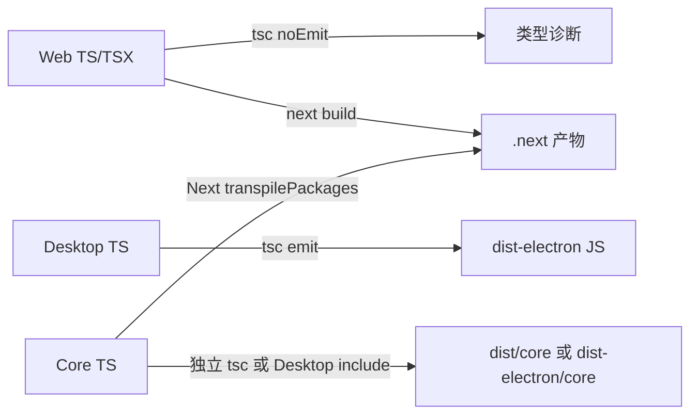

# C07：`noEmit` 检查源码，`outDir` 才决定 TypeScript 写到哪里

## 为什么 Web 不产 JS，页面仍能运行

C06 已算出 Web tsconfig 含 `noEmit: true`，Desktop 与 Core 则配置了输出目录。初学者常把 `tsc` 同时理解成“检查类型”和“生成 JavaScript”，于是产生疑问：Web 不让 TypeScript 输出 JS，Next 页面怎样运行？

答案是：类型检查器与框架 bundler 可以是两个消费者。Web 把 JS 生成交给 Next；Desktop 主进程需要 `tsc` 生成 Node 可加载文件；Core 当前既作为源码被 Next 转译，也可能被 Desktop 编译链一起输出。

## 三种消费者



图中两根从 Core 出发的箭头表示不同构建上下文，不表示每次命令都会同时执行两条。选择 `pnpm build` 时主要进入 Next；选择 Desktop build 时才展开桌面链。

## 第一段源码：Web 的检查合同

[Web manifest 第 5—12 行](../../../../packages/web/package.json#L5) 将 `type-check` 定义为 `tsc --noEmit`； [Web tsconfig 第 3—6 行](../../../../packages/web/tsconfig.json#L3) 也设置 `noEmit: true`。脚本参数与配置意图一致：这个命令只应产生诊断和增量缓存，不负责部署 JS。

Web 的 `build` 是 `next build`。Next 自己处理 TS/TSX 转换、服务端 bundle、浏览器 bundle 和 `.next` 目录。不能因 `tsc` 不 emit 就说 TypeScript 源码被浏览器直接执行。

## 第二段源码：Desktop 的输出路径

[Desktop tsconfig 第 3—12 行](../../../../packages/desktop/tsconfig.json#L3) 选择 CommonJS、Node resolution 和 `outDir: ../../dist-electron`。 [Desktop manifest 第 8—10 行](../../../../packages/desktop/package.json#L8) 的 `dev` 启动 `tsc -p tsconfig.json --watch`，而 Electron 等待 `../../dist-electron/desktop/src/main/main.js` 出现后再启动。

具体状态变化是：

```text
packages/desktop/src/main/main.ts
→ tsc 读取 Desktop tsconfig
→ 按 rootDir 推导相对目录
→ 写入 dist-electron/desktop/src/main/main.js
→ wait-on 看到文件
→ electron 加载该 JS
```

如果输出路径或目录结构改变，而 wait-on 与 `main` 不同步，TypeScript 可以成功，Electron 仍会等错文件。

## 第三段源码：Core 的两个输出身份

[Core tsconfig 第 16—21 行](../../../../packages/core/tsconfig.json#L16) 开启 declaration、composite、emit，并把输出指向 `dist/core`。与此同时， [Core manifest 第 5—19 行](../../../../packages/core/package.json#L5) 的 `main`、`types` 与 exports 都指向 `src/*.ts`，不是 `dist/core`。

这说明当前 Core package 首先是**源码导出包**；`dist/core` 是可生成产物，但 manifest 没把它声明为包的默认消费入口。Desktop 又通过 tsconfig include 和相对 import 把部分 Core 源码编译进 `dist-electron`。这是一组并存路径，不能用“Core build 一次，所有消费者都吃 dist”来概括。

## 编译流水线的五个独立结果

| 结果 | 典型工具 | OriginOS 路径 | 消费者 |
| --- | --- | --- | --- |
| 类型诊断 | `tsc --noEmit` | 终端，无 JS | 开发者/CI |
| JS bundle | Next/Webpack | `.next` | Next server 与浏览器 |
| Node JS | `tsc` | `dist-electron` | Electron main/worker |
| 类型声明 | `tsc declaration` | `dist/core/**/*.d.ts` | TS consumers/编辑器 |
| package/release | electron-builder | `release` | 用户机器 |

任何一列成功都不能自动替代下一列。声明文件生成成功不代表 JS bundle存在；安装包生成成功也可能因 `ignoreBuildErrors` 含有已知类型问题。

## `declaration`、`declarationMap` 与 `composite`

Core 配置同时启用三项：

- `declaration` 生成 `.d.ts`，描述公共类型形状；
- `declarationMap` 让类型声明可映射回源码，便于编辑器跳转；
- `composite` 为项目引用/增量构建提供约束，并通常生成 tsbuildinfo。

但 Core manifest 的 `types` 目前直接指向 `src/index.ts`。所以生成声明是一种构建能力，当前 workspace 源码消费路径不一定使用它。若未来将 manifest `types` 改指 dist，必须保证 build 在消费前完成，并把声明纳入打包/发布文件。

## `rootDir` 如何影响输出形状

Core 明确 `rootDir: src`，所以 `src/lib/paths.ts` 对应输出应落在 `dist/core/lib/paths.js`，不会保留顶层 `src` 目录。

Desktop 未明确 rootDir，且 include 同时跨 `packages/desktop/src` 和 `packages/core/src/...`。TypeScript 会寻找公共源根，使输出保留 `desktop/src` 与 `core/src` 段。这正是 Desktop manifest `main` 指向 `dist-electron/desktop/src/main/main.js` 的原因。

若开发者只按 Core 的 rootDir 心智推测 Desktop 输出，就会等待错误路径。

## source map 与声明 map 为什么不等于源码

source map/声明 map帮助调试和跳转，内容从构建生成。builder 配置排除了 `**/*.map`，用户安装包中可能没有它们。发生生产错误时，开发环境堆栈能映射源码，不保证发布环境也能。

修复仍应落在 `.ts/.tsx/.mts` 源文件；map 只能作为定位证据。

## Next transpile Core 与独立 Core emit 的差别

Next 从 Core exports 读取 TS 源码，将其编入自己的服务端/客户端图。它只处理 Web 实际可达的模块，并应用 Next/Webpack 的环境分支。

Core `tsc` 则从 Core include 根集合出发，生成通用 JS/声明并排除指定测试/模块。两条图的入口、exclude、模块转换和产物都不同。因此可能出现：Next 用到的某个 Core 文件能编译，而独立 Core tsc 因另一个未被 Web 引用的文件失败；反之也可能因 browser/Node 边界导致 Next 失败。

## 一个可计算路径例子

输入文件：

```text
packages/desktop/src/main/services/agent-session-service.ts
```

它被 Desktop include 匹配；编译器跟随其跨包相对 import 进入 Core；公共源根包含 `packages`；outDir 是根 `dist-electron`。于是 Desktop 主文件与所需 Core 文件按原层级写入 dist-electron。electron-builder 再从 package 内整理后的 dist-electron 取文件。

如果输出只有 Desktop JS、没有被相对 require 的 Core JS，运行会在模块加载阶段失败。检查“tsc 退出码”和“require 目标是否生成”比只看 main.js 更完整。

## 陈旧产物怎样制造假证据

watch 编译失败后，旧 JS 通常仍在磁盘。Electron 可能继续加载旧文件，看起来“修改没生效”；也可能新 main 引用了未生成的新模块而崩溃。

恢复框架：记录编译开始时间 → 找到第一条 TypeScript 错误 → 比较目标 JS mtime → 停止旧 Electron → 修源码并重建 → 再启动。直接手改 JS 会破坏证据链。

## 为 emit 建立 Given/When/Then 测试

- Given：临时目录包含最小 Desktop/Core 源文件和目标 tsconfig。
- When：执行 `tsc -p`。
- Then：预期 JS 出现在与 `main`/worker 消费路径一致的位置，不在仓库根散落源同名 JS。

再给错误 fixture：引入类型错误，断言非零退出且后续 electron 启动步骤不执行。这比只断言“dist 目录存在”更能固定流水线。

## 正常、失败与恢复

| 状态 | 现象 | 首查证据 | 恢复方向 |
| --- | --- | --- | --- |
| Web type-check 成功 | 无 JS 输出 | `noEmit`、退出码 | 属于预期，不要寻找 dist |
| Next build 成功 | `.next` 更新 | Web build script、`.next` | 不能据此确认 Desktop JS |
| Desktop tsc 成功但 Electron不启动 | wait-on 持续等待 | `outDir` 与目标路径 | 对齐输出路径/入口 |
| Core dist 存在但 Web 用旧逻辑 | manifest/Next 仍解析 src | exports、transpilePackages | 检查真正消费入口 |
| 旧产物掩盖失败 | Electron 加载历史 JS | 清理时间、mtime、构建日志 | 清理后重建并检查退出码 |

## 测试证据与缺口

本章没有运行 TypeScript 编译，因为当前 package exec 找不到 `tsc`。源码可以证明预期输出路径与消费关系，不能证明当前 checkout 能生成这些产物。C17 还会解释为何现成 `dist` 不能替代源码构建证据。

当前证据等级为：配置事实已核对；路径推导基于 TypeScript 配置语义与 manifest 消费路径；现场 emit 未执行；发布加载未验证。恢复依赖后，验证顺序应是 showConfig → tsc emit → 文件清单 → Node/Electron 加载 → builder 解包。

## 源码实验室：三个配置怎样产生三种产物承诺

Web 的配置片段只承诺检查，不承诺写 JS，见 [Web tsconfig 第 1—6 行](../../../../packages/web/tsconfig.json#L1)：

```json
{
  "extends": "../../tsconfig.base.json",
  "compilerOptions": {
    "incremental": true,
    "noEmit": true,
    "plugins": [{ "name": "next" }]
  }
}
```

`incremental` 允许写类型检查缓存；所以 `noEmit` 的准确含义是“不输出由 TypeScript 编译得到的 JS/声明”，不是绝对零文件副作用。页面 JS 由 Next 的编译链生成。

Desktop 选择另一组输出参数，见 [Desktop tsconfig 第 1—18 行](../../../../packages/desktop/tsconfig.json#L1)：

```json
{
  "extends": "../../tsconfig.base.json",
  "compilerOptions": {
    "module": "commonjs",
    "moduleResolution": "node",
    "outDir": "../../dist-electron",
    "types": ["node"]
  },
  "include": ["src/**/*.ts", "../core/src/modules/collaboration-runtime/sandbox/agent-worker.mts"]
}
```

这里的消费者是 Electron main 与 worker。include 跨入 Core，使共同源目录可能上移，最终输出保留 `desktop/src/...` 与 `core/src/...` 层级。不能只凭 outDir 猜测单个文件的完整落点。

Core 则同时输出 JS 和声明，见 [Core tsconfig 第 16—27 行](../../../../packages/core/tsconfig.json#L16)：

```json
"declaration": true,
"declarationMap": true,
"composite": true,
"noEmit": false,
"outDir": "../../dist/core",
"rootDir": "src",
"include": ["src/**/*.ts", "src/**/*.tsx", "src/**/*.mts"]
```

`rootDir: src` 使 `src/lib/foo.ts` 对应 `dist/core/lib/foo.js`；declaration 另产生 `.d.ts`。但 Core manifest 当前 main/exports 指向 `src`，所以产物存在不等于普通 workspace import 正在消费它。

### 一次陈旧产物诊断

若源码修改后 Electron 仍表现旧逻辑，先确认运行命令加载的 main 路径，再比较源文件时间与 `dist-electron` 对应 JS，最后确认 watch 进程是否成功重编译。直接改输出 JS 只能临时改变症状；下一次编译会覆盖它，源码和声明也继续不一致。

### Given/When/Then

- Given：Desktop tsconfig 可解析，目标源文件属于 include。
- When：运行 `pnpm --filter @originos/desktop build`。
- Then：退出为零应产生 CommonJS 输出；还需检查预期文件路径与 require 才能证明消费者可用。
- 缺口：当前环境缺少依赖，尚无本次构建通过证据。

## 小实验与口头验收

1. 为 Web type-check、Web build、Desktop build 各写一个预期副作用。
2. 若把 Desktop `outDir` 改成 package 内 `dist-electron`，至少需要同步哪些消费者？
3. 为什么 Core `dist/core` 存在不代表 Web 一定读取它？
4. 解释“检查成功”“编译成功”“运行成功”三种证据的停止边界。

### 实验参考推演

第1题：Web type-check预期只有诊断；Web build预期`.next`；Desktop build预期adapter/Web产物、根与package dist-electron等阶段结果。

第2题至少同步Desktop main字段、wait-on路径、builder source、prepare/verify脚本和任何运行path resolver。

第3题因为Core manifest/Next指向src，dist只是另一条生成路径；必须从consumer import与exports反向证明。

第4题：检查只证明静态合同范围；编译证明生成结果；运行证明宿主加载/行为。每层都可能有后续失败。

## 源码阅读顺序

1. 从Web/Desktop/Core manifest确定消费者命令与入口。
2. 对照各tsconfig的noEmit/outDir/rootDir/declaration。
3. 从main/wait-on/builder反向找到实际消费产物。
4. 搜索Core manifest是否指dist，避免假设。
5. 最后检查现有产物mtime；它只能辅助，不能替构建退出码。

## 迁移验收：把Core改为dist-first package

需要让main/types/exports指dist，建立消费者前置build，处理Next transpilePackages是否仍需要，保证Desktop不重复编译两份Core，发布声明/JS完整，并清除旧src直连。迁移期间可提供双入口，但要防止同一singleton加载两份实现。

这是一项跨包架构变更，不应在修一个模块错误时顺手完成。

下一课进入 import：即使文件成功生成，消费者是否可以从任意内部路径导入，仍由 package 的公共出口决定。
