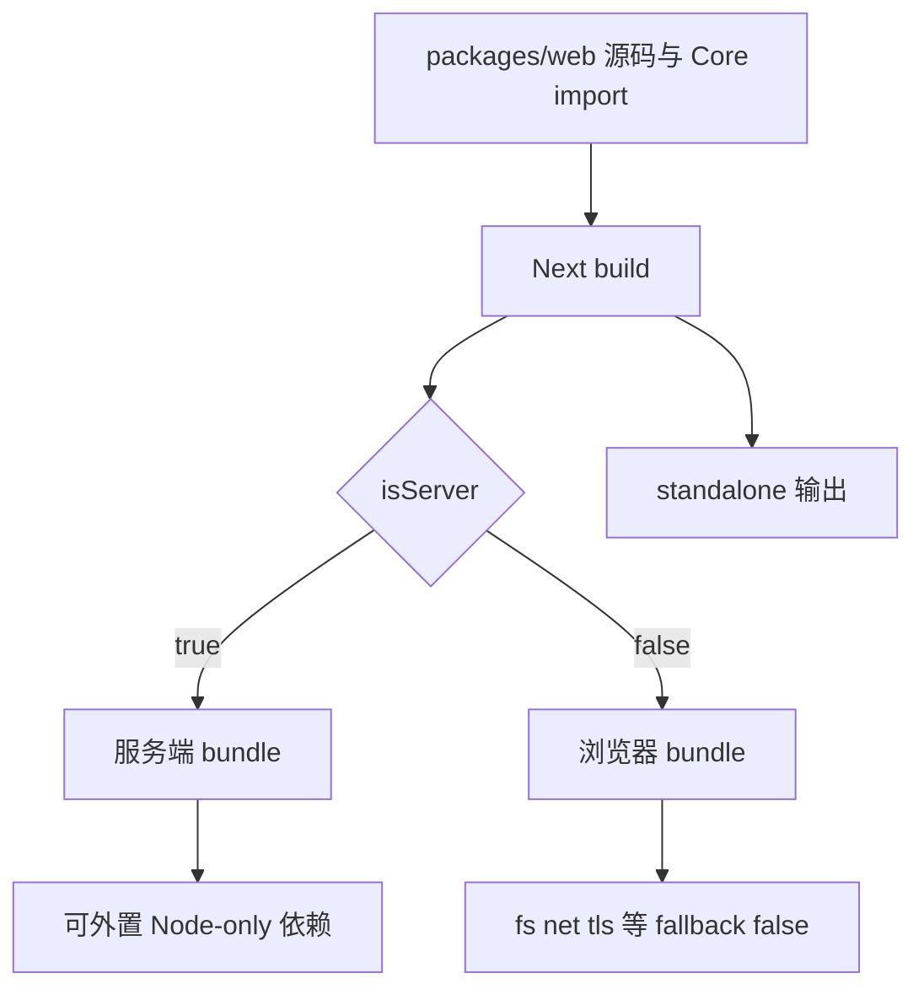

# C09：Next 构建的不是一个环境，而是服务端与浏览器两套世界

## 同一条 Skill 链为何有些代码能读文件，有些不能

Part B 的页面和 Route Handler 都位于 Web package，但前者最终运行在浏览器，后者运行在服务端。二者能使用的 Node API 不同。 [Next 配置](../../../../packages/web/next.config.mjs#L1) 正在处理这条双环境边界。

本章不精读页面与 API 业务；只解释配置怎样让 Core 源码、native 依赖、SVG 和 standalone 输出进入正确构建分支。

## 构建分叉



`isServer` 分支不是业务权限判断，而是 bundler 当前正在生成哪一侧代码。浏览器 fallback 为 false 表示“不提供这些 Node 内置模块的浏览器替代实现”，不是在运行时拦截任意文件访问。

## 第一段源码：standalone 与源码 package 转译

[Next 配置第 7—14 行](../../../../packages/web/next.config.mjs#L7) 设置 `output: 'standalone'` 并将 `@originos/core` 放入 `transpilePackages`。standalone 让 Next 生成可被桌面打包复制的自包含服务输出；transpilePackages 允许 Next 处理 Core 暴露的 TS 源码。

这与 C07 的事实对齐：Core manifest 指向 `src/index.ts`，Web 不是等待 Core 先发布一个 dist package，而是由 Next 处理这个 workspace 源码包。

## 第二段源码：开发态关闭缓存并忽略运行数据

[Next 配置第 15—22 行](../../../../packages/web/next.config.mjs#L15) 在 `dev` 时关闭 Webpack cache，并设置 watch 忽略 `node_modules`、`.git` 与 `data`。这降低运行数据不断变化导致重编译的可能性，但也意味着修改 `data/` 不应期待触发前端热更新。

若用户说“改了 data 文件页面没有自动刷新”，首先要区分业务是否主动重新请求数据；不能把 watch ignore 当作数据读取禁止。

## 第三段源码：资源、外置依赖与浏览器 fallback

[Next 配置第 24—64 行](../../../../packages/web/next.config.mjs#L24) 完成三件不同的事：

1. `.svg` 作为 asset/resource 发到 `static/media`；
2. `onnxruntime-node` 与 `node:` specifier 被标记为 CommonJS external；
3. 非服务端构建把 `fs`、`net`、`tls`、`child_process` 等 fallback 设为 false，并处理一组 problematic packages。

external 意味着 bundle 不把目标实现揉进去，运行环境仍要能找到它。它不是“忽略这个依赖”。这也是 Electron 打包必须准备 runtime dependencies 的原因之一。

## Webpack 回调的输入、分支与输出

`webpack(config, { isServer, dev })` 接收 Next 已构建的配置对象与环境标记，原地补充 rules、aliases、externals、fallback，最后返回 config。

执行顺序可展开为：

```text
输入 Next 默认 config
→ 若 dev，修改 cache/watchOptions
→ 总是追加 SVG rule
→ 总是追加 neural aliases
→ 规范化 externals 为数组
→ 追加 onnxruntime/node: external handlers
→ 若客户端，追加 fallback 与 problematic package handler
→ 返回同一配置对象
```

这个顺序很重要。若 `config.externals` 原本不是数组，代码先包装再 push；回调处理一个 request 后必须调用 callback，否则模块解析会悬停。

## SVG rule 改变 import 的数据形状

配置将 `.svg` 设置为 `asset/resource`，导入结果更接近一个生成资源 URL，而不是自动变成 React component。若组件写 `<Icon />` 却实际获得字符串，会出现类型/运行错误。

`generator.filename` 使用 name + hash + ext，hash 支持缓存失效。资源最终能否在 standalone/Electron 中访问，还需要 Next static 复制与正确 base 路径。

## `onDemandEntries` 只影响开发页面保活

`maxInactiveAge` 25 秒、`pagesBufferLength` 2 控制开发服务器如何保留非活动页面入口。它不是会话过期、Agent runtime timeout 或浏览器缓存时间。看到“25 秒”不能拿来解释 Skill 会话被销毁。

这是一条典型的相近数字误判：配置字段必须回到所属工具与对象生命周期。

## external 回调的三种结果

1. request 恰为 `onnxruntime-node`：返回 `commonjs onnxruntime-node`，bundle 留下运行时 require。
2. request 以 `node:` 开头：返回对应 CommonJS external。
3. 其他 request：空 callback，让 Webpack继续默认解析。

客户端 problematicPackages 使用 `includes`，匹配范围比精确相等更宽。它可能命中包的子路径，也要警惕意外包含同片段的请求。当前配置没有自动测试这些匹配边界。

## fallback false 的准确语义

Webpack 5 遇到客户端 import `fs` 时，不再自动注入浏览器 polyfill。设为 false 通常使模块不可用/替换为空解析，迫使代码不要依赖该 Node能力。

它不是运行时权限控制：用户在浏览器仍可使用 Web API；恶意代码也不是由这个配置全面 sandbox。安全边界还包括服务端 API、Electron contextIsolation/preload 和操作系统权限。

## `serverComponentsExternalPackages` 与普通 externals

experimental 配置列出 undici、Smithy handler、proxy-agent，指导 Server Components 服务端打包对这些包采用外置处理。Webpack callback 则可对更具体请求施加规则。两处都与 Node runtime 依赖有关，但作用入口不同。

准确教材表述应是“为服务端/构建提供外置提示和规则”，不把 experimental 名称写成永久稳定 API。Next 版本升级时必须重新核对配置字段是否仍有效。

## `outputFileTracingRoot` 为什么指向 monorepo 根

standalone 输出需要追踪 Web package 外的 workspace 文件。将 tracing root 设为 `../..`，让 Next 可以从 monorepo 根观察 Core/其他运行依赖；若只限定 Web 目录，外部 workspace 文件可能被漏掉。

追踪根扩大候选范围，不保证动态计算路径、native binary 或手工读取 templates 都被自动发现。Desktop builder仍显式复制额外资源。

## 三种构建错误的分层

| 错误 | 所属分支 | 典型证据 | 修复责任 |
| --- | --- | --- | --- |
| client 导入 `fs` | 非 server fallback | bundle 模块错误 | 移到 server/IPC 边界 |
| external 包运行时缺失 | server/Node runtime | require module not found | 安装/standalone/打包依赖 |
| Core TS 无法转译 | transpilePackages | Next compile log | Core语法/Next配置 |
| SVG 被当组件 | asset rule | 值为 URL/渲染错误 | 调整消费方式或 loader |
| 类型错但 build 继续 | ignoreBuildErrors | 独立 tsc 失败 | 修类型并恢复质量门 |

## 正向追踪：Core 中一个 Node-only 工具

若 Web server route 导入 Core Node-only 工具，Next 在 server 图中可外置相关依赖；同一个入口若被 client component 可达，客户端图会碰到 fallback/externals问题。判断文件是否带 `'use client'`、import 图是否跨界，比“它在 Web package”更关键。

## 构建验证应拆成哪几层

- 静态配置测试：调用 webpack callback 的伪 config，断言 dev/server/client 分支修改。
- Next build：确认 server/client bundle成功。
- standalone 检查：确认追踪文件与 runtime deps存在。
- Electron 集成：从打包资源启动本地服务并加载页面。

本章只完成第一层的源码推演，没有实际调用 callback fixture，也没有执行后三层。

## 第四段源码：构建放过错误是明确风险

[Next 配置第 67—74 行](../../../../packages/web/next.config.mjs#L67) 设置 output tracing root 到 monorepo 根，并配置：

```js
eslint: { ignoreDuringBuilds: true },
typescript: { ignoreBuildErrors: true },
```

所以 `next build` 成功不能证明 ESLint 与 TypeScript 通过。项目需要独立运行 `pnpm lint` 和 `pnpm type-check` 才能获得相应证据；当前这两个命令是否可运行还受依赖安装影响。

## 具体输入推演：浏览器组件误导入 `node:fs`

控制流是：组件进入客户端 bundle → Webpack 遇到 `node:fs` → 客户端 fallback 不提供实现 → 构建或运行出现模块问题。正确修复不是给浏览器 polyfill 一个完整文件系统，而是把文件读取放到服务端/Core/Electron 边界，再通过 API 或 IPC 适配给 UI。

## 测试证据与缺口

本章精读构建分支，没有执行 `next build`。配置中的忽略开关是源码事实；standalone 是否包含当前所有动态依赖、native 依赖能否在目标平台加载，必须由 C13 的打包验证脚本和实际构建证明。

如果补配置单测，Given 一个带非数组 externals 的最小 config；When 分别以 dev/server、dev/client、prod/server调用 webpack hook；Then 断言 cache/watch、fallback、rules 和 externals只在对应分支出现。它仍不证明真实 Next 内部 config 形状在升级后兼容，需要保留构建集成测试。

## 源码实验室：沿着 Webpack 回调执行一次真实分支

入口选项位于 [Next 配置第 7—15 行](../../../../packages/web/next.config.mjs#L7)：

```js
const nextConfig = {
  output: 'standalone',
  transpilePackages: ['@originos/core'],
  onDemandEntries: {
    maxInactiveAge: 25 * 1000,
    pagesBufferLength: 2,
  },
  webpack: (config, { isServer, dev }) => {
```

standalone 决定生产输出形态；transpilePackages 让 Next 编译 Core 源码；onDemandEntries 只影响开发服务器页面保活。三者不会互相替代。

当 `dev === true`，执行 [Next 配置第 16—22 行](../../../../packages/web/next.config.mjs#L16)：

```js
if (dev) {
  config.cache = false;
  config.watchOptions = {
    ...config.watchOptions,
    ignored: ['**/node_modules/**', '**/.git/**', '**/data/**'],
  };
}
```

输入是一份已有 Webpack config，输出仍是被修改后的同一配置对象。忽略 `data` 只是不监听其变化，不阻止服务端运行时读取数据，也不阻止 builder 复制其他资源。

浏览器分支位于 [Next 配置第 51—64 行](../../../../packages/web/next.config.mjs#L51)：

```js
if (!isServer) {
  config.resolve.fallback = {
    ...config.resolve.fallback,
    fs: false,
    net: false,
    child_process: false,
  };
  const problematicPackages = ['undici', 'proxy-agent', '@smithy/node-http-handler'];
  config.externals.push(({ request }, callback) => {
    if (problematicPackages.some(pkg => request.includes(pkg))) {
      return callback(null, 'commonjs ' + request);
    }
    callback();
  });
}
```

`fallback: false` 表示不为浏览器 bundle 注入这些 Node 模块的兼容实现。它不是安全沙箱；Node-only import 仍可能以构建错误、空模块或运行时路径差异暴露。external 回调的 `callback()` 表示交还默认处理，带 `commonjs ...` 才是显式外置。

### 输入推演：`node:fs`

服务端构建遇到 `node:fs` 时，前面的 node protocol external 回调可把它保留为 CommonJS 运行时依赖；浏览器组件若把同一依赖带进客户端图，则没有浏览器实现。正确修复是把文件系统逻辑留在 server/Core/desktop 边界，而不是给浏览器伪造 fs。

### 测试证据边界

配置单测可以分别调用 webpack 回调并断言 dev/isServer 分支；只有 `next build` 才会组合 Next 内部默认配置。当前配置还设置 `ignoreDuringBuilds` 与 `ignoreBuildErrors`，所以 build 成功不能替代 lint/type-check。

## 小实验与口头验收

1. 解释 `transpilePackages` 与 package `exports` 分别负责哪一步。
2. 为什么 external 不能理解成“依赖不需要安装”？
3. 给 `next build` 成功列出两项仍未证明的质量结论。
4. 从浏览器报 `fs` 不可用反推正确责任层，禁止用“加 polyfill”作为唯一答案。

### 实验参考推演

第1题：exports负责找到Core公共文件，transpilePackages负责让Next处理workspace TS包；任一缺失都可能在不同解析阶段失败。

第2题：external留下运行时require，反而要求Node/standalone/安装包能提供依赖。

第3题至少包括lint与type-check，因为配置显式忽略；还不证明Desktop packaging与真实启动。

第4题应把文件操作移到Route Handler/Core server/Desktop IPC，并给client一个受控请求合同；polyfill不能提供本机文件权限。

## 源码阅读顺序

1. 先读output/transpilePackages，确定产物形态与Core消费。
2. 顺着webpack函数按源码顺序标记dev和isServer分支。
3. 为每个external/fallback写一个具体request输入。
4. 读experimental tracing与外置配置，连接standalone。
5. 最后读ignore开关，重新界定build成功含义。

## 迁移验收：升级Next配置字段

升级Next前查官方版本对应的experimental/稳定字段，创建server/client fixture验证external与fallback，运行独立lint/type、Next build、standalone启动和Desktop集成。若新Next自动处理某external，移除自定义规则也要用产物与运行证据确认，不能因无警告就删除。

下一课沿着浏览器 bundle 进入样式：Tailwind 的 class 扫描、PostCSS 转换和 CSS 变量分别在哪一层发生？
