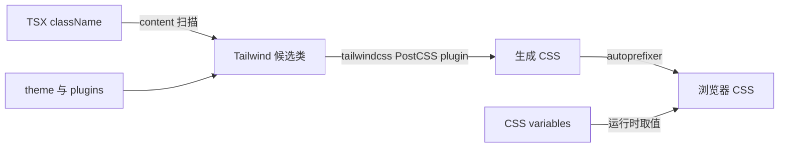

# C10：`className` 不是最终 CSS，必须经过扫描与转换

## 一个 Tailwind 类为什么有时“写了却没效果”

头脑风暴窗口使用大量 Tailwind class。源码里的 `bg-primary` 只是候选名称；Tailwind 要先扫描 content 范围，再根据 theme 生成 CSS，PostCSS 再把 Tailwind 与 autoprefixer 插入构建链。任何一层使用了错误配置，都可能表现为“组件渲染了但样式缺失”。

## 样式转换链



class 扫描决定“是否生成规则”，theme 决定“规则引用什么值”，CSS variables 决定运行时实际颜色。三者缺一，现象可能相似，排查点却不同。

## 第一段源码：真正的 Web content 范围

[Web Tailwind 配置第 1—6 行](../../../../packages/web/tailwind.config.ts#L1) 扫描 `./src/**/*.{js,ts,jsx,tsx,mdx}`。相对路径以加载配置时的 Web package 为基准，因此覆盖 `packages/web/src`。

根目录还存在 [根 Tailwind 配置](../../../../tailwind.config.ts#L1)，其 content 同样写 `./src/**/*`，但仓库根当前没有对应 Web src。配置存在不证明 Web 构建使用它；包级 PostCSS 从 Web cwd 启动时，应优先关联包级 Tailwind 配置。

这是一组真实的平行配置。教材不能把两份内容混成“一份全局主题”。

## 第二段源码：theme 从 CSS 变量取值

[Web Tailwind 配置第 7—54 行](../../../../packages/web/tailwind.config.ts#L7) 把 `primary`、`background`、`card` 等 token 映射到 `hsl(var(--...))`。Tailwind 只生成引用变量的规则；变量值需要由全局 CSS 在运行时定义。

因此：

- class 不在 content 扫描中 → 规则可能根本不生成；
- class 已生成但变量未定义 → 规则存在，颜色仍异常；
- 动态拼接 `bg-${color}` → 静态扫描可能看不到完整类名；
- 修改根配置 → 若 Web 实际加载包级配置，页面不变化。

## 第三段源码：动画与 typography 插件

[Web Tailwind 配置第 55—105 行](../../../../packages/web/tailwind.config.ts#L55) 定义 blur、saturate、keyframes、animation，并加载 `@tailwindcss/typography`。配置通过 TypeScript `Config` 类型获得静态形状检查；`require()` 能否在当前配置加载器中工作仍是实际构建问题，不能由类型标注证明。

## 逐层计算 `bg-primary`

给定 JSX：

```tsx
<button className="bg-primary text-primary-foreground">开始头脑风暴</button>
```

转换过程不是把 `primary` 写死成某个蓝色：

1. content scanner 在 TSX 字符串中发现完整候选类；
2. theme 查到 `primary.DEFAULT = hsl(var(--primary))`；
3. Tailwind 生成 `.bg-primary { background-color: hsl(var(--primary)); }`；
4. PostCSS 把规则放入输出并由 autoprefixer处理需要的兼容前缀；
5. 浏览器在当前元素作用域解析 `--primary`；
6. 变量随主题/根样式变化，最终像素才确定。

因此 Tailwind config 定义的是 token 映射，不是最终主题值。AGENTS.md 指定 `blue-600` 作为 Primary，而当前 Web theme 大量依赖 CSS variables；这可能由变量值映射到目标颜色，也可能存在规范差距。没有读取全局 CSS 变量前，不能断言实际像素就是 blue-600。

## 动态 class 为什么可能被漏扫

```tsx
const cls = `bg-${tone}`;
```

静态 scanner 看见的是片段而不是 `bg-primary` 完整词，可能不生成任何候选规则。正常恢复包括使用显式映射：

```ts
const toneClasses = {
  primary: 'bg-primary',
  destructive: 'bg-destructive',
} as const;
```

或在明确场景使用 safelist。不能用“运行时 tone 确实等于 primary”反驳构建时 scanner，因为二者发生在不同时间。

## `content` 范围也是依赖边界

Web 会渲染来自 `@originos/core/modules/collaboration-runtime/ui/...` 的组件。Web Tailwind content 只扫描 Web `src`，不会直接扫描 Core package。若 Core UI 自己含独特 Tailwind class 且 Web 源码从未出现，生产 CSS 可能缺规则。

这是配置审计必须询问的平行实现问题：共享 UI 的消费者是否把 provider 源码加入 content，或 provider 是否提供预构建 CSS？当前配置窗口没有给出这项保证。本章不宣称 Core UI 样式完整。

## 逐组读 theme 扩展

### 语义颜色

border/input/ring/background/foreground 与 primary/secondary/destructive 等来自 CSS variables，使暗色/主题切换可通过变量完成。语义名降低组件对具体色值的耦合，却要求变量合同稳定。

### 圆角

`lg = var(--radius)`，md/sm 依次减 2px/4px。若根变量小于减值，可能得到异常计算；配置没有运行时校验变量。

### acrylic blur/saturate

提供三档视觉 token。class 存在不保证浏览器/宿主合成性能满足 60fps；性能需要真实设备测量。

### keyframes 与 animation

keyframe 定义状态，animation 定义时长/easing并引用名称。名字错配会生成 animation 指向不存在 keyframe；当前配置可人工对照，尚无自动合同测试。

## typography 插件的角色

`@tailwindcss/typography` 生成 `prose` 等富文本样式，适合 Markdown 内容。插件加载成功只提供规则；组件仍要使用对应 class，且 Markdown sanitization/代码高亮属于另一层。

## PostCSS 插件顺序与停止边界

当前对象按 Tailwind、autoprefixer 顺序声明。Tailwind 展开指令/生成 utilities；autoprefixer基于浏览器目标补前缀。它们不负责 minify（由 Next 其他构建环节负责），也不读取 React state。

根与 Web 配置当前相同，不能因此认为永远等价。更可靠的做法是确认构建 cwd实际加载哪个文件，或消除无消费者的重复配置；本章只记录现状，不擅自重构。

## 正常、失败、恢复同框比较

| 状态 | CSS rule | CSS variable | 用户现象 | 恢复 |
| --- | --- | --- | --- | --- |
| 正常 | 存在 | 有效 | 颜色正确 | 无 |
| 扫描遗漏 | 不存在 | 可有 | class 无效果 | 修 content/显式类 |
| 变量遗漏 | 存在 | 未定义 | 颜色无效/继承异常 | 修全局变量作用域 |
| 错配置被加载 | 候选集合不同 | 可能有效 | 部分页面缺样式 | 确认 cwd与配置发现 |
| Core UI未扫描 | Web类正常、共享类缺 | 有效 | 共享组件局部裸样式 | 纳入 provider content/提供 CSS |

## 验证设计

静态测试可读取 config，断言关键 token、content glob、plugin 存在；构建测试用 fixture class 运行 Tailwind，断言生成 rule；浏览器测试再读取 computed style。只有第三层能证明最终像素，且仍需主题/响应式矩阵。

## 第四段源码：PostCSS 只做两个插件

[Web PostCSS 配置](../../../../packages/web/postcss.config.mjs#L1) 按顺序声明 `tailwindcss` 和 `autoprefixer`。根 [postcss.config.mjs](../../../../postcss.config.mjs#L1) 内容相同，也是平行配置。它们当前值一致，减少了行为差异，但重复仍可能日后漂移。

## 失败诊断：`bg-primary` 没颜色

1. 在浏览器/构建产物中确认对应 CSS rule 是否存在。
2. 若不存在，检查文件是否在 content glob 内、类名是否可静态发现、实际加载哪份 Tailwind 配置。
3. 若规则存在，检查 `--primary` 是否在当前主题作用域定义。
4. 若只有某浏览器异常，再检查 PostCSS/autoprefixer 与具体 CSS 支持。

这比一上来增加 `!important` 更能定位责任层。

## 测试证据与缺口

配置文件没有对应的自动化断言证明根/包级加载优先级，也没有在本章运行 CSS 构建。现有源码可以证明两份配置并存、Web content glob 的范围与 theme 字段；实际生成 CSS 需由 Next build 或专门 PostCSS 测试验证。

Given Web TSX 与一个 Core UI fixture；When 使用实际 Web PostCSS/Tailwind配置构建；Then 应断言 Web class 与共享 UI class均生成，并在缺变量 fixture 中明确失败表现。当前教材把“Core UI是否被扫描”记录为缺口，不把配置存在写成覆盖证明。

## 源码实验室：从一个 class 追到最终颜色值

候选类扫描从 [Web Tailwind 配置第 3—6 行](../../../../packages/web/tailwind.config.ts#L3) 开始：

```ts
const config: Config = {
  content: [
    "./src/**/*.{js,ts,jsx,tsx,mdx}",
  ],
```

只有匹配文件中的可识别类名才进入候选集合。字符串拼接 `bg-${tone}` 通常无法让静态扫描枚举所有结果；需要完整字符串映射或 safelist，而不是扩大到整个仓库掩盖问题。

语义 token 来自 [Web Tailwind 配置第 9—18 行](../../../../packages/web/tailwind.config.ts#L9)：

```ts
colors: {
  background: "hsl(var(--background))",
  foreground: "hsl(var(--foreground))",
  primary: {
    DEFAULT: "hsl(var(--primary))",
    foreground: "hsl(var(--primary-foreground))",
  },
},
```

这一步只生成引用 CSS 变量的规则。真实暗色值位于 [globals.css 第 12—22 行](../../../../packages/web/src/styles/globals.css#L12)：

```css
:root {
  --background: 214 100% 3%;
  --foreground: 210 40% 98%;
  --primary: 217 91% 60%;
  --primary-foreground: 222 47% 11%;
}
```

因此 `bg-primary` 的计算链是：扫描得到类名 → Tailwind 生成 `background-color: hsl(var(--primary))` → 浏览器在当前作用域解析 `--primary`。类存在但变量缺失时，问题不在 content；变量正确但类未生成时，问题才在扫描或构建。

PostCSS 入口见 [Web PostCSS 配置第 1—9 行](../../../../packages/web/postcss.config.mjs#L1)：

```js
const config = {
  plugins: {
    tailwindcss: {},
    autoprefixer: {},
  },
};
export default config;
```

Tailwind 展开指令和 utilities，autoprefixer 再按目标环境补供应商前缀。配置没有压缩器，因此不能把 CSS 压缩效果归功于这个文件；生产压缩若存在，应继续追 Next 构建链。

### 可执行诊断顺序

遇到 `bg-primary` 无效：先在生成 CSS 中搜索规则，再在 DevTools 检查变量值与作用域，之后确认 global CSS 是否导入，最后才清理 `.next` 重建。这个顺序用证据区分“没有生成规则”和“规则生成但计算值无效”。

### 测试缺口

仓库当前没有针对 content 扫描和 token 解析的配置测试。组件测试看到 className 只能证明字符串存在；构建产物或浏览器 computed style 才能证明最终样式。

## 小实验与口头验收

1. 将一个教学组件想象放在 `templates/demo.tsx`，预测 Web content glob 是否扫描它。
2. 区分“规则没生成”与“变量没定义”的浏览器证据。
3. 为什么修改根 Tailwind 配置可能不影响 Web？
4. 解释 Tailwind、PostCSS、autoprefixer、CSS variables 四者的责任顺序。

### 实验参考推演

第1题不会被Web `./src/**/*`扫描。目录同在仓库不等于content成员。

第2题在DevTools查生成rule：不存在先查scanner；存在再查computed variable与作用域。

第3题构建cwd有package级平行配置，真实调用点未证明根配置被加载。

第4题：Tailwind扫描/生成，PostCSS承载转换链，autoprefixer补兼容，CSS variable在运行时给token取值。

## 源码阅读顺序

1. 从一个实际className开始，不从整份theme表开始。
2. 检查其源码文件是否在content glob。
3. 在theme找到token/keyframe/plugin责任。
4. 打开package PostCSS确认转换插件。
5. 到全局CSS查变量值；本章在此停止并记录后续UI范围。

## 迁移验收：让Core共享UI样式进入Web

先盘点Core UI是否包含Web未出现的Tailwind类；选择把Core源码路径加入content、为Core构建独立CSS或减少Core UI职责；构建fixture确认规则；检查扫描范围扩大后的构建耗时；浏览器验证主题变量。不能把整个monorepo无差别加入content，以免扫描产物/模板并放大CSS与性能风险。

下一课重新审视 Web package：它是产品的界面与 HTTP 边界，却不是整个 OriginOS，也不拥有 Electron 主进程能力。
