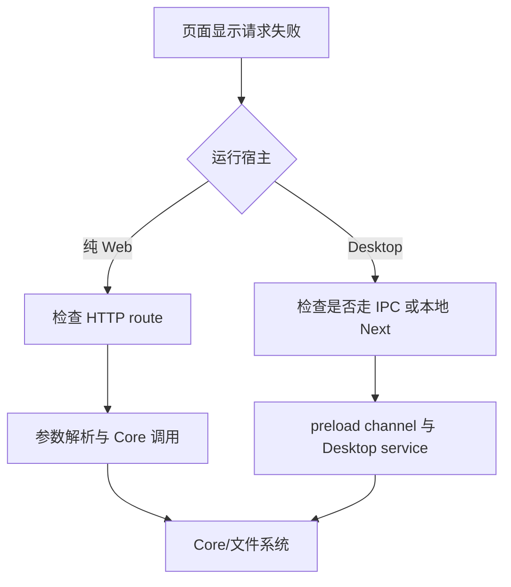

# C11：Web package 能呈现产品，但它不是整个产品

## 浏览器里看见 OriginOS，为什么还需要其他包

Part B 的可见链主要发生在 Web：页面、组件、Zustand、Next API。于是容易得出“Web 就是 OriginOS”的结论。C03 的依赖图已经否定这一点：Web 直接消费 Core 与 adapter；桌面态还需要 Electron main、IPC、standalone 服务和打包资源。

本章给 Web package 画责任边界，不深入任何业务实现。

## Web 的三种角色

```mermaid
flowchart TD
    W[@originos/web] --> UI[浏览器 UI]
    W --> API[Next Route Handlers]
    W --> SB[standalone 服务产物]
    UI -->|调用或适配| API
    W -->|workspace dependency| C[@originos/core]
    W -->|workspace dependency| A[@originos/pi-agent-adapter]
    D[@originos/desktop] -->|启动与装载| SB
```

Web 同时产生客户端与服务端材料，但不因此拥有 Desktop 主进程。Desktop 可以消费 Web standalone，依赖方向仍不等于 Web 反向依赖 Desktop UI 实现。

## 第一段源码：Web manifest 的运行入口

[Web manifest 第 1—13 行](../../../../packages/web/package.json#L1) 只提供 `dev`、`build`、`start`、`lint`、`type-check` 与 Vitest 脚本。没有 Electron `main` 字段，也没有 electron-builder 命令。`next start` 消费已完成的 Next build；它不会自动创建 `.next`。

给定 `pnpm start`：根脚本过滤到 Web → Web `next start` → 期望已有 `.next`。若从全新 checkout 直接 start 失败，责任首先在“缺构建前置条件”，不是首页组件。

## 第二段源码：依赖声明说明 Web 是上层消费者

[Web manifest 第 14—46 行](../../../../packages/web/package.json#L14) 同时列出 UI 包、Next、React、Core、adapter 和 Node/native 相关依赖。依赖在 manifest 中存在，不等于任意依赖都能进入客户端 bundle；C09 的 `isServer` 分支继续限制使用位置。

这解释了两层约束：

1. package 层：Web 能否解析某依赖；
2. bundle 层：该依赖能否进入浏览器或服务端目标。

## 第三段源码：构建输出为 Desktop 留接口

[Next 配置第 8—10 行](../../../../packages/web/next.config.mjs#L8) 的 standalone 和 transpilePackages，使 Web 构建结果可以被 Desktop 构建脚本进一步准备。 [Desktop manifest 第 10 行](../../../../packages/desktop/package.json#L10) 明确调用 `prepare-web-standalone.js`。

这里是“Desktop 消费 Web 产物”，不是“Web 运行时调用 Desktop package”。方向判断必须基于调用脚本和 import，而不是产品界面看起来属于谁。

## App Router 的两个执行边界

`packages/web/src/app` 同时含页面/layout 与 `api/**/route.ts`。目录同名并不代表执行位置相同：客户端组件在浏览器，Server Components/Route Handler在 Next server。

AGENTS.md 要求 app 只承担页面/API 边界：解析输入、拼装环境、调用 Core/service、映射响应。业务算法放入 route 虽然能被 Next 执行，仍违反所有权；可运行与架构合规必须分别检查。

## Web package 的依赖为何包含 server-only 包

Next package 同时拥有 server graph，所以 Web dependencies 中出现 `onnxruntime-node`、`undici` 等并不自动错误。关键在 import 可达性：

- 仅 Route Handler/server module 可达：有机会在 Node 环境运行；
- client component 可达：会进入 C09 的浏览器 fallback/external风险；
- 动态路径读取：standalone tracing 可能漏掉，需显式打包。

因此依赖清单只能确认“包允许消费”，不能确认“消费发生在正确侧”。

## `next start` 与 standalone server不是同一个启动包装

Web `next start` 从 package cwd 消费 `.next`；Desktop 打包准备脚本会复制 `.next/standalone`，在 resources 下以另一目录结构启动本地服务。二者共享 Next 构建结果，却拥有不同 cwd、资源根与环境变量。

纯 Web start 通过不能证明复制后的 standalone 路径正确；standalone 启动也不能证明 Electron renderer 已加载它。

## 浏览器、Next server、Electron renderer、Electron main

| 环境 | 所属代码入口 | 可直接使用 | 不应直接假设 |
| --- | --- | --- | --- |
| 浏览器 | client component | DOM、fetch | fs、child_process |
| Next server | route/server component | Node API、Core server逻辑 | Electron IPC 全局存在 |
| Electron renderer | Web UI + preload bridge | DOM、受控 bridge | unrestricted Node（取决安全配置） |
| Electron main | Desktop main | Electron/Node、本地文件 | React DOM |

同一个产品动作可以跨四行。组件层应依赖服务/adapter而不是根据宿主复制业务逻辑。

## Web API 与 Desktop IPC 复用 Core，不等于合同相同

两个入口可能最终调用同一 Core service，但 Web 要解析 HTTP body/path/query 并返回 status/JSON；Desktop 要处理 IPC channel、payload、异步事件与窗口生命周期。必须分别验证输入字段、身份范围、错误映射和清理语义。

Part C 只建立这个边界意识，具体 Route/IPC合同在 I/K 深入。现在不能由“都用 Core”推出平台行为一致。

## 可计算输入：Skill 内容读取

纯 Web：SkillDialog → HTTP/服务适配 → Next server 读取 Skill 定义。

Desktop：同一 UI 可能通过 Electron adapter/IPC → Desktop service → Core Skill loader。若平台判断选择不同入口，返回形状需要保持 UI 可消费；源目录/输出目录仍可能由宿主环境决定。

这也解释为什么 `.claude/skills` 只读规则不能只放在 React组件：真正写文件的服务/工具层必须守住路径边界。

## 故障树：页面请求 500



第一问是宿主与入口，不是直接归咎 Core。两条路径汇合后仍要保留各自错误映射证据。

## Web package 验证矩阵

| 目标 | 最小命令/验证 | 证明 | 不证明 |
| --- | --- | --- | --- |
| 类型 | Web type-check | include 范围内类型 | Core excluded文件 |
| lint | Web lint | Web src规则 | Desktop/Core全仓 |
| 单测 | Web Vitest | jsdom下断言 | 真实浏览器/Electron |
| build | Next build | bundle生成 | 独立类型/lint（被忽略） |
| start | Next server请求 | Web build可服务 | Desktop packaging |
| Desktop host | 打包/开发集成 | 宿主连接 | 目标平台签名更新 |

## 具体输入推演：头脑风暴页面在两种宿主中运行

| 阶段 | 纯 Web 开发态 | Electron 桌面态 |
| --- | --- | --- |
| 页面来源 | Next dev server | 打包内 standalone 服务 |
| UI 代码 | 同一 Web package | 同一 Web package |
| 本地能力边界 | API/浏览器限制 | preload/IPC 可提供桌面适配 |
| 进程拥有者 | Node + 浏览器 | Electron main + renderer + Next server |
| 产物准备 | `.next` 开发缓存 | `.next` standalone 被复制进 resources |

同一 React 组件不等于同一运行环境。代码必须通过适配层判断能力，而不是在组件中假设 `fs` 或 Electron 永远存在。

## 失败诊断：Web 正常，Desktop 白屏

优先检查 Desktop 是否成功启动/找到 standalone 服务、renderer URL 是否正确、静态资源是否被打包。只有确认桌面宿主已经加载同一页面且组件自身报错，才进入 UI 调试；提前修改 Web 业务组件不能修复宿主装载问题。

## 测试证据与缺口

Web manifest 与 Desktop 构建脚本证明两者存在产物消费关系。没有运行 Desktop package，因此不能证明当前 standalone 在打包态可启动；Web Vitest 也不覆盖 Electron 宿主启动。

Given 同一头脑风暴入口；When 分别在纯 Web 与 Electron 宿主打开并请求 Skill 内容；Then 应对照请求字段、返回内容、产物 cwd 与错误状态。只有跨入口合同测试实际断言的共同部分，才可写成平台一致。

## 源码实验室：Web 包的三个边界信号

[Web manifest 第 5—12 行](../../../../packages/web/package.json#L5) 把可直接启动的对象限定为 Next 与 Vitest：

```json
"scripts": {
  "dev": "next dev",
  "build": "next build",
  "start": "next start",
  "lint": "eslint src --ext .ts,.tsx",
  "type-check": "tsc --noEmit",
  "test": "vitest run"
}
```

没有 Electron main、builder 或 IPC 启动命令，所以 Web 包不能单独构成桌面产品。`next start` 的输入是已有生产构建；它不会替调用者先执行 `next build`。

包依赖再次表明 Web 是上层消费者，见 [Web manifest 第 14—20 行](../../../../packages/web/package.json#L14)：

```json
"dependencies": {
  "@originos/core": "workspace:*",
  "@originos/pi-agent-adapter": "workspace:*",
  "@anthropic-ai/sandbox-runtime": "^0.0.51"
}
```

依赖存在只证明 Web 获准解析这些包，不证明每个模块适合进入浏览器。Server Component、Route Handler 和客户端组件必须继续按宿主能力分开。

[Next 配置第 7—10 行](../../../../packages/web/next.config.mjs#L7) 给 Desktop 留下构建接口：

```js
const nextConfig = {
  output: 'standalone',
  transpilePackages: ['@originos/core'],
```

standalone 输出由 Desktop 的准备脚本再次整理。Web build 成功只证明这个阶段产物形成；窗口创建、renderer URL、IPC 和安装包资源仍属于后续消费者。

### 故障反推与测试边界

浏览器访问 API 得到 500 时，先区分客户端请求是否发出、Route Handler 是否进入、Core 服务是否抛错和文件副作用是否发生。Web 组件测试不能替代 Route/Core 集成测试；Desktop 白屏还需检查窗口 URL 与静态资源路径。

```text
浏览器组件
  -> HTTP 请求
  -> Next Route Handler
  -> Core 公共服务
  -> 文件系统或 Agent 副作用
```

这条窗口是诊断顺序，不是说所有 Web 功能都必经五层。每向下一层移动，都要先找到真实调用点；不能因为最终可能调用 Core，就跳过 Route Handler 的输入解析与错误映射。

## 小实验与口头验收

1. 解释 Web 的 UI、API、standalone 三种角色。
2. 为什么 Web dependencies 中有 Node 包不代表客户端可直接使用？
3. 从 `pnpm start` 失败反推构建前置条件。
4. 给“Web 可用、Desktop 白屏”列出宿主优先的证据顺序。

### 实验参考推演

第1题需说明UI在浏览器、API在Next server、standalone是可复制服务产物；三者属于同包不同消费者。

第2题manifest只授权解析；client/server import图由Next配置和源码边界决定。

第3题`next start`消费已有`.next`，全新checkout应先build；start不编译源码。

第4题按standalone/server进程→URL/静态资源→renderer控制台→业务组件，不应先改Core或IPC。

## 源码阅读顺序

1. Web manifest读scripts与直接workspace依赖。
2. Next配置读standalone/transpile与双环境。
3. Desktop build脚本找Web产物消费者。
4. 再选一个页面/route确认运行侧；业务正文留给I/J。
5. 对同一能力搜索HTTP和IPC平行入口，登记而不混写合同。

## 迁移验收：新增只允许桌面使用的能力

不要把Electron API直接导入通用client组件。应在Desktop main实现能力，经preload/IPC暴露最小合同，Web service adapter检测宿主并调用；纯Web分支给明确不支持状态或服务端替代。测试需覆盖Electron入口、纯Web边界与UI状态，且不能用一个Core单测宣称两入口一致。

下一课展开 Desktop `dev`：它不是一个进程，而是三个长期进程按条件协作。
