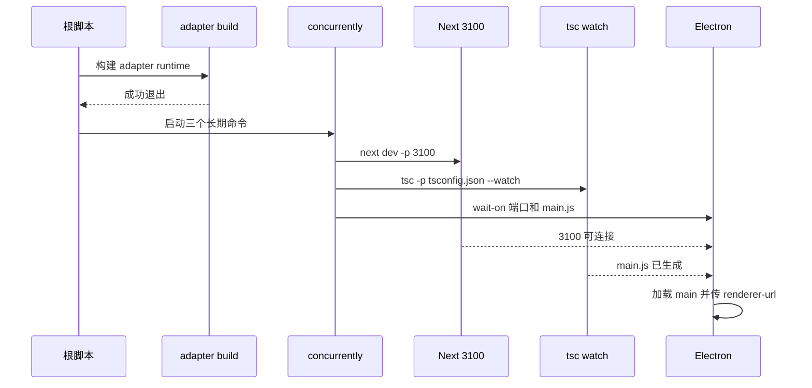

# C12：Desktop 开发态是三个长期进程，不是一个窗口命令

## 为什么 Electron 窗口可能一直不出现

根 `pnpm desktop:dev` 进入 Desktop package 后，会先构建 adapter，再用 `concurrently` 启动 Next dev、TypeScript watch 与 Electron。Electron 命令还用 `wait-on` 等待端口和主进程 JS。任一前置条件未满足，用户看到的都可能只是“没有窗口”。

## 启动时序



`concurrently` 表示三条命令并行存活；`wait-on` 只位于 Electron 那一支，避免它早于两个依赖启动。等待条件成立也不等于页面业务健康，只证明端口与文件出现。

## 第一段源码：完整 dev 字符串

[Desktop manifest 第 6—10 行](../../../../packages/desktop/package.json#L6) 的 `dev` 包含四个关键工具：

- `pnpm --filter ... build`：一次性前置构建 adapter；
- `concurrently`：并行管理长期命令；
- `tsc --watch`：持续写 Desktop JS；
- `wait-on`：在启动 Electron 前等待资源。

Next 被显式指定端口 `3100`，Electron 接收 `--renderer-url=http://localhost:3100`。若只改一处端口，wait-on、参数或实际服务器会失配。

## 第二段源码：TypeScript 为什么输出到根目录

[Desktop tsconfig 第 2—17 行](../../../../packages/desktop/tsconfig.json#L2) 输出 `../../dist-electron`，include Desktop `src` 与一个 Core worker。rootDir 未在子配置显式设置，继承的 base 也没有 rootDir；TypeScript 会根据公共源目录计算输出层级，这与目标路径中出现 `desktop/src/main` 相呼应。

不要只看到 `outDir` 就假设输出必定是 `dist-electron/main.js`。实际目录结构由源文件公共根、include 和输入路径共同决定。

## 三个进程分别拥有什么状态

| 进程 | 长期状态 | 输入 | 输出/事件 | 退出影响 |
| --- | --- | --- | --- | --- |
| Next dev | 路由、bundle、HMR、3100端口 | Web/Core源码 | HTTP、静态资源、HMR | renderer无法加载/更新 |
| tsc watch | TS文件图、增量诊断 | Desktop + worker源码 | dist-electron JS | main代码陈旧或缺失 |
| Electron | 窗口、IPC、主进程服务 | main.js、renderer URL | 原生窗口/IPC | 桌面应用结束 |

它们共享产品动作，却不共享内存。Next HMR 更新 renderer 不会替换 Electron main；tsc watch 更新 JS 后，已运行 main进程通常也不会自动重启，除非外层另有监听机制。当前 script 没显示自动重启 Electron。

## `concurrently` 的失败传播需要实际验证

命令字符串没有显示 `--kill-others-on-fail` 等选项。一个子进程退出后其他进程是否保留、最终退出码如何组合，取决于 concurrently 默认行为与版本。不能从“并行启动”直接写成“一项失败全部自动清理”。

开发时若 tsc watch 因错误保持运行但不 emit，Next 仍可服务页面，Electron 可能加载旧 main。这是一种部分可用状态，而不是完整开发环境健康。

## `wait-on` 检查的是可观察条件，不检查语义

`tcp:3100` 表示端口可建立连接；它不请求具体页面，也不判断返回 200。文件条件只检查 main.js 出现；不解析语法、不验证其 require 依赖。

因此 wait-on 成功后 Electron仍可能：

- main.js 一启动就语法/模块错误；
- renderer URL 返回 500；
- preload 加载失败；
- BrowserWindow 创建后白屏。

等待器解决竞态顺序，不是健康检查。

## renderer URL 参数的数据流

script 把 `--renderer-url=http://localhost:3100` 作为进程 argv 交给 Electron。main 代码必须解析该参数并用于窗口加载；仅在命令行传入不证明生产代码消费。完整取证应反向搜索 `renderer-url` 调用点。

本章从 manifest 只证明参数发送。消费者解析在 Desktop 入口章节精读，当前不越界声称最终一定使用。

## 工作目录对相对路径的影响

Desktop script 在 `packages/desktop` cwd 执行，但输出/等待路径使用 `../../dist-electron`，回到 monorepo 根。prepare/verify scripts若使用 `process.cwd()` 或 `__dirname`，得到的根不同。

复制一条内部命令到仓库根单独运行，可能因相对路径改变而失败。复现日志必须记录调用层与 cwd，不能只粘贴最后的 `electron ../../...`。

## 一次具体时间线

```text
t=0 adapter build 完成
t=1 concurrently 创建三子进程
t=2 tsc 开始首轮编译；Next开始准备路由
t=3 Next先监听3100，main.js尚未出现
t=4 wait-on继续等待文件
t=5 tsc emit完成，文件出现
t=6 Electron启动并读取argv
t=7 main创建窗口，加载3100
```

若 tsc 首轮耗时较长，等待是正常状态；若 tsc 报错且保持 watch，wait-on可能无限等待旧文件/新文件条件。区分“正在准备”和“不会完成”需要观察编译日志与文件mtime。

## 修改不同源码后的反馈路径

| 修改 | 主要消费者 | 预期反馈 | 常见误判 |
| --- | --- | --- | --- |
| Web component | Next HMR | renderer更新 | 等待 tsc main重编译 |
| Next route | Next dev | server route重载 | 重启 Electron main |
| Desktop main service | tsc watch | JS更新；可能需重启 Electron | 只刷新浏览器 |
| Core UI模块 | Next transpile | Web重编译 | 只看 dist/core |
| Core worker/main依赖 | Desktop tsc | dist-electron更新 | Next HMR代表已生效 |

## 故障诊断实例：窗口加载旧 main

1. 在 TypeScript watch日志确认新源码是否编译成功。
2. 比较目标 JS mtime 与源码mtime。
3. 确认 Electron进程启动时间早于还是晚于新 JS。
4. 停止并重启 Electron支路/完整 dev命令。
5. 若仍旧，打印/确认实际加载路径，而不是编辑 dist。

这条路径区分“产物未更新”和“进程未重载”。

## 自动化测试应控制哪些条件

脚本化集成可使用临时端口和临时输出：先故意延迟 main.js，断言 Electron启动脚本等待；再创建文件但让 HTTP返回500，证明端口条件不足以代表页面健康；最后用最小 Electron stub记录 argv。

真实 GUI/E2E还需窗口出现、preload/IPC与页面可见断言。Node/Vitest 单测无法覆盖这整条链。

## 状态推演：一次正常启动

```text
adapter dist 可用
→ Next 监听 3100
→ tsc watch 写出 dist-electron/desktop/src/main/main.js
→ wait-on 两个条件都满足
→ Electron 读取 JS
→ main 创建 renderer，加载 3100
```

失败状态应放在相同链上定位：

| 症状 | 首查 | 尚不能推断 |
| --- | --- | --- |
| adapter build 立即退出 | adapter 构建日志 | Next 是否可运行 |
| 3100 可访问但无窗口 | main.js 是否生成、Electron 日志 | Web 页面本身有错 |
| main.js 存在但 wait-on 不结束 | 端口或路径参数 | IPC 实现错误 |
| 窗口打开后白屏 | renderer URL、页面控制台 | TypeScript watch 未运行 |
| 修改 main.ts 不生效 | watch 编译错误、加载的 JS 路径 | React 热更新错误 |

## 测试证据与缺口

Desktop Vitest 使用 Node 环境，但并不启动这条 `concurrently` 开发链。manifest 证明预期顺序；真正的端口、Electron GUI 与 watch 行为需要运行开发命令进行集成验证。本章没有执行长期 GUI 命令。

证据分级：脚本顺序为当前源码事实；wait-on语义来自命令参数；main 是否消费 renderer-url 尚需入口源码证明；GUI可见与热更新均未现场验证。读者应能指出每条结论停在哪里。

## 源码实验室：把一行 dev 脚本拆成启动协议

[Desktop manifest 第 8 行](../../../../packages/desktop/package.json#L8) 的完整入口是：

```json
"dev": "pnpm --filter @originos/pi-agent-adapter build && concurrently \"pnpm --filter @originos/web exec next dev -p 3100\" \"tsc -p tsconfig.json --watch\" \"wait-on tcp:3100 ../../dist-electron/desktop/src/main/main.js && electron ../../dist-electron/desktop/src/main/main.js --renderer-url=http://localhost:3100\""
```

最外层 `&&` 要求 adapter build 成功后才启动三个长期任务。`concurrently` 内部的 Web 与 tsc 可以并行；第三个任务先等待端口和 main.js 两个条件，再启动 Electron。

主进程输出合同来自 [Desktop tsconfig 第 3—17 行](../../../../packages/desktop/tsconfig.json#L3)：

```json
"module": "commonjs",
"moduleResolution": "node",
"outDir": "../../dist-electron",
"include": [
  "src/**/*.ts",
  "../core/src/modules/collaboration-runtime/sandbox/agent-worker.mts"
]
```

由于 include 跨 Desktop 与 Core，编译器需要保留共同目录层级；因此 wait-on 检查的是 `dist-electron/desktop/src/main/main.js`，而不是简单的 `dist-electron/main.js`。

manifest 的运行入口与等待目标一致，见 [Desktop manifest 第 2—5 行](../../../../packages/desktop/package.json#L2)：

```json
"name": "@originos/desktop",
"version": "0.1.47",
"private": true,
"main": "dist-electron/desktop/src/main/main.js"
```

`main` 是 Electron 在 package 语境下的默认主入口；开发脚本仍显式传入文件路径。两处一致减少了入口漂移，但只有实际启动测试能证明输出文件的依赖也完整。

启动参数也是显式数据，仍在第一段脚本中：

```text
electron ../../dist-electron/desktop/src/main/main.js --renderer-url=http://localhost:3100
```

`tcp:3100` 只证明端口可连接，main.js 存在只证明文件可观察；二者都不证明页面语义正确或主进程能成功 require 全部依赖。Electron 启动后的第一条错误才是下一责任边界。

### 可控集成测试

Given 一个临时端口和临时 main 文件，When 分别延迟端口、文件或令 adapter build 失败，Then 应断言 Electron 只在两个条件都满足后启动，且前置失败时三个长期任务均不开始。当前仓库没有这类进程编排测试。

## 小实验与口头验收

1. 给启动图中的每根箭头写一个可观察证据：退出码、端口、文件或日志。
2. 若端口从 3100 改为 3200，需要同步哪些位置？
3. 为什么 main.js 出现不等于 Electron 窗口已经成功？
4. 从“无窗口”出发按 adapter、Next、tsc、wait-on、Electron 顺序排查。

### 实验参考推演

第1题可分别用adapter退出码、3100端口/HTTP、main.js存在与mtime、Electron日志/窗口作为箭头证据。

第2题至少同步Next `-p`、wait-on tcp与renderer-url；main若有默认端口也要搜索。

第3题文件存在只过wait-on，Node加载、main初始化、窗口创建仍可失败。

第4题应寻找最后成功条件和第一条失败日志，而不是把所有原因并列。

## 源码阅读顺序

1. 从根desktop:dev转到Desktop manifest。
2. 将前置adapter build与concurrently分开。
3. 将三个引号内长期命令分别写行。
4. 对照Desktop tsconfig与manifest main推导文件路径。
5. 搜索renderer-url消费者；未读前只写“参数已发送”。

## 迁移验收：加入主进程自动重启

需要选择监听编译成功而非任意文件变化；优雅关闭旧Electron避免端口/锁残留；保留Next/tsc长期进程；处理首轮wait；在编译错误时不启动旧/半成品main；测试连续快速修改去抖。简单再套一个watcher可能产生多个Electron实例，不能算完成。

下一课从开发态转到发布态：能在工作区解析的文件，不会自动进入安装包；electron-builder 使用显式清单决定携带什么。
