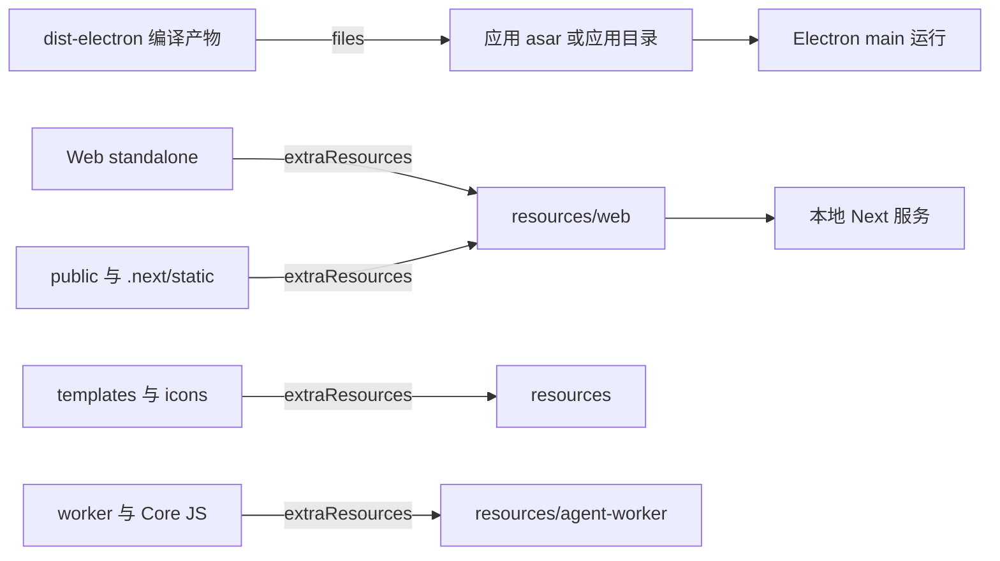

# C13：开发态能找到文件，不等于安装包会携带文件

## 从工作区成功到用户机器失败

C12 的 Electron 开发态可以从整个 monorepo 读取文件，并向上解析 hoisted `node_modules`。发布后的应用没有这份仓库结构。electron-builder 必须把主进程代码、Web standalone、adapter runtime、模板、图标和 worker 依赖复制进安装包。

本章研究 package 级 [electron-builder 配置](../../../../packages/desktop/electron-builder.yml#L1)。签名、公证、更新发布的完整流程属于后续发布单元；这里先学会从清单判断“某资源是否有资格进入包”。

## 两层装载区



`files` 主要描述应用代码与 Node 模块；`extraResources` 描述随应用复制、按路径访问的外部资源。两者都不是源码发现器：未被匹配的文件不会因为开发时存在就自动进入包。

## 第一段源码：包身份与输出目录

[Desktop builder 配置第 1—13 行](../../../../packages/desktop/electron-builder.yml#L1) 定义 appId、productName、artifactName、输出目录、build resources、Electron 版本与下载镜像。`electronVersion: 42.3.3` 与 Desktop manifest 的 devDependency `^42.3.2` 不是完全相同的声明；打包使用的明确版本应以 builder 配置与实际安装解析共同判断。

`directories.output: ../../release` 表示发布物写到仓库根 `release`，这与 C17 的 `.gitignore` 产物分类一致。

## 第二段源码：`files` 是应用代码白名单

[Desktop builder 配置第 15—55 行](../../../../packages/desktop/electron-builder.yml#L15) 首先包含 package 内 `dist-electron/**/*`，然后显式复制 Core lib/modules/types、adapter package 的入口与 dist、准备好的 pi-ai runtime node_modules 以及 package.json。

两个细节尤其重要：

1. adapter 只列出一组文件与 `dist/**/*`。新增新的公共入口后，若 build 脚本生成了文件但 builder filter 未包含，开发态可用、打包态仍可能缺失。
2. `!**/*.map` 排除 source map，意味着安装包故障诊断不能默认依赖这些 map。

`npmRebuild: false` 与 `buildDependenciesFromSource: false` 也说明打包阶段不会替所有 native 依赖重新构建；平台二进制必须更早准备并经过目标平台验证。

## 第三段源码：`extraResources` 固定运行时路径

[Desktop builder 配置第 57—90 行](../../../../packages/desktop/electron-builder.yml#L57) 把 Web standalone 放到 `web`，把 `.next/static` 放到其预期目录，把 public、icons、templates 与 agent worker 文件复制到固定位置。

具体输入推演：头脑风暴 Skill 若读取系统模板，开发态可能从仓库 `templates/` 成功；打包态只有 `extraResources` 的 templates 条目正确、运行时路径解析也指向 resources，才能继续工作。复制成功与消费路径正确是两个阶段。

## `files`、`extraResources` 与生成阶段的三重交集

一个文件最终可用，必须同时满足：上游生成/存在、builder 匹配、运行代码按正确路径读取。可以表示为：

```text
可用资源 = 已生成文件 ∩ 打包清单 ∩ 运行时可解析路径
```

只满足前两项，文件在包里但代码找错位置；只满足后两项，builder 没有源文件可复制；只在开发 workspace存在，则三项都未闭环。

## 逐段精读 `files`

### 主 dist

`dist-electron/**/*` 从 Desktop package 打包目录取全部编译结果。C05 的 build:app先把根 dist复制进这里，因此 builder不是直接消费根输出。复制步骤漏执行时，根文件再新也无效。

### Core 的重复/补充复制

配置又从 `dist-electron/core/src/lib`、modules、types复制 JS/MJS。这表现为对 Core运行依赖的显式保障，也形成重复路径审计责任：要确认 source/target没有互相覆盖出不同版本。

### Adapter 白名单

它列出 package.json、顶层 JS/声明、load-runtime与 dist。若 adapter exports增加 `task-runtime.js`，当前 filter 是否包含？列表中没有显式 task-runtime，但 `dist/**/*`是否包含对应实现要看 build-runtime 输出；顶层 export目标若未被复制就会失败。

### pi-ai runtime node_modules

从 `.packaging/pi-ai-runtime/node_modules` 整体复制，说明 Node external 依赖由准备脚本单独组装。builder配置不解释这个目录怎样产生；上游 prepare脚本是不可跳过的中间层。

## `extraResources` 的路径合同

builder 的 `to` 是相对 app resources目录的目标。运行代码不应继续用 monorepo `../../templates` 心智，而要通过 Electron resourcesPath/项目路径工具计算。

| 源 | 包内目标 | 消费者问题 |
| --- | --- | --- |
| `.packaging/web-standalone` | `resources/web` | 本地 Next server入口在哪 |
| `.next/static` | `web/packages/web/.next/static` | HTML引用路径是否一致 |
| Web public | `web/packages/web/public` | 静态 URL 是否可达 |
| templates | `resources/templates` | 模板 loader 如何定位 |
| worker JS | `resources/agent-worker/...` | worker启动 specifier是否一致 |

路径只差一个 `packages/web` 层级都可能导致页面样式/资源404，而 server本身仍启动。

## Worker 为何被逐文件复制

worker在独立线程/进程中运行，不能依赖主进程 bundle自动携带全部动态 require。配置显式复制 worker、paths、display-content、cognitive-session-end、project collaboration与tools目录。

这份列表同时暴露维护风险：worker新增动态依赖后，TypeScript编译成功不等于 extraResources更新。Desktop提供 `verify-agent-worker-runtime` 正是为了在发布前捕获一部分缺口。

## 平台配置不是同一产物换扩展名

mac设置 hardenedRuntime、entitlements、dmg/zip与 arm64/x64；Windows使用 NSIS/zip x64；Linux使用 AppImage x64。不同目标选择不同图标、签名/权限和 native binary。

所以 mac包通过不能代表 Windows，arm64通过不能代表 x64。supportedArchitectures只是准备候选，builder target才定义这次输出。

## 更新配置的证据边界

publish 使用 generic URL 与 stable channel，生成更新元数据。它不证明 CDN可达、签名可信、客户端升级能恢复。发布章节需验证 artifact name、metadata、签名、公证、上传与真实更新器。

本章只承认“package级 builder声明这些值”。

## 具体故障：Web页面有HTML但无静态样式

1. 本地 standalone是否引用 `/_next/static/...`。
2. 安装包内 `web/packages/web/.next/static` 是否存在。
3. 本地 server cwd/standalone目录结构是否与引用匹配。
4. builder source `.next/static` 在打包前是否存在。
5. 是清单漏复制，还是运行server静态根计算错误。

若所有静态资源 404，责任更接近打包/服务路径，此时修改 Tailwind class 不能修复资源装载边界。

## 解包测试的 Given/When/Then

- Given：完成 build:app，生成 package-scoped dist与packaging目录。
- When：electron-builder `--dir` 生成未压缩应用并列出文件。
- Then：main入口、adapter每个export、Web standalone/static/public、templates和worker依赖都存在。

第二层启动测试再 require adapter、启动worker、请求静态资源；第三层才在签名安装包目标机运行。文件存在只完成第一层。

## 第四段源码：根 builder 配置是平行实现

仓库根还有 [electron-builder.yml](../../../../electron-builder.yml#L1)，它的资源清单更短、publish provider 也不同。Desktop scripts 明确写 `electron-builder --config electron-builder.yml`，而命令在 Desktop package cwd 执行，所以直接消费的是 package 级配置。

准确结论是：根与 package 级 builder 配置并存；当前 Desktop scripts 指向 package 级文件。根配置存在不能替代调用点证据，也不应把两份 publish 设置混成一套事实。

## 失败诊断：开发态成功，安装包报模块缺失

按副作用反向追踪：

1. 解包或检查安装包，确认目标文件是否存在。
2. 不存在：核对生成阶段是否产生、`files`/`extraResources` 是否匹配。
3. 存在：核对运行时代码计算的目标路径和 asar/resources 边界。
4. JS 存在但依赖缺失：核对 runtime node_modules 与 external 配置。
5. native 模块存在仍加载失败：核对目标 OS、CPU、ABI 与签名。

不要用“在 monorepo 里能 import”作为第 1 步证据。

## 测试证据与缺口

Desktop manifest 提供 `verify:mac-package`、`verify:win-package`、`verify:asar-requires` 等脚本，但本章没有运行昂贵且平台相关的打包。清单只能证明配置意图。完整包是否携带并能加载每项资源仍需实际构建、解包和启动测试。

源码覆盖还存在明确停止边界：prepare-web-standalone、prepare-pi-ai-runtime-deps、各 verify脚本在本章只作为调用者/验证入口，不冒充已精读；它们属于 Desktop/build tooling后续单元。

## 源码实验室：资源必须连续穿过生成、选择和定位

[Desktop builder 第 15—24 行](../../../../packages/desktop/electron-builder.yml#L15) 首先选择编译输出：

```yaml
files:
  - dist-electron/**/*
  - from: dist-electron/core/src/lib
    to: dist-electron/core/src/lib
    filter:
      - "**/*.js"
  - from: dist-electron/core/src/modules
    to: dist-electron/core/src/modules
```

`from` 是打包时输入位置，`to` 是应用内目标位置，filter 再缩小文件集合。源文件存在但没有先被编译成匹配扩展名，就不会因 allowlist 写着路径而凭空生成。

Adapter 使用更细的白名单，见 [Desktop builder 第 34—47 行](../../../../packages/desktop/electron-builder.yml#L34)：

```yaml
- from: ../../packages/agent
  to: node_modules/@originos/pi-agent-adapter
  filter:
    - "package.json"
    - "index.js"
    - "index.d.ts"
    - "ai.js"
    - "ai.d.ts"
    - "load-runtime.js"
    - "dist/**/*"
```

新增 `goal.js` 一类入口时，必须同时经过 adapter build、manifest exports 和这里的 filter；开发态 workspace 能解析只跨过前两层中的一部分。

Web 静态资源走 [Desktop builder 第 57—69 行](../../../../packages/desktop/electron-builder.yml#L57)：

```yaml
extraResources:
  - from: .packaging/web-standalone
    to: web
  - from: ../../packages/web/.next/static
    to: web/packages/web/.next/static
  - from: ../../packages/web/public
    to: web/packages/web/public
```

standalone server、`.next/static` 与 public 分开复制，是因为运行时查找路径不同。漏掉 static 时 HTML 仍可能返回，但 CSS/JS chunk 404。

### 解包证据

Given `electron-builder --dir` 成功，When 在 unpacked 目录按运行时目标路径检查文件并实际 require adapter 子入口，Then 才能证明 allowlist 与消费路径闭合。只检查 YAML 或构建退出码不能证明目标文件可加载。

## 小实验与口头验收

1. 区分 `files` 与 `extraResources` 的消费方式。
2. 新增 adapter 入口 `report.js` 后，列出构建和打包两个都要检查的位置。
3. 为什么根 builder 配置不能自动解释 Desktop 脚本？
4. 从“开发态可用、安装包缺模块”写出五步证据顺序。

### 实验参考推演

第1题：files进入应用代码/asar边界，extraResources复制到resources供路径读取；实际asar设置仍由builder默认/配置决定。

第2题要验证adapter build生成、exports声明、builder filter包含和unpacked app require，四步缺一不可。

第3题调用cwd与`--config`选择package级文件；根文件只是并存配置。

第4题顺序是包内存在→生成源存在→清单匹配→运行路径→native/ABI，不应先改业务逻辑。

## 源码阅读顺序

1. 从Desktop dist/pack script确定实际config。
2. 读directories与Electron版本，确认输入/输出根。
3. 将files每个from/to/filter转成文件清单。
4. 将extraResources转成运行路径表。
5. 最后按mac/win/linux分别读target；不要混成跨平台单产物。

## 迁移验收：新增一个动态worker依赖

先让Desktop tsc生成目标JS；确认worker运行路径中的相对require；更新extraResources最小清单；扩展worker verify脚本；在unpacked app从真实resourcesPath启动；再做目标平台包。只在开发worker测试通过，不能宣布发布完成。

下一课继续看 adapter：它为何不像 Core 那样直接 export TypeScript 源码，而要先生成 Node 可加载的 JavaScript？
