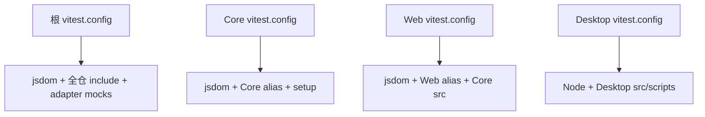

# C16：测试文件相同，使用不同配置就进入不同解析世界

## “跑 Vitest”仍然缺少关键信息

OriginOS 至少有根、Core、Web、Desktop 四份 Vitest 配置；adapter 与 pi-tasks 还使用 Node test runner。测试失败时，只说“Vitest 找不到模块”不够，必须先知道命令在哪个 package 运行、加载哪份配置、使用 Node 还是 jsdom、aliases 指向哪里。

## 四个测试世界



图中的箭头不是继承关系。四份配置彼此独立，每次命令通常选择其中一份。

## 第一段源码：根配置做了大量替身

[根 Vitest 配置第 1—27 行](../../../../vitest.config.ts#L1) 把 adapter 根入口、adapter ai 和 `onnxruntime-node` 映射到 `tests/mocks`，还把 `@/` 指向 Core src。 [第 29—78 行](../../../../vitest.config.ts#L29) 使用 jsdom、30 秒超时、跨 packages include 与 coverage 排除。

这些 mock 让测试避免真实 native/runtime 依赖，但也缩小证据：通过根测试不能证明真实 adapter 或 ONNX 能加载。mock 是受控替身，不是生产实现。

## 第二段源码：Core 配置有自己的 setup

[Core Vitest 配置](../../../../packages/core/vitest.config.ts#L1) 为 `@`、`@/lib`、`@/types`、`@/modules` 指向 Core src，使用 jsdom，并加载 pi-agent 测试 setup。include 只覆盖 Core `src`。

Core 业务包含文件系统与 Node 逻辑，却仍选择 jsdom；测试可以使用被模拟的浏览器环境，不代表生产运行环境就是浏览器。具体测试是否切换或 mock Node API要看测试正文。

## 第三段源码：Web 配置连接两个源码根

[Web Vitest 配置](../../../../packages/web/vitest.config.ts#L1) 将 `@` 指向 Web src，将 `@originos/core` 直接指向 `../core/src`。这绕过 Core package exports 的精确子路径映射，便于测试源码，却可能与真实 package resolver 出现差异。

它加载 Web `src/test-setup.ts`，使用 jsdom。由此证明 React/store 测试获得 DOM-like 环境；不能证明真实浏览器布局、CSS 与 Electron preload。

## 第四段源码：Desktop 使用 Node 环境

[Desktop Vitest 配置](../../../../packages/desktop/vitest.config.ts#L1) 选择 Node，include Desktop src 与 scripts，并启用 mockReset、restoreMocks。它不启动 Electron，也不创建真实 BrowserWindow。Node 环境适合主进程服务与脚本单测，但 Electron API 通常仍需 mock 或集成测试。

## 测试配置的五个核心维度

| 维度 | 问题 | 改错后的典型症状 |
| --- | --- | --- |
| `include/exclude` | 哪些测试被发现 | “0 tests”或漏跑整类文件 |
| `environment` | 提供哪些全局对象 | `document is not defined`或Node API差异 |
| `resolve.alias` | import指向哪里 | module not found/加载错误实现 |
| `setupFiles` | 测试前安装哪些mock/matcher | matcher缺失、全局状态未初始化 |
| reset/restore | 用例间如何清理替身 | 单测单跑过、整套跑失败 |

测试“没有失败”前要先确认测试被发现。include漏掉文件时，零错误不是通过证据。

## 根 include/exclude 的边界细节

根 include覆盖 `src/**` 与 `packages/**/src/**` 的TS/TSX test/spec；adapter/pi-tasks 的JS测试不在其中，由Node runner负责。Desktop `scripts/**/*.test.mjs`也不匹配根include，而由Desktop config覆盖。

根exclude列出 `src/modules` 又试图用 `!src/modules/...` 重新包含两个模块。Glob排除的否定规则能否按预期覆盖，需要Vitest/picomatch实际行为验证；单看字符串不能保证。

## jsdom 提供了什么、没有什么

jsdom模拟DOM、window、document，适合React组件与浏览器逻辑。它没有真实布局/绘制引擎、Electron preload、原生文件选择器或完整网络栈。

`vitest-canvas-mock`等setup可继续补API，但mock出来的canvas不会证明真实渲染性能/像素。UI单测与浏览器E2E必须分层。

## Core为何也使用jsdom

Core不仅有纯Node服务，还导出React hooks/UI适配和客户端逻辑，统一jsdom让这些测试可运行。代价是Node-only模块可能在浏览器模拟环境中被mock/条件分支隐藏。

更精确的测试可以按文件/项目拆Node与jsdom；当前配置事实是全Core默认jsdom，正文不假装每个Core测试都在生产Node环境执行。

## `setupFiles` 的共享状态风险

Core在每个测试环境加载pi-agent setup。setup可能注册mock、polyfill、清理钩子。测试依赖setup中的隐式全局，迁移到根/Web config后可能失败。

读取测试时要把setup当作前置源码；只看test文件无法知道真实Given。C16登记其路径但不精读内容，业务测试章节需补上。

## alias mock怎样改变被测对象

根config把adapter替换为仓库mock。这能让Core/集成测试在不加载真实vendor runtime时控制事件，却可能出现“测试断言的是mock协议，真实adapter已漂移”。

合同测试应另建一条不mock adapter的最小边界，或验证mock导出与真实`.d.ts`同步。mock不是越多越稳定，而是要明确替身边界。

## `mockReset` 与 `restoreMocks`

`mockReset`重置mock状态/实现，`restoreMocks`恢复spy原方法，减少测试顺序污染。它们不能自动清理文件系统、环境变量、Zustand store singleton、timer或全局event listener。每类副作用仍需自己的afterEach。

若单测单独通过、套件失败，应检查未清理状态，而不是先增加随机等待。

## 测试超时不是性能指标

根/Core设置30秒testTimeout，只表示测试最多等待多久；它不证明CUI响应<500ms或Skill<5秒。将超时设大能减少慢测试失败，却可能掩盖性能退化。

性能验收需显式测量时间并断言阈值，且控制机器/网络/模型变量。

## coverage 的分母由配置决定

根coverage排除测试、声明、stories与若干模块。覆盖率报告只对纳入文件计算；高百分比不能代表被exclude模块已覆盖。

此外行覆盖不证明错误分支/跨进程合同。教材引用覆盖率时必须说明provider、include/exclude与断言内容。

## 一个完整失败推演

输入：将Web测试复制到Core，保留 `import { foo } from '@/services/foo'`。

```text
Core Vitest加载
→ @ 指 Core src
→ 查 core/src/services/foo
→ 文件不存在
→ 收集阶段module not found
→ 测试body尚未执行
```

正确恢复是明确测试所有权：若它仍测Web service，留在Web；若要测Core逻辑，改为Core公共入口与fixture。把Core alias改指Web会破坏整个Core测试世界。

## 反向故障：测试显示“通过”，生产adapter失败

1. 查运行测试使用根还是package config。
2. 查adapter import是否被alias到mock。
3. 看断言覆盖的是事件形状还是实际加载。
4. 运行adapter自己的verify/runtime tests。
5. 在Desktop/Electron宿主执行最小真实加载。

这条链能把“业务逻辑在mock协议下正确”和“真实runtime可用”拆开。

## 测试命令路由表

| 命令 | 默认配置/runner | 直接范围 |
| --- | --- | --- |
| 根 `pnpm test` | Web script → Web Vitest | Web |
| Core `pnpm exec vitest` | Core cwd config | Core src tests |
| Desktop `pnpm test` | Desktop Vitest | Desktop src/scripts |
| Adapter `pnpm test` | Node verify + node:test | Adapter runtime |
| pi-tasks `pnpm test` | node:test | pi-tasks JS tests |

“全项目测试”需要显式编排这些入口，当前根test不是全仓聚合器。

## 测试配置合同怎样写

- Given：每个package放一个标记fixture，分别需要DOM/Node与alias。
- When：执行该package标准test script并输出收集列表。
- Then：只发现应属文件，解析到应属源码，environment提供预期对象。
- Negative：在Desktop访问document应按设计失败/需显式jsdom；在Web测试导入Desktop main应被边界阻止。

## 具体输入推演：同一个 `@/lib/foo` import

- 根 Vitest：`@/` 指向 Core src；
- Core Vitest：`@` 也指向 Core src；
- Web Vitest：`@` 指向 Web src；
- Desktop Vitest：没有该 alias。

同一字符串在不同配置中可以指向不同文件或完全无法解析。复制测试到另一个 package 后失败，不应立刻修改生产 import；先判断测试配置是否仍匹配文件所有权。

## 失败诊断：生产构建能解析，测试不能

1. 记录实际命令与 cwd。
2. 确认加载哪份 Vitest config。
3. 比较生产工具的 alias/exports 与测试 alias。
4. 检查 environment 和 setupFiles。
5. 检查 include 是否发现测试、exclude 是否排除依赖。
6. 若使用 mock，确认失败来自替身还是生产实现。

## 本次验证边界

当前未能在 package 内解析 `tsc`，也没有据此推断 Vitest 一定缺失；本章没有运行整套测试。配置精读证明测试世界不同，不证明任何业务测试当前通过。执行时应使用明确 package，例如：

```bash
pnpm --filter @originos/core exec vitest run <test-file>
pnpm --filter @originos/web test
pnpm --filter @originos/desktop test
```

若命令因Vitest二进制缺失失败，应记录为依赖环境阻塞；若收集0 tests是范围配置问题；若测试body失败才进入业务断言。三者不能统一写成“测试失败”。

## 源码实验室：同一个测试命令如何选择不同世界

根配置先替换真实依赖，见 [根 Vitest 配置第 8—26 行](../../../../vitest.config.ts#L8)：

```ts
alias: [
  { find: /^@originos\/pi-agent-adapter\/ai$/, replacement: path.resolve(__dirname, './tests/mocks/@originos/pi-agent-adapter/ai.ts') },
  { find: /^@originos\/pi-agent-adapter$/, replacement: path.resolve(__dirname, './tests/mocks/@originos/pi-agent-adapter/index.ts') },
  { find: /^onnxruntime-node$/, replacement: path.resolve(__dirname, './tests/mocks/onnxruntime-node.ts') },
]
```

测试通过时真正执行的是 mock，不是 workspace adapter 或 native 包。它适合隔离 Core/Web 行为，不适合证明发布 runtime。

Core 配置定义自己的 setup 与范围，见 [Core Vitest 配置第 13—22 行](../../../../packages/core/vitest.config.ts#L13)：

```ts
test: {
  globals: true,
  environment: 'jsdom',
  setupFiles: [path.resolve(__dirname, './src/lib/integrations/pi-agent/__tests__/setup.ts')],
  include: ['src/**/*.{test,spec}.{ts,tsx}'],
  mockReset: true,
  restoreMocks: true,
}
```

Web 配置则把 Core 指向源码，见 [Web Vitest 配置第 10—14 行](../../../../packages/web/vitest.config.ts#L10)：

```ts
alias: {
  '@': path.resolve(__dirname, './src'),
  '@originos/core': path.resolve(__dirname, '../core/src'),
}
```

Desktop 使用 Node 且包含 scripts，见 [Desktop Vitest 配置第 3—11 行](../../../../packages/desktop/vitest.config.ts#L3)：

```ts
test: {
  environment: 'node',
  include: ['src/**/*.{test,spec}.ts', 'scripts/**/*.{test,spec}.{js,mjs}'],
  mockReset: true,
  restoreMocks: true,
}
```

所以“Vitest 通过”必须附带 cwd、实际配置、被选测试和 mock。四个配置不能相互代证。

### 失败反推

若生产 adapter 失败而根测试通过，先检查根 alias 是否替换了 adapter；若 Web 测试找不到 Core subpath，检查 Web alias 是否绕过/错误拼接 exports。修复测试配置前要确认生产解析合同，避免让测试继续掩盖真实问题。

## 小实验与口头验收

1. 为四份配置各写 environment、alias 范围、include。
2. 为什么根测试 mock adapter 后通过，不能证明 adapter runtime 可用？
3. 从 Web 测试 `@/lib/foo` 失败反推 alias 的实际目标。
4. 迁移一个 Core 测试到 Desktop 时，列出配置层面的三项风险。

### 实验参考推演

第1题应回到四份配置逐字段填表，而不是按package名称猜。尤其Desktop是Node，其他三份默认jsdom。

第2题根alias把adapter换成mock，真实vendor/runtime没有加载；通过只证明替身合同下的逻辑。

第3题Web的`@`目标是Web src；若文件其实属于Core，应该用Core公共入口/相应测试所有权。

第4题至少有environment、alias、setupFiles、include与Electron mock差异；复制文件不迁移Given。

## 源码阅读顺序

1. 从实际test script确定runner/cwd。
2. 打开对应config，先查include确认测试会被发现。
3. 查environment/setup重建Given。
4. 查alias/mock确定真正被测实现。
5. 最后读test断言，说明它证明/未证明什么。

## 迁移验收：建立全仓测试聚合命令

显式串联或递归调用Web/Core/Desktop/Adapter/pi-tasks标准scripts；避免根Vitest重复收集package tests；保留各自environment与mock；输出package归属；任一失败返回非零；coverage按package解释。用一个故意失败fixture确认聚合不漏包，并记录尚无E2E的跨进程边界。

下一课处理另一类误判：仓库里已经出现 `.next`、dist 或 JS 文件，并不说明它们应该被当成源码修改。
