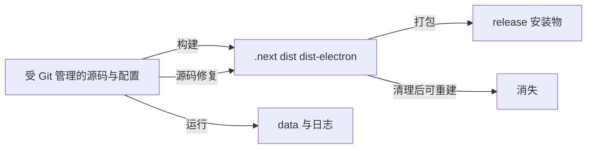

# C17：生成产物是结果证据，不是修复入口

## “改 dist 立刻生效”为什么仍是错误修复

假设 Electron 主进程报错，开发者直接修改 `dist-electron/.../main.js`，窗口可能暂时恢复；下一次 TypeScript watch 又会覆盖它。更糟的是，Git 不记录这项修改，源码仍保留故障。

本章建立源码、缓存、运行数据、构建物与发布物的分类方法。

## 文件生命周期



最后一根箭头强调修复方向：回到源码再重建。运行数据不一定可重建，也不能与缓存一起随意删除。

## 第一段源码：`.gitignore` 给出分类意图

[`.gitignore` 第 1—24 行](../../../../.gitignore#L1) 排除 `node_modules`、dist、dist-electron、`.packaging`、`.next`、coverage、release、tmp、tsbuildinfo 与根 data。 [第 42—48 行](../../../../.gitignore#L42) 排除 env 与签名密钥， [第 86—88 行](../../../../.gitignore#L86) 明确保留 pnpm lockfile、排除 npm/yarn lockfile。

ignore 不是安全删除清单：

- `.next` 通常可重建；
- `data/` 可能含用户运行数据；
- `.env` 可能含不可恢复凭证；
- `release/` 可重建但成本高；
- 未跟踪不表示无价值。

## 第二段源码：清理脚本也有明确范围

[根 manifest 第 60—66 行](../../../../package.json#L60) 提供 `clean` 与 `clean:all`。它们使用显式目录集合，没有删除 `data`、`.env` 或整个 workspace。这说明安全清理应基于已知产物路径，而不是对根目录做宽泛递归删除。

Desktop `build:app` 也先清理特定 `.next` 与 dist-electron；失败时旧产物已消失，因此构建失败后不能再依赖旧文件判断代码状态。

## 六类文件的所有权卡

| 类别 | 例子 | 生产者 | 能否重建 | 默认修复入口 |
| --- | --- | --- | --- | --- |
| 源码 | `packages/**/src/*.ts` | 开发者 | 不能由产物可靠反推 | 直接修改并review |
| 配置 | package/tsconfig/builder | 开发者 | 不能自动重建 | 修改真实消费者配置 |
| 依赖解析 | `pnpm-lock.yaml` | pnpm + manifest | 可重算但会漂移 | 从manifest意图更新 |
| 编译/缓存 | `.next`、dist、tsbuildinfo | Next/tsc | 通常可重建 | 修源码/配置后重建 |
| 发布物 | release dmg/zip | builder | 成本高但可重建 | 修上游后重新打包 |
| 运行数据/秘密 | data、env、key | 用户/运行时 | 可能不可恢复 | 谨慎迁移，绝不当缓存删 |

“Git忽略”横跨后四类，所以ignore状态不能回答恢复价值。

## `.gitignore` pattern的作用域

`dist`可以匹配多处同名目录；`/release`锚定根；`**/dist-electron/`覆盖嵌套；`.env.*.local`匹配本地环境变体。pattern只影响Git未跟踪文件显示/纳入，已被Git跟踪的文件不会因后来加入ignore自动消失。

判断某文件是否受控要运行 `git ls-files --error-unmatch <path>` 或 `git status --ignored`，不能只搜索ignore文本。

## lockfile为何是生成但必须跟踪的例外

lockfile由pnpm生成，却承载可重复解析合同，应提交。生成文件不等于都忽略；判据是它是否是可审查输入/合同，还是每次由同一输入可无歧义重建的输出。

同理，某些声明文件可能是package公开面并需发布，但仓库选择从源码构建；具体是否跟踪由package策略决定，不能用扩展名一刀切。

## 运行数据与构建产物的危险相似

`data/`和`.next/`都不跟踪、都会频繁变化。但前者可能保存项目、会话、Agent记忆，后者是框架缓存/产物。`clean:all`不删除data正体现生命周期差异。

在执行清理前要解析精确绝对目标并确认它属于已知产物，绝不能把workspace根、用户HOME或未解析变量作为递归删除目标。

## 根与package级产物的复制链

Desktop先编译到根 `dist-electron`，验证后复制到 `packages/desktop/dist-electron`，builder消费后者。于是同名文件可能存在两份：

```text
packages/desktop/src/...        源码
dist-electron/desktop/src/...   编译主输出
packages/desktop/dist-electron  打包整理副本
release/...                     发布物
```

修改时间可以判断链在哪一步停止。只打开离当前目录最近的dist可能看错副本。

## `check-root-build-artifacts` 为什么允许配置MJS

脚本用扩展名识别根一级生成物，但根 `postcss.config.mjs` 是真实源码配置，所以放入allowedRootFiles。这个例外说明扩展名只是启发式，需要路径所有权白名单。

脚本不会读取git状态；一个意外手写`debug.js`也会被判offender。这符合“根不应散落JS产物”的项目策略，但错误信息不能区分它是手写还是编译生成。

## 陈旧缓存、陈旧编译物、陈旧发布物

| 陈旧对象 | 现象 | 观察 | 恢复 |
| --- | --- | --- | --- |
| `.next` cache | HMR/路由行为异常 | Next日志/cache时间 | 只清Web `.next`重启 |
| 根 dist | main加载旧逻辑 | JS mtime/编译错误 | 修TS并重编译 |
| package dist副本 | build对、pack错 | 两份文件hash不同 | 重跑整理阶段 |
| release | 安装包仍旧 | artifact版本/hash | 完整重打包 |
| data schema | 新代码读旧数据失败 | JSON version/迁移日志 | 迁移/备份，不能清空冒充修复 |

## 具体故障：Git status出现根JS

1. 用`git status --short`确认未跟踪/已跟踪。
2. 用产物检查脚本确认是否命中。
3. 根据文件内容/source map/source路径找到生产者。
4. 修tsconfig outDir/rootDir或错误构建cwd。
5. 移除明确生成的offender并重建到正确目录。
6. 再运行检查，确认没有新散落文件。

只把该JS加到gitignore会隐藏症状，不修生产者。

## 具体故障：安装包行为旧于源码

从release反向比对package dist、根dist、源码mtime和构建日志；查builder是否使用package副本；检查版本/缓存；重新执行拥有该阶段的脚本。不要在asar或release内补丁后称源码已修复。

## 安全清理清单的形成

1. 从构建脚本/配置确定生产者和目标。
2. 用绝对规范路径确认目标位于workspace已知产物目录。
3. 检查是否包含用户数据/秘密/手工资源。
4. 记录清理后重建命令。
5. 只删除精确目标，随后验证Git与构建。

教材中的纸面实验不要求读者实际删文件；先能证明所有权，才有资格执行清理。

## 自动化证据设计

- 产物位置测试：在临时fixture编译，根只允许预期配置文件。
- Git hygiene：CI运行`git status --porcelain`确认构建没改跟踪文件。
- 可重建性：清空临时产物后构建，比较关键manifest/hash。
- 数据保护：clean脚本fixture中放置data sentinel，断言不删除。
- 打包新鲜度：发布物记录源commit/版本并与当前构建匹配。

## 第三段源码：根产物检查只检查根一级文件

[scripts/check-root-build-artifacts.js 第 6—39 行](../../../../scripts/check-root-build-artifacts.js#L6) 读取仓库根目录的一层文件，查找 JS、声明、source map、tsbuildinfo 等扩展名，允许根 `postcss.config.mjs`，发现其他匹配文件则非零退出。

这项检查能防止 TypeScript 将生成文件散落到根一级；它不递归检查 package，也不证明 `dist-electron` 内容正确。该脚本的完整实现属于后续 build tooling 单元，本章只用它说明检查范围必须按源码读。

## 具体输入推演：修复 Desktop main

错误路径：编辑 `dist-electron/desktop/src/main/main.js` → 当前进程可能加载修改 → watch 重编译覆盖 → Git diff 没有源码变化。

正确路径：定位 `packages/desktop/src/main/main.ts` → 修改源码 → 运行/恢复 TypeScript 编译 → 检查新 JS → 启动 Electron → 运行目标测试。若问题来自复制脚本或 builder 清单，则修对应 `packages/desktop/scripts`/配置，而不是改安装包内部文件。

## 失败诊断：改了源码但运行行为不变

1. 确认运行进程实际加载哪个文件路径。
2. 检查该产物修改时间是否随构建更新。
3. 检查构建是否非零退出，是否被旧进程吞掉日志。
4. 检查是否存在根/package 两份平行产物。
5. 清理**明确可重建的目标目录**后重新构建。

这套顺序避免在不知道所有权时盲目删除用户数据。

## 测试证据与缺口

本章没有执行清理命令，因当前工作区可能包含用户生成状态，且写教材不需要破坏产物。静态证据证明 ignore 与脚本的预期边界；实际某文件是否受 Git 跟踪，应再用 `git ls-files`/`git status` 判断。

Given一个临时workspace fixture；When分别运行clean、build和root artifact checker；Then只删除/生成明确产物，保留data/env sentinel，根无offender。真实仓库仍要人工确认路径，不能把fixture安全推广为任意目录安全。

## 源码实验室：生成物的三层防线

根清理脚本在 [package.json 第 65—66 行](../../../../package.json#L65) 明确列出目标：

```json
"clean": "rm -rf dist-electron dist .tmp",
"clean:all": "rm -rf dist-electron dist .tmp release packages/desktop/dist-electron packages/web/.next"
```

它们是破坏性命令，范围不同；`clean` 不删除 release 和 Web `.next`。执行前必须确认 cwd 是仓库根，不能把“清缓存”当成无风险动作。

[.gitignore 第 5—23 行](../../../../.gitignore#L5) 把构建物与运行数据分成两组：

```gitignore
dist
dist-electron
**/dist-electron/
**/.packaging/
/.next
/release
/.tmp

# Runtime data (user-specific)
/data
/data/
```

ignore 只影响 Git 默认跟踪建议，不阻止程序读写，也不删除已经被跟踪的文件。`data` 与 `dist` 都被忽略，但前者可能包含用户状态，后者应可由源码重建；清理策略绝不能因为同在 ignore 中就相同。

根产物扫描器先定义启发式模式，见 [check-root-build-artifacts.js 第 6—18 行](../../../../scripts/check-root-build-artifacts.js#L6)：

```js
const repoRoot = path.resolve(__dirname, '..');
const forbiddenFilePatterns = [
  /\.js$/, /\.cjs$/, /\.mjs$/, /\.d\.ts$/,
  /\.d\.ts\.map$/, /\.js\.map$/, /\.tsbuildinfo$/,
];
const allowedRootFiles = new Set(['postcss.config.mjs']);
```

白名单说明扩展名不能单独代表生成物：`postcss.config.mjs` 是受版本控制的源码配置。扫描只看仓库根一级，不能证明 package 内没有错位产物。

失败分支在 [check-root-build-artifacts.js 第 20—39 行](../../../../scripts/check-root-build-artifacts.js#L20)：

```js
const offenders = fs.readdirSync(repoRoot, { withFileTypes: true })
  .filter((entry) => entry.isFile())
  .map((entry) => entry.name)
  .filter((name) => forbiddenFilePatterns.some((pattern) => pattern.test(name)))
  .filter((name) => !allowedRootFiles.has(name))
  .sort();

if (offenders.length > 0) process.exit(1);
```

输入是根目录当前文件集合，状态变化是过滤和排序，输出是错误列表与退出码。它不删除文件，因此适合门禁；修复仍应回到错误的 tsconfig/outDir 或构建脚本。

### 安全验证

Given 一个临时仓库副本，When 放入 `accidental.js` 与合法 `postcss.config.mjs`，Then 扫描器应只报告前者。还应补 package 嵌套、目录名后缀和 symlink 等边界测试；当前静态阅读不能证明这些情况。

## 小实验与口头验收

1. 将 `.next`、`data`、`.env`、`pnpm-lock.yaml`、release 分成可重建/不可盲删/必须跟踪。
2. 为什么 `.gitignore` 不能直接当 `rm` 输入？
3. 从“源码改了但行为不变”设计五步产物追踪。
4. 解释根产物检查脚本证明什么、没证明什么。

### 实验参考推演

第1题：`.next`/release通常可重建；data/env不可盲删；lockfile必须跟踪。release重建昂贵仍不改变其产物身份。

第2题ignore只影响Git纳入，不表达可恢复价值，也含秘密/用户数据。

第3题从运行加载路径→产物mtime→构建退出码→平行副本→精确清理重建，不直接改dist。

第4题只证明根一级没有扩展名命中的offender；不证明package产物、内容或运行正确。

## 源码阅读顺序

1. 从具体异常文件用git状态确认所有权。
2. 在ignore定位pattern，判断它为何不跟踪。
3. 反向搜索outDir/build/copy/builder找到生产者和消费者。
4. 比较源码、主输出、整理副本、release四级mtime/hash。
5. 只对明确可重建层执行清理。

## 迁移验收：调整Desktop输出目录

先列所有生产者/消费者：tsconfig、main、wait-on、build copy、builder、verify、ignore、clean；在临时目录验证新形状；迁移后构建不在根散落offender；unpacked app可加载。删除旧产物前确认不含用户数据，并让Git diff只出现源码/配置预期变化。

下一课把所有边界放回同一条命令与故障链，完成 Part C 的正向追踪、反向诊断和迁移验收。
