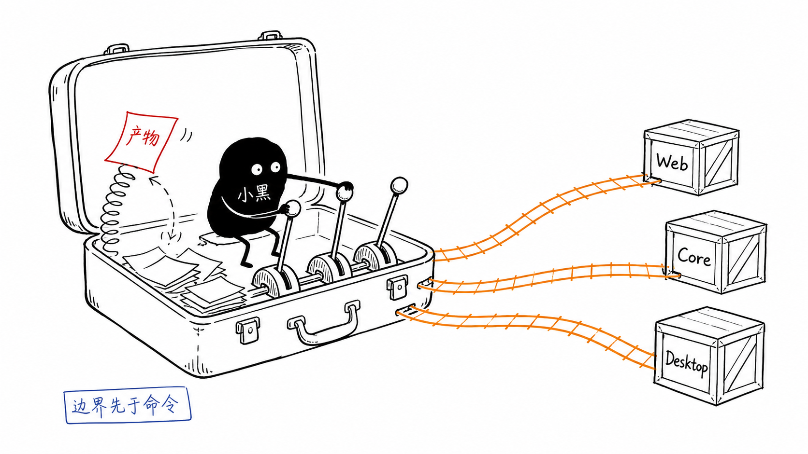
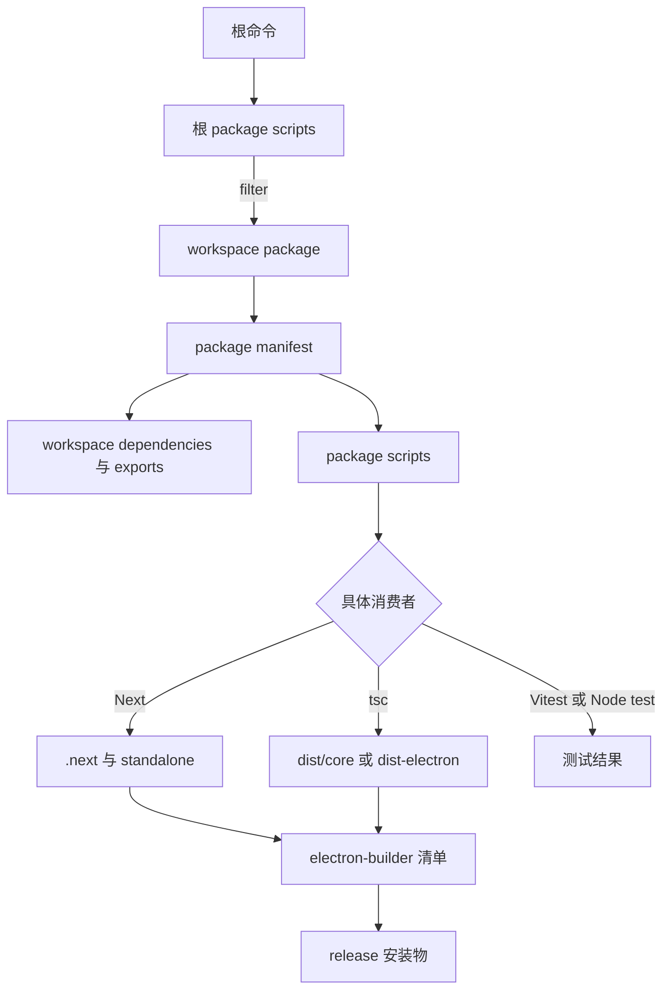

# C18：从一条命令重建 OriginOS 的工程边界

## 复盘场景

现在回到 Part B 的头脑风暴 Skill。开发态浏览器可以打开窗口，团队准备验证 Desktop 安装包；构建中却依次遇到三个现象：Core 的类型问题没有阻止 Next build、pre-commit 在格式步骤失败、安装包又缺少 adapter 新入口。

这不是三个随机错误。它们分别落在类型配置、质量门脚本与打包清单边界。Part C 最重要的能力，就是先判断失败属于哪一条流水线，再进入对应配置和源码，而不是在首页组件里到处试改。

## 一句核心判断

> 先确定消费者和边界，再展开命令与配置；任何“成功”都只证明它跨过了已经实际执行的那一道门。

这句话包含四层含义：

1. 同一仓库不等于同一 package。
2. 同名命令不等于同一流水线。
3. 配置文件存在不等于生产命令读取它。
4. 构建、测试、运行、打包成功互不替代。

## 小黑的边界分拣台



图中的行李箱代表一个 Git 仓库，小黑不是站在旁边介绍架构，而是在拉动三根分轨杆：同一批源码、配置与测试必须进入 Web、Core、Desktop 各自的消费者。橙色轨道表示明确的构建路径；红色“产物”被弹簧拦住，提醒生成文件不能倒灌成源码修复入口；蓝色“边界先于命令”是本单元的排查原则。

## 总体工程图



逐箭头解释：根命令先由根 scripts 路由；filter 选择 workspace 成员；manifest 同时给出依赖/公共出口与脚本；具体工具读取自己的配置后生成 Web、Electron 或测试结果；只有被 builder 清单收录的构建材料才进入 release。图在发布物处停止，没有宣称应用已在目标机器正常运行。

## 正向追踪一：`pnpm dev`

复查入口依次是 [根 package.json 第 36—48 行](../../../../package.json#L36)、 [Web package.json 第 5—12 行](../../../../packages/web/package.json#L5) 与 [Next 配置第 7—22 行](../../../../packages/web/next.config.mjs#L7)。这三个窗口分别证明命令路由、包内命令和框架配置；不能用其中一个替另外两个作证。

```text
pnpm dev
→ 根 package.json scripts.dev
→ pnpm filter @originos/web
→ Web package.json scripts.dev
→ next dev
→ Next 读取 package 级 next/tsconfig/postcss/tailwind
→ Web 与 Core 源码按 exports、alias、transpilePackages 解析
→ 开发服务器与浏览器页面
```

这条链不创建 Electron main，不读取 electron-builder，也不运行 Core/adapter/Desktop 全套测试。

## 正向追踪二：`pnpm desktop:build`

桌面链应同时对照 [Desktop package.json 第 6—21 行](../../../../packages/desktop/package.json#L6)、 [Desktop tsconfig 第 1—18 行](../../../../packages/desktop/tsconfig.json#L1) 与 [Desktop builder 配置第 15—90 行](../../../../packages/desktop/electron-builder.yml#L15)，分别回答编排、编译输出与打包携带范围。

```text
根 desktop:build
→ Desktop build:app
→ 清理指定旧产物
→ adapter build
→ Next build 与 standalone
→ 准备 runtime dependencies
→ Desktop tsc emit 到根 dist-electron
→ worker/根产物验证
→ 复制 package 打包目录
```

若继续执行 `dist`，electron-builder 才根据 package 级配置将代码和 extraResources 送入 release。每一步都有自己的退出码与副作用；整条链不具备自动回滚。

## 五张边界卡

### 1. 成员卡：谁属于 workspace

看 `pnpm-workspace.yaml` glob 与 package `name`。目录相邻不构成依赖。

### 2. 依赖卡：谁可以消费谁

看 consumer manifest 的 `workspace:` 与 provider `exports`。alias 和相对穿透是另外的解析路径。

### 3. 编译卡：谁检查，谁 emit

看具体命令选择的 tsconfig。Web `noEmit` 与 Next build 并行分责；Desktop tsc 产生 Electron main JS。

### 4. 测试卡：证据来自哪个世界

看 cwd、Vitest config、environment、alias、mock 与 include。mock 通过不能证明真实 runtime。

### 5. 打包卡：哪些结果能离开工作区

看 builder `files` 与 `extraResources`。开发态能解析只是一项上游证据。

## 反向故障诊断

### 症状 A：`pnpm dev` 没有桌面窗口

根 `dev` 只选择 Web；若目标是 Desktop，先换入口。此时无需优先排查 IPC。

### 症状 B：Next build 成功但类型问题仍在

Next 配置忽略 build type errors；单独恢复并运行 Web/Core 对应 type-check。还要注意 Core 当前 `strict: false`。

### 症状 C：pre-commit 在格式步骤失败

hook 调用根 `format:check`，manifest 没有该 script。修质量门连接，不把失败归因于某个 TS 文件格式。

### 症状 D：编辑器能解析 alias，Vitest 不能

比较当前 package 的 tsconfig 与 Vitest alias；同一个 `@` 在 Web 和 Core 指向不同目录。

### 症状 E：开发态 adapter 新入口正常，安装包缺失

确认 build 输出，再查 Core/adapter exports，最后查 Desktop builder filter。不要编辑安装包或 dist 作为最终修复。

## 源码覆盖与证据边界

| 分类 | Part C 已直接建立的证据 | 仍未证明/后续范围 |
| --- | --- | --- |
| 根组织 | scripts、workspace 成员、lock importer、Turbo 未接通事实 | 干净环境完整安装 |
| 包依赖 | 六个 manifest 的 workspace 边与 Core exports | 所有动态/相对耦合已合规 |
| TypeScript | Web/Desktop 继承、Core 独立配置、emit 目标 | 当前类型检查通过 |
| Web 构建 | standalone、transpile、双 bundle、忽略错误开关 | 当前 Next build 成功 |
| Desktop | dev 三进程、build 顺序、builder 清单 | 目标平台安装包可运行 |
| 质量门 | ESLint/Prettier/hook 声明及 format/扫描缺口 | 全仓规范已自动强制 |
| 测试 | 四份 Vitest 的环境、alias、include 与 mock 差异 | 业务测试与 E2E 全部通过 |
| 产物 | ignore、清理、根产物检查范围 | 任意未跟踪文件都可安全删除 |

## 综合实验：为 Core 增加一个公共诊断函数

不必真的提交代码，先写执行计划：

1. 把实现放在 Core 合适下层，并从公共 `index.ts` 导出。
2. 若需要新的 package 子路径，更新 Core `exports`；否则复用现有公共入口。
3. 在 Web 通过 `@originos/core/...` 消费，不写跨包相对路径。
4. 为 Core 行为写 Core 测试，为 Web 适配写 Web 测试；分别选择配置。
5. 运行明确 package 的类型检查/测试，记录依赖缺失等阻塞，不把静态阅读写成通过。
6. 若 Desktop 运行时也消费，检查 Desktop 编译路径和 adapter/worker边界。
7. 若发布包需要新文件，检查 builder allowlist 与实际解包结果。
8. 用 `git diff` 确认没有误改 dist、lockfile 或用户数据。

验收标准不是“函数能 import”，而是能说明每一层消费者、配置、产物、测试与未覆盖风险。

## 三个源码锚点：复盘不能离开真实文件

第一个锚点是根命令路由，见 [package.json 第 37—50 行](../../../../package.json#L37)：

```json
"dev": "pnpm --filter @originos/web dev",
"build": "pnpm --filter @originos/web build",
"desktop:dev": "pnpm --filter @originos/desktop dev",
"desktop:build": "pnpm --filter @originos/desktop build:app"
```

它回答“从哪里进入”，不回答内部做了什么。第二个锚点是 Desktop 的阶段序列，见 [Desktop manifest 第 9—12 行](../../../../packages/desktop/package.json#L9)：

```json
"build": "tsc -p tsconfig.json",
"build:app": "rm -rf ../web/.next ../../dist-electron && pnpm --filter @originos/pi-agent-adapter build && pnpm --filter @originos/web build && node scripts/prepare-web-standalone.js && node scripts/prepare-pi-ai-runtime-deps.js && pnpm build && node ../../scripts/check-root-build-artifacts.js && node scripts/verify-agent-worker-runtime.js && rm -rf dist-electron && mkdir -p dist-electron && cp -R ../../dist-electron/. dist-electron/ && node ../../scripts/check-root-build-artifacts.js",
"dist": "pnpm build:app && electron-builder --config electron-builder.yml --publish never"
```

它回答“按什么顺序生成”，但仍不回答哪些结果进入安装包。第三个锚点是 builder 的资源选择，见 [Desktop builder 第 57—69 行](../../../../packages/desktop/electron-builder.yml#L57)：

```yaml
extraResources:
  - from: .packaging/web-standalone
    to: web
  - from: ../../packages/web/.next/static
    to: web/packages/web/.next/static
  - from: ../../packages/web/public
    to: web/packages/web/public
  - from: ../../templates
    to: templates
```

三个窗口依次回答入口、生成和携带。诊断时若跳过中间窗口，就容易把“没有生成”误判成“builder 漏复制”，或把“根命令没有进入 Desktop”误判成 Electron 故障。

## 学习者模拟复审记录：四轮闭环

本节记录的是对正文实际完成的模拟，而不是再给读者布置四道题。模拟对象是一名会 TypeScript/React、但没有 pnpm monorepo、Next 服务端和 Electron 经验的学习者。

### 第一轮：术语首次出现

逐章从头阅读后，最容易断层的八个词及返工位置如下：

| 术语 | 原断点 | 返工后的第一抓手 |
| --- | --- | --- |
| workspace | 容易被理解成普通文件夹 | C02 先用成员 glob，再区分目录、manifest 与 package name |
| importer | 容易被理解成源码 import | C04 用 lockfile 中的 `.` 消费者窗口解释 |
| hoisted | 容易被理解成自动声明依赖 | C02 增加磁盘布局与 dependency 边界 |
| emit | 容易被理解成所有构建输出 | C07 对照 Web noEmit、Desktop JS、Core declaration |
| exports | 容易与 TypeScript alias 混同 | C08 用 package、tsconfig、Vitest 三个窗口逐层判定 |
| standalone | 容易被理解成完整桌面应用 | C09/C11 限定为 Next 生产输出形态 |
| external | 容易被理解成删除依赖 | C09 解释“保留给运行时解析”与 callback 分支 |
| artifact | 容易与用户数据混同 | C17 用 Git ignore、清理脚本和扫描器划分所有权 |

复读结果是：这些术语现在都能在第一次承担推理任务时找到具体配置值和“不负责什么”。仍需在后续发布 Part 单独补签名、asar、公证和更新 channel。

### 第一轮：术语首次出现

随机指出workspace、importer、export、emit、external、standalone、mock、artifact。合格解释必须包含当前仓库的具体值、负责什么和不负责什么；只给英文翻译不合格。

### 第二轮：正向输入

模拟输入选择 `pnpm desktop:build`。不借助结论段，只按正文可推出：

```text
根 package.json desktop:build
  -> filter @originos/desktop / build:app
  -> 删除旧 .next 与根 dist-electron
  -> adapter build-runtime 生成 Node 可加载入口
  -> Web next build 读取 next.config.mjs 并形成 standalone/.next/static
  -> 两个 prepare 脚本整理 Web 与 pi-ai runtime
  -> Desktop tsc 读取包内 tsconfig，emit CommonJS 到根 dist-electron
  -> 根产物扫描与 worker runtime 验证
  -> 复制根 dist-electron 到 package 局部 dist-electron
```

模拟在“prepare 脚本内部如何变形文件”处停止，这是正文主动声明的 T20/发布工具后续范围，而不是无标记空洞。Part C 能确定调用顺序、输入/输出目录与失败短路，不能声称已精读脚本全部分支。

### 第三轮：反向故障

模拟症状为“开发态 adapter 新入口正常，安装包报 `MODULE_NOT_FOUND`”。证据顺序为：

1. 在 unpacked 应用的 `node_modules/@originos/pi-agent-adapter` 检查目标 JS；不存在则先确认是携带问题，暂不修改业务源码。
2. 检查 Desktop builder 的 adapter filter；没有目标文件名可确认 allowlist 缺口，有则继续向上。
3. 检查 `packages/agent` 构建输出；没有生成则责任在 build-runtime 或入口源文件，而非 builder。
4. 检查 adapter exports 的 require/default/types 是否同时声明；JS 存在但 subpath 未导出，应修 package 合同。
5. 实际在 unpacked 环境 require 子路径；这一步才覆盖 Node 解析与相邻依赖。

这条链能区分“未生成、未选择、未导出、运行依赖缺失”，但尚不能证明所有平台和 asar 形态一致；平台包验证属于发布单元。

### 第四轮：相邻迁移

把案例替换成新包 `packages/diagnostics`。迁移推演得到以下责任清单：

1. `packages/*` 已能发现目录，但 manifest name 必须唯一。
2. 消费者显式增加 `workspace:*`，provider 用 exports 声明公开入口。
3. 根据宿主选择 tsconfig：纯检查使用 noEmit，Node runtime 必须定义 module/outDir 与消费者。
4. 增加 package 内 test script 和对应 Vitest/Node test 配置；不能依赖根 Web-only `test`。
5. 若进入 Desktop 发布包，先生成 JS，再扩展 builder allowlist，最后做 unpacked require。
6. 更新聚合 lint/type/test 门禁，否则“包已加入 workspace”仍可能完全不受质量门保护。

该推演不依赖头脑风暴 Skill 的名称，说明边界分析框架可以迁移到新 package。

## 一份合格的验证记录长什么样

```text
命令：pnpm --filter @originos/core exec vitest run <file>
环境：Node/pnpm版本、cwd、配置文件
结果：退出码与关键断言
证明：该测试实际跨过的边界
未证明：Next bundle、Desktop打包、真实adapter
残余风险：未运行原因与下一验证动作
```

“测试通过”四个字缺少范围；“无法运行”也必须带真实错误和阻塞层。本次教材验证正按这个口径记录，而不是把静态链接检查写成运行通过。

## Part C 的最终排查算法

```text
1. 观察用户/终端症状
2. 记录命令、cwd、宿主和第一条错误
3. 找根/包script的真实调用点
4. 确定workspace成员与dependency/export
5. 确定具体工具配置和分支
6. 找预期副作用/产物
7. 反向确认消费者实际读取它
8. 选择同边界测试，不扩大修复范围
9. 写清已证明与未证明
```

算法的关键不是步骤多，而是始终保留“最后成功边界”和“第一失败边界”。这能把一个表面故障缩小到可验证的责任层。

## 进入 Part D 前的口头验收

合上本页，独立回答：

1. `pnpm dev` 为什么只启动 Web？
2. `workspace:*`、package `exports` 与 TypeScript alias 分别解决什么问题？
3. 为什么 Web `tsc --noEmit` 与 Next build 不矛盾？
4. Desktop dev 的三个长期进程怎样互相等待？
5. 为什么 lockfile 没变化不能证明 native runtime 正常？
6. 为什么 Next build 成功不能证明 lint/type-check 通过？
7. 当前 pre-commit 与依赖扫描有什么真实缺口？
8. 为什么开发态文件存在不能证明安装包包含它？
9. 根、Core、Web、Desktop Vitest 的解析世界如何不同？
10. 遇到旧 dist 掩盖问题时，为什么必须回到源码并只清理明确产物？

Part C 到这里把“代码为何分在这些包、命令为何走不同构建路径”连成了可诊断模型。Part D 将进入 Core 基础设施：工程边界已经能找到 `@originos/core`，下一步要理解类型、路径与 JSON 存储怎样让项目数据跨越进程重启继续存在。
