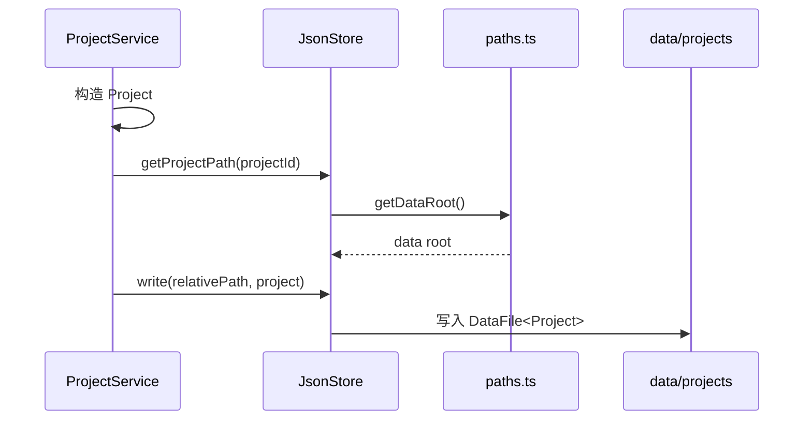

# D01：项目关闭以后，什么还应该存在

## 课程助手消失的那一刻

用户创建“课程助手”项目，页面出现项目卡片，技能窗口生成方案。关闭应用后再次打开，项目是否仍在？若不在，问题不在 React 是否重新渲染，而在项目从未离开进程内存。

本 Part 始终追踪同一个对象：

```ts
const project = {
  id: "proj-course-assistant",
  name: "课程助手",
  status: "active"
};
```

它如何从内存变成文件，再从文件恢复为可用项目，是后续章节的主线。



图中的顺序不能颠倒。`ProjectService` 决定项目字段；`JsonStore` 不负责发明项目的业务含义。路径函数只生成命名规则，真正写入发生在 `write`；数据根目录由 `paths.ts` 统一决定。

## 谁真正发起保存

 [项目创建逻辑（第 75-103 行）](../../../../packages/core/src/lib/features/services/project-service.ts#L75) 先构造 `Project`。第 93-94 行才进入存储层：

```ts
const filePath = jsonStore.getProjectPath(projectId);
await jsonStore.write(filePath, project);
```

| 代码 | 回答的问题 | 不负责什么 |
| --- | --- | --- |
| `getProjectPath` | 项目采用什么相对路径 | 不创建文件 |
| `write` | 如何持久化对象 | 不决定项目业务字段 |

第 96-101 行还创建 `files` 目录。这说明项目元数据 JSON 与项目生成的工作文件是两类资源：前者描述项目，后者承载项目内容。

## 为什么文件有外壳

 [DataFile（第 21-26 行）](../../../../packages/core/src/lib/storage/json-store.ts#L21) 将业务对象包装为 `version`、`createdAt`、`updatedAt` 和 `data`。写入前的 `Project` 是领域对象；写入后才成为 `DataFile<Project>`。 [write（第 100-114 行）](../../../../packages/core/src/lib/storage/json-store.ts#L100) 负责创建这个外壳、确保目录存在并写 JSON。

```json
{
  "version": "1.0.0",
  "createdAt": "...",
  "updatedAt": "...",
  "data": { "id": "proj-course-assistant", "name": "课程助手", "status": "active" }
}
```

## 恢复与错误边界

 [getProject（第 109-121 行）](../../../../packages/core/src/lib/features/services/project-service.ts#L109) 读取 `DataFile<Project>` 后返回 `file.data`，因此上层不必知道存储元数据。 [read（第 80-95 行）](../../../../packages/core/src/lib/storage/json-store.ts#L80) 将文件缺失、损坏 JSON 和其他 I/O 错误区分处理；权限错误不能被伪装成“没有项目”。

## 练习与验收

1. 找出 `projectId` 第一次变成文件路径的位置。
2. 区分 `Project`、`DataFile<Project>` 与 `projects/{id}/files` 分别保存什么。
3. 说明路径函数已经返回为什么不等于文件已经存在。

能够解释 `ProjectService -> JsonStore -> paths.ts -> data/projects` 的责任链，即通过本章。下一章追踪 `getDataRoot()` 在不同运行环境中如何确定数据根目录。
