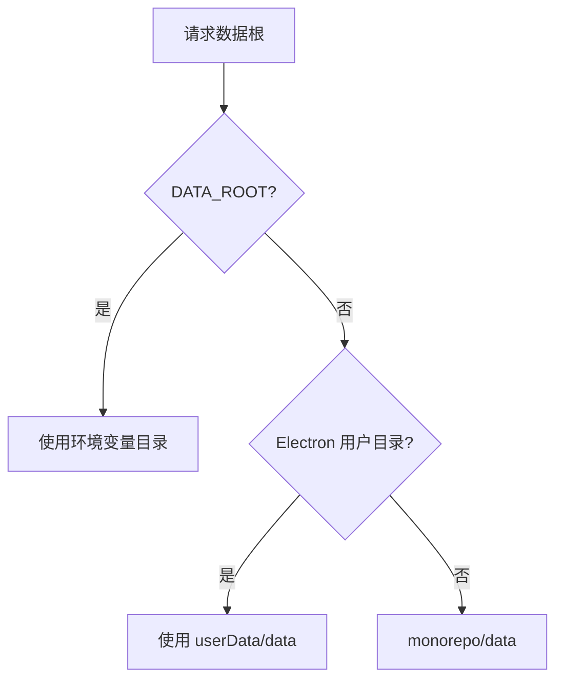

# D02：课程助手项目究竟保存到哪里

D01 已经证明项目服务把 `Project` 交给 `JsonStore`。但 `jsonStore.getProjectPath('proj-course-assistant')` 返回的并不是一个随意拼出的字符串：它必须在浏览器开发、Electron 桌面和测试环境中都指向正确的数据根，否则同一个项目会被写进不同位置，重启自然无法恢复。

## 数据根的三层优先级

 [getDataRoot（第 87-100 行）](../../../../packages/core/src/lib/paths.ts#L87) 的代码表达了明确顺序：

```ts
if (process.env['DATA_ROOT']) return process.env['DATA_ROOT'];
const electronDataRoot = resolveElectronUserDataDataRoot();
if (electronDataRoot) return electronDataRoot;
return path.join(getMonorepoRoot(), 'data');
```

| 优先级 | 来源 | 为什么存在 |
| --- | --- | --- |
| 1 | `DATA_ROOT` | 测试、部署或隔离运行可指定数据位置 |
| 2 | Electron userData | 桌面打包后不应把用户数据写入应用资源目录 |
| 3 | monorepo `data/` | 本地开发最直观的默认位置 |



每条箭头表示一次优先级判定。图并非说三处目录会同时使用；一次运行只会选择其中一个。环境变量最高，是为了让测试不会污染开发数据，也让受控部署能改变存储位置。

## 路径函数的职责

 [getProjectDataDir（第 102-107 行）](../../../../packages/core/src/lib/paths.ts#L102) 将项目 id 放到 `getDataRoot()/projects/{projectId}`。而 `JsonStore` 的 [getProjectPath（第 204-208 行）](../../../../packages/core/src/lib/storage/json-store.ts#L204) 生成项目元数据的命名规则。两者相关，却不相同：一个是项目目录，一个是项目元数据文件。

对课程助手而言，可以分别理解为：

```text
项目目录：data/projects/proj-course-assistant/
项目元数据：data/projects/proj-course-assistant.json
项目文件目录：data/projects/proj-course-assistant/files/
```

这些命名在当前实现中同时存在。阅读时不能自行假定它们必然完全一致，而应沿实际调用者核对。 [项目创建（第 92-101 行）](../../../../packages/core/src/lib/features/services/project-service.ts#L92) 使用元数据路径后又创建关联文件目录，正是需要注意的连接点。

## 路径为什么也是边界

业务服务传递相对路径，例如 `projects/{id}.json`；存储层在 [read（第 80-84 行）](../../../../packages/core/src/lib/storage/json-store.ts#L80) 和 [write（第 111-113 行）](../../../../packages/core/src/lib/storage/json-store.ts#L111) 统一使用 `path.join(dataRoot(), filePath)`。若每个调用方直接拼绝对路径，测试无法隔离，Electron 与 Web 的规则会分叉，路径安全检查也没有集中入口。

## 练习与验收

1. 说明设置 `DATA_ROOT` 后，课程助手项目会优先写到哪里。
2. 比较“项目目录”“元数据文件”“files 目录”的用途。
3. 解释为何 `getDataRoot()` 的返回值不应由 React 组件直接决定。

下一章追踪首次写入：`JsonStore` 怎样确保这些目录存在，以及目录创建失败应由哪一层解释。
